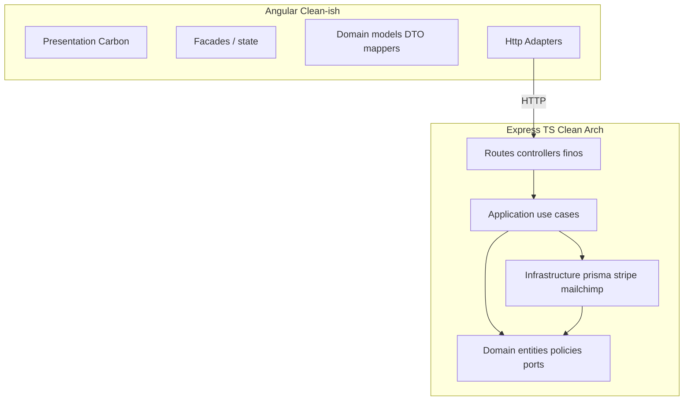

# Plano: enriquecimento task-a-task com arquitetura alinhada

## Estado atual

- Existem **54** ficheiros [`TSK-DEV-*.md`](plan/user-stories) sob `plan/user-stories/**/US-*/tasks/` (inclui **duplicados intencionais**: ex. `TSK-DEV-012` em `US-E03-001` e `US-E03-008`, `TSK-DEV-009` em `US-E02-002` e `US-E02-003`, várias cópias de `TSK-DEV-019`, etc.).
- O conteúdo típico é **genérico** (ex. [TSK-DEV-001](plan/user-stories/E01-identidade-acesso/US-E01-001/tasks/TSK-DEV-001.md): objetivo vago, critérios idênticos em todas).
- A **fonte de verdade funcional** já está nos [épicos](plan/features/epic-01-identidade-e-acesso.md) (ex. DEV-001 com `POST /auth/register`, DB, critérios) e nas [SPECs](plan/specs/SPEC-01-identidade-acesso.md) (rotas `/api/v1/...`, modelo de dados).

## Princípio de desenho

- **DRY:** não repetir 30 linhas de stack em cada task. Criar **um** documento base; cada task referencia-o e aprofunda só o que é específico do DEV.
- **Duplicados:** Núcleo de cada DEV deve ser **idêntico** em todas as cópias do mesmo `TSK-DEV-NNN.md`, ou uma cópia é canónica e as outras começam com linha fixa “espelho de X” (evita deriva). Recomendação: validação automatizada com `diff` entre duplicados antes de merge.
- **Mapeamento arquitetura → código alvo:**

- **SOLID:** tasks devem nomear **interfaces (ports)** no domínio/aplicação e **implementações (adapters)** na infra (ex.: pagamentos: `CheckoutSessionPort` + `StripeCheckoutAdapter`; e-mail: `TransactionalEmailPort` + `MailchimpEmailAdapter`).
- **Strategy:** usar onde há **variação de algoritmo/política** (ex.: conclusão de aula auto vs manual — [DEV-021](plan/features/epic-04-area-do-aluno.md); regras de elegibilidade de compra; mapeamento de erros Stripe → resposta HTTP).
- **Adapter:** integrações externas **sempre** atrás de port (Stripe, Mailchimp, storage futuro, relógio/tempo para testes).

## Documento base novo (1 ficheiro)

Criar algo como [`plan/architecture/stack-e-padroes.md`](plan/architecture/stack-e-padroes.md) (ou `plan/docs/stack-e-padroes.md` se preferires manter `architecture/` limpo), cobrindo:

| Tema | Conteúdo mínimo |
|------|------------------|
| Backend | Pastas sugeridas: `domain/`, `application/`, `infrastructure/`, `interfaces/http/` (ou equivalente); regra “**Prisma apenas em infrastructure**”; use cases chamam ports; controllers só DTO/validação. |
| Frontend | Angular: smart/dumb, **facades** por feature, serviços HTTP como adapters; **Carbon Design System** ([carbondesignsystem.com](https://carbondesignsystem.com)) + nota de uso do **Carbon MCP** para prompts/componentes assistidos. |
| Dados | **Neon** Postgres: **dois ambientes** (hml/prd) via `DATABASE_URL` / branches; fluxo `prisma migrate` por ambiente; nunca misturar secrets. |
| Deploy | **Hostinger VPS**, **nginx** reverse proxy, TLS, upstream Node; variáveis por ambiente; health/readiness alinhado a [E08](plan/features/epic-08-notificacoes-e-plataforma.md). |
| E-mail | **Mailchimp**: documentar se o produto usa Marketing API, Transactional (Mandrill), ou ambos — contrato `EmailPort` na app e adapter Mailchimp (permite troca futura). |
| Pagamentos | **Stripe Checkout** como única checkout surface no MVP; webhooks raw body; idempotência — já detalhado nos épicos; repetir só o contrato de port na baseline. |

Ligar este doc nos [READMEs](plan/specs/README.md) e [features](plan/features/README.md) com um link curto (“ver stack e padrões”).

## Template enriquecido por task (substituir o atual)

Para **cada** `TSK-DEV-NNN.md`, estrutura alvo (preenchendo com texto do **épico correspondente** + trechos da **SPEC**):

1. **Cabeçalho** (manter tabela DEV / P / Spec / US / Épico; corrigir links relativos se necessário — hoje `US` aponta para `../US-E01-001.md` mas o ficheiro real pode ser `../US-E01-001/US-E01-001.md` após a migração de pastas; **validar** em todo o árvore).
2. **Contexto de negócio** (2–4 linhas ligadas ao Logistikon / Stripe quando aplicável).
3. **Referências** — links para o bloco do DEV no [epic-XX](plan/features/) e âncoras da SPEC.
4. **Contrato da API / UI** — copiar/adaptar do épico (método, path, payloads, códigos HTTP esperados).
5. **Domínio e ports** — entidades envolvidas (`User`, `Order`, etc.); **interfaces** a criar ou estender; políticas (RBAC, idempotência).
6. **Infraestrutura** — Prisma (tabelas/migrações citadas); adapters (Stripe/Mailchimp/…); variáveis de ambiente **nomeadas** (`STRIPE_SECRET_KEY`, `STRIPE_WEBHOOK_SECRET`, `DATABASE_URL`, `MAILCHIMP_*`, …).
7. **Frontend (se aplicável)** — rotas Angular, componentes Carbon sugeridos (ex.: form: `Input`, `Button`, `Modal`; tabelas: `Table`; layout: `Grid`); facade e chamada ao endpoint `/api/v1/...` alinhado à SPEC.
8. **DevOps / ambientes** — o que muda entre hml/prd (URLs Stripe webhook, `success_url`, secrets Neon); nginx apenas se a task expuser domínio público novo.
9. **Segurança e conformidade** — PII, segredos, rate limit (especialmente webhook e rotas públicas).
10. **Testes** — unit (use case com ports mockados), integração (Prisma test DB ou testcontainers se adotado), e2e críticos quando for fluxo Stripe.
11. **Critérios de aceite** — **substituir** a checklist genérica por bullets **copiados/adaptados** do épico + bullets de arquitetura (“não importar Prisma fora de `infrastructure`”, “Stripe atrás de `StripeCheckoutAdapter`”, etc. onde relevante).
12. **Dependências explícitas** — lista `DEV-XXX` do registro, não só “ver registro”.

### Tasks com ficheiros duplicados

- **TSK-DEV-012** (duas US): conteúdo idêntico; secção extra “**Ângulo US-E03-008**” com bullets só de UX/redirect (1 parágrafo).
- **TSK-DEV-009** (duas US): idêntico + nota “detalhe vs elegibilidade” por US.
- **TSK-DEV-018 / 019 / 041 / 042** onde existem múltiplos paths: sincronizar ou canónico + espelho.

### Ordem de execução recomendada (49 DEVs únicos)

1. Redigir **stack-e-padroes.md**.
2. **E01–E02–E03** primeiro (funda auth + comércio + **Stripe** — máximo impacto arquitetural).
3. E04–E05 (learning + certificados).
4. E06 (BO — muitos DEVs; reutilizar padrão “admin routes + Carbon data entry”).
5. E07–E08 (B2B P2, plataforma, Mailchimp, health).

## Validação final

- Grep: cada `DEV-001`…`DEV-049` aparece em **pelo menos** um `TSK-DEV-NNN.md` e o texto do epic existe para esse DEV.
- Para duplicados: `diff` entre pares de ficheiros com o mesmo nome.
- Rever links `US` nos tasks para apontarem para `US-*/US-Ejj-NNN.md` real (inconsistência detectada no exemplo [TSK-DEV-001](plan/user-stories/E01-identidade-acesso/US-E01-001/tasks/TSK-DEV-001.md) com `../US-E01-001.md`).

## Esforço

- Baseline: ~**1** ficheiro novo.
- Enriquecimento: **49** revisões de conteúdo (e **54** ficheiros a sincronizar onde há cópia).

Não inicia implementação de código da aplicação nesta fase — apenas **artefactos de plano** alinhados ao stack definido.
