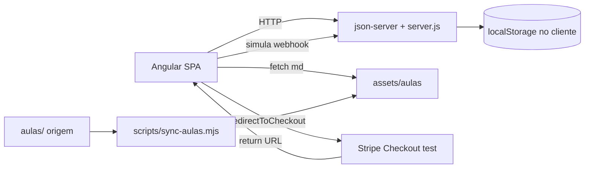

## Decisões já fechadas

- **Mock BFF:** `json-server` em processo separado, com `db.json` e handlers custom (`server.js`).
- **Persistência cliente:** `localStorage` para sessão JWT-fake, progresso, matrículas e seed de utilizadores.
- **Aulas:** **sync runtime** (`HttpClient` busca `.md` de `assets/aulas/`); um **script de cópia/index** em `prebuild`/`prestart` espelha [aulas/](aulas/) para `assets/aulas/` e gera `index.json` (sem alterar [aulas/](aulas/)).
- **Local do POC:** novo diretório [web/](web/) na raiz deste repositório.
- **Stripe:** **modo test real** (chave publishable test). Ao retornar para `/checkout/sucesso?session_id=`, a landing chama um endpoint do mock (`POST /__sim/stripe-webhook`) que marca `order` como `paid` e cria `enrollment` (substitui o webhook real, que precisaria de servidor exposto).
- **i18n:** fora do POC (PT-PT apenas).

## Etapa 0 — Documentação estruturante (antes do código)

Criar a pasta [web/docs/](web/docs/) com **8 documentos curtos**, focados em "o que se vai construir":

- `00-visao-geral-poc.md` — escopo, premissas, o que está dentro/fora.
- `01-estrutura-de-pastas.md` — árvore Angular standalone + `mock-api/` + `scripts/`.
- `02-stack-e-dependencias.md` — `package.json` proposto (Angular 18+, `carbon-components-angular`, `@carbon/styles`, `marked`, `dompurify`, `json-server`, `concurrently`, `tsx`, `gray-matter`, `@stripe/stripe-js`).
- `03-mock-api.md` — esquema `db.json` + lista de endpoints + handlers custom alinhados a `plan/specs/SPEC-0*` e ao [registro de features](plan/features/registro-de-features.md).
- `04-sync-aulas.md` — algoritmo do script, formato do `index.json`, como o front consome os `.md` em runtime via `marked` + `DOMPurify`.
- `05-features-x-telas-x-endpoints.md` — matriz que liga cada ficha de [ui/telas/](ui/telas/) a feature module, rotas, componentes Carbon e endpoints mock.
- `06-stripe-modo-poc.md` — fluxo Checkout test + simulação do webhook local.
- `07-sprints-e-ordem-execucao.md` — sequência de implementação com critérios de aceite por sprint.

## Estrutura de pastas (resumo)

```text
web/
  package.json
  angular.json
  docs/                      (etapa 0)
  mock-api/
    db.json
    server.js                json-server + handlers custom
    seed/                    fixtures iniciais
  scripts/
    sync-aulas.mjs           le /aulas, copia .md, gera index.json
  projects/logistikon-web/
    src/
      assets/aulas/          gerado por sync-aulas (gitignored)
      app/
        core/                interceptors, guards, services HTTP, auth, storage
        shared/              componentes Carbon-compostos, pipes, diretivas
        layouts/             shell publico, shell aluno, shell minimo
        features/
          catalog/           lista, detalhe
          auth/              registo, login, verificar-email
          checkout/          retorno sucesso/cancelado
          learn/             dashboard, outline, player
          quiz/              quiz modulo, resultado
          certificates/      certificado, validacao publica
          errors/            403/404/500
        styles/              tema Carbon + tokens marca
```

## Stack confirmada

- **Angular 18+ standalone**, Router lazy por feature, RxJS.
- **UI:** [Carbon Design System](https://carbondesignsystem.com) via `carbon-components-angular` + `@carbon/styles` (tema `g10`).
- **Markdown:** `marked` + `DOMPurify` (renderização segura runtime).
- **Mock BFF:** `json-server` + `server.js` para rotas POST que precisam de lógica (criar pedido, simular webhook, embaralhar quiz, emitir certificado).
- **Pagamentos:** `@stripe/stripe-js` apenas para `redirectToCheckout` em modo test.
- **Dev:** `concurrently` corre `ng serve` + `json-server` + `nodemon` no `server.js`.

## Diagrama de dependências do POC



## Mock BFF — endpoints mínimos (alinhados ao MVP)

Cobertos por [registro-de-features.md](plan/features/registro-de-features.md) DEV-001 a DEV-027 e DEV-047:

- `POST /auth/register`, `POST /auth/login`, `POST /auth/verify-email`, `POST /auth/resend-verification`
- `GET /trails`, `GET /trails/:slug`, `GET /trails/:slug/eligibility`
- `POST /orders`, `POST /checkout/session`, `POST /__sim/stripe-webhook`, `GET /orders/:id`
- `GET /enrollments`, `GET /enrollments/:trailId/outline`
- `PATCH /enrollments/:trailId/lessons/:lessonId/progress`
- `POST /modules/:moduleId/quiz/start`, `POST /quiz/attempts/:attemptId/submit`
- `POST /enrollments/:trailId/certificate`, `GET /certificates/verify?code=`

`db.json` traz seeds: 6 trilhas (subset real de [aulas/trilhas.md](aulas/trilhas.md)), preços, 1 utilizador admin opcional.

## Script de sync das aulas (resumo)

`scripts/sync-aulas.mjs`:

1. Lê recursivo `../aulas/trilha-*/modulo-*/aula-*.md` e `README.md` de módulo.
2. Copia ficheiros para `projects/logistikon-web/src/assets/aulas/<trilha>/<modulo>/<aula>.md`.
3. Extrai com `gray-matter` ou regex: título do módulo, título da aula, duração da tabela do README.
4. Gera `assets/aulas/index.json` com árvore: `trails[] -> modules[] -> lessons[] { slug, title, durationMin, mdPath }`.
5. Não escreve em [aulas/](aulas/); apenas lê.
6. Hooks: `prestart`, `prebuild`; comando manual `npm run sync:aulas`.

O front consome `index.json` no `CatalogService`/`OutlineService` e renderiza `.md` no `LkLessonContent` via `marked` (sanitizado por `DOMPurify`).

## Sprints (ordem de execução)

| Sprint | Entrega | Telas | Critério de aceite |
|--------|---------|-------|--------------------|
| S0 | Scaffolding + tema Carbon + shells + mock infra + script de aulas | — | `npm start` levanta SPA + mock; `index.json` gerado |
| S1 | Catálogo público + detalhe | [tela-catalogo-trilhas](ui/telas/tela-catalogo-trilhas.md), [tela-detalhe-trilha](ui/telas/tela-detalhe-trilha.md) | Lista paginada, detalhe com syllabus do `index.json` |
| S2 | Identidade + sessão | [tela-registo](ui/telas/tela-registo.md), [tela-login](ui/telas/tela-login.md), [tela-verificacao-email](ui/telas/tela-verificacao-email.md) | Login persiste em `localStorage`, guards funcionam |
| S3 | Pedido + Stripe + retorno | [tela-checkout-retorno-stripe](ui/telas/tela-checkout-retorno-stripe.md) | Redirect Stripe test → success → matrícula ativa |
| S4 | Área do aluno | [tela-dashboard-aluno](ui/telas/tela-dashboard-aluno.md), [tela-outline-trilha](ui/telas/tela-outline-trilha.md), [tela-player-aula](ui/telas/tela-player-aula.md) | Renderiza MD; progresso persistido |
| S5 | Avaliação + certificado | [tela-quiz-modulo](ui/telas/tela-quiz-modulo.md), [tela-certificado-e-conclusao](ui/telas/tela-certificado-e-conclusao.md), [tela-validacao-certificado-publica](ui/telas/tela-validacao-certificado-publica.md) | Quiz aprova/reprova, PDF placeholder, código verifica |
| S6 | Erros + a11y polish | [tela-erros-globais](ui/telas/tela-erros-globais.md) | 403/404/500 + axe limpo nos fluxos F-A a F-G |

Cada sprint inclui: rotas, guards, serviços HTTP, componentes Carbon e fixtures no `db.json`.

## Premissas que valem citar

- **Não toca em [aulas/](aulas/)** nem em [plan/](plan/), [discovery/](discovery/), [apresentacao/](apresentacao/), [UX/](UX/), [ui/](ui/).
- O POC ignora B2B (E07) e Backoffice (E06).
- Recuperação de palavra-passe (DEV-005) e materiais de aula (DEV-020) ficam fora do POC.

## Próximo passo proposto (após confirmação)

Executar **apenas a Etapa 0** (criar [web/docs/](web/docs/) com os 8 documentos), e parar para revisão antes de começar o scaffolding Angular.