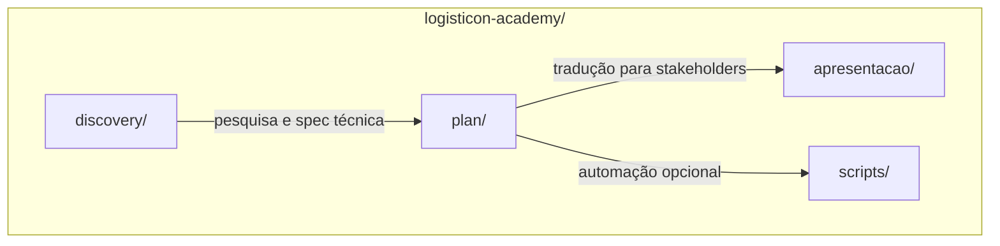
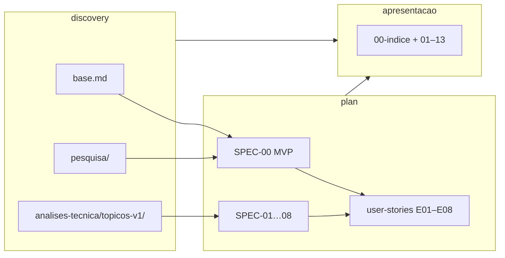
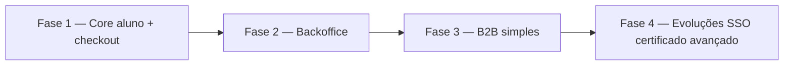

# Logistikon Academy — Repositório de planejamento e documentação

Repositório da **Logistikon Academy** (escola de tecnologia aplicada à logística): **discovery** de mercado e produto, **plano** de implementação (épicos, specs, user stories, tasks) e **apresentação** executiva em linguagem de negócio.

Este repositório concentra **documentação e backlog**; o código da aplicação, quando existir, pode viver noutro repositório ou pasta — consultar `plan/architecture/stack-e-padroes.md` para a stack alvo definida no plano.

---

## Estrutura do projeto

| Pasta | Finalidade |
|-------|------------|
| **[discovery/](discovery/)** | Base pedagógica, pesquisa de mercado (concorrência, tendências, posicionamento) e especificação técnica da plataforma fatiada em tópicos |
| **[plan/](plan/)** | MVP (SPEC-00), specs por tema (SPEC-01…08), épicos, registo DEV-001…049, user stories e tasks `TSK-DEV-*`, arquitetura alvo |
| **[apresentacao/](apresentacao/)** | Narrativa executiva: 13 tópicos de negócio/produto/jornada, índice e README com mapas Mermaid |
| **[scripts/](scripts/)** | Ferramentas de apoio (ex.: `enrich_plan_tasks.py` para enriquecimento em lote de tasks) |
| **[UX/](ux)** | Inventário de contexto, happy paths MVP, critérios de acessibilidade |
| **[ui/](ui/)** | Especificação de UI para frontend: tokens Carbon, componentes, mapa de rotas, fichas por tela |

---

## Por onde começar (por perfil)

| Perfil | Caminho sugerido |
|--------|------------------|
| **Direção / negócio** | [apresentacao/README.md](apresentacao/README.md) → [apresentacao/00-indice.md](apresentacao/00-indice.md) → tópicos 01–07 |
| **Produto / PM** | [plan/specs/SPEC-00-visao-geral-mvp.md](plan/specs/SPEC-00-visao-geral-mvp.md) → [plan/user-stories/README.md](plan/user-stories/README.md) → [plan/features/registro-de-features.md](plan/features/registro-de-features.md) |
| **Engenharia** | [plan/specs/README.md](plan/specs/README.md) (matriz SPEC ↔ épico ↔ tasks) → SPEC do tema → `plan/user-stories/E../US-../tasks/TSK-DEV-*.md` |
| **Frontend (UI)** | [ui/README.md](ui/README.md) → tokens, inventário de componentes, fichas em `ui/telas/`; stack em [plan/architecture/stack-e-padroes.md](plan/architecture/stack-e-padroes.md) |
| **Conteúdo / pedagógico** | [discovery/base.md](discovery/base.md) (níveis, trilhas, rotas nomeadas) |
| **Mercado / posicionamento** | [discovery/pesquisa/](discovery/pesquisa/) (análises 01–06) |

---

## Fluxo lógico dos artefactos

---

## `discovery/` — mapa rápido

| Área | Conteúdo |
|------|-----------|
| [discovery/adequacao-posicionamento-fase1-menos-sap.md](discovery/adequacao-posicionamento-fase1-menos-sap.md) | Planejamento de adequação: menos ênfase em SAP na fase 1 (stakeholder), mapa de ficheiros a ajustar; **plan/** permanece inalterado |
| [discovery/base.md](discovery/base.md) | Visão, proposta de valor, níveis Foundation / Professional / Specialist, catálogo de trilhas, rotas certificáveis |
| [discovery/pesquisa/](discovery/pesquisa/) | Concorrência, plataformas, tendências, níveis pedagógicos, ampliação da proposta, síntese para software |
| [discovery/analises-tecnica/](discovery/analises-tecnica/) | Especificação da plataforma v1; entrada: [plataforma-logistikon-especificacao-tecnica-v1.md](discovery/analises-tecnica/plataforma-logistikon-especificacao-tecnica-v1.md) e [topicos-v1/00-indice.md](discovery/analises-tecnica/topicos-v1/00-indice.md) |

---

## `plan/` — mapa rápido

| Área | Conteúdo |
|------|-----------|
| [plan/specs/](plan/specs/) | SPEC-00 (visão MVP) e SPEC-01…08 por domínio; índice e matriz com épicos/tasks |
| [plan/features/](plan/features/) | Épicos `epic-*.md` e [registro-de-features.md](plan/features/registro-de-features.md) (DEV-001…049) |
| [plan/user-stories/](plan/user-stories/) | Pastas E01–E08, user stories `US-Ejj-NNN`, tasks `TSK-DEV-NNN.md` |
| [plan/architecture/](plan/architecture/) | [stack-e-padroes.md](plan/architecture/stack-e-padroes.md) |

**Épicos (resumo):** E01 Identidade · E02 Catálogo e pedidos · E03 Stripe e pagamentos · E04 Área do aluno · E05 Avaliação e certificados · E06 Backoffice · E07 B2B · E08 Plataforma (e-mail, health, LGPD).

---

## `apresentacao/` — mapa rápido

| Recurso | Descrição |
|---------|-----------|
| [apresentacao/README.md](apresentacao/README.md) | Mapa completo da série, diagramas Mermaid consolidados, tabela dos 13 tópicos |
| [apresentacao/00-indice.md](apresentacao/00-indice.md) | Índice linear com links |
| [apresentacao/01-resumo-executivo.md](apresentacao/01-resumo-executivo.md) … **13** | Tópicos autónomos (negócio, jornadas, roadmap, métricas, riscos, referências) |

---

## Fases do MVP (alinhamento SPEC-00)

Detalhe: [plan/specs/SPEC-00-visao-geral-mvp.md](plan/specs/SPEC-00-visao-geral-mvp.md).

---

## Scripts

- [scripts/enrich_plan_tasks.py](scripts/enrich_plan_tasks.py) — geração/atualização em lote de conteúdo das tasks DEV (ver comentário no cabeçalho do script e referência em `plan/user-stories/README.md`).

---

## Convenções úteis

- **IDs:** `SPEC-NN`, `US-Ejj-NNN`, `TSK-DEV-NNN`, épicos **E01–E08**.  
- **Prioridades no plano:** P0 (bloqueia MVP B2C), P1, P2 — ver SPEC-00 e registo de features.  
- **Idioma:** documentação principal em **português**; oferta pedagógica prevê conteúdo **PT/EN** conforme `discovery/base.md`.

---

## Licença e contacto

*(Adicionar licença e contacto da equipa quando aplicável.)*
