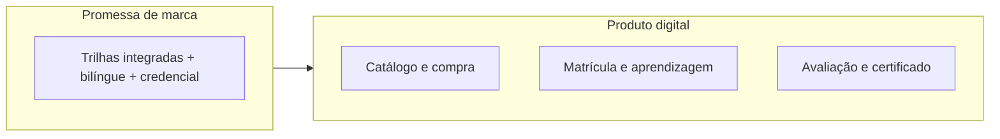

# 1. Resumo executivo

**Foco:** visão consolidada — o quê é a Logistikon Academy, **por que existe no mercado**, que promessa o **produto digital** cumpre e que resultado de negócio se espera.

**Estado:** enriquecido (detalhamento aprofundado manual).

**Série:** [Índice](./00-indice.md) · [2 →](./02-posicionamento-e-territorio.md)

---

## O que é a Logistikon Academy

A **Logistikon Academy** é uma **escola de tecnologia aplicada à logística**: oferta estruturada em **trilhas** que combinam **processos da cadeia**, **dados e indicadores**, **sistemas corporativos** (ERP, WMS, TMS) e **automação / transformação digital**. O foco intencional é a **stack corporativa** — em especial SAP e ecossistema ERP — articulada com **tomada de decisão orientada a dados**, e não um catálogo genérico de “fundamentos de supply chain” desconectado do chão de fábrica e do escritório de planejamento.

Em uma frase para **investidor ou patrocinador**: trata-se de **educação profissional** com narrativa de **empregabilidade e promoção**, ancorada em conteúdo **bilíngue**, **credenciais** e **operação comercial formal** (CNPJ, nota fiscal), preparada para escalar em **B2C** e **B2B**.

---

## Por que o mercado “pede” este produto (contexto)

O *discovery* de concorrência e tendências aponta um **espaço pouco densamente ocupado**:

- **MOOCs e trilhas amplas** validam demanda, mas costumam ser **genéricas** ou pouco operacionais em SAP/MM/SD/WM e em dados aplicados ao Brasil.
- **Treinamentos SAP** são fortes em profundidade técnica, mas muitas vezes **isolados** da narrativa de processo, KPI e melhoria contínua.
- **Instituições públicas gratuitas** cobrem fundamentos; a Logistikon pode posicionar-se como **aceleração** para quem já tem base e quer **sistemas + dados + carreira**.

Assim, a Academia não precisa “vencer” ASCM ou Coursera no mesmo critério: compete por **integração** — processo + sistema + KPI + automação — com **idioma e contexto** alinhados a multinacionais e ao mercado brasileiro.

---

## Proposta de valor (pilares)

| Pilar | Significado para o cliente |
|-------|----------------------------|
| **Bilíngue (PT / EN)** | Competitividade em ambientes corporativos globais e clareza de terminologia. |
| **Credenciais digitais** | Certificados com **regras de conclusão** explícitas; evolução para verificação e badges conforme roadmap de produto. |
| **Aquisição profissional** | Descoberta via **LinkedIn**, campanhas e rede — coerente com o ICP que compra por **carreira**, não só por curiosidade. |
| **Operação formal** | **CNPJ e NF** sustentam compra individual e negociação B2B com compras e RH. |

---

## O que o produto digital (LMS) precisa entregar em negócio

O **LMS** é o mecanismo que transforma **promessa comercial** em **experiência mensurável**:

1. **Descoberta e catálogo** — trilha como unidade clara (preço, duração, requisitos, certificação).
2. **Compra segura** — checkout com confirmação confiável e conciliação com pedido.
3. **Matrícula e estudo** — acesso proporcional ao direito adquirido; progressão visível.
4. **Avaliação e integridade mínima** — quizzes, entregas e critérios alinhados ao nível da trilha.
5. **Certificação** — emissão e, em evolução, validação pública credível.
6. **B2B (fases posteriores)** — organização, assentos, convites e **visão do comprador** para RH.

---

## Para quem é — e o que não é

**É para:** profissionais que precisam **subir de nível** (analista → especialista), **mudar de área** para supply chain, ou **padronizar linguagem** com ERP e dados; empresas que precisam **capacitar equipes** com evidência de progresso (roadmap B2B).

**Não é (sozinha):** substituto de **diploma regulamentado**; **parceria oficial SAP** salvo contrato explícito; promessa de salário sem evidência — o *discovery* recomenda **outcomes** e prova social em vez de claims frágeis.

---

## Decisões implícitas neste resumo

- A **trilha** é a unidade central de **venda e progresso** — evita dispersão de SKUs sem narrativa.
- **B2C** é o vetor de validação de receita no MVP; **B2B** é expansão com **mesma base** de matrícula e conteúdo.
- **Time-to-value** (valor aplicável em semanas) alinha produto de conteúdo e expectativa de marketing — coerente com tendência de *upskilling* em supply chain.

---

[← Índice](./00-indice.md) · [2. Posicionamento →](./02-posicionamento-e-territorio.md)
