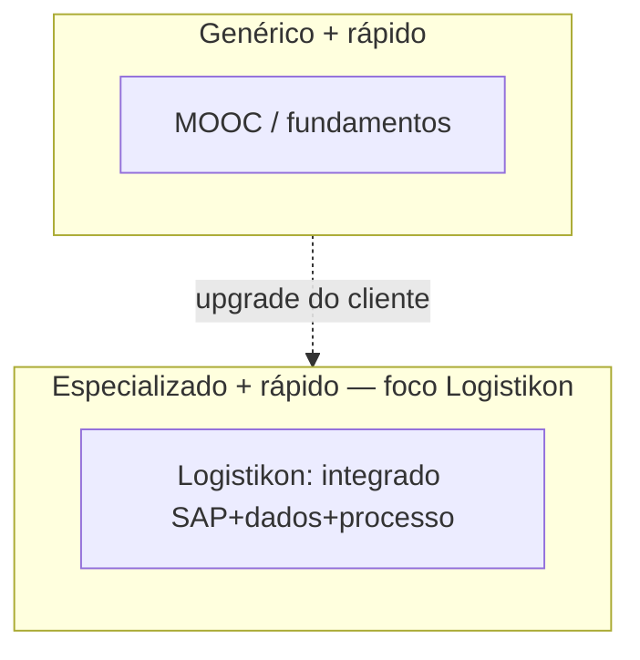
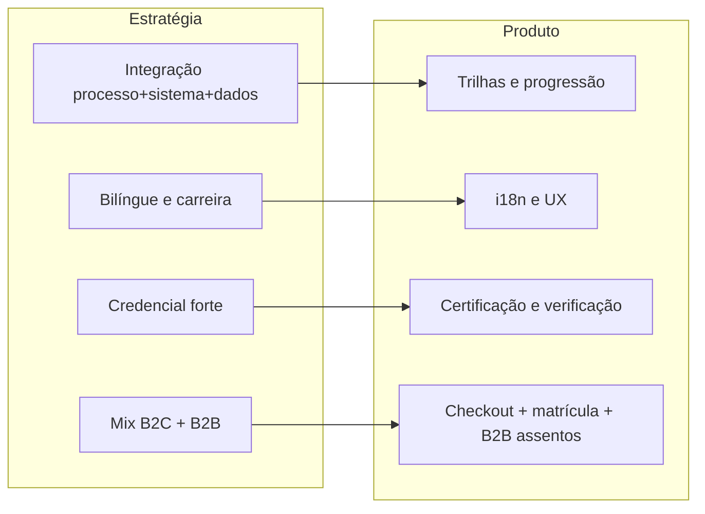

# 2. Posicionamento e território de mercado

**Foco:** declaração de posicionamento, **mapa de território** competitivo e ligação explícita **estratégia → produto** — incluindo como **validar** a tese com o mercado.

**Estado:** enriquecido (detalhamento aprofundado manual).

**Série:** [← 1](./01-resumo-executivo.md) · [Índice](./00-indice.md) · [3 →](./03-estrutura-de-negocio-ponta-a-ponta.md)

---

## Declaração de posicionamento (negócio)

> **Para** profissionais e equipes de *supply chain* que precisam dominar processos, sistemas (ERP/WMS/TMS) e decisões orientadas por dados, **a Logistikon Academy** é uma escola de tecnologia aplicada à logística que oferece **trilhas empilháveis**, ensino bilíngue e **credenciais verificáveis**. **Diferente de** cursos genéricos de plataformas abertas ou treinamentos SAP isolados, **entrega** integração **processo + sistema + KPI + automação** com contexto de **operação real** e narrativa de **carreira**.

### Uso interno desta frase

| Uso | Como aplicar |
|-----|----------------|
| **Copy** | Landing por rota: subtítulo que reforça **outcome** (cargo, KPI, ferramenta) em PT/EN. |
| **Priorização** | Trilhas que não “fecham” o quadrado processo+sistema+dados ficam em backlog ou como módulos avulsos — não como promessa principal da marca. |
| **Prova social** | Cases e depoimentos devem citar **mudança de prática** (ex.: relatório, rotina, projeto), não só satisfação genérica. |

**Validação recomendada no discovery:** entrevistas com **10–15 ICPs** para ajustar a declaração (tom, dor, preço de referência).

---

## Território de mercado (onde jogamos)

O *landscape* mistura **quatro grandes faixas**: MOOCs e cursos amplos; certificações globais (ASCM, etc.); treinamento SAP/ERP; oferta pública gratuita (SENAI, SEBRAE, SENAC). A Logistikon **não substitui** diploma de longo prazo nem o exame oficial ASCM; **orbita** e **diferencia** pelo **nicho integrado** e pelo **contexto Brasil + bilíngue**.

**Eixos úteis para workshops** (do discovery):

- **Eixo horizontal:** Genérico (supply chain ampla) ↔ **Especializado** (SAP + WMS + TMS + dados).
- **Eixo vertical:** Credencial acadêmica longa ↔ **Habilitação rápida** com certificado profissional.

A **área de menor densidade** (oportunidade) tende a ser **especializado integrado** — processos + stack de dados + automação — com **entrega bilíngue** e encaixe no mercado brasileiro.

| Quadrante (conceitual) | Exemplos típicos | Onde a Logistikon se ancora |
|------------------------|------------------|------------------------------|
| Genérico + habilitação rápida | MOOCs amplos, trilhas “fundamentos” | Diferenciação por **especialização** integrada |
| Genérico + longo prazo | MBAs, pós stricto sensu | Não competir pelo mesmo critério de diploma |
| Especializado + longo prazo | Certificações globais com exame formal | **Orbitar** como preparatório ou especialização SAP+dados |
| **Especializado + habilitação rápida** | Treinamentos ERP, analytics aplicado | **Território principal** — processo + sistema + KPI + dados |

*Nota:* posições são **qualitativas** para alinhamento de narrativa; não são dados de mercado primários.

---

## Concorrentes “na cabeça do cliente” (enquadramento)

| Tipo | O que o cliente compara | Resposta de posicionamento |
|------|---------------------------|----------------------------|
| **Plataforma global** | Preço baixo, marca forte, escala | “Nós **integramos** processo + sistema + KPI + automação com **operação real** e **PT/EN**.” |
| **Certificação global** | Prestígio do exame | “Somos **complemento** ou **especialização** aplicada (SAP + dados + Brasil); não concorremos no mesmo credencial.” |
| **Escola SAP** | Profundidade técnica | “Acrescentamos **cadeia de valor**, **indicadores** e **melhoria contínua** — não só transação no ERP.” |
| **Gratuito público** | Custo zero | “Somos **aceleração** para quem já tem base e precisa **empregabilidade em sistemas e dados**.” |

---

## Onde a estratégia encontra o produto

| Pilar estratégico | O que significa para o cliente | Como o produto sustenta |
|-------------------|-------------------------------|-------------------------|
| Profundidade integrada (processo + sistema + dados) | Menos “curso solto”, mais **jornada coerente** até resultado de trabalho | Trilhas com módulos, progressão, avaliações e projeto onde fizer sentido |
| Bilíngue | Competitividade em multinacionais e clareza de terminologia | Experiência e conteúdo com suporte PT/EN no *shell* e nas ofertas |
| Credencial respeitável | Confiança de RH e mercado | Certificado com regras claras, identificação e validação pública (evolução por fases) |
| B2C e B2B | Receita mista e escala | Mesma base: matrícula e progresso; B2B adiciona **organização, assentos e visão do comprador** |
| Operação e compliance | Compra profissional com NF e contratos | Pedidos, conciliação, LGPD mínima e comunicação transacional confiável |

---

## Diferenciação defensável (moat de narrativa)

Elementos que sustentam o posicionamento **sem depender só de preço**:

1. **Contexto Brasil** — regulatório, modais, cultura de OTIF e linguagem de operação local.  
2. **Bilíngue com terminologia** alinhada a multinacionais.  
3. **Integração numa única jornada** (evitar silo “só SAP” ou “só Lean”).  
4. **Prova social** do instrutor fundador e convidados corporativos.  
5. **Credencial** com metadados e verificação em evolução (roadmap de produto).

---

[← 1](./01-resumo-executivo.md) · [Índice](./00-indice.md) · [3. Estrutura de negócio →](./03-estrutura-de-negocio-ponta-a-ponta.md)
