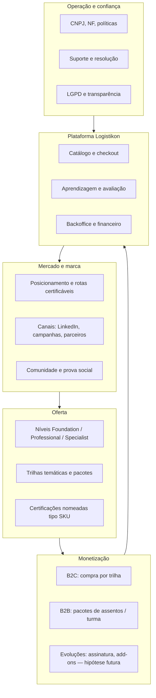

# 3. Estrutura de negócio de ponta a ponta

**Foco:** modelo que liga **mercado**, **oferta pedagógica**, **monetização**, **operação** e **plataforma** — com níveis (F/P/S), **famílias de trilhas** e **rotas SKU**; linguagem de negócio, não de schema técnico.

**Estado:** enriquecido (detalhamento aprofundado manual).

**Série:** [← 2](./02-posicionamento-e-territorio.md) · [Índice](./00-indice.md) · [4 →](./04-audiencias-personas-e-papeis.md)

---

## Definição

A “estrutura de negócio” é o **modelo completo** que explica **como a Logistikon cria valor** e **como o valor volta** em receita, reputação e dados — da **marca** ao **aluno certificado**, passando por **preço**, **entrega** e **suporte**.

### Ciclo de valor (leitura executiva)

1. **Marca e conteúdo** atraem ICP por canais profissionais.  
2. **Oferta** (trilha/rota) traduz promessa em **SKU** com regras claras.  
3. **Monetização** converte interesse em **pedido pago** e **direito de acesso**.  
4. **Plataforma** orquestra estudo, avaliação e credencial.  
5. **Operação** (NF, suporte, LGPD) reduz fricção e risco.  
6. **Alumni e credenciais** alimentam de novo o **mercado** (prova social, *referral*).

---

## Arquitetura pedagógica (níveis)

| Nível | Foco | Exemplos de temas |
|-------|------|-------------------|
| **Foundation** | Conceitos e operação básica da cadeia | Fundamentos, estoque, transporte, KPIs |
| **Professional** | Ferramentas e sistemas do dia a dia | SAP logística, Power BI, WMS, custos, S&OP |
| **Specialist** | Rede, tecnologia avançada, estratégia | *Network design*, IA aplicada, automação, *digital supply chain* |

**Regra de produto (negócio):** a **trilha** é a **unidade de venda e de progresso** — agrupa módulos, regras de conclusão e preço. Evita “curso solto” sem narrativa de carreira ou sem encaixe no catálogo.

**Matriz futura (artefato):** trilha × nível (1/2/3) × idioma — priorizada no *discovery* para o MVP.

---

## Famílias de trilhas (catálogo de negócio)

O *discovery* organiza o catálogo em **eixos temáticos** (cada um pode alimentar os três níveis):

| Família | Exemplos de foco |
|---------|------------------|
| Fundamentos e estratégia | Supply chain, S&OP, custos e performance |
| Dados e analytics | Excel avançado, Power BI, KPIs, analytics para decisão |
| Tecnologia e sistemas | SAP (MM/SD/WM), ERP, WMS, TMS, master data |
| Operações | Estoques, armazenagem, transporte, internacional |
| Melhoria contínua | Lean, Six Sigma, projetos, excelência operacional |
| Logística estratégica | *Network design*, procurement, Logística 4.0 |
| Automação e digitalização | RPA, Python aplicado, IA na cadeia, transformação digital |

Isso orienta **landing**, **SEO** e **priorização** (“rota herói” vs. *long tail*).

---

## Rotas nomeadas (SKUs-certificação)

**Rotas** são **pacotes de mercado** com nome próprio (identidade de carreira):

1. ERP Logistics Specialist  
2. SAP Supply Chain Specialist  
3. Logistics Data Analyst  
4. Digital Supply Chain Specialist  
5. Supply Chain Transformation  
6. Logistics Process Excellence  

**Checklist comercial por rota (mínimo):** público-alvo (ICP), pré-requisitos, carga horária, módulos incluídos, idioma PT/EN, critérios de certificado, preço de referência, prova social ou *anchor content*.

---

## Encaixe com o produto digital

| Elemento de negócio | Tradução na plataforma |
|---------------------|-------------------------|
| Trilha publicada | Visível no catálogo; estados rascunho/publicado |
| Preço ativo | Associação trilha ↔ oferta comercial ↔ checkout |
| Matrícula | Direito de consumo e progresso por usuário + trilha |
| Certificado | Emissão condicionada a regras da trilha |

---

[← 2](./02-posicionamento-e-territorio.md) · [Índice](./00-indice.md) · [4. Audiências e papéis →](./04-audiencias-personas-e-papeis.md)
