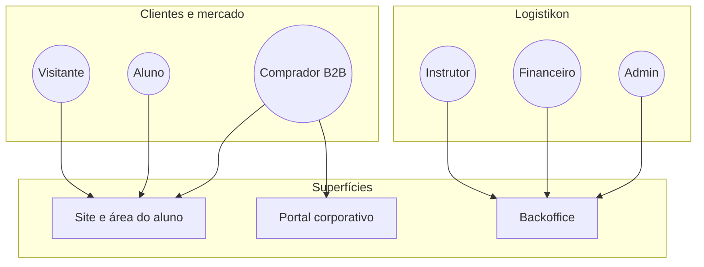

# 4. Audiências, personas e papéis (visão de negócio)

**Foco:** **quem paga**, **quem estuda**, **quem opera** a oferta; jornadas por persona; papéis na plataforma em linguagem de produto (equivalente ao desenho de permissões, sem jargão técnico).

**Estado:** enriquecido (detalhamento aprofundado manual).

**Série:** [← 3](./03-estrutura-de-negocio-ponta-a-ponta.md) · [Índice](./00-indice.md) · [5 →](./05-matriz-de-valor.md)

---

## Quem paga e quem consome

| Audiência | Motivação típica | O que espera da Logistikon |
|-----------|------------------|----------------------------|
| **Profissional individual (B2C)** | Carreira, promoção, mudança de área | Trilha clara, prazo até resultado (*time-to-value*), certificado credível |
| **Empresa (B2B)** | Capacitação em massa, padronização de linguagem e ferramentas | Assentos, convites, visão agregada para RH/gestor, NF e contrato |
| **Parceiros (B2B2C)** | Alcance, co-brand, novos canais | Narrativa conjunta, eventual pacotes por comunidade (futuro) |

**Distinção útil:** no B2B, **comprador** (budget) nem sempre é quem **estuda**; o produto precisa servir **dois usuários** — patrocinador e aluno — com relatórios no roadmap B2B.

---

## Segmentos dentro do B2C (do *discovery*)

| Segmento | Dor / contexto | Implicação para oferta |
|----------|------------------|-------------------------|
| **Early career** | Técnico ou operação migrando para analista | Fundamentos acelerados + ferramentas (BI, Excel, intro ERP) |
| **Mid-career** | Coordenador rumo à gestão; precisa visão de processo + dados | Trilhas Professional com SAP/KPI/S&OP |
| **Career switcher** | Entrando em supply chain a partir de áreas correlatas | Onboarding claro, pré-requisitos e “mapa” da carreira |

---

## Jornadas-resumo (personas)

### Analista (B2C)

Descobre no **LinkedIn** ou campanha → **landing** da rota → **compra** → onboarding → consumo (vídeo, materiais) → **quizzes** / projeto → **certificado** → uso do **badge** no perfil.

**Momento de maior ansiedade:** entre **pagamento** e **primeiro valor** (primeira aula útil ou checklist aplicável) — impacta retenção e NPS.

### Gestor / comprador (B2B)

Contato comercial → **proposta** (turma, escopo) → **pagamento e documentos** → **convites** → acompanhamento no **painel** → **exportação** (CSV/PDF) para RH.

**Critério de sucesso B2B:** visibilidade de **progresso** e **conclusão** sem depender de planilha paralela.

### Instrutor / operações internas

Monta e **publica** trilha, define critérios, **corrige** entregas avaliativas; em cenários avançados, **exceções** pedagógicas (ex.: pré-requisito) com **trilha de aprovação** interna.

---

## Papéis na plataforma (o quê cada um “faz” no produto)

| Papel | Em uma frase | Superfície típica |
|-------|----------------|-------------------|
| **Visitante** | Explora catálogo e inicia compra | Site público |
| **Aluno** | Estuda, faz avaliações, obtém certificado da própria matrícula | Área do aluno |
| **Cliente corporativo (buyer)** | Gere vagas, convida equipe, vê indicadores agregados (fase B2B) | Portal corporativo |
| **Instrutor / editor** | Cria, atualiza e publica conteúdo e avaliações | Backoffice |
| **Financeiro / operações** | Pedidos, reembolsos, conciliação | Backoffice |
| **Administrador** | Usuários, políticas, integrações | Backoffice |

### Separação de responsabilidades (visão negócio)

| Tema | Aluno | Buyer B2B | Instrutor | Financeiro | Admin |
|------|-------|-----------|-----------|------------|-------|
| Ver conteúdo pago | ✓ (sua matrícula) | — | ✓ (prévia/gestão) | — | ✓ |
| Comprar / pedidos | ✓ (próprios) | ✓ (organização) | — | ✓ (todos) | ✓ |
| Publicar trilha | — | — | ✓ | — | ✓ |
| Reembolso | — | — | — | ✓ | ✓ |

*(Matriz simplificada — detalhe operacional no desenho de autorização.)*

---

## Implicação para experiência

- **Um mesmo e-mail** pode ser, ao longo do tempo, aluno e depois buyer — o produto deve suportar **múltiplos papéis** sem fragmentar identidade.  
- **B2B** exige **escopo por organização**: dados de equipe e pedidos não podem vazar entre clientes corporativos.

---

[← 3](./03-estrutura-de-negocio-ponta-a-ponta.md) · [Índice](./00-indice.md) · [5. Matriz de valor →](./05-matriz-de-valor.md)
