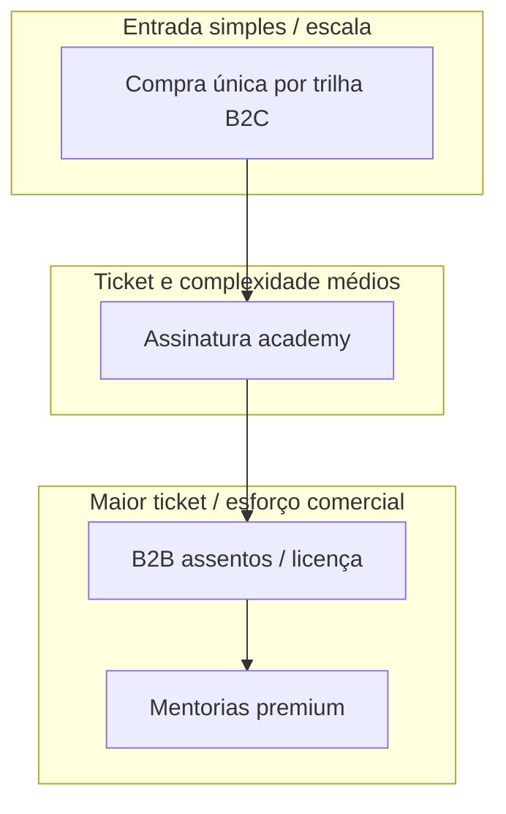

# 6. Estratégia de receita e ampliação (hipóteses)

**Foco:** **modelos de monetização**, trade-offs, **pacotes** e linhas de ampliação (comunidade, parceiros, add-ons) — sem jornadas detalhadas ([tópico 7](./07-jornadas-ponta-a-ponta.md)).

**Estado:** enriquecido (detalhamento aprofundado manual).

**Série:** [← 5](./05-matriz-de-valor.md) · [Índice](./00-indice.md) · [7 →](./07-jornadas-ponta-a-ponta.md)

---

## Modelos base

| Modelo | Benefício | Custo / atenção |
|--------|-----------|-----------------|
| **Compra única por trilha** | Simples de comunicar; alinhado ao mercado BR de educação paga online | Receita mais esporádica; depende de lançamentos ou novas trilhas |
| **Assinatura (“academy +”)** | Previsibilidade (*MRR*); financia catálogo contínuo | Exige **valor recorrente** (novos módulos, comunidade, biblioteca) |
| **Licença corporativa / pacotes de assentos** | Ticket maior; aderência a RH | Ciclo de venda longo; necessidade de relatório e NF |
| **Mentorias premium** | ARPU alto; diferenciação em Specialist | Não escala linearmente; operações de agenda |

---

## Hipótese central do discovery

- **Professional:** compra única como **âncora** de receita e clareza de preço.  
- **Specialist:** **projeto** + **mentoria opcional** como *upsell* de valor e prova de profundidade.  
- **Comunidade:** assinatura **leve** (conteúdo, eventos, networking) — validar preço e frequência.

**Experimentos sugeridos:** teste A/B de *landing* (compra única vs. entrada + *upsell*); pacotes “rota completa” vs. módulo avulso só onde fizer sentido pedagógico.

---

## Ampliação por canal (sem mudar o core do LMS)

| Linha | Descrição | Requisito de negócio |
|-------|-----------|----------------------|
| **Afiliados / indicação** | CAC externo | Qualidade da conversão; compliance de copy |
| **Parceiros (associações, escolas)** | Volume e marca | Contrato, repartição de receita, co-marketing |
| **Add-ons** | Inglês para supply chain, storytelling executivo | SKUs claros no catálogo |
| **Turma fechada B2B** | Customização de cases | Capacidade de **relatório** e, no futuro, SSO |

---

## Sequência de sofisticação (receita)

*Leitura:* escalar **B2C** primeiro; **assinatura** e **B2B** exigem **prova de retenção** e **operação comercial** maduras.

---

## Implicação para o produto

- **Checkout** e **pedido** devem suportar **SKU único** hoje e **pacotes** amanhã (B2B, bundles).  
- **Cupons** e **reembolsos** (prioridade P1 no plano) protegem **margem** e relacionamento em campanhas.  
- **Nota fiscal** e conciliação: decisão de **terceirizar** emissão em escala (ver riscos no [tópico 11](./11-riscos-e-decisoes-em-aberto.md)).

---

[← 5](./05-matriz-de-valor.md) · [Índice](./00-indice.md) · [7. Jornadas →](./07-jornadas-ponta-a-ponta.md)
