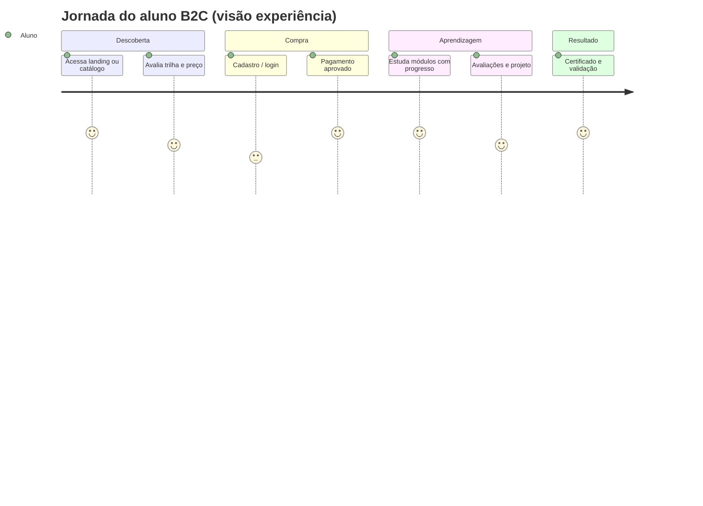
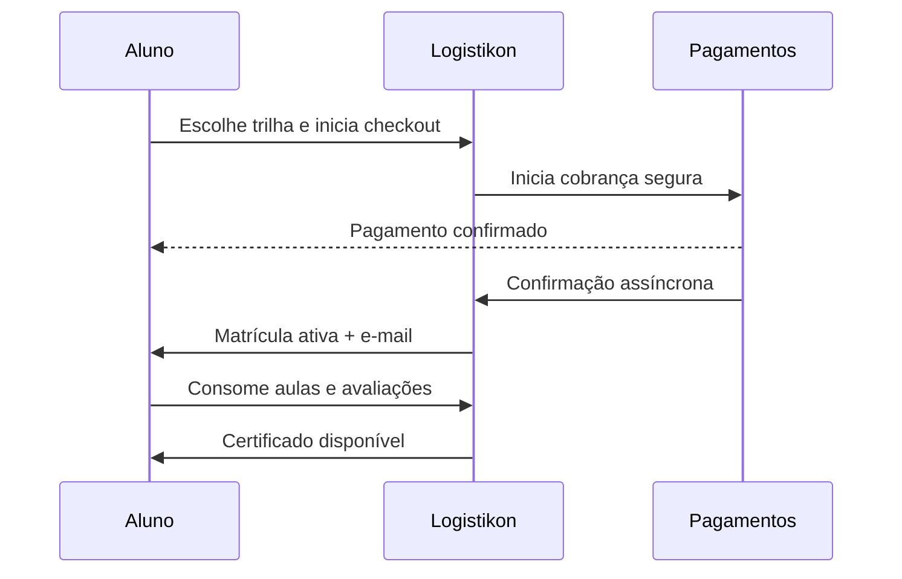
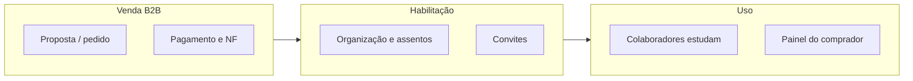
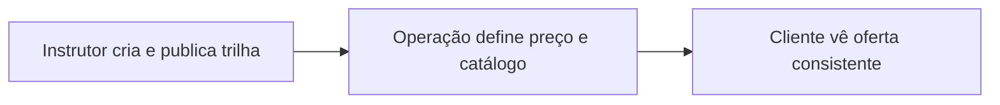
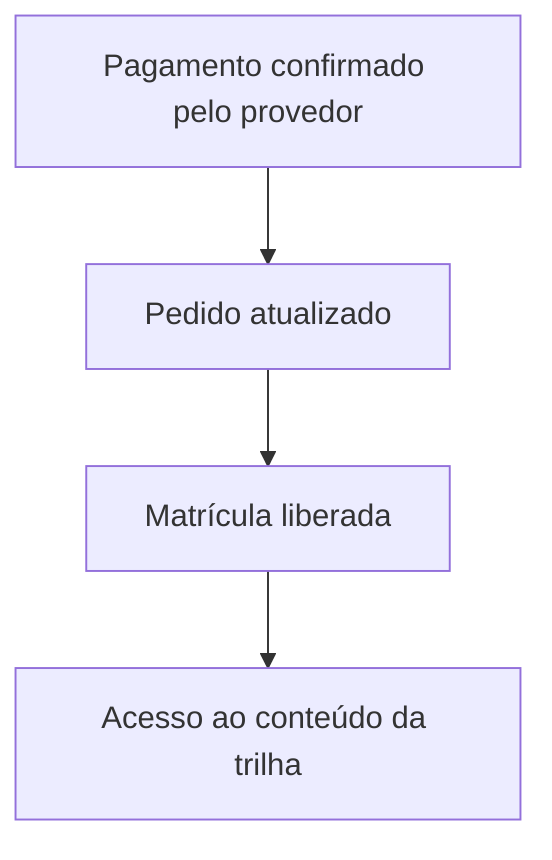

# 7. Jornadas ponta a ponta (fluxo e experiência)

**Foco:** **momentos de verdade** na experiência — B2C, B2B, **cadeia de publicação** da oferta e **pagamento → acesso** — com diagramas.

**Estado:** enriquecido (detalhamento aprofundado manual).

**Série:** [← 6](./06-estrategia-de-receita.md) · [Índice](./00-indice.md) · [8 →](./08-capacidades-de-produto-epicos.md)

---

## Aluno B2C (do clique ao certificado)

Equivalente ao **Fluxo A** do planejamento técnico. Passos:

1. Descobre a marca ou uma trilha (campanha, SEO, LinkedIn).  
2. Compara *syllabus*, preço e regras de certificação.  
3. Cria conta ou entra.  
4. Paga no checkout (gateway).  
5. Recebe confirmação e **matrícula liberada**.  
6. Estuda com progresso salvo; faz quizzes e entregas.  
7. Conclui critérios da trilha.  
8. Obtém certificado e pode compartilhar validação.

### Momentos de verdade (negócio)

| Momento | Risco se mal executado |
|---------|-------------------------|
| Pós-clique na campanha | *Landing* não bate com a promessa → abandono |
| Checkout | Fricção ou desconfiança no pagamento |
| Pós-pagamento | Atraso na liberação → chargeback ou suporte massivo |
| Meio da trilha | Abandono silencioso — precisa de lembretes e progresso visível |
| Certificado | Erro de nome ou regra → desgaste de marca |

---

## B2B (empresa compradora)

1. Negocia pacote (comercial) ou compra autosserviço quando existir.  
2. O **comprador** **gerencia** o *pool* de assentos e os **convites** por e-mail.  
3. Colaboradores aceitam e entram como alunos **vinculados à organização**.  
4. Comprador acompanha progresso e exporta relatório para RH.

**Handoff crítico:** alinhamento entre **pedido corporativo** (financeiro) e **liberação de assentos** (produto) — evitar “pagou mas não consigo convidar”.

---

## Fornecimento da oferta (conteúdo → catálogo)

1. **Instrutor** monta trilha, módulos e critérios de aprovação.  
2. Publica para consumo interno/aprovação.  
3. **Operação comercial / admin** associa **preço** e disponibiliza no catálogo.  
4. Aluno vê trilha **somente quando publicada** e com **preço ativo**.

**Risco operacional:** se “preço ativo” depender de processo **manual** (planilha + *dashboard* do gateway), documentar **SLA interno**; idealmente evoluir para **fluxo único** “publicar e precificar”.

---

## Pagamento e liberação de acesso

O **pagamento confirmado** é o evento que **desbloqueia valor** (matrícula). O negócio precisa de **confiança**: um pagamento válido gera **um** direito de acesso coerente — alinhado a reconciliação e auditoria no plano técnico.

### Fluxos transversais (referência)

- **Suporte (Fluxo E):** aluno abre solicitação → triagem → resolução ou escala (financeiro/conteúdo) — ver especificação de tickets no *backlog* (E06).  
- **Webhook / conciliação:** falhas impactam **todas** as jornadas; observabilidade é requisito de confiança, não só de TI.

---

[← 6](./06-estrategia-de-receita.md) · [Índice](./00-indice.md) · [8. Capacidades de produto →](./08-capacidades-de-produto-epicos.md)
