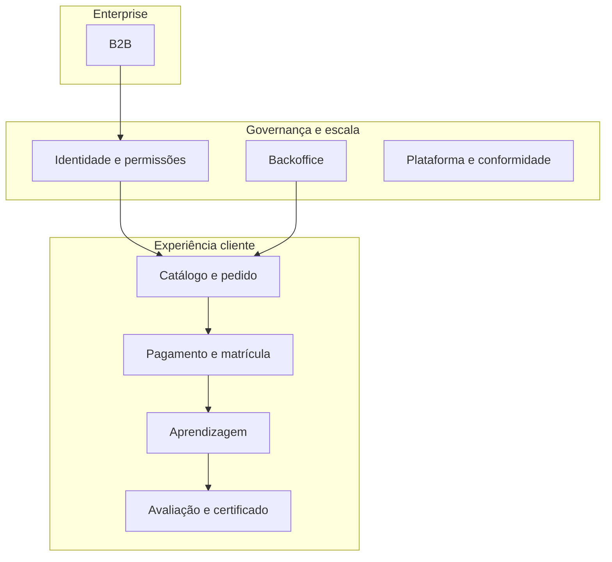

# 8. Capacidades de produto alinhadas ao plano (épicos em linguagem de negócio)

**Foco:** épicos **E01–E08** como **capacidades de negócio**, resultados para cliente e **encadeamento** — sem API, *endpoints* ou critérios técnicos (ver `plan/`).

**Estado:** enriquecido (detalhamento aprofundado manual).

**Série:** [← 7](./07-jornadas-ponta-a-ponta.md) · [Índice](./00-indice.md) · [9 →](./09-roadmap-e-alinhamento-estrategico.md)

---

## Mapa de épicos → valor

| Épico | Capacidade de negócio | Benefício para cliente / empresa |
|-------|------------------------|----------------------------------|
| **E01 Identidade e acesso** | Contas seguras, sessão, perfis e permissões | Confiança; separação entre aluno, equipe e staff; base para B2B |
| **E02 Catálogo e pedidos** | Vitrine de trilhas, detalhe da oferta, criação de pedido | Clareza de compra; rastreabilidade comercial |
| **E03 Pagamentos (Stripe)** | Checkout, confirmação de pagamento, cupom, anti-duplicidade | Receita com reconciliação; menos divergência operacional |
| **E04 Área do aluno** | Dashboard, aulas, progresso, retomar estudo | Continuidade de estudo; redução de abandono |
| **E05 Avaliação e certificados** | Quizzes, tentativas, projeto, PDF, validação pública | Credencial com regras claras e integridade mínima |
| **E06 Backoffice** | CMS, usuários, pedidos, certificados operacionais, suporte, observabilidade | Escala sem *deploy* para cada atualização de conteúdo |
| **E07 B2B** | Organização, assentos, convites, painel do comprador | Venda para equipes; **ROI** visível para RH |
| **E08 Plataforma** | E-mails transacionais, saúde do serviço, LGPD mínima | Confiança, conformidade e continuidade do serviço |

---

## Fluxo de valor típico (B2C)

1. **E01** — o utilizador existe e está autenticado.  
2. **E02** — escolhe trilha e gera intenção de compra (*order*).  
3. **E03** — paga; pedido vira **pago** de forma confiável.  
4. **E04** — consome conteúdo com progresso.  
5. **E05** — completa avaliações e recebe certificado.  
6. **E08** — recebe e-mails de confirmação e pode exercer direitos LGPD.

**E06** atravessa tudo: **publicação**, **financeiro** e **suporte**.

---

## Diagrama de dependências (visão negócio)

---

## O que cada épico “libera” comercialmente

| Sem este épico… | Efeito no negócio |
|-----------------|-------------------|
| E01 fraco | Vazamento de dados; confusão de papéis; B2B inviável |
| E02 incompleto | Catálogo inconsistente com o que se vende |
| E03 incompleto | Receita não bate; chargebacks; suporte sobrecarregado |
| E04 fraco | Abandono; queixa de “paguei e não uso” |
| E05 fraco | Certificado sem valor percebido |
| E06 mínimo demais | Cada mudança de conteúdo vira gargalo técnico |
| E07 ausente | Ticket B2B depende de planilha e e-mail |
| E08 ausente | Falhas silenciosas; risco LGPD e reputacional |

---

## Referência de profundidade

Lista **DEV-001…049** e user stories por pasta: `plan/user-stories/README.md` e `plan/features/registro-de-features.md`.

---

[← 7](./07-jornadas-ponta-a-ponta.md) · [Índice](./00-indice.md) · [9. Roadmap →](./09-roadmap-e-alinhamento-estrategico.md)
