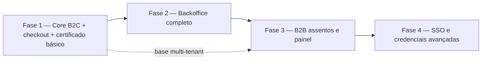
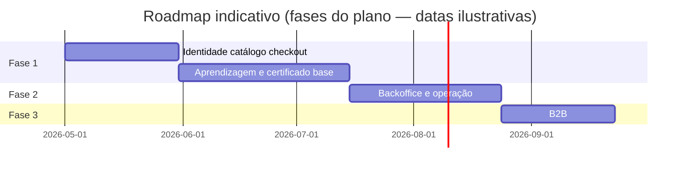

# 9. Roadmap de produto e alinhamento estratégico

**Foco:** **fases** do plano, **o que o mercado percebe** em cada fase, **dependências**, **P0** e critérios de “fase pronta” — métricas de gestão no [tópico 10](./10-metricas-norte-e-operacionais.md).

**Estado:** enriquecido (detalhamento aprofundado manual).

**Série:** [← 8](./08-capacidades-de-produto-epicos.md) · [Índice](./00-indice.md) · [10 →](./10-metricas-norte-e-operacionais.md)

---

## Fases e promessa percebida

| Fase | Foco estratégico | Entrega principal percebida pelo mercado |
|------|------------------|------------------------------------------|
| **1** | Receita B2C e núcleo de aprendizagem | “Comprar e estudar online com certificado” |
| **2** | Operação e conteúdo em escala | Publicação sem engenharia a cada edição; usuários e financeiro sob controlo |
| **3** | Expansão B2B | “Comprar para o time e acompanhar” |
| **4** | Evoluções enterprise e credencial avançada | SSO, credenciais reforçadas (*badges*), automações de retenção |

**Alinhamento com SPEC-00:** Fase 1 = core aluno + checkout; Fase 2 = backoffice; Fase 3 = B2B simples; Fase 4 = evoluções (SSO, certificado avançado, BI/automações).

---

## Dependências entre fases

- **Fase 3** beneficia-se de **modelo de organização** pensado cedo (mesmo que a UI B2B venha depois).  
- **Fase 4** depende de **demanda enterprise** real e requisitos jurídicos de credencial.

---

## Gantt ilustrativo (datas não vinculantes)

*Ajustar datas à cadência real do time.*

---

## Priorização P0 (valor)

Tudo que **bloqueia venda B2C** no MVP:

- Autenticação e sessão  
- Catálogo e checkout  
- Confirmação de pagamento e **matrícula** coerente  
- E-mails transacionais críticos  
- Fluxo de estudo mínimo (dashboard, player, progresso)  
- Certificado básico com regra clara  

Detalhe de prioridades: `plan/specs/SPEC-00-visao-geral-mvp.md`.

---

## Critérios de “fase concluída” (negócio)

| Fase | Critério de aceite (alto nível) |
|------|--------------------------------|
| **1** | Jornada compra → estudo → certificado **E2E** em ambiente de homologação com pagamento de teste |
| **2** | Instrutor **publica trilha** sem necessidade de *deploy* de código para cada alteração de conteúdo |
| **3** | Comprador teste **convida** utilizadores e **vê progresso** agregado |

---

[← 8](./08-capacidades-de-produto-epicos.md) · [Índice](./00-indice.md) · [10. Métricas →](./10-metricas-norte-e-operacionais.md)
