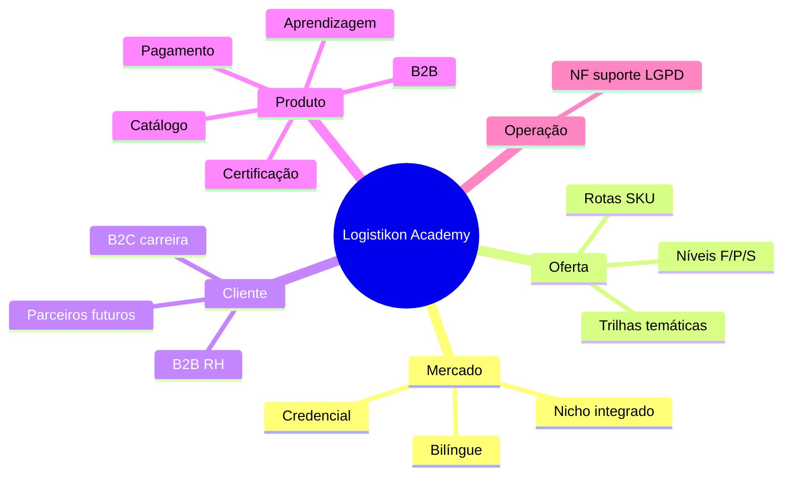

# 12. Mapa mental — do discurso de mercado ao backlog

**Foco:** **síntese visual** da série: como **mercado**, **oferta**, **cliente**, **produto** e **operação** se conectam ao **trabalho de entrega** (épicos e capacidades).

**Estado:** enriquecido (detalhamento aprofundado manual).

**Série:** [← 11](./11-riscos-e-decisoes-em-aberto.md) · [Índice](./00-indice.md) · [13 →](./13-referencias-internas-repositorio.md)

---

## Como ler este mapa

- **Mercado / Oferta:** o que **dizemos** e **vendemos** (trilhas, rotas SKU, níveis F/P/S).  
- **Cliente:** quem **paga** e quem **estuda** (B2C, B2B, parceiros futuros).  
- **Produto:** o que o **software** faz no caminho **catálogo → pagamento → aprendizagem → certificado** (+ B2B).  
- **Operação:** o que sustenta **confiança** (NF, suporte, LGPD).

O **backlog** em `plan/` decompõe “Produto” em épicos E01–E08 e *tasks* DEV — este mapa **não** substitui lista de trabalho; **orienta** priorização.

---

---

## Ligação rápida épicos ↔ ramos

| Ramo do mapa | Épicos principais (ver [tópico 8](./08-capacidades-de-produto-epicos.md)) |
|--------------|---------------------------------------------------------------------------|
| Catálogo + Pagamento | E02, E03 |
| Aprendizagem + Certificação | E04, E05 |
| B2B | E07 (+ E01) |
| Operação / confiança | E06, E08 |

---

[← 11](./11-riscos-e-decisoes-em-aberto.md) · [Índice](./00-indice.md) · [13. Referências →](./13-referencias-internas-repositorio.md)
