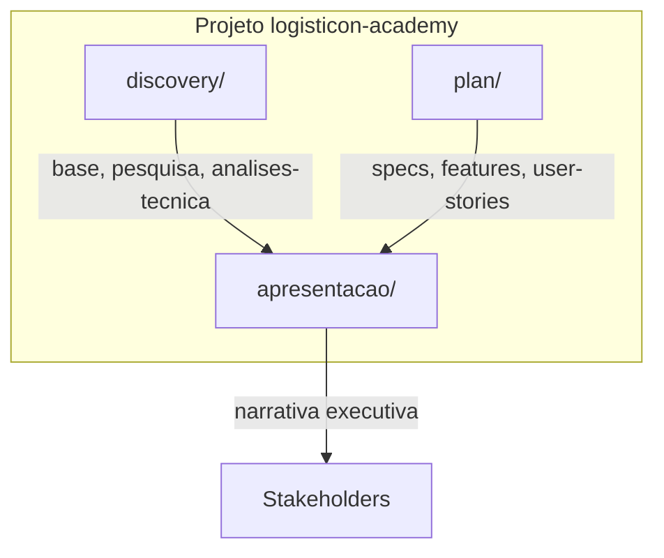
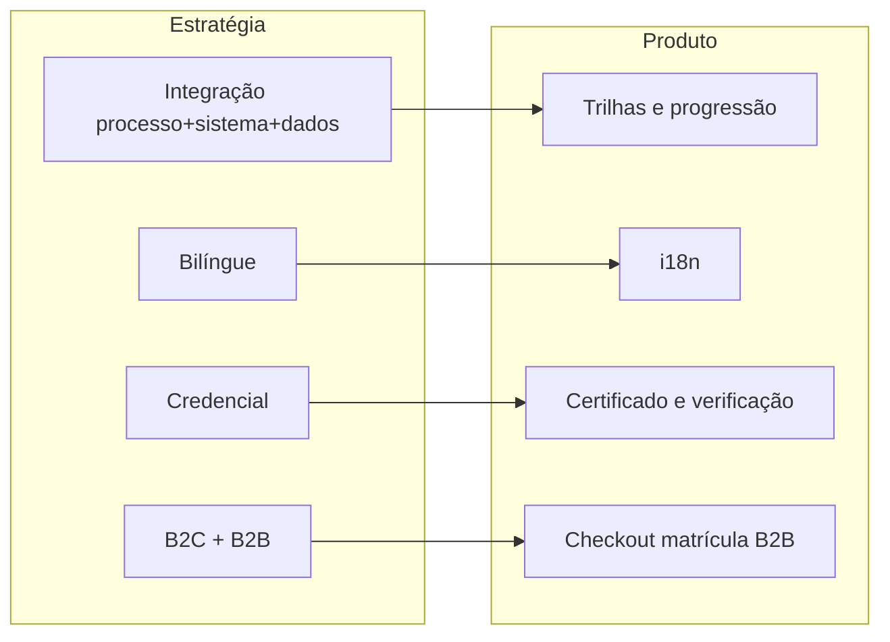
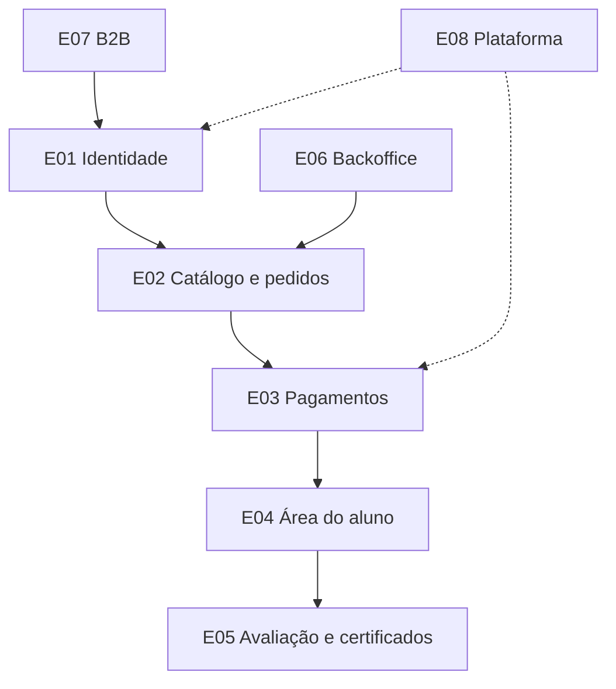
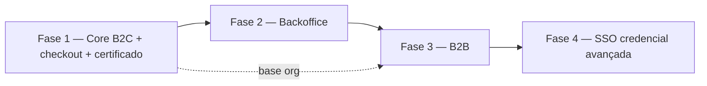
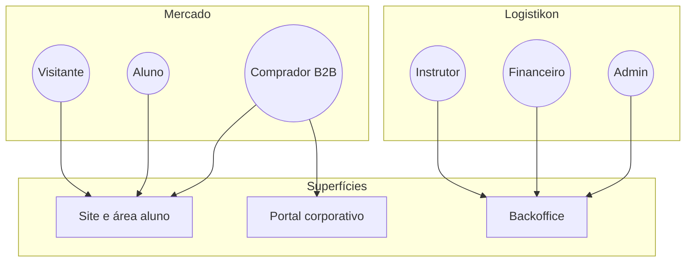
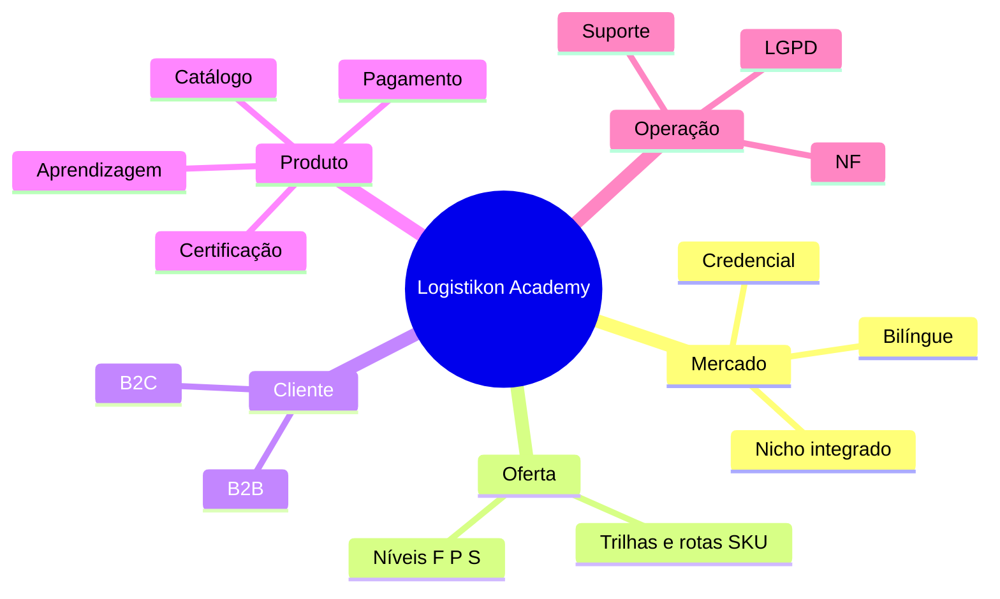

# Apresentação — Documentação executiva Logistikon Academy

Visão de **negócio, produto e jornada** derivada do *discovery* (`discovery/`) e do *planejamento* (`plan/`), em linguagem para **direção, produto, comercial, marketing, operações e parceiros**. **Não** substitui PRD, SPEC nem *tasks* de engenharia.

**Idioma:** português. **Estado:** tópicos `01`–`13` **enriquecidos manualmente** (detalhe contextual, tabelas e ligações cruzadas).

---

## 1. Onde isto vive no repositório

| Pasta | Conteúdo | Papel para esta documentação |
|-------|----------|------------------------------|
| `discovery/` | Base pedagógica, pesquisa de mercado, tópicos técnicos fatiados | **Fonte** de posicionamento, fluxos e requisitos |
| `plan/` | SPEC-00, épicos, registro DEV, user stories | **Fonte** de fases MVP, épicos E01–E08 e prioridades |
| `apresentacao/` | Tópicos 01–13 + índice | **Tradução** técnica → negócio / produto / jornada |

---

## 2. Entrada recomendada

| Ficheiro | Uso |
|----------|-----|
| **[00-indice.md](./00-indice.md)** | Índice linear com links para os 13 tópicos |
| **[documento-executivo-logistikon-academy.md](./documento-executivo-logistikon-academy.md)** | Apenas ponteiro legado → índice |

**Leitura em 15 minutos:** [01-resumo-executivo.md](./01-resumo-executivo.md) → [02-posicionamento-e-territorio.md](./02-posicionamento-e-territorio.md) → [07-jornadas-ponta-a-ponta.md](./07-jornadas-ponta-a-ponta.md).

**Leitura para produto / PM:** ordem **1 → 13** ou saltar para **8** (épicos), **9** (roadmap), **13** (links para `plan/`).

---

## 3. Mapeamento completo dos 13 tópicos

| # | Tópico | Ficheiro | Conteúdo principal | Diagramas no ficheiro |
|---|--------|----------|---------------------|------------------------|
| 1 | Resumo executivo | [01-resumo-executivo.md](./01-resumo-executivo.md) | Visão, proposta de valor, para quem / o que não é | `flowchart` promessa → plataforma |
| 2 | Posicionamento e território | [02-posicionamento-e-territorio.md](./02-posicionamento-e-territorio.md) | Declaração de posicionamento, concorrentes na cabeça do cliente, estratégia → produto | `flowchart` pilares; tabela de quadrantes |
| 3 | Estrutura de negócio | [03-estrutura-de-negocio-ponta-a-ponta.md](./03-estrutura-de-negocio-ponta-a-ponta.md) | Ciclo de valor, níveis F/P/S, famílias de trilhas, rotas SKU | `flowchart` mercado → plataforma |
| 4 | Audiências e papéis | [04-audiencias-personas-e-papeis.md](./04-audiencias-personas-e-papeis.md) | B2C/B2B/B2B2C, segmentos, jornadas-resumo, RBAC em linguagem de negócio | `flowchart` atores × superfícies |
| 5 | Matriz de valor | [05-matriz-de-valor.md](./05-matriz-de-valor.md) | Promessa ↔ evidência ↔ risco; donos; anti-promessas | — |
| 6 | Estratégia de receita | [06-estrategia-de-receita.md](./06-estrategia-de-receita.md) | Modelos de monetização, hipóteses, canais de ampliação | `flowchart` evolução B2C → B2B → mentorias |
| 7 | Jornadas | [07-jornadas-ponta-a-ponta.md](./07-jornadas-ponta-a-ponta.md) | B2C, B2B, conteúdo → catálogo, pagamento → acesso | `journey`, `sequenceDiagram`, `flowchart` |
| 8 | Capacidades (épicos) | [08-capacidades-de-produto-epicos.md](./08-capacidades-de-produto-epicos.md) | E01–E08 em valor de negócio, dependências | `flowchart` experiência × governança × B2B |
| 9 | Roadmap | [09-roadmap-e-alinhamento-estrategico.md](./09-roadmap-e-alinhamento-estrategico.md) | Fases 1–4, P0, critérios de fase, SPEC-00 | `flowchart` dependências; `gantt` ilustrativo |
| 10 | Métricas | [10-metricas-norte-e-operacionais.md](./10-metricas-norte-e-operacionais.md) | North Star hipótese, operacionais, cadência | — |
| 11 | Riscos e decisões | [11-riscos-e-decisoes-em-aberto.md](./11-riscos-e-decisoes-em-aberto.md) | Riscos, mitigações, workshops, execução | — |
| 12 | Mapa mental | [12-mapa-mental-mercado-ao-backlog.md](./12-mapa-mental-mercado-ao-backlog.md) | Síntese mercado → backlog, ligação épicos | `mindmap` |
| 13 | Referências | [13-referencias-internas-repositorio.md](./13-referencias-internas-repositorio.md) | Mapa de ficheiros em `discovery/` e `plan/` | — |

---

## 4. Fluxo de leitura da série (ordem lógica)

---

## 5. Estratégia → produto (visão consolidada)

---

## 6. Épicos E01–E08 e fluxo de valor (consolidado)

---

## 7. Fases do roadmap (alinhamento SPEC-00)

---

## 8. Stakeholders × superfícies digitais

---

## 9. Mapa mental resumido (síntese da série)

---

## 10. Fontes canónicas no repositório

| Tema | Caminho |
|------|---------|
| MVP e fases | `plan/specs/SPEC-00-visao-geral-mvp.md` |
| Catálogo pedagógico | `discovery/base.md` |
| Síntese mercado → software | `discovery/pesquisa/06-sintese-discovery-implicacoes-para-planejamento-de-software.md` |
| Posicionamento e valor | `discovery/pesquisa/05-amplificacao-da-proposta-posicionamento-e-matriz-de-valor.md` |
| Especificação técnica fatiada | `discovery/analises-tecnica/plataforma-logistikon-especificacao-tecnica-v1.md` |
| Fluxos e roadmap técnico | `discovery/analises-tecnica/topicos-v1/10-fluxos-e-passos.md`, `12-roadmap-implementacao.md` |
| Registo DEV e épicos | `plan/features/registro-de-features.md`, `plan/features/epic-*.md` |
| User stories | `plan/user-stories/README.md` |

Lista expandida: [13-referencias-internas-repositorio.md](./13-referencias-internas-repositorio.md).

---

## 11. Convenções e notas

- Cada tópico `NN-*.md` tem cabeçalho **Foco**, **Estado: enriquecido** e ligações **← / Índice / →** para leitura linear ou saltos.
- Diagramas **Mermaid** adicionais e detalhados por tema estão **dentro** dos ficheiros 01–12 (jornada, sequência de pagamento, *Gantt*, etc.).
- Renderização: GitHub, GitLab, VS Code (extensão Mermaid), Notion e ferramentas de slides compatíveis com Mermaid renderizam estes blocos; em caso de falha, usar os ficheiros-fonte individuais.

---

**Navegação rápida:** [Índice 00](./00-indice.md) · [Tópico 1](./01-resumo-executivo.md) · [Tópico 13](./13-referencias-internas-repositorio.md)
