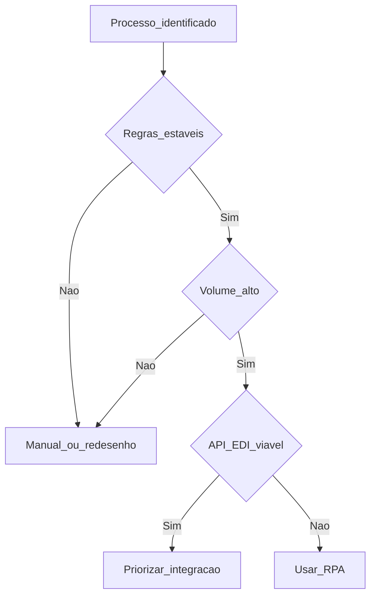

# O que é RPA e candidatos na logística — robô na interface, não mágica na cabeça

**RPA (*Robotic Process Automation*)** é software que **emula** ações humanas em **interfaces** (ERP, portal, e-mail, planilha): cliques, cópia, colagem, preenchimento de formulário. Serve quando há **volume**, **regras** relativamente **estáveis** e **sistemas** que **não** oferecem integração barata — é **tubagem** *versus* **braço mecânico** na mesa, não substituto de **API** bem desenhada.

---

## Objetivos e resultado de aprendizagem

**Ao final desta aula**, você será capaz de:

- Definir RPA e distinguir de **macro** em Excel, *script* Python e **integração** API/EDI.  
- Aplicar critérios **go/no-go** a processos logísticos típicos.  
- Explicar **trade-off** RPA *versus* refatoração ou API.

**Duração sugerida:** 60–75 minutos.

---

## Gancho — a TechLar e os «cinquenta cliques sagrados»

Na **TechLar**, um analista gastava **duas horas diárias** a copiar **status** de expedição de um **portal 3PL** para o ERP — mesmo menu, mesma sequência. A direção pediu «**IA**»; o problema era **repetição mecânica** com regra clara. RPA **liberou** o analista para **exceções** e **melhoria** — depois que alguém documentou o *happy path* que ninguém queria escrever.

**Analogia da lavandaria automática:** empurra botões em vez de esfregar à mão — **não** lava melhor se a roupa estiver **mal separada** (processo ruim).

---

## Mapa do conteúdo

- Definição e limites do RPA.  
- Candidatos: volume, estabilidade, digitalização da entrada.  
- RPA *versus* API/EDI *versus* manual.  
- Riscos: mudança de UI, sazonalidade de regra.

---

## Conceito núcleo

**RPA:** robô de **software** que opera **como usuário** em aplicações existentes.

**Bom candidato (*consenso de mercado*):** alta **frequência**, passos **repetíveis**, poucas **decisões** complexas, sistemas **legados** ou portais **sem** API estável.

**Mau candidato:** regras que mudam **toda semana**, julgamento **subjetivo** forte, dados **só** em papel ilegível, ou processo que **devia** ser eliminado (Lean).

**Legenda:** losangos = **decisões**; retângulos = **conclusão** pedagógica (simplificada — envolver TI e compras).

**Mini-caso:** conciliação de **fatura de frete** com **tabela** de tarifas: RPA pode ler PDF **se** layout for estável; se o transportador muda layout **semanalmente**, o candidato vira **ruim** sem OCR treinado (custo alto).

---

## Trade-offs

- **RPA rápido** *versus* **dívida técnica** quando a UI muda.  
- **CAPEX** de plataforma RPA *versus* **custo** de projeto de integração único.  
- **Autonomia** do negócio *versus* **governança** central (segurança, licenças).

---

## Aplicação — exercício

Liste **três** processos da sua área (ou fictícios). Para cada um, marque **S/N**: regras estáveis? volume relevante? existe API viável? Conclua **RPA**, **API** ou **redesenhar** em **uma palavra** cada.

**Gabarito pedagógico:** processo com API oficial e SLA deve tender a **API**; «julgar se fornecedor é confiável» não é RPA — é **humano** ou modelo supervisionado (outro módulo); se tudo virou RPA sem passar pelo fluxograma, revisar.

---

## Erros comuns e armadilhas

- RPA no processo **errado** — automatiza lixo mais rápido.  
- Ignorar **mudança de versão** do ERP (quebra seletor de tela).  
- **Shadow IT** com robô em credencial pessoal.  
- Prometer **100%** sem tratamento de exceção (ver próxima aula).

---

## KPIs e decisão

- **Horas** recuperadas por semana (*antes/depois* medido).  
- **Taxa de sucesso** do robô *versus* fila humana.  
- **Custo** por transação (licença + manutenção).  
- **Incidentes** de segurança ou erro de dado.

---

## Fechamento — três takeaways

1. RPA imita **pessoa na tela** — não resolve **regra de negócio** ambígua.  
2. API primeiro quando **viável** — RPA é **ponte**, não religião.  
3. Candidato bom tem **documentação** do passo a passo — não só «o João sabe».

**Pergunta de reflexão:** qual processo hoje só existe porque «**sempre foi assim no sistema**»?

---

## Referências

1. AGARWAL, A. et al. *Digital labor: innovation, productivity, and employment* — discussão económica sobre automação de tarefas (contexto).  
2. UiPath / Automation Anywhere / Microsoft Power Automate — **documentação** de conceitos de RPA (*tipo de fonte*; sem endorsement).  
3. ASCM — tecnologia e produtividade na cadeia — [ascm.org](https://www.ascm.org/).

**Ponte:** [Integrações batch](../../trilha-tecnologia-e-sistemas/modulo-02-erp-aplicado-supply-chain/aula-03-integracoes-batch.md).
