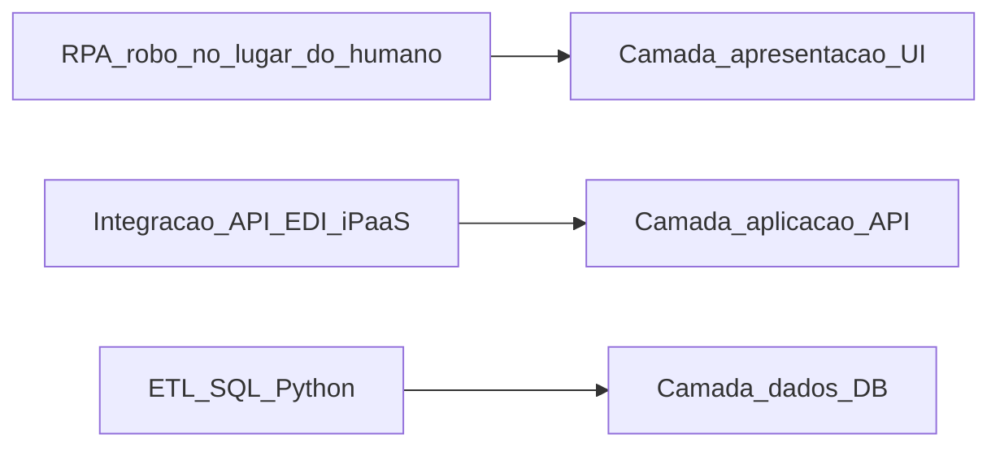
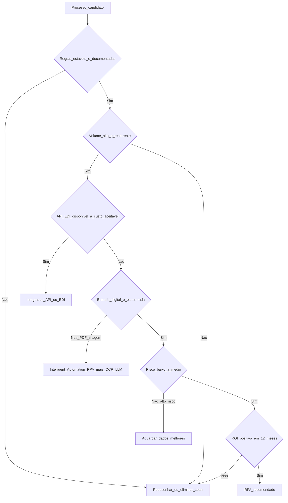

# O que é RPA e candidatos na logística — robô na interface, não mágica na cabeça

**RPA (*Robotic Process Automation*)** é software que **emula** ações humanas em **interfaces** (ERP, portal, e-mail, planilha): cliques, cópia, colagem, preenchimento de formulário. Serve quando há **volume**, **regras** relativamente **estáveis** e **sistemas** que **não** oferecem integração barata — é **tubagem** *versus* **braço mecânico** na mesa, não substituto de **API** bem desenhada.

A indústria já viu três ondas: **RPA atendido** (*attended*, robô no desktop do utilizador), **RPA não atendido** (*unattended*, em servidor 24/7) e, mais recentemente, ***Intelligent Automation*** (RPA + OCR + LLM + ML para *cognitive tasks*). Esta aula firma o **alicerce conceitual** e o **critério de seleção** — sem critério, automatiza-se lixo a alta velocidade.

---

## Objetivos e resultado de aprendizagem

- Definir RPA e distinguir de **macro Excel**, ***script* Python**, **integração API/EDI** e ***iPaaS*** (*Integration Platform as a Service*).
- Aplicar **matriz multi-critério** (volume × estabilidade × maturidade da entrada × ROI × risco) a processos logísticos.
- Comparar **RPA atendido vs. não atendido** e **on-prem vs. cloud**.
- Posicionar a plataforma RPA dentro do **ecossistema** (UiPath, Automation Anywhere, Power Automate, Blue Prism, n8n, Make).
- Escrever um **mini *business case*** (horas-poupadas × custo-de-licença × manutenção) defensável.

**Duração sugerida:** 75–90 minutos. **Pré-requisitos:** noções de ERP/WMS/TMS ([Tecnologia e sistemas](../../trilha-tecnologia-e-sistemas/README.md)) e KPIs logísticos ([Custos e performance](../../trilha-fundamentos-e-estrategia/modulo-04-custos-logisticos-performance/README.md)).

---

## Mapa do conteúdo

1. Definição operacional, fronteiras e taxonomia (*attended* / *unattended* / *intelligent*).
2. Matriz **go/no-go** com 6 critérios e *score*.
3. RPA × Macro × Script × API/EDI × iPaaS — quadro de decisão.
4. *Business case*: TCO, ROI e *payback*.
5. Casos típicos em logística BR (CT-e, ASN portal, conciliação tabela frete).
6. Riscos, *anti-padrões* e armadilhas comuns.

---

## Gancho — a TechLar e os «cinquenta cliques sagrados»

Na **TechLar**, um analista gastava **duas horas diárias** a copiar *status* de expedição de um **portal 3PL** para o ERP — mesmo menu, mesma sequência. A direção pediu «**IA**»; o problema era **repetição mecânica** com regra clara. Após **30 dias** de RPA não atendido em servidor:

| Métrica | Antes | Depois |
|---|---|---|
| Horas/semana do analista no portal | 10 h | 0,5 h (tratar exceções) |
| Tempo entre evento no 3PL e ERP atualizado | 4–24 h | < 30 min |
| Inconsistências de *status* detectadas em auditoria | 3,2% | 0,4% |

**Analogia da lavandaria automática:** empurra botões em vez de esfregar à mão — **não** lava melhor se a roupa estiver **mal separada** (processo ruim). RPA herda a qualidade do processo.

**Analogia complementar (estagiário rápido):** RPA é como **estagiário fluente em cliques, sem julgamento e sem cansaço** — perfeito para tarefa repetitiva-determinística, péssimo para decisão ambígua.

---

## Conceito-núcleo — o que RPA é e o que **não é**

**RPA é** um robô de software que opera **na camada de apresentação** (UI) das aplicações existentes, simulando teclado, mouse, leitura de elementos HTML ou *image-based* (visão computacional simples).

**RPA *não* é:**

| Não é | Porque |
|---|---|
| **API/EDI** | API conversa máquina-a-máquina, é mais rápida, robusta a mudança visual e auditável. RPA é o "plano B" quando API não existe. |
| **IA / ML** | RPA segue regra fixa. Quando junta OCR ou LLM para **interpretar** entrada, vira **Intelligent Automation** ou *Hyperautomation*. |
| **BPM** | *Business Process Management* desenha e orquestra processos *end-to-end*; RPA é uma **task** dentro do processo. |
| **Macro Excel/VBA** | Macro vive dentro do Office; RPA atravessa **múltiplas aplicações** com governança central. |



**Legenda:** quanto mais **fundo** na camada (DB), mais robusto e barato no longo prazo, mas mais dependente de TI. RPA é a opção **mais superficial** — rápida de entregar, frágil em mudanças visuais.

---

## Diagrama / Arquitetura — a matriz **go/no-go** ampliada



**Legenda:** seis decisões em sequência. Se cair em `IA`, o caminho é OCR + classificação ou LLM com *guardrails* (Módulo 3). Se cair em `API`, abre-se ticket à TI/fornecedor. RPA "puro" só sobrevive ao funil quando não há alternativa **e** o ROI fecha.

### Score quantitativo (planilha mental)

Atribua 0–5 a cada critério; **soma ≥ 22** sugere candidato forte; **15–21** revisar; **< 15** pular.

| Critério | Peso | 0 (péssimo) | 5 (ótimo) |
|---|---|---|---|
| Volume mensal | 1,0 | < 50 transações | > 5 000 |
| Estabilidade da regra | 1,2 | muda toda semana | estável > 12 meses |
| Estabilidade da UI/sistema | 1,0 | redesign anual | sem mudança 24 meses |
| Maturidade da entrada | 0,8 | papel/PDF imagem | XML/JSON/CSV |
| Risco regulatório | 0,8 | alto (fiscal/seguro) | baixo |
| Disponibilidade de *owner* funcional | 1,2 | nenhum | dedicado |

---

## Aprofundamentos — variações de RPA

### RPA atendido vs. não atendido

| Dimensão | *Attended* (no desktop) | *Unattended* (servidor) |
|---|---|---|
| Quem dispara | Humano com clique | Agendador / fila / API |
| Caso típico | Conciliar fatura interativa, *triage* call center | Lote noturno de relatórios, ASN |
| Licença | Mais barata | Mais cara (uso 24/7) |
| Observabilidade | Limitada (registo local) | Centralizada (orquestrador) |
| Risco | Compartilha credencial do utilizador | Conta de serviço dedicada |

### On-prem vs. cloud RPA

- **On-prem** (UiPath Orchestrator, Blue Prism Server): controlo total, exige TI dedicada, latência baixa em sistemas legados internos.
- **Cloud** (UiPath Cloud, Power Automate, Automation Anywhere AAI): *time-to-deploy* curto, custo OPEX, requer auditoria de **transferência internacional** de dados (LGPD art. 33).

### Citizen developer vs. CoE central

| Modelo | Vantagem | Risco |
|---|---|---|
| *Citizen developer* (Power Automate, n8n) | Velocidade, autonomia da área | Robôs órfãos, *shadow IT*, falha de auditoria |
| Centro de Excelência (CoE) RPA | Padrão, segurança, reuso | Pode virar gargalo |
| **Híbrido recomendado** | CoE define guardrails, padroes e revisão; áreas constroem com kit | Exige governança ativa |

---

## Exemplos técnicos

### Pseudo-fluxo UiPath / Power Automate (descrito em alto nível)

```text
Fluxo: ATUALIZAR_STATUS_3PL_NO_ERP
1. [Trigger] Agendamento a cada 30 min (orquestrador)
2. [Login] Abrir browser, ir ao portal 3PL, ler credencial do Vault (Azure Key Vault / CyberArk)
3. [Navegação] Menu > Expedições > filtro: status alterado nas últimas 60 min
4. [Extração] Para cada linha: HTI, número da expedição, status, timestamp
5. [Validação] Schema (regex no HTI, status pertence a {ENVIADO, EM_ROTA, ENTREGUE, EXCEÇÃO})
6. [Idempotência] Hash (HTI + status + timestamp) já processado? Se sim, pular
7. [Escrita] POST no ERP via tela Z_TRANSPORTE (ou tabela Z_STATUS via WS)
8. [Log] Append em tabela centralizada (run_id, item, resultado, screenshot em erro)
9. [Exceção] Se erro -> fila humana (Action Center / SharePoint List) com SLA 4 h
10. [Encerramento] Logout, fechar browser, encerrar sessão
```

**Boas práticas obrigatórias:**

- Credencial **nunca** em variável de ambiente do robô — sempre em **vault** (Azure Key Vault, AWS Secrets Manager, HashiCorp Vault, CyberArk).
- *Selectors* devem ser **resilientes**: usar atributos `id`, `name`, `aria-label` — evitar XPath baseado em posição (`div[3]/span[2]`).
- Toda execução precisa de `run_id` único (UUID) para correlacionar logs, screenshots e tickets de exceção.
- *Screenshots* em erro **mascaram PII** (CPF, nome de motorista) antes de gravar.

### Snippet Python — esqueleto de um RPA "leve" com Playwright + cofre

```python
"""
RPA leve em Python: lê status no portal 3PL e envia ao ERP via API interna.
Padrão equivalente ao que UiPath / Power Automate fazem, com mais controlo.
"""
import os
import hashlib
import logging
from datetime import datetime, timezone
from playwright.sync_api import sync_playwright
import requests
from azure.identity import DefaultAzureCredential
from azure.keyvault.secrets import SecretClient

logging.basicConfig(level=logging.INFO, format="%(asctime)s %(levelname)s %(message)s")
log = logging.getLogger("rpa_3pl")

VAULT_URL = os.environ["VAULT_URL"]
ERP_API = os.environ["ERP_API_BASE"]

def get_secret(name: str) -> str:
    credential = DefaultAzureCredential()
    client = SecretClient(vault_url=VAULT_URL, credential=credential)
    return client.get_secret(name).value

def already_processed(payload: dict, seen: set) -> bool:
    h = hashlib.sha256(
        f"{payload['hti']}|{payload['status']}|{payload['ts']}".encode()
    ).hexdigest()
    if h in seen:
        return True
    seen.add(h)
    return False

def push_to_erp(payload: dict, token: str) -> int:
    r = requests.post(
        f"{ERP_API}/transporte/status",
        json=payload,
        headers={"Authorization": f"Bearer {token}"},
        timeout=15,
    )
    r.raise_for_status()
    return r.status_code

def main() -> None:
    user = get_secret("portal-3pl-user")
    pwd = get_secret("portal-3pl-pwd")
    erp_token = get_secret("erp-internal-token")
    seen: set[str] = set()
    with sync_playwright() as p:
        browser = p.chromium.launch(headless=True)
        page = browser.new_page()
        page.goto("https://portal.3pl.example.com/login")
        page.fill("#username", user)
        page.fill("#password", pwd)
        page.click("button[aria-label='Entrar']")
        page.wait_for_selector("#tabela-expedicoes")
        rows = page.query_selector_all("#tabela-expedicoes tbody tr")
        for row in rows:
            payload = {
                "hti": row.query_selector("td.hti").inner_text().strip(),
                "status": row.query_selector("td.status").inner_text().strip(),
                "ts": datetime.now(timezone.utc).isoformat(),
            }
            if already_processed(payload, seen):
                continue
            try:
                push_to_erp(payload, erp_token)
                log.info("OK %s -> %s", payload["hti"], payload["status"])
            except requests.HTTPError as e:
                log.error("ERP recusou %s: %s", payload["hti"], e)
        browser.close()

if __name__ == "__main__":
    main()
```

**Comentário pedagógico:** este script tem **idempotência** (hash), **vault** real, **timeout** explícito e **logs** estruturados — mesmo nível de cuidado que se exige a um robô em UiPath de produção.

---

## Trade-offs e decisão — RPA × API × redesenho × iPaaS

| Cenário | RPA | API/EDI | iPaaS (Make/n8n/Boomi) | Redesenhar |
|---|---|---|---|---|
| Sistema legado sem API | ✅ | ❌ | depende | longo prazo |
| Fornecedor com API REST estável | ⚠️ desperdício | ✅ | ✅ | — |
| Múltiplos parceiros com formatos diferentes | ⚠️ fragmenta | ❌ caro | ✅ | — |
| Processo com decisão subjetiva | ❌ | — | — | ✅ humano + ML |
| Tarefa que **não deveria existir** | ❌ | ❌ | ❌ | ✅ Lean |

**Regra prática:** se há **API documentada e SLA**, integre. Se não há e o processo é estável, RPA. Se há **dezenas de parceiros**, **iPaaS**. Se o processo é **idiota**, mate-o antes de automatizá-lo.

---

## Caso prático / Mini-laboratório — TechLar conciliação CT-e × tabela

**Contexto:** TechLar recebe **800 CT-e** por mês de **12 transportadores**. CT-e chega via **e-mail** (XML). Tabela contratual está em planilha SharePoint, atualizada trimestralmente. Atualmente, dois analistas conciliam manualmente — 6 dias úteis por mês.

**Diagnóstico go/no-go:**

| Critério | Score | Nota |
|---|---|---|
| Volume mensal | 4 | 800 CT-e/mês |
| Estabilidade da regra | 4 | tarifas mudam trimestralmente |
| Estabilidade da entrada | **5** | XML CT-e tem **layout SEFAZ padrão** (modelo 57) — não muda |
| Risco | 3 | erro = pagamento divergente, mas há controle financeiro |
| ROI | **5** | 12 dias-homem/mês = ~R$ 9 000 vs. R$ 1 500/mês de licença |
| *Owner* | 4 | controller de transportes |
| **Soma** (ponderada) | **~24** | ✅ candidato forte |

**Caminho ótimo:** **não usar RPA na UI** — usar Python para *parse* do XML CT-e (estruturado!) e comparar com tabela. RPA cabe só se o transportador exigisse confirmar leitura num portal (parte humana).

---

## Erros comuns e armadilhas

- **Automatizar o errado**: RPA num processo que devia morrer (Lean primeiro, robô depois).
- **Selector frágil**: usar XPath posicional (`/html/body/div[3]/...`) — quebra a cada deploy do fornecedor.
- ***Shadow IT* com credencial pessoal**: robô usa login do João; João sai → robô morre, ou pior, audita o João por "ações suspeitas".
- **Sem tratamento de exceção**: RPA com `try/catch` vazio engole erro e segue, gerando dados sujos silenciosamente (próxima aula).
- **CAPTCHA / 2FA contornado**: tentar driblar segurança é antiético, fere LGPD/contrato e pode ser crime (Lei 12.737/2012 Carolina Dieckmann).
- **Promessa de 100%**: RPA tem *failure rate* de 1–10% típico — comunicar é maturidade.
- **ROI inflacionado**: contar "horas brutas" sem descontar manutenção (~30% do esforço inicial/ano).

---

## Segurança, ética e governança

| Tema | Boa prática | Referência |
|---|---|---|
| **Credenciais** | Vault central (Azure Key Vault, CyberArk, HashiCorp), rotação trimestral, conta de serviço dedicada (não pessoal) | OWASP Secrets Management |
| **Princípio do menor privilégio** | Robô tem só permissões necessárias (read em portal, write só na tela X) | NIST SP 800-53 AC-6 |
| **PII em logs** | Mascarar CPF/CNPJ/nome em screenshots e logs (`***.***.***-12`) | LGPD art. 6º (necessidade) |
| **Auditoria** | Toda execução com `run_id`, retenção mínima 12 meses (depende do setor) | ISO 27001, SOX se aplicável |
| **Mudança de UI** | *Pipeline* de testes automatizados do robô antes de promover | DevOps para RPA (UiPath Test Suite) |
| **Ética** | Não automatizar contornar CAPTCHA, scraping em violação de TOS, ou decisões de RH/crédito sem revisão | EU AI Act *high-risk* (cap. III) |

**LGPD na prática RPA:**

1. **Mapear** dados pessoais que o robô toca (motorista, destinatário).
2. **Base legal** para tratamento (geralmente *execução de contrato* art. 7º V).
3. **Retenção** mínima necessária — purgar logs após o prazo.
4. **DPIA** (*Data Protection Impact Assessment*) se houver decisão automatizada com efeito relevante.

---

## KPIs

| KPI | Pergunta | Dono | Fonte | Cadência | Playbook se fora da meta |
|---|---|---|---|---|---|
| **Hours Saved / semana** | Quanto tempo de humano libertamos? | Sponsor de negócio | Estudo *baseline* + fila atual | Semanal | Recalcular *baseline*; revisar exceções |
| **Bot Success Rate (%)** | % execuções terminadas sem fila humana | CoE RPA | Orquestrador (UiPath, Power Automate) | Diário | Investigar logs; *selector healing* |
| **Bot Uptime (%)** | Disponibilidade do orquestrador | TI / SRE | Monitoring (Datadog, App Insights) | Tempo real | Failover, escala |
| **MTTR (h)** | Tempo médio para reparar fluxo após mudança | CoE RPA | Ticket / Jira | Mensal | Testes automatizados pré-release do alvo |
| **Cost per Transaction (R$)** | Custo total ÷ transações processadas | Controlling | Licença + FTE manutenção + infra | Trimestral | Revisar licenciamento / consolidar fluxos |
| **Exceptions in Human Queue** | Quanto a fila cresce? | Operações | Action Center / fila interna | Diário | Reforçar *happy path*, treinar operador |
| **Security Incidents (n)** | Houve uso de credencial em desvio? | Segurança da Informação | SIEM | Mensal | Rotação imediata, RCA |
| **Compliance Audit Findings** | Achados em auditoria do robô | Auditoria interna | Auditorias periódicas | Anual | Plano de ação 90 dias |

---

## Tecnologias e ferramentas — panorama de mercado

| Categoria | Players principais | Quando usar |
|---|---|---|
| **RPA enterprise** | UiPath, Automation Anywhere, Blue Prism | Volume grande, governança forte, on-prem |
| **RPA cloud "low-code"** | Microsoft Power Automate, UiPath Cloud | Já tem licença Microsoft 365 / E5; *citizen developers* |
| **iPaaS / automação flow** | Make (ex-Integromat), Zapier, n8n, Workato, Boomi | Conectar SaaS, sem UI; *event-driven* |
| **OCR / IDP** (*Intelligent Document Processing*) | UiPath Document Understanding, Azure AI Document Intelligence, ABBYY, Rossum | Faturas, CT-e em PDF, contratos |
| **Process Mining** (descobrir candidatos) | Celonis, UiPath Process Mining, Microsoft Process Insights | Achar gargalo antes de automatizar |
| **Observability RPA** | Datadog, Splunk, App Insights | Métricas centralizadas além do orquestrador |
| **Cofres de credenciais** | Azure Key Vault, AWS Secrets Manager, HashiCorp Vault, CyberArk | Sempre, sem exceção |

**Recomendação para PMEs BR:** começar com **Power Automate Cloud** (licença Microsoft 365 já existente) ou **n8n self-hosted** (open-source, baixo custo). Migrar para UiPath quando volume passar de ~50 fluxos críticos.

---

## Glossário rápido

- **RPA**: Robotic Process Automation. Automação por simulação de UI.
- **Attended / Unattended**: robô disparado por humano (atendido) vs. agendado (não atendido).
- **Orchestrator**: servidor que gere filas, agendamento, credenciais e logs dos robôs.
- **Selector**: identificador do elemento na tela (ex.: `<button id="login">`).
- **IDP**: Intelligent Document Processing — OCR + ML para extrair dados de docs.
- **CoE**: Center of Excellence — equipa central que governa a prática RPA.
- **Citizen Developer**: utilizador de negócio que constrói automações *low-code* sem ser de TI.
- **Hyperautomation** (Gartner): RPA + ML + Process Mining + LLM + iPaaS combinados.
- **Idempotência**: rodar a mesma operação N vezes produz o mesmo resultado (não duplica).

---

## Aplicação — exercícios

**Exercício 1 — matriz go/no-go.** Liste **três** processos da sua área (ou da TechLar fictícia). Para cada um, atribua score 0–5 nos **6 critérios** da matriz, calcule a soma ponderada e decida: **RPA**, **IA**, **API**, **iPaaS**, **redesenhar** ou **adiar**.

**Exercício 2 — *business case*.** Calcule *payback* simples para um robô que: poupa 8 h/semana, custo médio R$ 60/h, licença R$ 1 200/mês, manutenção 20% do esforço inicial (estimar 80 h × R$ 200/h por ano).

**Exercício 3 — quadro de decisão.** Para o cenário "fornecedor X só envia faturas em PDF não estruturado, layout muda 3× ao ano, 200 faturas/mês", justifique numa frase por que RPA **puro** não é a melhor escolha. Sugira alternativa.

**Gabarito pedagógico:**

- **Ex.1**: critério `estabilidade` (peso 1,2) é o que mais elimina candidatos; quem decidir RPA com regra instável ignora *trade-off* de manutenção.
- **Ex.2**: 8 h × 50 sem × R$ 60 = R$ 24 000/ano poupados; custo = R$ 14 400 licença + R$ 16 000 manutenção = R$ 30 400 → **payback negativo** sem revisão de licenciamento ou aumento de escopo.
- **Ex.3**: RPA puro depende de UI estável e PDF estruturado; combinar **IDP + revisão humana** (UiPath DU, Azure AI DI), ou negociar contratualmente layout XML/CSV.

---

## Pergunta de reflexão

Qual processo da sua operação **só existe porque "sempre foi assim no sistema"**? Se ele desaparecesse amanhã, **alguém notaria** além do auditor?

---

## Fechamento — takeaways

1. **RPA imita pessoa na tela** — não resolve regra de negócio ambígua nem corrige processo idiota.
2. **API primeiro quando viável** — RPA é ponte, não religião; iPaaS para muitos parceiros.
3. **Candidato bom tem documentação** — não só "o João sabe"; sem `as-is` mapeado, robô nasce dívida.
4. **Score multi-critério** > intuição: peso a estabilidade e ROI realista (com manutenção).
5. **Vault, conta de serviço e auditoria** são pré-requisito, não *nice to have*.

---

## Referências

1. **WILLCOCKS, L.; LACITY, M.** *Service Automation: Robots and the Future of Work* — Steve Brookes Publishing.
2. **VAN DER AALST, W.** *Robotic Process Automation* — *Business & Information Systems Engineering* (2018) — base académica.
3. **Gartner** — *Hype Cycle for ICT in Supply Chain* / *Magic Quadrant for RPA* (anual; *consultar versão vigente*).
4. **Forrester Wave™** — *Robotic Process Automation* (anual).
5. **UiPath Academy** — formação certificada gratuita ([academy.uipath.com](https://academy.uipath.com/)).
6. **Microsoft Learn** — Power Automate ([learn.microsoft.com/power-automate](https://learn.microsoft.com/power-automate/)).
7. **OWASP** — *Secrets Management Cheat Sheet*.
8. **ANPD** — *Guia Tratamento de Dados pelo Poder Público* / *guias setoriais* — [gov.br/anpd](https://www.gov.br/anpd/).
9. **EU AI Act** (Regulation (EU) 2024/1689) — classificação de risco, *high-risk systems* — [artificialintelligenceact.eu](https://artificialintelligenceact.eu/).
10. **CSCMP** / **ASCM** / **ABRALOG** — práticas de automação na cadeia.

---

## Pontes para outras trilhas

- [Integrações batch e EDI](../../trilha-tecnologia-e-sistemas/modulo-02-erp-aplicado-supply-chain/aula-03-integracoes-batch.md) — alternativa estruturada ao RPA.
- [Logística 4.0 — maturidade digital](../../trilha-logistica-estrategica/modulo-04-logistica-4-0/aula-01-maturidade-digital-supply-chain.md) — onde RPA cabe na estratégia.
- [Melhoria contínua — gemba e PDCA](../../trilha-melhoria-continua-e-processos/modulo-03-continuous-improvement/aula-01-pdca-gemba-sponsor.md) — eliminar antes de automatizar.
- [Aula 1.2 desta trilha — Exceções e governança](aula-02-desenho-excecao-governanca-rpa.md) — próximo passo natural.
