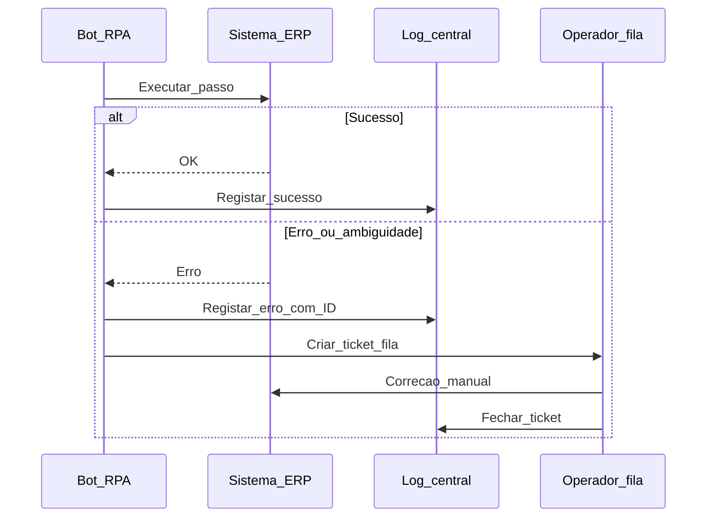

# Exceções, fila humana e governança de RPA — o robô precisa de «andar de emergência»

RPA no **caminho feliz** impressiona em demo; em **produção** aparecem pop-ups, timeouts, **PDF ilegível** e regras de negócio **novas**. **Governança** define: **logs**, **versão** do fluxo, **conta de serviço**, **segregação** de funções, tratamento de **PII** (*Personally Identifiable Information*) e **fila humana** (*human-in-the-loop*) com SLA.

---

## Objetivos e resultado de aprendizagem

**Ao final desta aula**, você será capaz de:

- Desenhar **fluxo** com ramo de exceção e **escalação**.  
- Listar controlos mínimos de **GRC** para RPA (*consenso de mercado*).  
- Explicar por que **credencial pessoal** é inaceitável.

**Duração sugerida:** 60–75 minutos.

---

## Gancho — a TechLar e o robô que «comprou» sozinho

Um fluxo RPA da **TechLar** repetia **Enter** em janela de confirmação de **PO** quando o sistema travava — numa **mudança** de *layout*, confirmou **duas** ordens duplicadas. Não havia **log** auditável nem **regra** de duplicidade; a culpa foi para «**o robô**». Sem **governança**, RPA é **risco operacional** disfarçado de inovação.

**Analogia do carro autónomo nível 2:** ainda precisa **condutor** atento; o fabricante define **quando** o humano assume — o mesmo vale para exceções.

---

## Mapa do conteúdo

- *Happy path* e **exceções** tipadas.  
- Fila humana, prioridade P1/P2.  
- Logs, *screenshots* (política de privacidade), retenção.  
- Conta de serviço, **MFA** onde aplicável (TI define).

---

## Conceito núcleo

**Exceção:** qualquer desvio que **não** pode ser resolvido com regra pré-definida sem **risco** — deve **parar** ou **encaminhar**, não «adivinhar».

**Fila humana (*queue*):** lista de itens com **contexto** (captura de tela, referência de pedido) para decisão em **tempo** acordado.

**GRC mínimo (pedagógico):** *change management* quando UI muda; **acesso** mínimo necessário; **auditoria** de quem aprovou exceção; **PII** mascarada em logs quando possível.

**Legenda:** `B` = **automação**; `L` = **evidência**; `H` = **humano** em exceção.

---

## Trade-offs

- **Log detalhado** (forense) *versus* **privacidade** e armazenamento.  
- **Autonomia** do *citizen developer* *versus* **pipeline** de CI/CD para robôs.  
- **Resolver tudo** no robô *versus* **simplificar** processo na origem.

---

## Aplicação — exercício

Para **um** processo RPA (real ou fictício), escreva **cinco** exceções possíveis e, para cada uma, **uma** ação: «retentar», «fila humana», «abortar», «notificar». Indique **um** dado que **não** pode ir para log em claro.

**Gabarito pedagógico:** deve existir **pelo menos** uma exceção com **fila humana**; «retentar infinitamente» é **alerta** pedagógico; PII típico: nome completo de motorista, NIF em texto livre — *mascarar* ou **excluir** do log conforme política.

---

## Erros comuns e armadilhas

- Robô com **permissão** de administrador «por ser mais fácil».  
- Sem **owner** quando o desenvolvedor original sai.  
- Exceções **engolidas** (try/catch vazio no fluxo).  
- Demo gravada em **produção** com dados reais.

---

## KPIs e decisão

- **% transações** sem intervenção humana (meta realista, não 100%).  
- **MTTR** (*mean time to repair*) do fluxo após mudança de sistema.  
- **Backlog** da fila humana.  
- **Auditorias** sem achado crítico de acesso.

---

## Fechamento — três takeaways

1. Exceção bem desenhada **protege** marca e saldo.  
2. Log é **prova** — trate como documento regulatório.  
3. RPA maduro é **produto**, não brinquedo de secretária virtual.

**Pergunta de reflexão:** quem é o **dono** do teu fluxo RPA hoje se a TI sair de férias?

---

## Referências

1. ISACA / COBIT — governança de TI (*tipo de fonte* para alinhar linguagem com auditoria).  
2. GDPR / LGPD — princípios de **minimização** e registo de atividades (*consultar texto legal* para implementação).  
3. ASCM — risco e controlo na cadeia — [ascm.org](https://www.ascm.org/).

**Ponte:** [IA — governança estratégica](../../trilha-logistica-estrategica/modulo-04-logistica-4-0/aula-03-ia-casos-uso-governanca-risco.md).
