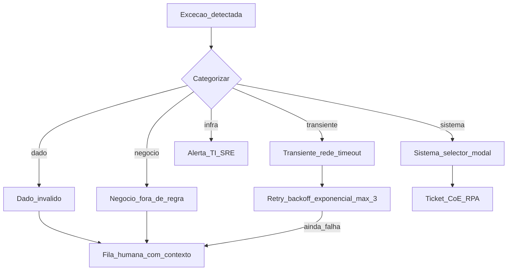
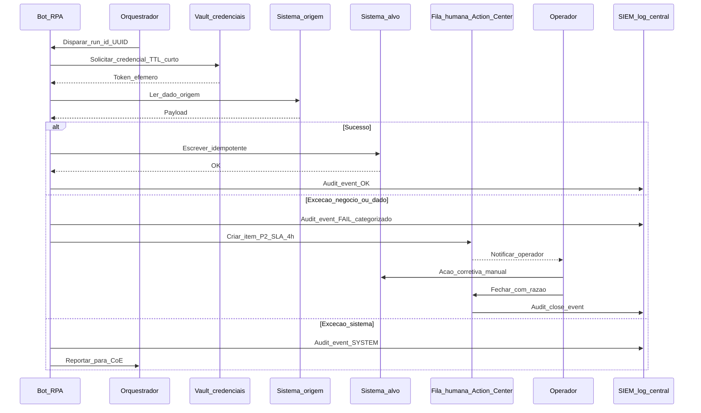
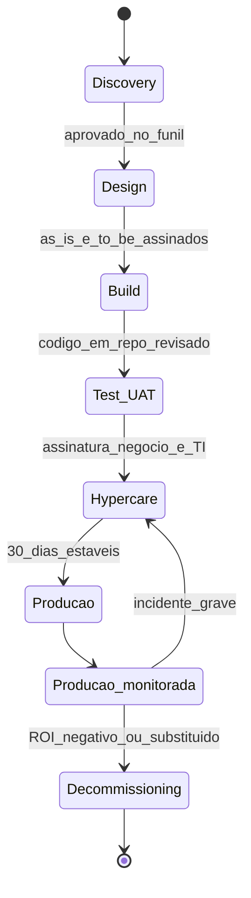

# Exceções, fila humana e governança de RPA — o robô precisa de «andar de emergência»

RPA no **caminho feliz** impressiona em demo; em **produção** aparecem pop-ups, *timeouts*, **PDF ilegível**, certificados expirados e regras de negócio **novas**. **Governança** define: **logs**, **versão** do fluxo, **conta de serviço**, **segregação** de funções, tratamento de **PII** e **fila humana** (*human-in-the-loop*) com **SLA** explícito.

A questão não é **se** vai falhar — é **quando**, **como o robô percebe**, **quem é avisado**, **com que SLA** o caso é tratado, e **se a evidência** sobreviveu para auditoria. Esta aula constrói o **modelo operacional** do RPA maduro: fluxo *as-is* desenhado com ramo de exceção tipado, fila humana com prioridade, *vault*, CoE, Robot Lifecycle Management e métricas de qualidade do robô.

---

## Objetivos e resultado de aprendizagem

- **Tipar** exceções (negócio × sistema × dado × infraestrutura) com ações apropriadas (*retry*, *queue*, *abort*, *notify*).
- Desenhar **fluxo de fila humana** com SLA, prioridade P1/P2/P3 e *escalation matrix*.
- Listar controlos mínimos de **GRC** (*Governance, Risk, Compliance*) para RPA: vault, conta de serviço, MFA, segregação, logs, retenção.
- Estruturar **Centro de Excelência (CoE)** RPA com papéis, RACI e ciclo de vida (Robot Lifecycle Management).
- Aplicar **LGPD/ANPD**, **EU AI Act** e **ISO 42001** ao contexto de robô.
- Medir saúde do robô com **KPIs operacionais** (success rate, MTTR, exceções por categoria).

**Duração sugerida:** 75–90 minutos. **Pré-requisitos:** [Aula 1.1 — RPA candidatos](aula-01-o-que-e-rpa-candidatos-logistica.md).

---

## Mapa do conteúdo

1. Taxonomia de exceções (4 famílias) e *patterns* de tratamento.
2. Fila humana, SLA, prioridade e *escalation*.
3. *Robot Lifecycle Management* — do desenvolvimento ao decomissionamento.
4. CoE, RACI e papéis.
5. Segurança: vault, conta de serviço, princípio do menor privilégio, MFA.
6. Governança regulatória: LGPD, EU AI Act, ISO 42001, SOX.
7. KPIs operacionais e *playbook* de incidentes.

---

## Gancho — a TechLar e o robô que «comprou» sozinho

Um fluxo RPA da **TechLar** repetia **Enter** em janela de confirmação de **PO** (Pedido de Compra) quando o sistema travava — numa **mudança** de *layout*, confirmou **duas** ordens duplicadas no valor combinado de **R$ 1,8 milhão**. Não havia **log** auditável da decisão, nem regra de duplicidade, nem *idempotency key*; a culpa foi para «**o robô**». A TI passou **três dias** a recuperar dados do ERP e a auditoria abriu **NC** (não-conformidade) Sox.

**Causa-raiz pedagógica:** ausência de quatro pilares — (1) *retry* com limite, (2) idempotência por hash, (3) screenshot de evidência antes de confirmar, (4) revisão humana acima de R$ 100k. Sem **governança**, RPA é **risco operacional** disfarçado de inovação.

**Analogia do carro autónomo nível 2:** ainda precisa **condutor atento**; o fabricante define **quando** o humano assume — o mesmo vale para exceções. **Analogia do estagiário fluente:** o estagiário não decide compra de R$ 1M; o robô também não.

---

## Conceito-núcleo — taxonomia de exceções

| Família | Exemplo | Ação típica |
|---|---|---|
| **Negócio** | Status do CT-e fora do domínio esperado; valor acima do limite contratual | Fila humana com contexto |
| **Dado** | CPF mal formatado, encoding errado, campo nulo obrigatório | Retentar uma vez (talvez ETL atrasado), depois fila |
| **Sistema (UI/aplicação)** | Selector mudou, modal inesperada, sessão expirou | *Retry* com *exponential backoff* (3 tentativas), depois ticket TI |
| **Infraestrutura** | DNS, *timeout* de rede, certificado TLS expirado, fila do orquestrador cheia | Alerta a TI/SRE, *circuit breaker* |

**Regra de ouro:** *retry* só é apropriado para **falhas transientes** (rede, lock temporário). Para **erro de regra ou dado**, retry só **multiplica o erro** — vai direto à fila humana com evidência.



**Legenda:** o robô **categoriza** o erro em runtime (try/except com tipos) antes de decidir o ramo. *Retry* sem categorização é receita para o caso TechLar.

---

## Diagrama / Arquitetura — fila humana com SLA



**Legenda:** **vault** entrega credencial **efémera** (TTL minutos), nunca persistida em arquivo. **SIEM** centraliza eventos para auditoria; **Action Center** (UiPath) ou **SharePoint List/Power Apps** materializa a fila humana.

### Modelo SLA típico

| Prioridade | Critério | SLA | Notificação |
|---|---|---|---|
| **P1** | Risco financeiro, regulatório, segurança alimentar, *recall* | 1 h | Telefone + chat + e-mail |
| **P2** | Operacional crítico (ASN, expedição) | 4 h úteis | Chat + e-mail |
| **P3** | Conciliação de baixo valor | 1 dia útil | E-mail |
| **P4** | Cosmético, sem impacto cliente | 5 dias úteis | Dashboard |

**Métricas da fila:** backlog, idade média do item mais antigo, taxa de SLA atingido, *override* humano (se >40%, robô é inútil — refazer regra).

---

## Aprofundamentos — Robot Lifecycle Management (RLM)



**Etapas-chave:**

1. **Discovery** — *process mining* + entrevistas; matriz go/no-go (aula anterior).
2. **Design** — PDD (*Process Definition Document*), *as-is* e *to-be*, lista de exceções, SLA.
3. **Build** — código no Git, *peer review*, padrões do CoE, *secrets* via vault.
4. **Test/UAT** — testes em ambiente espelho, dados anonimizados, *user acceptance test* assinado.
5. **Hypercare** — 30 dias com suporte L2/L3 ativo, métricas diárias, ajustes finos.
6. **Produção monitorada** — orquestrador + SIEM + dashboard de KPIs.
7. **Decomissionamento** — quando o sistema-alvo ganha API, ou ROI vira negativo.

**Antipadrão crítico:** robô em produção **sem owner**. Quando o desenvolvedor sai e ninguém sabe a senha do vault, o fluxo morre — frequentemente sem ninguém notar até o auditor abrir.

---

## Centro de Excelência (CoE) RPA — RACI mínimo

| Atividade | Sponsor Negócio | *Process Owner* | CoE / RPA Dev | TI / SRE | Auditoria |
|---|---|---|---|---|---|
| Selecionar candidato | A | R | C | I | I |
| PDD (process definition) | C | R | C | I | — |
| Build do robô | I | C | R | C | — |
| UAT | A | R | C | I | I |
| Deploy em produção | I | C | R | A | I |
| Operação diária / fila humana | C | R | C | C | — |
| Mudança de UI do sistema-alvo | I | I | R | C | — |
| Auditoria anual | I | C | C | C | R, A |

**Tamanho típico CoE:** PME (1–2 devs + 1 analista de processo); empresa média (5–10 + lead arquiteto + business analyst); grande (15+, com especialização IDP / ML / *citizen developer enablement*).

---

## Exemplos técnicos — *patterns* de código

### *Pattern* 1 — *retry* com *exponential backoff* + *circuit breaker*

```python
import time
import random
import logging
from typing import Callable, TypeVar
from functools import wraps

T = TypeVar("T")
log = logging.getLogger(__name__)

class CircuitBreakerOpen(Exception): ...

class CircuitBreaker:
    def __init__(self, fail_threshold: int = 5, reset_after_s: int = 300):
        self.fail_count = 0
        self.opened_at: float | None = None
        self.fail_threshold = fail_threshold
        self.reset_after_s = reset_after_s

    def can_call(self) -> bool:
        if self.opened_at is None:
            return True
        if time.time() - self.opened_at > self.reset_after_s:
            self.opened_at = None
            self.fail_count = 0
            return True
        return False

    def record(self, ok: bool) -> None:
        if ok:
            self.fail_count = 0
        else:
            self.fail_count += 1
            if self.fail_count >= self.fail_threshold:
                self.opened_at = time.time()

def retry_with_backoff(
    max_attempts: int = 3,
    base_delay_s: float = 2.0,
    breaker: CircuitBreaker | None = None,
) -> Callable:
    def decorator(fn: Callable[..., T]) -> Callable[..., T]:
        @wraps(fn)
        def wrapper(*args, **kwargs) -> T:
            if breaker and not breaker.can_call():
                raise CircuitBreakerOpen(f"{fn.__name__} circuit aberto")
            for attempt in range(1, max_attempts + 1):
                try:
                    result = fn(*args, **kwargs)
                    if breaker:
                        breaker.record(True)
                    return result
                except (TimeoutError, ConnectionError) as e:
                    if breaker:
                        breaker.record(False)
                    if attempt == max_attempts:
                        log.error("%s falhou apos %d tentativas: %s", fn.__name__, attempt, e)
                        raise
                    delay = base_delay_s * (2 ** (attempt - 1)) + random.random()
                    log.warning("Tentativa %d falhou (%s); aguardando %.1fs", attempt, e, delay)
                    time.sleep(delay)
            raise RuntimeError("unreachable")
        return wrapper
    return decorator
```

**Uso pedagógico:** decora **só** funções com falhas **transientes**. Falhas de **regra** ou **dado** *não* devem reentrar — vão direto à fila humana.

### *Pattern* 2 — idempotência por chave determinística

```python
import hashlib
import json
from pathlib import Path

LEDGER = Path("/var/rpa/ledger.txt")

def idempotency_key(payload: dict) -> str:
    canonical = json.dumps(payload, sort_keys=True, separators=(",", ":"))
    return hashlib.sha256(canonical.encode("utf-8")).hexdigest()

def already_processed(key: str) -> bool:
    if not LEDGER.exists():
        return False
    with LEDGER.open("r", encoding="utf-8") as f:
        return any(line.strip() == key for line in f)

def mark_processed(key: str) -> None:
    with LEDGER.open("a", encoding="utf-8") as f:
        f.write(key + "\n")
```

**Em produção:** trocar `LEDGER` por **Redis** ou **tabela** com índice único — escalável e à prova de corrida (concorrência).

### *Pattern* 3 — credencial efémera via Azure Key Vault

```python
from datetime import datetime, timedelta, timezone
from azure.identity import DefaultAzureCredential
from azure.keyvault.secrets import SecretClient

class CredentialCache:
    def __init__(self, vault_url: str, ttl_minutes: int = 30):
        self.client = SecretClient(vault_url, DefaultAzureCredential())
        self.ttl = timedelta(minutes=ttl_minutes)
        self._cache: dict[str, tuple[str, datetime]] = {}

    def get(self, name: str) -> str:
        now = datetime.now(timezone.utc)
        cached = self._cache.get(name)
        if cached and now - cached[1] < self.ttl:
            return cached[0]
        secret = self.client.get_secret(name).value
        self._cache[name] = (secret, now)
        return secret
```

**Por que TTL curto?** se o processo do robô for comprometido (memory dump), a senha em RAM expira em minutos. Combine com **rotação trimestral** no vault.

---

## Trade-offs e decisão

| Decisão | Opção A | Opção B | Quando A | Quando B |
|---|---|---|---|---|
| Logs | Detalhados (forenses) | Mínimos | Setor regulado, valor alto | Volume gigante, custo storage |
| Citizen vs CoE | Liberar Power Automate | Tudo central | Cultura digital madura, áreas pequenas | Setor regulado, baixa maturidade |
| Tratar tudo no robô | "Magia" no script | Simplificar processo origem | Origem fora do controlo | Origem interna (preferir simplificar) |
| Vault on-prem | CyberArk / HashiCorp | Cloud (Azure KV / AWS SM) | Regulação forte, latência | OPEX, time-to-market |
| Atomicidade | Transação ACID no destino | Compensação (saga) | API REST com PATCH idempotente | Múltiplos sistemas |

---

## Caso prático / Mini-laboratório — TechLar fila humana de exceção CT-e

**Cenário:** o robô de conciliação (Aula 1.1) processa 800 CT-e/mês. Em 6% surgem exceções (≈48/mês):

- 30 — divergência de tarifa < 5% (fila humana P3)
- 12 — CT-e cancelado pela SEFAZ após embarque (fila humana P2)
- 4 — tarifa > 50% acima do esperado (P1, possível fraude)
- 2 — XML corrompido (P3, voltar ao transportador)

**Desenho da fila:**

| Categoria | Prioridade | SLA | Operador | Ação esperada |
|---|---|---|---|---|
| Divergência < 5% | P3 | 2 dias | Analista controller | Aceitar ou disputar |
| CT-e cancelado | P2 | 4 h | Analista transportes | Estornar pagamento, contactar transportador |
| Tarifa > 50% | P1 | 1 h | Coordenador transportes + CFO se > R$ 50k | Bloquear pagamento, abrir investigação |
| XML corrompido | P3 | 2 dias | Analista transportes | Pedir reenvio |

**Pergunta de aplicação:** se 35% das exceções saem com *override* "aprovado sem verificar", qual é a leitura? **Resposta esperada:** o robô está a marcar exceções **demais** — limiar de tarifa precisa de ajuste, ou o operador está sob pressão e não revisa (treinar / auditar / refazer regra).

---

## Erros comuns e armadilhas

- **Try/except vazio**: `except Exception: pass` — engole o erro, robô segue mentindo sucesso.
- **Robô com permissão de admin "porque é mais fácil"**: viola menor privilégio, audita-se na 1ª inspeção.
- **Sem owner**: o desenvolvedor sai → fluxo vira *legacy* órfão.
- **Logs em texto livre**: impossível agregar; usar **logs estruturados** (JSON) com `run_id`, `step`, `severity`, `system`, `latency_ms`.
- **Demo gravada em produção** com dados reais — vaza PII em treinamento interno.
- **Fila sem SLA** vira *backlog* eterno → robô deixa de poupar tempo, só transfere o trabalho.
- **MFA** que o robô "contorna": negociar com TI **conta de serviço** com autenticação por certificado/SAML, **não** humano clicar no MFA pelo robô.
- **Versão única em produção** sem ambiente espelho → primeira mudança quebra geral.

---

## Segurança, ética e governança

### Vault — checklist mínimo

- [ ] Conta de serviço **dedicada** ao robô (não pessoal).
- [ ] Senha/segredo **só no vault**; código pede em runtime com TTL ≤ 60 min.
- [ ] **Rotação trimestral** automatizada (Azure KV: *rotation policy*).
- [ ] **Auditoria** de acessos ao vault (quem leu, quando) → SIEM.
- [ ] **Recovery** documentado se o vault cair (BCM).

### LGPD / ANPD aplicada a RPA

| Princípio LGPD | Aplicação prática |
|---|---|
| **Finalidade** (art. 6º I) | Documentar para que cada dado pessoal é usado pelo robô (PDD). |
| **Necessidade** (art. 6º III) | Não copiar campos PII desnecessários (ex.: CPF do destinatário se só precisa de status). |
| **Transparência** (art. 6º VI) | Inventário de robôs publicado para o DPO. |
| **Segurança** (art. 6º VII) | Vault, criptografia em trânsito, mascaramento em logs. |
| **Não discriminação** (art. 6º IX) | Cuidado em decisão automatizada de scoring/RH/seguros (ANPD focal). |
| **Responsabilização** (art. 6º X) | Logs auditáveis, RACI claro. |

**Decisão automatizada (art. 20)**: se o robô **decide** sem humano (ex.: aprovar pagamento), o titular tem direito a **revisão humana**. Robôs com impacto financeiro > X devem ter humano "no loop" obrigatório.

### EU AI Act (para empresas que vendem na UE)

- RPA "puro" (sem ML) **não** é IA pelo Act.
- **Intelligent Automation** com classificação/decisão **pode** ser *limited risk* ou *high-risk* (RH, crédito, infraestrutura crítica). Obrigações: gestão de risco, documentação técnica, log, supervisão humana, transparência.
- **AI RMF NIST** (USA, voluntário) e **ISO/IEC 42001:2023** (sistema de gestão de IA, certificável) são frameworks complementares.

### SOX / controle interno (para multinacionais)

- Robôs que tocam fechamento contábil ou faturação ⇒ **controle ITGC** (*IT General Controls*): segregação, change management, *access review* trimestral, evidência de testes.

---

## KPIs

| KPI | Pergunta | Dono | Fonte | Cadência | Playbook se fora |
|---|---|---|---|---|---|
| **Bot Success Rate (%)** | % runs com resultado OK | CoE RPA | Orquestrador | Diário | Investigar top-3 categorias de erro |
| **MTTR (h)** | Tempo médio para reparar fluxo | CoE RPA | Ticket Jira/ServiceNow | Mensal | Testes pré-release do alvo |
| **Exceções por categoria** | Mix de erros (negócio/dado/sistema/infra) | CoE + Ops | SIEM / log central | Semanal | Refatorar regra ou refazer ETL upstream |
| **Backlog fila humana** | Itens pendentes por prioridade | Ops process owner | Action Center | Tempo real | Reforço de pessoal ou ajuste de limiar |
| **SLA atingido (%)** | % itens fechados dentro do SLA | Ops | Action Center | Semanal | Revisar SLA ou capacidade |
| **Override humano (%)** | % itens onde humano "aprovou sem mudar" | Ops + Auditoria | Action Center | Mensal | Se > 40%, robô inútil — refazer regra |
| **Credencial expirada (n)** | Falhas por TLS / token | TI / SRE | SIEM | Tempo real | Alertar antes do vencimento (30d) |
| **Findings auditoria** | NCs em revisão GRC | Auditoria | Auditoria interna | Semestral | Plano 30/60/90 |
| **Cost per Transaction** | Custo total / transações | Controlling | Licença + FTE + infra | Trimestral | Consolidar fluxos / renegociar licença |

---

## Tecnologias e ferramentas

| Necessidade | Ferramentas |
|---|---|
| **Orquestração** | UiPath Orchestrator, Automation Anywhere Control Room, Power Automate Cloud, Blue Prism Hub |
| **Vault** | Azure Key Vault, AWS Secrets Manager, HashiCorp Vault, CyberArk Conjur |
| **Fila humana** | UiPath Action Center, Power Automate Approvals, SharePoint Lists + Power Apps, ServiceNow |
| **Versionamento** | Git (GitHub, GitLab, Azure Repos); UiPath usa pacotes `.nupkg` versionados |
| **CI/CD para robôs** | UiPath Test Suite + Pipelines, GitHub Actions, Azure DevOps |
| **SIEM / observability** | Splunk, Datadog, Elastic Stack, Microsoft Sentinel |
| **Process Mining** (descobrir gargalos) | Celonis, UiPath Process Mining, Microsoft Process Insights |
| **GRC platform** | ServiceNow GRC, Archer, MetricStream |

---

## Glossário rápido

- **RACI**: Responsible, Accountable, Consulted, Informed.
- **PDD** (*Process Definition Document*): documento *as-is* do processo.
- **SDD** (*Solution Design Document*): documento *to-be* da automação.
- **Hypercare**: período pós-go-live com suporte intensificado (típ. 30 dias).
- **Idempotência**: repetir operação não duplica resultado.
- **Saga / compensação**: padrão para "desfazer" ações em sistemas distintos quando uma falha.
- **Circuit breaker**: corta chamadas quando alvo está degradado, evita cascata.
- **SLA / SLO / SLI**: Service Level Agreement (contratual), Objective (interno), Indicator (medido).
- **DPIA**: Data Protection Impact Assessment.
- **CoE**: Center of Excellence.
- **IDP**: Intelligent Document Processing.

---

## Aplicação — exercícios

**Exercício 1 — taxonomia.** Para um processo RPA real ou fictício, escreva **5 exceções**, classifique em (negócio, dado, sistema, infra) e atribua ação (*retry*, fila P1/P2/P3, *abort*, *notify*).

**Exercício 2 — PII em log.** Liste **3 dados** que o robô **não pode** registar em claro e a estratégia de mascaramento (hash, truncamento, ofuscação).

**Exercício 3 — RACI.** Desenhe o RACI para "mudança de versão do ERP que quebrou o robô". Responsável de detectar? Acionado primeiro? Quem aprova *hotfix*?

**Exercício 4 — fila humana.** Para uma fila com 200 exceções/dia e SLA P2 de 4 h, calcule capacidade mínima de operadores (assumir 5 min/exceção, jornada 7h).

**Gabarito pedagógico:**

- **Ex.1**: deve ter ≥ 1 exceção P1 com humano obrigatório; *retry infinito* é alerta vermelho.
- **Ex.2**: CPF/CNPJ → mascarar `***.***.***-NN`; nome motorista → hash determinístico; geolocalização exata → arredondar ou ofuscar.
- **Ex.3**: SRE detecta (monitoring), CoE faz triage, PO aprova hotfix se for **regra**, TI aprova se for **infra**.
- **Ex.4**: 200 × 5 min = 1 000 min = 16,7 h ÷ 7 h/operador ≈ **3 operadores** + folga de 30% = **4 FTE**. Se a fila explodir: revisar limiares ou refatorar regra.

---

## Pergunta de reflexão

Quem é o **dono** do teu fluxo RPA hoje se a TI sair de férias e o desenvolvedor original já não trabalha aqui? Se a resposta é "ninguém sabe", que **risco financeiro** está coberto e qual está exposto?

---

## Fechamento — takeaways

1. **Exceção tipada protege marca, saldo e reputação** — `try/except: pass` é negligência.
2. **Log é prova** — trate como documento regulatório com retenção e mascaramento.
3. **RPA maduro é produto**, com dono, versão, SLA, ciclo de vida e métricas — não brinquedo de "secretária virtual".
4. **Vault, conta de serviço, MFA, menor privilégio** — checklist não-negociável.
5. **Fila humana com SLA** transforma exceção em insumo de melhoria contínua, não em caos.
6. **CoE com RACI** evita órfãos e *shadow IT*.

---

## Referências

1. **WILLCOCKS, L.; LACITY, M.** *Service Automation* — operating model do RPA maduro.
2. **ISACA** / **COBIT 2019** — governança de TI ([isaca.org](https://www.isaca.org/)).
3. **NIST SP 800-53** — controles de segurança (acesso AC-6, auditoria AU).
4. **OWASP** — *Secrets Management Cheat Sheet*; *Logging Vocabulary*.
5. **LGPD** (Lei 13.709/2018) e **ANPD** — guias setoriais ([gov.br/anpd](https://www.gov.br/anpd/)).
6. **EU AI Act** (Reg. 2024/1689) — classificação de risco.
7. **ISO/IEC 42001:2023** — *AI Management System* (certificável).
8. **NIST AI RMF 1.0** (2023) — *AI Risk Management Framework*.
9. **UiPath Best Practices** — *REFramework*, *Action Center* docs.
10. **CSCMP** / **ASCM** — controlo interno na cadeia.

---

## Pontes para outras trilhas

- [Aula 1.3 — Casos práticos: documentos, faturamento, ASN](aula-03-casos-logistica-doc-faturamento-asn.md).
- [Logística 4.0 — IA, casos de uso e governança de risco](../../trilha-logistica-estrategica/modulo-04-logistica-4-0/aula-03-ia-casos-uso-governanca-risco.md).
- [Aula 3.3 — *MLOps lite* e governança](../modulo-03-ai-aplicada-supply-chain/aula-03-otimizacao-intro-mlops-lite-governanca.md) — paralelo de governança aplicada a modelos.
- [Tecnologia — segurança em sistemas](../../trilha-tecnologia-e-sistemas/README.md).
