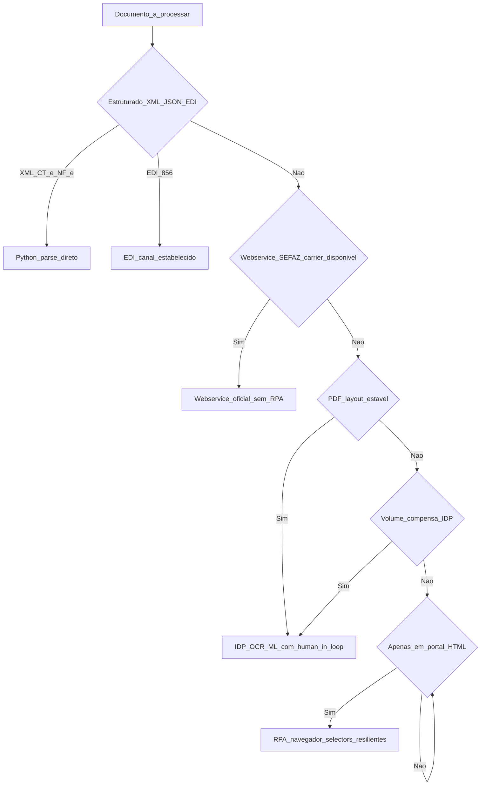
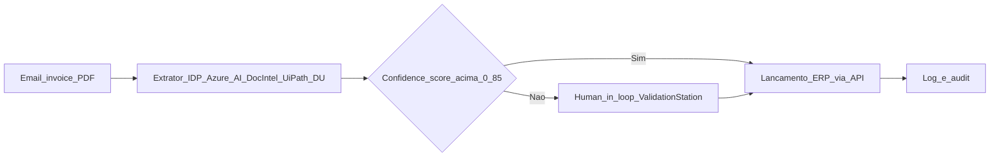

# Casos: documentos, faturamento e ASN — onde o robô brilha e onde quebra o nariz

Esta aula desce ao **piso de fábrica** do RPA logístico no Brasil: **leitura de XML CT-e/MDF-e** (estruturado, dado bom para Python), **conciliação fatura × tabela contratual** (RPA + IDP quando vem PDF), **registo de ASN** em portal de cliente/3PL e **download de POD** (*Proof of Delivery*). Aqui se separa o **robô que dá ROI** do **robô que vira passivo de TI**.

A regra-mestra é: **dado estruturado → Python/EDI/API**; **dado semi-estruturado (PDF, planilha humana) → IDP + revisão humana**; **UI sem alternativa → RPA**. Inverter essa ordem é caro.

---

## Objetivos e resultado de aprendizagem

- Descrever **5 casos** logísticos típicos de RPA/IDP no Brasil com pré-condições e *anti-padrões*.
- Distinguir **CT-e**, **MDF-e**, **NF-e** e **ASN/EDI 856** — origem, estrutura e quando RPA é (in)evitável.
- Aplicar **árvore de decisão** RPA × IDP × API × EDI × Webservice SEFAZ.
- Esboçar **pseudocódigo + snippet Python** para *parse* de XML CT-e e conciliação contra tarifa contratual.
- Reconhecer armadilhas (CAPTCHA/2FA, layout volátil, fuso, moeda, multi-modal).

**Duração sugerida:** 75–90 min. **Pré-requisitos:** [Aula 1.1](aula-01-o-que-e-rpa-candidatos-logistica.md) e [1.2](aula-02-desenho-excecao-governanca-rpa.md).

---

## Mapa do conteúdo

1. Fontes documentais BR: NF-e, CT-e, MDF-e, NFS-e, BL, ASN/EDI 856, POD.
2. Caso A — Conciliação CT-e × tabela contratual (Python parse XML).
3. Caso B — Fatura PDF de carrier internacional (IDP + revisão humana).
4. Caso C — Registo de ASN no portal do cliente (RPA + alternativas).
5. Caso D — Download de POD em portal 3PL (RPA com *selectors* resilientes).
6. Caso E — Bot fiscal (consulta SEFAZ) — usar Webservice oficial, não scraping.
7. Anti-padrões e segurança.

---

## Gancho — a TechLar e o PDF «artístico»

A **TechLar** automatizou leitura de **fatura** de *carrier* (Maersk, em USD) com RPA + OCR. Funcionou **três meses** até o transportador mudar o **cabeçalho** e inserir **logo vetorial** com transparência — taxa de erro do OCR **subiu** para 18%. **Conciliação manual** voltou; o ROI do robô virou negativo.

A solução estável foi **negociar** com o transportador o envio de **CSV semanal** + RPA só como **fallback** para quem não enviar — *sourcing* e TI na mesma mesa, com **cláusula contratual** de formato.

**Lições:**

| Problema | Causa-raiz | Mitigação real |
|---|---|---|
| OCR com 18% de erro | Layout PDF instável | Cláusula contratual de formato + IDP com *human-in-the-loop* |
| Equipa culpou o robô | Falta de monitoramento de drift de OCR | Métrica diária de *confidence score* |
| ROI negativo | Não considerou manutenção (~30%) no *business case* | Reforço da Aula 1.1 |

**Analogia da letra de médico:** OCR treinado lê **um** médico; troca de clínica e a letra vira **arte abstrata** — generalização é cara.

**Analogia da chave Yale:** se o cliente troca a fechadura toda semana, ter chave-mestra é ilusão. Negocie a chave (formato).

---

## Conceito-núcleo — fontes documentais BR e estrutura

### Documentos eletrônicos fiscais (BR)

| Documento | Modelo SEFAZ | Conteúdo | Onde o robô atua |
|---|---|---|---|
| **NF-e** | 55 | Venda de mercadoria | ERP recebe XML; raramente RPA |
| **NFS-e** | varia (município) | Serviços | Coleta em portal municipal (sem padrão único) → RPA frequente |
| **CT-e** | 57 | Conhecimento de transporte (frete) | Conciliação contra tarifa contratual |
| **CT-e OS** | 67 | CT-e Outros Serviços | Idem CT-e |
| **MDF-e** | 58 | Manifesto eletrônico (agrupador de NF-e/CT-e por viagem) | Compliance fiscal de transporte |
| **DACTE / DAMDFE** | (representação) | PDF impresso do CT-e/MDF-e | Evitar — sempre exigir XML |

**Verdade prática:** os XML têm **schema XSD oficial** publicado pela SEFAZ. **Lê-los em Python é simples** (`lxml`, `xmltodict`); usar RPA para abrir DACTE em PDF e digitar é *anti-padrão*.

### Documentos internacionais

| Documento | Padrão | Como obter | Robô típico |
|---|---|---|---|
| **Bill of Lading (BL)** | varia | E-mail / portal carrier | IDP (PDF) ou EDI 310 |
| **House BL / Master BL** | varia | Forwarder / NVOCC | IDP |
| **Invoice + Packing List** | varia | E-mail | IDP |
| **ASN** | EDI ANSI X12 856 ou EDIFACT DESADV | EDI VAN / AS2 | EDI direto (preferível) ou portal → RPA |
| **POD** (*Proof of Delivery*) | foto + assinatura digital | Portal 3PL ou app | RPA download / webhook |

---

## Diagrama / Arquitetura — árvore de decisão "qual ferramenta?"



**Legenda:** quanto mais à **esquerda** da árvore (XML, EDI, Webservice), mais robusto e barato. RPA puro é o **último recurso**.

---

## Caso A — Conciliação CT-e × tabela contratual em Python (NÃO É RPA!)

**Por que não é RPA:** o CT-e é **XML estruturado** com schema SEFAZ. Usar RPA para abrir, ler e digitar seria absurdo. Python resolve em ~50 linhas.

### Trecho do XML CT-e (modelo 57, simplificado)

```xml
<cteProc xmlns="http://www.portalfiscal.inf.br/cte" versao="4.00">
  <CTe>
    <infCte Id="CTe35240612345678901234571000000001234567890123" versao="4.00">
      <ide>
        <cUF>35</cUF>
        <cCT>12345678</cCT>
        <CFOP>5353</CFOP>
        <natOp>Prestacao de servico de transporte</natOp>
        <mod>57</mod>
        <serie>1</serie>
        <nCT>1234</nCT>
        <dhEmi>2026-04-15T10:30:00-03:00</dhEmi>
        <modal>01</modal>
        <UFIni>SP</UFIni>
        <UFFim>RJ</UFFim>
      </ide>
      <emit>
        <CNPJ>12345678000190</CNPJ>
        <xNome>Transportadora Exemplo LTDA</xNome>
      </emit>
      <vPrest>
        <vTPrest>1250.00</vTPrest>
        <vRec>1250.00</vRec>
        <Comp>
          <xNome>FRETE PESO</xNome>
          <vComp>1000.00</vComp>
        </Comp>
        <Comp>
          <xNome>GRIS</xNome>
          <vComp>50.00</vComp>
        </Comp>
        <Comp>
          <xNome>ICMS</xNome>
          <vComp>200.00</vComp>
        </Comp>
      </vPrest>
      <infCTeNorm>
        <infCarga>
          <vCarga>50000.00</vCarga>
          <proPred>Eletrodomesticos</proPred>
        </infCarga>
      </infCTeNorm>
    </infCte>
  </CTe>
</cteProc>
```

### Snippet Python — *parser* + conciliação

```python
"""
Concilia CT-e (XML SEFAZ modelo 57) contra tabela contratual.
Substitui RPA: dados estruturados, parser XML direto.
"""
from __future__ import annotations
from dataclasses import dataclass
from decimal import Decimal
from pathlib import Path
import pandas as pd
from lxml import etree

NS = {"c": "http://www.portalfiscal.inf.br/cte"}

@dataclass(frozen=True)
class CteResumo:
    chave: str
    cnpj_emit: str
    uf_ini: str
    uf_fim: str
    modal: str
    valor_total: Decimal
    frete_peso: Decimal
    valor_carga: Decimal
    data_emi: str

def parse_cte(xml_path: Path) -> CteResumo:
    tree = etree.parse(str(xml_path))
    root = tree.getroot()
    inf = root.find(".//c:infCte", NS)
    ide = inf.find("c:ide", NS)
    emit = inf.find("c:emit", NS)
    vprest = inf.find("c:vPrest", NS)
    carga = inf.find(".//c:infCarga", NS)
    frete_peso = Decimal("0")
    for comp in vprest.findall("c:Comp", NS):
        if comp.findtext("c:xNome", namespaces=NS) == "FRETE PESO":
            frete_peso = Decimal(comp.findtext("c:vComp", namespaces=NS))
    return CteResumo(
        chave=inf.get("Id").replace("CTe", ""),
        cnpj_emit=emit.findtext("c:CNPJ", namespaces=NS),
        uf_ini=ide.findtext("c:UFIni", namespaces=NS),
        uf_fim=ide.findtext("c:UFFim", namespaces=NS),
        modal=ide.findtext("c:modal", namespaces=NS),
        valor_total=Decimal(vprest.findtext("c:vTPrest", namespaces=NS)),
        frete_peso=frete_peso,
        valor_carga=Decimal(carga.findtext("c:vCarga", namespaces=NS) or "0"),
        data_emi=ide.findtext("c:dhEmi", namespaces=NS),
    )

def conciliar(ctes: list[CteResumo], tabela: pd.DataFrame) -> pd.DataFrame:
    rows = []
    for c in ctes:
        match = tabela[
            (tabela["cnpj_transportador"] == c.cnpj_emit)
            & (tabela["uf_origem"] == c.uf_ini)
            & (tabela["uf_destino"] == c.uf_fim)
            & (tabela["modal"] == c.modal)
        ]
        if match.empty:
            rows.append({**c.__dict__, "status": "SEM_TABELA", "diff_pct": None})
            continue
        tarifa_minima = Decimal(str(match.iloc[0]["frete_peso_minimo"]))
        diff_pct = (c.frete_peso - tarifa_minima) / tarifa_minima * 100
        if abs(diff_pct) <= Decimal("5"):
            status = "OK"
        elif diff_pct > Decimal("5"):
            status = "ACIMA_TABELA"
        else:
            status = "ABAIXO_TABELA"
        rows.append({**c.__dict__, "status": status, "diff_pct": float(diff_pct)})
    return pd.DataFrame(rows)

def main(pasta_xml: Path, tabela_csv: Path, saida: Path) -> None:
    tabela = pd.read_csv(tabela_csv, dtype={"cnpj_transportador": str})
    ctes = [parse_cte(p) for p in pasta_xml.glob("*.xml")]
    rel = conciliar(ctes, tabela)
    rel.to_csv(saida, index=False)
    print(f"{len(rel)} CT-e processados; {(rel['status']=='OK').mean():.1%} dentro da tabela")

if __name__ == "__main__":
    main(Path("./xmls"), Path("./tabela_contratual.csv"), Path("./conciliacao.csv"))
```

**Comentário pedagógico:** uso de `Decimal` em vez de `float` (precisão monetária), namespace SEFAZ correto (`http://www.portalfiscal.inf.br/cte`), `dataclass(frozen=True)` para imutabilidade, *match* multi-coluna (cnpj × UF × modal). **30 linhas** que substituem 4 robôs RPA.

---

## Caso B — Fatura PDF de carrier internacional (IDP, não RPA puro)

**Cenário:** Maersk envia *invoice* PDF semanal ~80 páginas, layout estável **80% do tempo**.



**Pontos críticos:**

- **Treinar extrator** em ~50–100 amostras anotadas (campos: invoice number, BL, valor, moeda, descrição da rota).
- **Confidence score** por campo é mais útil que score global.
- **Human-in-the-loop**: UiPath *Validation Station*, Azure AI Document Intelligence Studio, ABBYY Vantage.
- **Métrica de drift**: se taxa "human review" subir de 15% para 40%, retreinar.

**Tecnologias IDP:**

| Player | Forte em | Custo |
|---|---|---|
| Azure AI Document Intelligence | Pré-treinados (invoice, receipt, ID), custom forms | Pay-per-page |
| UiPath Document Understanding | Integrado ao orchestrator e Action Center | Licença + per-page |
| ABBYY Vantage / FineReader | Setor financeiro/legal, alta precisão | Enterprise |
| Rossum | Faturas com auto-aprendizagem | SaaS |
| Open-source (Tesseract + LayoutLM) | Baixo custo, exige equipa ML | Custo de equipa |

---

## Caso C — Registo de ASN no portal do cliente

**Cenário típico BR:** clientes grandes (varejistas) exigem ASN no **portal proprietário** (ex.: Mercado Eletrônico, ID Logistics portal). 200 ASN/mês para 5 clientes diferentes — formato diferente em cada portal.

**Análise:**

| Opção | Pro | Con |
|---|---|---|
| **EDI 856 puro** | Padrão internacional, sem UI | Cliente precisa estar pronto; raro em BR fora de multinacionais |
| **API REST do portal** | Robusto | Poucos portais BR oferecem |
| **iPaaS multi-conector** (n8n, Make) | 1 fluxo por cliente | Frágil se portal não tem API |
| **RPA por portal** | Funciona em qualquer UI | Manutenção × N clientes |
| **Híbrido**: EDI quando existe, RPA fallback | Melhor mundo real | Maior complexidade orquestral |

**Recomendação realista BR:** começar **híbrido** — pressionar EDI/API com clientes top-3, RPA para *long tail*.

---

## Caso D — Download de POD em portal 3PL

**Padrão típico:** robô faz login, navega filtro por data, lista expedições, clica "Download POD" e salva PDF nomeado por número de expedição. Depois associa no ERP via API.

**Boas práticas:**

- **Selectors por aria-label / id**, nunca posicionais.
- **Idempotência**: já baixou (pasta com nome) → pular.
- **Verificação**: checksum do PDF antes de marcar "OK".
- **Se portal mudar para SPA React**: monitorar e adaptar; considerar pedir API.

---

## Caso E — Bot fiscal: consulta SEFAZ por chave NF-e/CT-e

**ANTI-PADRÃO crítico:** RPA navegando o site público da SEFAZ com CAPTCHA. Resolver CAPTCHA com OCR ou serviço terceiro **viola termos de uso** e pode ser **crime** (Lei 12.737/2012).

**SOLUÇÃO CORRETA:** **Webservice SEFAZ oficial** (NfeConsultaProtocolo, CteConsultaProtocolo) com **certificado digital A1/A3**. Bibliotecas Python: `pynfe`, `nfelib`, `erpbrasil.edoc`.

```python
"""
Consulta CT-e via Webservice SEFAZ oficial (NfeConsultaProtocolo).
Caminho ETICO E LEGAL — RPA no site público com CAPTCHA NÃO É opção.
"""
from erpbrasil.assinatura.certificado import Certificado
from erpbrasil.transmissao import TransmissaoSOAP
from erpbrasil.edoc.cte import Cte
from requests import Session

certificado = Certificado("certificado_a1.pfx", "senha")
session = Session()
session.cert = certificado.cert_pfx_path  # caminho temporario
transmissao = TransmissaoSOAP(certificado, session)
cte = Cte(transmissao=transmissao, uf="SP", versao="4.00", ambiente="2")

chave = "35240612345678901234571000000001234567890123"
resp = cte.consulta(chave)
print(resp.resposta.cStat, resp.resposta.xMotivo)
```

---

## Aprofundamentos — variações e *trade-offs*

### XML vs. PDF — sempre exigir XML quando existir

A **DACTE** (PDF do CT-e) e a **DANFE** (PDF da NF-e) são **representações** — o **dado oficial** é o **XML**. Ler PDF quando há XML é desperdício e fonte de erro.

### Multi-modal e fuso

- Frete internacional: **múltiplas moedas** (USD, EUR), **câmbio** do dia da emissão vs. pagamento.
- **Fuso**: CT-e emitido em SP (UTC-3), MDF-e processado em servidor UTC → guardar `dhEmi` com offset, converter na visualização, **nunca** "perder" timezone.
- **Modal**: 01 rodoviário, 02 aéreo, 03 aquaviário, 04 ferroviário, 05 dutoviário, 06 multimodal.

### Quando NÃO usar RPA mesmo se "couber"

- Volume baixo (< 200 transações/mês) — manutenção come o ROI.
- Decisão precisa **julgamento** (julgar fornecedor confiável → humano + ML).
- Sistema-alvo em redesign anunciado nos próximos 6 meses → esperar.

---

## Trade-offs e decisão

| Decisão | Trade-off |
|---|---|
| **RPA em PDF** vs. **exigir CSV/XML** | Pode custar relação comercial (negociar com sourcing). |
| **Velocidade** de implementação vs. **fragilidade** a UI | Pilotos de 2 semanas viram dívida de 2 anos. |
| **Custo de licença** vs. **custo de FTE** | Licença escala; FTE em conciliação pré-RPA já cara em BR. |
| **OCR genérico** vs. **IDP treinado** | Genérico falha em layout custom; treinado custa setup. |
| **CAPTCHA**: contornar vs. negociar conta técnica | **Sempre negociar** — questão ética e legal. |

---

## Caso prático / Mini-laboratório — TechLar 360°

A TechLar tem 4 frentes:

1. 800 CT-e/mês (modelo 57, XML por e-mail) — conciliar com tabela.
2. 80 *invoices* Maersk/MSC (PDF, USD).
3. 200 ASN/mês para 5 grandes varejistas (portais distintos).
4. 1 200 POD/mês de 3PL (portal HTML, download).

**Plano de portfólio (ondas G1/G2/G3 — ver Aula 4.2):**

| Onda | Iniciativa | Tecnologia | Justificação |
|---|---|---|---|
| G1 — 90d | Conciliação CT-e | Python + `lxml` + Airflow | XML estruturado, ROI imediato |
| G1 — 90d | Download POD (3 portais top) | RPA UiPath unattended | Padrão claro, alto volume |
| G2 — 6m | Invoices Maersk/MSC | Azure AI DI + human-in-loop | Volume justifica IDP |
| G2 — 6m | ASN top-3 clientes | iPaaS (n8n) + RPA fallback | Dependência cliente |
| G3 — 12m | EDI 856 com top-2 varejistas | EDI VAN + AS2 | Estratégico, longo prazo |

---

## Erros comuns e armadilhas

- Assumir **PDF = dado estruturado** — não é.
- Robô **partilhar password** de utilizador humano (anti-LGPD).
- Ignorar **fusos** e datas em conciliação internacional.
- Não **versionar** tabela tarifária na regra (qual versão valia em 15/Mar?).
- Tentar **driblar CAPTCHA** — antiético, ilegal.
- **Não validar XSD** do XML antes de processar (pode vir corrompido).
- Misturar **CT-e original e cancelado** sem checar evento de cancelamento.
- Não tratar **CT-e complementar** (modelo 57 com `tpCTe=2`) — diff de tarifa pode ser legítima.
- Confundir **DACTE** (PDF, representação) com **CT-e** (XML, oficial).

---

## Segurança, ética e governança

- **Certificado A1/A3** SEFAZ — guardado em **HSM** ou vault; nunca no laptop do analista.
- **Webservice SEFAZ** assinado com certificado da empresa, não de pessoa física.
- **CAPTCHA / 2FA**: jamais contornar. Pedir conta técnica institucional ao parceiro.
- **PII no XML**: nome do motorista, CPF — minimizar retenção, mascarar em logs (LGPD).
- **Auditoria fiscal**: guardar **XML original assinado** por **5 anos** (Art. 173 CTN).
- **NF-e/CT-e cancelado** depois de processado — robô precisa **reverter** lançamento.

---

## KPIs

| KPI | Pergunta | Dono | Fonte | Cadência | Playbook |
|---|---|---|---|---|---|
| **% CT-e dentro da tabela** | Qualidade da contratação | Coord. Transportes | Conciliação | Semanal | Renegociar contrato; auditar transportador |
| **Diferença média (R$)** | Quanto se paga a mais? | Controlling | Conciliação | Mensal | Análise por transportador |
| **Tempo até pagamento** | Ciclo financeiro de frete | Financeiro | ERP | Mensal | Reduzir fila humana |
| **Taxa erro IDP (%)** | Qualidade do extrator | CoE IDP | Audit log | Semanal | Retreino se > 15% |
| **% POD recebido em 48h** | Compliance contratual cliente | Customer service | Conciliação | Diário | Pressionar 3PL |
| **Incidentes pagamento duplicado** | Quanto sai indevido? | Financeiro + Auditoria | ERP | Mensal | Idempotência + revisão |
| **% Robôs com selector quebrado** | Saúde técnica | CoE RPA | Orquestrador | Diário | Pipeline de teste |
| **Findings auditoria fiscal** | Compliance SEFAZ/SOX | Compliance | Auditoria | Anual | Plano corretivo |

---

## Tecnologias e ferramentas

| Necessidade | Opções |
|---|---|
| **XML CT-e/NF-e** | `lxml`, `xmltodict`, `nfelib`, `pynfe`, `erpbrasil.edoc` |
| **Webservice SEFAZ** | `erpbrasil.transmissao`, `zeep` (SOAP), `requests` + manualmente |
| **IDP** | Azure AI Document Intelligence, UiPath DU, ABBYY, Rossum, Klippa, Hyperscience |
| **OCR open-source** | Tesseract, EasyOCR, PaddleOCR, LayoutLMv3 |
| **EDI BR** | TecnoSpeed, NeoGrid, Sinco, GXS |
| **Webhook/API portal** | Mercado Eletrônico API, Magalu Pay, ME|
| **Orquestração** | UiPath, Automation Anywhere, Power Automate, Apache Airflow (para Python jobs) |

---

## Glossário rápido

- **CT-e** (modelo 57): Conhecimento de Transporte eletrônico.
- **MDF-e** (modelo 58): Manifesto eletrônico que agrupa NF-e/CT-e por viagem.
- **DACTE/DANFE/DAMDFE**: representações em PDF dos respectivos XML.
- **ASN** (*Advance Ship Notice*): aviso de embarque (EDI 856 / EDIFACT DESADV).
- **POD** (*Proof of Delivery*): comprovante de entrega.
- **IDP**: *Intelligent Document Processing*.
- **A1 / A3**: tipos de certificado digital ICP-Brasil (A1 arquivo, A3 token/cartão).
- **SEFAZ**: Secretaria da Fazenda (estadual).
- **Webservice SEFAZ**: serviços SOAP oficiais (NfeAutorizacao, CteConsultaProtocolo, etc.).

---

## Aplicação — exercícios

**Ex.1 — Árvore de decisão.** Para cada caso, escolha a ferramenta:
(a) NF-e que chega em XML por e-mail; (b) PDF de invoice carrier internacional; (c) consulta de status de CT-e na SEFAZ; (d) ASN no portal de varejista sem API; (e) extrato bancário em PDF com layout que muda mensal.

**Ex.2 — *Anti-padrão*.** Identifique 3 anti-padrões em: "robô abre site da SEFAZ, resolve CAPTCHA com serviço externo, copia XML do CT-e e cola no ERP digitando campo a campo".

**Ex.3 — KPI.** Para a TechLar, sugerir **um** KPI principal por caso (CT-e, invoice, ASN, POD) que permitiria ao CFO **decidir parar** o robô.

**Gabarito pedagógico:**

- **Ex.1**: (a) Python parser; (b) IDP; (c) Webservice SEFAZ com cert A1; (d) RPA + roadmap EDI; (e) IDP com retreino periódico.
- **Ex.2**: (1) usar site público em vez de Webservice é desperdício; (2) contornar CAPTCHA é antiético/ilegal; (3) digitar campo a campo no ERP em vez de POST API é fragilidade gratuita.
- **Ex.3**: CT-e — diferença R$ acima da tabela; invoice — taxa human-review IDP; ASN — % SLA cliente; POD — % recebido em 48h.

---

## Pergunta de reflexão

Qual fornecedor hoje te **obriga** a RPA porque **não oferece** integração razoável? Qual seria a **conversa contratual** na próxima renovação?

---

## Fechamento — takeaways

1. **XML SEFAZ é dado, não documento** — Python > RPA.
2. **PDF instável + alto volume = IDP com human-in-loop**, não OCR cego.
3. **Contornar CAPTCHA é crime** — usar Webservice oficial sempre.
4. **Tabela tarifária versionada** é tão importante quanto o robô que a usa.
5. **Híbrido EDI + RPA + IDP** é o estado-da-arte realista no BR.

---

## Referências

1. **SEFAZ Nacional** — *Manual de Orientação CT-e* (mod. 57); *Schemas XSD* — [cte.fazenda.gov.br](https://www.cte.fazenda.gov.br/portal/).
2. **GS1** — *EDI 856 ASN guidelines* — [gs1.org](https://www.gs1.org/).
3. **ICP-Brasil** — uso de certificado digital — [iti.gov.br](https://www.gov.br/iti/).
4. **Lei 12.737/2012** ("Carolina Dieckmann") — invasão de dispositivo informático.
5. **CTN art. 173** — prazo decadencial fiscal (5 anos).
6. **Microsoft Learn** — Azure AI Document Intelligence ([learn.microsoft.com](https://learn.microsoft.com/azure/ai-services/document-intelligence/)).
7. **UiPath Document Understanding** docs — [docs.uipath.com](https://docs.uipath.com/document-understanding/).
8. **erpbrasil/edoc** — biblioteca Python para edocs BR ([github.com/erpbrasil/erpbrasil.edoc](https://github.com/erpbrasil/erpbrasil.edoc)).
9. **CSCMP** / **ASCM** / **ABRALOG** — práticas de integração documental.
10. **OWASP API Security Top 10** — boas práticas para integração com portais.

---

## Pontes para outras trilhas

- [TMS — faturação e auditoria de frete](../../trilha-tecnologia-e-sistemas/modulo-04-tms/aula-03-faturacao-auditoria-frete.md).
- [ERP — integrações batch e EDI](../../trilha-tecnologia-e-sistemas/modulo-02-erp-aplicado-supply-chain/aula-03-integracoes-batch.md).
- [Aula 2.2 — pandas para CSV/planilhas](../modulo-02-python-para-logistica/aula-02-pandas-csv-planilhas-logistica.md) — extender o parser CT-e com agregações.
- [Aula 2.3 — REST e agendamento](../modulo-02-python-para-logistica/aula-03-agendamento-apis-leitura-rest.md) — chamar Webservice SEFAZ programaticamente.
