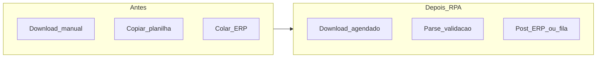

# Casos: documentos, faturamento e ASN — onde o robô brilha e onde quebra o nariz

Esta aula cobre **padrões** de uso de RPA em **logística administrativa**: conciliação **frete *versus* tabela**, leitura de **fatura/PDF** com **layout fixo**, registo de **ASN** ou *status* em **portal** de transportadora/3PL. **Não** se promete **OCR universal** nem substituição de **EDI** bem implementado — apenas **critério** de viabilidade.

---

## Objetivos e resultado de aprendizagem

**Ao final desta aula**, você será capaz de:

- Descrever **três** casos logísticos típicos de RPA com pré-condições.  
- Identificar **armadilhas** (layout variável, CAPTCHA, 2FA em conta errada).  
- Posicionar **EDI/API** como alternativa preferível quando existir.

**Duração sugerida:** 60–75 minutos.

---

## Gancho — a TechLar e o PDF «artístico»

A **TechLar** automatizou leitura de **fatura** de *carrier* com RPA+OCR. Funcionou **três meses** até o transportador mudar o **cabeçalho** e inserir **logo** vectorial — taxa de erro **subiu** para 18%. A solução estável foi **negociar** ficheiro **CSV** semanal + RPA só como **reserva** — *sourcing* e TI na mesma mesa.

**Analogia da letra de médico:** OCR treinado lê **um** médico; troca de clínica e a letra vira **arte abstrata**.

---

## Mapa do conteúdo

- Conciliação: pedido, entrega, fatura, tarifa.  
- ASN / confirmação de embarque.  
- Portal 3PL: *status*, *pod*, *download*.  
- PDF: quando RPA, quando **forçar** formato estruturado.

---

## Conceito núcleo

**Conciliação de frete:** cruzar **volume**, **trecho**, **modal** e **acessórios** com **tabela contratual** ou *rate card* — tarefa repetitiva e **regra** clara.

**ASN (*Advance Ship Notice*):** aviso estruturado de embarque — idealmente **EDI/XML/API**; RPA quando o parceiro só tem **portal**.

**Portal 3PL:** robô pode **extrair** *status* se o HTML tiver **seletores** estáveis; **frágil** se o site for reescrito em *React* sem aviso.

**Legenda:** «Depois» pressupõe **validação** de schema e **fila** em erro (aula anterior).

**Mini-caso:** **CAPTCHA** ou **2FA** no portal — RPA **não** deve contornar medidas de segurança; resolver com **conta técnica** negociada ou **integração** oficial (*consenso de mercado* ético).

---

## Trade-offs

- **RPA em PDF** *versus* **exigir** CSV do fornecedor (pode custar **relação** comercial).  
- **Velocidade** de implementação *versus* **fragilidade** a mudanças de UI.  
- **Custo** de licença *versus* **custo** de FTE em conciliação.

---

## Aplicação — exercício

Escolha **um** caso (conciliação, ASN ou portal). Liste: **entrada** (ficheiro, tela), **saída** (campo ERP), **duas** falhas frequentes e **uma** mitigação não técnica (ex.: cláusula contratual de formato).

**Gabarito pedagógico:** mitigação contratual deve ser **plausível**; se «OCR resolve tudo» sem ressalva, corrigir; falhas típicas: *timeout*, mudança de *layout*, **moeda** errada.

---

## Erros comuns e armadilhas

- Assumir **PDF** = dados estruturados.  
- Robô a **partilhar** password de utilizador humano.  
- Ignorar **fusos** e datas em conciliação internacional.  
- Não versionar **tarifa** usada na regra.

---

## KPIs e decisão

- **Linhas** conciliadas / hora.  
- **% erro** pós-automação *versus* manual.  
- **Tempo** até fechar ciclo financeiro de frete.  
- **Incidentes** de pagamento duplicado ou errado.

---

## Fechamento — três takeaways

1. RPA em documento **exige** estabilidade de formato ou **custo** de manutenção.  
2. O melhor robô às vezes é **um e-mail** ao fornecedor pedindo CSV.  
3. Segurança do portal **não** é obstáculo a «hackear» — é requisito a **cumprir** com TI.

**Pergunta de reflexão:** qual fornecedor hoje te **obliga** a RPA porque **não** oferece integração razoável?

---

## Referências

1. GS1 — ASN e padrões de identificação (*tipo de fonte* para dados estruturados).  
2. CSCMP — boas práticas em documentação e colaboração — [cscmp.org](https://cscmp.org/).  
3. Documentação de plataformas RPA sobre **best practices** de *exception handling*.

**Ponte:** [Faturação e auditoria de frete](../../trilha-tecnologia-e-sistemas/modulo-04-tms/aula-03-faturacao-auditoria-frete.md).
