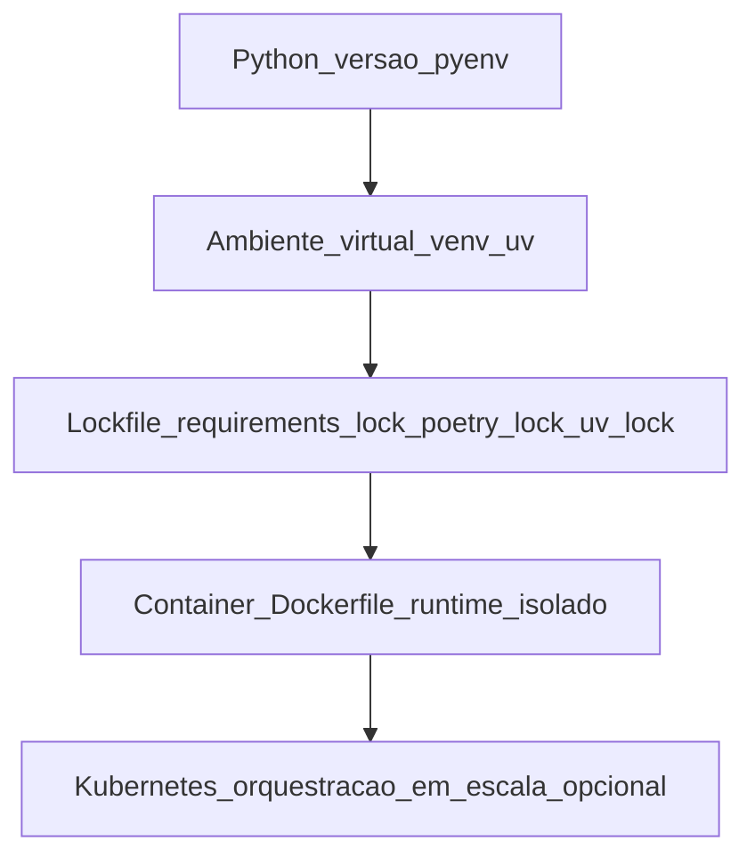
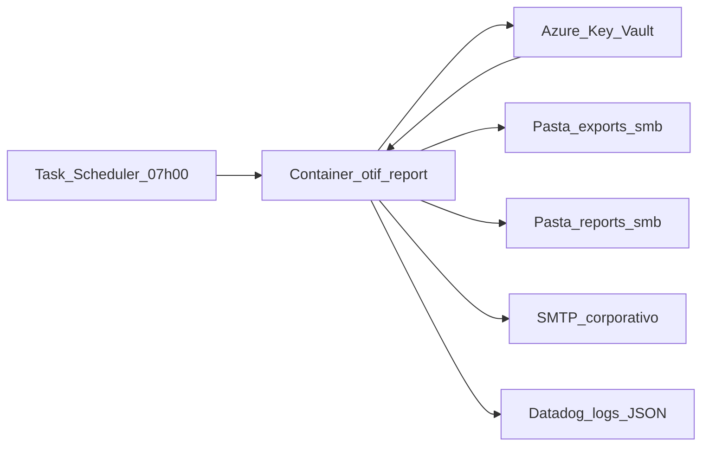

# Ambiente, *notebooks* e boas práticas — o teu script não é «ficheiro mágico no ambiente de trabalho»

**Python** em logística começa por **reprodutibilidade**: mesmo código, **mesmas versões** de bibliotecas, **segredos** fora do ficheiro `.py`, **logs** estruturados e **caminho** claro de *dev* → teste → homologação → produção (com **TI**). *Notebooks* (Jupyter, VS Code, Databricks, Google Colab) são ótimos para **explorar**; para **correr à noite** em servidor, prefira **script** versionado num repositório Git.

A maturidade técnica do "Python na logística" hoje exige conhecer: **gestores de pacote modernos** (`uv`, `poetry`, `pip-tools` para além do `pip`); **ambientes** (`venv`, `conda`, `pyenv`); **vault de segredos** (Azure Key Vault, AWS Secrets Manager, HashiCorp Vault); **logging estruturado** (JSON), **observabilidade** (OpenTelemetry); **CI/CD** (GitHub Actions); e **containerização** (Docker) para *deploy* consistente.

---

## Objetivos e resultado de aprendizagem

- Criar **ambiente reprodutível** com `pyproject.toml` ou `requirements.txt` (com *pinning* + lock).
- Aplicar **12-Factor App** ao script de logística (config via env, logs em stdout, sem state local).
- Usar **vault** para segredos (não `.env` em produção).
- Estruturar **logging JSON** com `run_id`, `step`, `latency_ms`.
- Conhecer **stack moderna**: `uv`/`poetry`, `pre-commit`, `ruff`, `mypy`, `pytest`.
- Containerizar com `Dockerfile` mínimo seguro para *deploy* em produção.

**Duração sugerida:** 75–90 min. **Pré-requisitos:** Git básico; noções de linha de comando.

---

## Mapa do conteúdo

1. Versão do Python e gestores: `pyenv`, `uv`, `poetry`, `conda`.
2. Ambientes virtuais e ficheiros de dependência.
3. **12-Factor App** aplicado ao script logístico.
4. Estrutura de projeto recomendada.
5. Segredos: `.env` para dev, vault para produção.
6. Logging estruturado e observabilidade.
7. CI/CD mínimo (GitHub Actions / Azure DevOps).
8. Container e *deploy* (Docker, runners cron).

---

## Gancho — a TechLar e o «funciona na minha máquina»

Uma analista da **TechLar** gerava relatório de **OTIF** em Python no portátil — funcionava lá. No **servidor** do departamento, falhava por **versão de pandas** antiga. Pior: o *token* da API Datadog estava **colado** no notebook e foi **commitado** ao GitHub privado — o GitHub *secret scanning* alertou em **45 segundos**, mas a TI levou **uma semana** a:

1. **Rodar** todas as chaves comprometidas (não era só o Datadog).
2. **Auditar** acessos com a chave antiga.
3. **Reescrever** histórico Git (`git filter-repo`).
4. **Treinar** a equipa em `pre-commit` com `gitleaks`.

Custo total estimado: **R$ 18 000** (40h de TI + retrabalho). O relatório poupava R$ 600/mês.

**Analogia da receita de bolo:** sem **indicação de forno** e **gramas**, outra cozinha queima — `pyproject.toml` + `lock` são a **receita com unidades exatas**.

**Analogia do passaporte:** segredo no Git é como **fotografar o passaporte e publicar no LinkedIn** — pode parecer privado, é público.

---

## Conceito-núcleo — pirâmide de reprodutibilidade



**Legenda:** cada nível **inclui** o anterior. Para script simples num servidor: `P + V + L`. Para produção crítica: `P + V + L + C`. Para alta escala: tudo.

### Comparativo de gestores de pacote

| Ferramenta | Quando usar | Velocidade | Lock | Notas |
|---|---|---|---|---|
| `pip + venv` | Script simples, tutorial | Lenta | Não nativo (usar `pip freeze`) | Padrão histórico |
| `pip-tools` | `requirements.in` → `requirements.txt` lock | Lenta | Sim | Bom meio-termo |
| `poetry` | Projeto sério, biblioteca | Média | `poetry.lock` | Padrão moderno (2018+) |
| **`uv`** (Astral) | **2024+, recomendado novo projeto** | **10–100× mais rápido** | `uv.lock` | Drop-in pip, ambiente automático |
| `conda` / `mamba` | Data science com binários (geos, gdal, mkl) | Média | `environment.yml` | Necessário para ML pesado |
| `pixi` | Reprodutibilidade científica multi-OS | Rápida | `pixi.lock` | Conda + lock + tasks |

---

## Diagrama / Arquitetura — pipeline dev → produção

```mermaid
flowchart LR
  DEV[Dev_local_venv_uv]
  GIT[Repositorio_Git_protegido]
  CI[CI_GitHub_Actions_lint_test]
  ART[Artefacto_wheel_ou_imagem_Docker]
  REG[Registry_PyPI_interno_ou_GHCR]
  HML[Homologacao_servidor_TI]
  PROD[Producao_agendada]
  MON[Monitoring_Datadog_Sentry_OTel]
  DEV -->|push| GIT
  GIT -->|trigger| CI
  CI -->|build| ART
  ART -->|publish| REG
  REG -->|deploy| HML
  HML -->|aprovacao_negocio| PROD
  PROD --> MON
  MON -->|alerta| DEV
```



**Legenda:** linha contínua = automatizado; **aprovação humana** entre HML e PROD é não-negociável em setor regulado.

---

## Aprofundamentos — 12-Factor App aplicado a script logístico

Os 12 fatores ([12factor.net](https://12factor.net/)) são universais; os 6 mais críticos para nosso contexto:

| Fator | Aplicação concreta |
|---|---|
| **III. Config** | URL do ERP, paths, schedule via env var; nunca em código |
| **IV. Backing services** | Banco, S3, vault são "URLs trocáveis" — `DATABASE_URL=postgres://...` |
| **V. Build, release, run** | Build = wheel/imagem; release = + config; run = execução. Separados. |
| **X. Dev/prod parity** | Mesmo Python, mesmo OS (Docker), mesmo banco (Postgres em ambos) |
| **XI. Logs** | stdout/stderr em JSON, **agregar** em sistema central, não em ficheiro local |
| **XII. Admin processes** | Migração de schema, reprocessamento — script no mesmo repo, mesma config |

---

## Exemplos técnicos

### `pyproject.toml` mínimo recomendado (com `uv`)

```toml
[project]
name = "logistikon-otif-report"
version = "0.3.1"
description = "Relatório semanal de OTIF a partir de export ERP/WMS"
requires-python = ">=3.11"
dependencies = [
  "pandas>=2.2,<3.0",
  "pyarrow>=15",
  "requests>=2.32",
  "tenacity>=8.2",
  "azure-identity>=1.16",
  "azure-keyvault-secrets>=4.8",
  "structlog>=24.1",
  "click>=8.1",
]

[project.optional-dependencies]
dev = ["pytest>=8", "pytest-cov", "ruff>=0.5", "mypy>=1.10", "pre-commit>=3.7"]

[project.scripts]
otif-report = "otif_report.cli:main"

[tool.ruff]
line-length = 100
target-version = "py311"

[tool.ruff.lint]
select = ["E", "F", "I", "B", "UP", "S", "ANN", "RUF"]
ignore = ["S101"]

[tool.mypy]
strict = true
python_version = "3.11"

[tool.pytest.ini_options]
addopts = "-q --cov=otif_report --cov-report=term-missing"
```

### Estrutura de projeto recomendada

```text
logistikon-otif-report/
├── pyproject.toml
├── uv.lock                 # gerado por `uv lock`
├── .pre-commit-config.yaml
├── .gitignore              # inclui .env, *.csv, .venv/, dist/
├── .env.example            # template SEM segredos reais
├── Dockerfile
├── README.md
├── src/
│   └── otif_report/
│       ├── __init__.py
│       ├── cli.py          # entrypoint click
│       ├── config.py       # pydantic-settings
│       ├── etl.py
│       ├── kpi.py
│       ├── exporters.py
│       └── log.py
├── tests/
│   ├── conftest.py
│   ├── test_etl.py
│   └── data/
│       └── pedidos_sample.csv
└── .github/
    └── workflows/
        ├── ci.yml
        └── release.yml
```

### `config.py` com `pydantic-settings`

```python
from pydantic_settings import BaseSettings, SettingsConfigDict
from pydantic import HttpUrl, Field

class Settings(BaseSettings):
    model_config = SettingsConfigDict(env_file=".env", env_prefix="OTIF_", extra="ignore")
    erp_export_path: str = Field(..., description="Pasta com export diário do ERP")
    output_dir: str = Field(..., description="Destino dos relatórios consolidados")
    vault_url: HttpUrl
    erp_api_secret_name: str = "erp-api-token"
    log_level: str = "INFO"

settings = Settings()  # raises se variável faltar — fail-fast
```

### Logging estruturado com `structlog`

```python
import logging
import sys
import structlog
from uuid import uuid4

def setup_logging(level: str = "INFO") -> None:
    logging.basicConfig(stream=sys.stdout, level=level, format="%(message)s")
    structlog.configure(
        processors=[
            structlog.contextvars.merge_contextvars,
            structlog.processors.add_log_level,
            structlog.processors.TimeStamper(fmt="iso", utc=True),
            structlog.processors.StackInfoRenderer(),
            structlog.processors.format_exc_info,
            structlog.processors.JSONRenderer(),
        ],
        wrapper_class=structlog.make_filtering_bound_logger(getattr(logging, level)),
    )

log = structlog.get_logger()

def main() -> int:
    setup_logging()
    run_id = str(uuid4())
    structlog.contextvars.bind_contextvars(run_id=run_id, app="otif-report")
    log.info("job_started", input_path=str(settings.erp_export_path))
    try:
        otif_value = compute_otif()
        log.info("kpi_computed", kpi="otif", value=otif_value, threshold=0.95)
        return 0
    except Exception as e:
        log.exception("job_failed", error=str(e))
        return 1
```

**Por que JSON?** porque agregadores (Datadog, Splunk, Elastic, Grafana Loki) parseiam *fields* sem regex frágil. Um log assim:

```json
{"timestamp":"2026-04-19T10:30:01Z","level":"info","run_id":"5e3a...","app":"otif-report","event":"kpi_computed","kpi":"otif","value":0.943,"threshold":0.95}
```

permite alerta automático "se `value < threshold` por 3 dias seguidos → Slack do gestor".

### `Dockerfile` mínimo seguro (multi-stage, distroless)

```dockerfile
FROM python:3.12-slim AS builder
RUN pip install --no-cache-dir uv==0.4.18
WORKDIR /app
COPY pyproject.toml uv.lock ./
RUN uv sync --frozen --no-dev
COPY src/ ./src/
RUN uv build --wheel

FROM gcr.io/distroless/python3-debian12:nonroot
WORKDIR /app
COPY --from=builder /app/.venv /app/.venv
COPY --from=builder /app/dist/*.whl /tmp/
ENV PATH="/app/.venv/bin:$PATH"
USER nonroot
ENTRYPOINT ["python", "-m", "otif_report.cli"]
```

**Pontos críticos:** `--frozen` garante mesmo lock; **`distroless`** = sem shell, sem package manager → superfície de ataque mínima; **`nonroot`** = principle of least privilege.

### `.pre-commit-config.yaml` mínimo

```yaml
repos:
  - repo: https://github.com/astral-sh/ruff-pre-commit
    rev: v0.5.0
    hooks:
      - id: ruff
        args: [--fix]
      - id: ruff-format
  - repo: https://github.com/gitleaks/gitleaks
    rev: v8.18.0
    hooks:
      - id: gitleaks
  - repo: https://github.com/pre-commit/pre-commit-hooks
    rev: v4.6.0
    hooks:
      - id: check-added-large-files
      - id: detect-private-key
      - id: end-of-file-fixer
```

`gitleaks` evita o caso TechLar — bloqueia commit com aparência de segredo (AWS keys, JWT, etc.).

### GitHub Actions CI mínimo

```yaml
name: ci
on: [push, pull_request]
jobs:
  test:
    runs-on: ubuntu-latest
    steps:
      - uses: actions/checkout@v4
      - uses: astral-sh/setup-uv@v3
      - run: uv sync --all-extras
      - run: uv run ruff check .
      - run: uv run mypy src/
      - run: uv run pytest
      - uses: gitleaks/gitleaks-action@v2
```

---

## Trade-offs e decisão

| Decisão | Opção A | Opção B | Quando A | Quando B |
|---|---|---|---|---|
| Notebook vs script | Jupyter | `.py` versionado | EDA, ensino | Pipeline em produção |
| `pip` vs `uv`/`poetry` | `pip + requirements.txt` | `uv` ou `poetry` | Tutorial, projeto < 10 deps | Projeto sério |
| `.env` vs vault | `.env` | Azure KV / Vault | Dev local | Produção, multi-ambiente |
| Cron OS vs orquestrador | `cron` Linux / Task Scheduler | Airflow / Prefect / Dagster | < 5 jobs | > 5 jobs com dependências |
| Logs em arquivo vs central | Arquivo local | Datadog / Loki / Splunk | Solo dev | Equipa / produção |
| Bare metal vs Docker | rodar no host | Container | Setup interno simples | Multi-ambiente / cloud |

---

## Caso prático / Mini-laboratório — TechLar relatório OTIF

**Cenário:** consolidar OTIF semanal a partir de:

1. Export `pedidos.csv` do ERP (gerado às 02:00 todo dia em `\\fileserver\exports\`).
2. Export `expedicoes.csv` do WMS (mesmo local, 02:30).
3. Calcular OTIF = (pedidos *on-time-in-full*) / (pedidos totais) por CD e transportadora.
4. Gravar relatório `otif_YYYY-MM-DD.parquet` em `\\fileserver\reports\`.
5. Enviar resumo por e-mail às 07:00.

**Arquitetura:**



**Checklist de pré-produção (8 itens):**

- [ ] **Versão Python e libs** lockadas (`uv.lock`) commitadas.
- [ ] **Segredo SMTP** lido do vault, nunca em arquivo.
- [ ] **Conta de serviço** com permissão R nas pastas SMB e W só em `reports/`.
- [ ] **Logs** estruturados com `run_id`, indo a Datadog.
- [ ] **Monitoring**: alerta se job falhar 2 dias consecutivos.
- [ ] **Idempotência**: re-rodar mesma data não duplica.
- [ ] **Owner** explícito no `README.md` (e-mail, equipa).
- [ ] **Rollback** documentado (ex.: imagem Docker da versão anterior + tag).

---

## Erros comuns e armadilhas

- `pip install` **global** em servidor partilhado (estoura outras apps).
- Dados de **produção** em laptop sem encriptação (LGPD).
- Cron a correr como **root** "porque funcionou" (escalada de privilégio).
- Sem **idempotência** — re-execução duplica linhas no destino.
- **`requirements.txt` sem versão** (`pandas` vs `pandas==2.2.2`) → "funciona hoje, quebra amanhã".
- Logs em **texto livre** (`print("foi")`) — não dá para alertar/dashboardar.
- Notebook em produção sem repo — `.ipynb` é **JSON**, diff horrível em PR.
- Variável de ambiente com **PII em claro** no `docker inspect`.
- *Job* sem **timeout** — pendura para sempre.
- Sem **lock file** → "passou no CI, falhou em PROD" (versão menor do dep mudou).

---

## Segurança, ética e governança

| Tema | Boa prática |
|---|---|
| **Segredos** | Vault sempre em produção; `.env` só local com `.gitignore` |
| **`gitleaks`/`trufflehog`** | Pre-commit + CI; bloqueia segredos |
| **SBOM** (*Software Bill of Materials*) | Gerar `cyclonedx-py` e arquivar; rastrear vulnerabilidades |
| **CVE scanning** | `pip-audit`, `safety`, GitHub Dependabot |
| **Container** | Imagem `distroless` ou `chainguard`; `nonroot`; `--read-only` |
| **Rede** | Container só com egress necessário; VPN para acessar SMB/ERP |
| **PII em logs** | Mascarar CPF/CNPJ; nunca log de payloads completos |
| **Auditoria** | Retenção de logs 90 dias mínimo; export para *cold storage* |
| **LGPD** | Mapeamento de dados pessoais no script (RoPA — Record of Processing Activities) |

---

## KPIs

| KPI | Pergunta | Dono | Fonte | Cadência | Playbook |
|---|---|---|---|---|---|
| **Job success rate** | % execuções sem erro | DataOps | Datadog | Diário | Investigar top erro |
| **Latency** (p50/p95) | Tempo de execução do job | DataOps | OTel / Datadog | Diário | Otimizar bottleneck |
| **Time to onboard** novo dev | Quão rápido um novo membro roda local? | Tech lead | *Survey* | Trimestral | Atualizar README |
| **Vulnerabilities críticas** abertas | Quantas CVEs abertas? | SecOps | Dependabot | Semanal | Atualizar dep |
| **Lock drift** | `requirements.txt` vs lock divergente? | DataOps | CI check | Por commit | Renovar lock |
| **Coverage** de testes | % linhas testadas | Tech lead | pytest-cov | Por PR | Adicionar teste no PR |
| **MTTR** | Tempo para reparar falha | DataOps | Incident log | Mensal | Postmortem |
| **Incidente de credencial** | Vazamento detetado | SecOps | gitleaks / GitHub | Tempo real | Rotação imediata |

---

## Tecnologias e ferramentas

| Categoria | Recomendado 2026 |
|---|---|
| **Versão Python** | `pyenv`, `mise` |
| **Pacote** | `uv` (rápido), `poetry` (maduro) |
| **Lint/format** | `ruff` (substitui flake8, isort, black) |
| **Type check** | `mypy`, `pyright` |
| **Tests** | `pytest`, `hypothesis`, `pytest-cov` |
| **Pre-commit** | `pre-commit`, `gitleaks` |
| **Notebook** | Jupyter, VS Code, Marimo (notebook reativo), Databricks |
| **Vault** | Azure Key Vault, AWS Secrets Manager, HashiCorp Vault, Doppler, Infisical |
| **Logs** | `structlog`, `loguru` |
| **Observability** | OpenTelemetry, Datadog, Grafana stack, Sentry |
| **Container** | Docker, Podman; imagens `distroless`, `chainguard` |
| **Orchestrator** | Airflow, Prefect, Dagster, Temporal; `cron`/Task Scheduler para casos simples |
| **CI/CD** | GitHub Actions, GitLab CI, Azure DevOps Pipelines |

---

## Glossário rápido

- **`venv`**: ambiente virtual nativo Python (`python -m venv .venv`).
- **`uv`**: package manager ultra-rápido (Astral, em Rust).
- **`poetry`**: gestor de projeto + dep com lock.
- **Lock file**: pin exato de versão + hash; reprodutibilidade.
- **12-Factor App**: 12 princípios para apps cloud-native (Heroku, 2011).
- **SBOM**: lista de componentes do software (compliance, supply-chain security).
- **Distroless**: imagem container sem shell/package-manager (ataque mínimo).
- **`structlog`**: lib Python para logging estruturado JSON.
- **OTel** (OpenTelemetry): padrão CNCF para traces/metrics/logs.
- **`pre-commit`**: framework para hooks Git locais.

---

## Aplicação — exercícios

**Ex.1 — Reproduzir.** A partir de um repo dado, descreva os 3 comandos que um novo dev roda para ter ambiente funcional (`uv sync` ou equivalente, `pre-commit install`, `pytest`).

**Ex.2 — Checklist de produção.** Liste **8 itens** para subir um script Python a homologação (versões, segredos, conta de serviço, log, owner, rollback, monitoring, dados de teste).

**Ex.3 — Vault.** Reescreva o snippet abaixo eliminando o segredo do código:
```python
TOKEN = "ghp_abc123def456..."
```

**Ex.4 — Logging.** Converter `print("OTIF: 0.93")` para `structlog` com `kpi`, `value`, `run_id`, `cd_id` como campos.

**Gabarito pedagógico:**

- **Ex.1**: deve incluir `uv sync` (ou `poetry install`), `pre-commit install`, `pytest`. Bónus: `cp .env.example .env`.
- **Ex.2**: deve incluir versão Python+libs lockadas, segredo no vault, conta de serviço, monitoring, dados de teste anonimizados, owner com e-mail, rollback (tag/imagem anterior), local de logs.
- **Ex.3**: ler de `os.environ["GITHUB_TOKEN"]` ou via cliente do vault; `.env` com `.gitignore`.
- **Ex.4**: `log.info("kpi_computed", kpi="otif", value=0.93, run_id=run_id, cd_id="SP-01")`.

---

## Pergunta de reflexão

Se a TI **bloqueasse** todos os scripts Python sem `uv.lock`, vault e log estruturado **amanhã**, quantos dos teus pipelines sobreviveriam? Qual seria o **primeiro** a refatorar?

---

## Fechamento — takeaways

1. **`venv` + lockfile = mesmo resultado em duas máquinas** — sem isso é loteria.
2. **Segredo no Git é dívida** que TI paga com juros (rotação + auditoria).
3. **Produção sem homologação** é loteria com dados reais.
4. **Logs estruturados JSON** > `print` — habilitam alerta e dashboard sem regex.
5. **Container + distroless + nonroot** é o padrão de segurança hoje.
6. **CI obrigatório**: lint, type, test, gitleaks. Sem CI, nada é "produção".

---

## Referências

1. **Heroku / Adam Wiggins** — *The Twelve-Factor App* — [12factor.net](https://12factor.net/).
2. **Astral** — *uv* docs ([docs.astral.sh/uv](https://docs.astral.sh/uv/)).
3. **Poetry** — [python-poetry.org](https://python-poetry.org/).
4. **PyPA** — *Python Packaging User Guide* ([packaging.python.org](https://packaging.python.org/)).
5. **OWASP** — *Secrets Management Cheat Sheet*; *Top 10 CI/CD Security Risks*.
6. **Snyk** / **GitGuardian** — relatórios anuais sobre vazamento de segredos em repos.
7. **Real Python** / **PyCon Brasil** talks — boas práticas modernas.
8. **CNCF** — OpenTelemetry docs ([opentelemetry.io](https://opentelemetry.io/)).
9. **Docker** / **Chainguard** — imagens hardened; *Docker Best Practices* ([docs.docker.com](https://docs.docker.com/develop/dev-best-practices/)).
10. **PEP 517 / 518 / 621** — packaging moderno.
11. **GitHub Docs** — secret scanning ([docs.github.com](https://docs.github.com/code-security/secret-scanning)).

---

## Pontes para outras trilhas

- [Aula 2.2 — pandas para CSV/planilhas](aula-02-pandas-csv-planilhas-logistica.md) — próxima aula natural.
- [Aula 2.3 — REST e agendamento](aula-03-agendamento-apis-leitura-rest.md) — colocar o script no ar.
- [Dados e analytics — origem dos dados](../../trilha-dados-analytics-logistica/README.md).
- [Aula 1.2 — Governança de RPA](../modulo-01-automacao-processos-logisticos-rpa/aula-02-desenho-excecao-governanca-rpa.md) — paralelo de governança aplicada a robôs.
