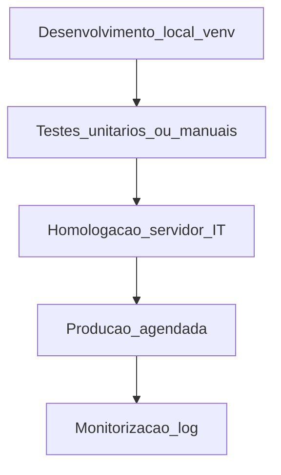

# Ambiente, *notebooks* e boas práticas — o teu script não é «ficheiro mágico no ambiente de trabalho»

**Python** em logística começa por **reprodutibilidade**: mesmo código, **mesmas versões** de bibliotecas, **segredos** fora do ficheiro `.py`, **log** mínimo e **caminho** claro de *dev* → teste → homologação → produção (com **IT**). *Notebooks* (Jupyter, VS Code) são ótimos para **explorar**; para **correr à noite** em servidor, prefira **script** versionado.

---

## Objetivos e resultado de aprendizagem

**Ao final desta aula**, você será capaz de:

- Criar **ambiente virtual** (*venv*) e ficheiro `requirements.txt` (conceitualmente).  
- Explicar por que **chaves** não entram no Git.  
- Listar **checklist** antes de pedir agendamento em produção.

**Duração sugerida:** 60–75 minutos.

---

## Gancho — a TechLar e o «funciona na minha máquina»

Um analista da **TechLar** gerava relatório de **OTIF** em Python no **portátil**. Funcionava **lá**; no **servidor** do departamento, **falhava** por versão de *pandas* antiga. Pior: o *token* da API estava **colado** no *notebook* e foi **commitado** por engano. TI teve de **rodar** chaves e **auditar** acessos — custo maior que o relatório poupava.

**Analogia da receita de bolo:** sem **indicação de forno** e **gramas**, outra cozinha queima — *venv* e `requirements` são a **receita com unidades**.

---

## Mapa do conteúdo

- Python 3.x, *venv*, `pip`, `requirements.txt`.  
- Variáveis de ambiente (`.env` **não** commitado; usar `.env.example` sem segredos).  
- Logging (`INFO`/`ERROR`) e ficheiro de saída datado.  
- Git: `.gitignore` para dados e credenciais.

---

## Conceito núcleo

**Ambiente virtual:** pasta isolada com bibliotecas — evita «**conflito** com o Python do sistema».

**Segredo:** *API key*, password, *connection string* — ler de **variável de ambiente** ou cofre corporativo (*consenso de mercado*: Azure Key Vault, AWS Secrets Manager, etc.).

**Notebook *versus* script:** notebook para **EDA**; *pipeline* agendado em `.py` com **argumentos** (datas, caminho de ficheiro).

**Legenda:** retângulos = **fases**; saltar `H` sem acordo com TI é **risco** pedagógico a evitar.

**Mini-caso:** relatório que **escreve** em pasta de rede partilhada — precisa de **conta de serviço** com permissão mínima, não da conta pessoal do analista.

---

## Trade-offs

- **Velocidade** do analista *versus* **governação** de TI.  
- **Notebook** flexível *versus* **script** auditável.  
- **Log verboso** (debug) *versus* **PII** em texto claro no log.

---

## Aplicação — exercício

Escreva um **checklist** de 8 itens para «subir» um *script* de consolidação de CSV para **homologação** (versões, segredos, pasta de saída, *rollback*, dono, etc.).

**Gabarito pedagógico:** deve incluir **versão Python/bibliotecas**, **segredo fora do repo**, **conta de serviço**, **local de log**, **contacto de escalação**; se faltar **dados de teste anonimizados**, nota pedagógica menor.

---

## Erros comuns e armadilhas

- `pip install` global no servidor partilhado.  
- Dados de **produção** em *laptop* sem encriptação.  
- *Cron* a correr como **root** «porque funcionou».  
- Sem **idempotência** — correr duas vezes duplica linhas no destino.

---

## KPIs e decisão

- **Tempo** de *setup* de novo colega (onboarding).  
- **Incidentes** de credencial exposta.  
- **Taxa de falha** do job agendado.  
- **Tempo** de recuperação após erro.

---

## Fechamento — três takeaways

1. *venv* + `requirements` = **mesmo resultado** em duas máquinas.  
2. Segredo no Git é **dívida** que TI paga com juros.  
3. Produção sem **homologação** é lotaria com dados reais.

**Pergunta de reflexão:** o teu último *script* tem **dono** e **versão** no repositório?

---

## Referências

1. Python Software Foundation — [docs.python.org](https://docs.python.org/3/tutorial/venv.html) (*venv*).  
2. PEP 518 / *packaging* — contexto moderno de dependências (*tipo de fonte*).  
3. OWASP — *Secrets Management* — [owasp.org](https://owasp.org/).

**Ponte:** [Excel / Power Query](../../trilha-dados-analytics-logistica/README.md) (origem de dados exportados).
