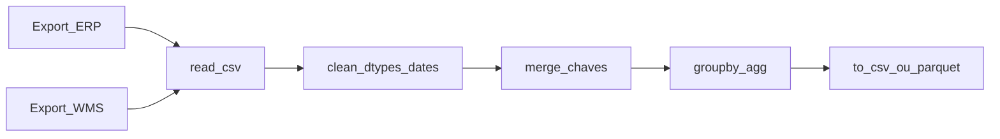

# *pandas*: CSV e planilhas na logística — limpar sujeira antes de somar OTIF

***pandas*** é a biblioteca Python mais usada para **tabelas**: ler CSV exportado do ERP/WMS, **normalizar** datas e SKUs, **juntar** (*merge*) pedidos com expedições, **agregar** por CD ou transportadora. Esta aula é **literacia** com **pseudo-código** — não substitui documentação oficial nem curso de Python completo.

---

## Objetivos e resultado de aprendizagem

**Ao final desta aula**, você será capaz de:

- Descrever os passos: **ler → limpar → transformar → agregar → exportar**.  
- Nomear **problemas típicos** em dados logísticos (SKU com zero à esquerda, *timezone*, separador decimal).  
- Esboçar pseudocódigo para **um** KPI consolidado.

**Duração sugerida:** 60–75 minutos.

---

## Gancho — a TechLar e o SKU «0123» virado número

Dois exports da **TechLar**: um tratava SKU **0123** como texto; outro como **número** 123 — o *merge* falhou em **4%** das linhas e o OTIF **mentiu** na direção. Só **auditoria** de tipos de dados descobriu. *pandas* permite **forçar** `dtype=str` na coluna certa — se alguém **souber** que SKU não é número.

**Analogia do CEP:** sem zero à esquerda, a encomenda vai para **outro estado** — formatação **é** dado.

---

## Mapa do conteúdo

- `read_csv`, encoding (`utf-8`, `latin-1`).  
- `to_datetime`, fusos (*consenso de mercado*: sempre documentar TZ).  
- `merge` (*left*/*inner*), chaves duplicadas.  
- `groupby`, `agg` para OTIF, fill rate, etc.

---

## Conceito núcleo

**Pipeline típico (pedagógico):**

1. `read_csv("expedicoes.csv")`  
2. `read_csv("pedidos.csv")`  
3. Limpar: `strip()` em strings, padronizar SKU.  
4. `merge(pedidos, expedicoes, on=["id_pedido","sku"], how="inner")`  
5. Calcular: `on_time = data_entrega <= data_prometida`  
6. `groupby("cd").agg(otif=("on_time","mean"))`  
7. `to_csv("otif_por_cd.csv")`

*Hipótese pedagógica:* nomes de colunas ilustrativos; na empresa serão códigos técnicos.

**Legenda:** fluxo de **dados**; `C` é onde **maioria** dos erros silenciosos aparece.

**Exemplo numérico (*hipótese*):** 100 pedidos; 7 sem par expedição após *merge* — investigar **chave** ou **atraso** de carga do ficheiro antes de publicar KPI.

---

## Trade-offs

- ***Inner merge*** (só chaves coincidentes) *versus* **perda** de linhas *versus* ***outer*** (preserva mas gera *null*).  
- **Tudo em Python** *versus* **parte** em SQL no *warehouse* corporativo.  
- **CSV** simples *versus* **Parquet** para grandes volumes (*opcional avançado*).

---

## Aplicação — exercício

Escreva **pseudocódigo** (5–10 linhas) que: leia `pedidos.csv` e `entregas.csv`, faça *merge* por `id_pedido`, calcule `atraso = dias(entrega) - dias(prazo)` e exporte média de atraso por `transportadora`.

**Gabarito pedagógico:** deve aparecer **merge** explícito e **agregação** por transportadora; se usar só «abrir Excel no Python» sem *merge*, insuficiente; mencionar tratamento de **data** ganha bónus.

---

## Erros comuns e armadilhas

- **Encoding** errado — caracteres quebrados.  
- **Duplicados** na chave sem `drop_duplicates` consciente.  
- Agregar **antes** de limpar — lixo agregado.  
- Publicar KPI sem **reconciliar** com **um** número oficial do BI.

---

## KPIs e decisão

- **Discrepância** entre KPI Python e painel Power BI (deve tender a **zero** após alinhamento).  
- **Tempo** de execução do *script*.  
- **% linhas** descartadas no *merge* (investigar limiar).

---

## Fechamento — três takeaways

1. *pandas* é **ferramenta**; definição de KPI continua a ser **negócio**.  
2. SKU, lote e documento são **identidades** — trate como texto quando necessário.  
3. *Merge* mal feito é **OTIF falso** com aparência científica.

**Pergunta de reflexão:** qual coluna do teu export **nunca** foi validada tipo a tipo?

---

## Referências

1. McKINNEY, W. *Python for Data Analysis* (O'Reilly) — *pandas* em profundidade.  
2. Documentação *pandas* — [pandas.pydata.org](https://pandas.pydata.org/docs/).  
3. ASCM — literacia de dados na cadeia — [ascm.org](https://www.ascm.org/).

**Ponte:** [Indicadores logísticos](../../trilha-dados-analytics-logistica/modulo-04-indicadores-logisticos-kpis/README.md).
