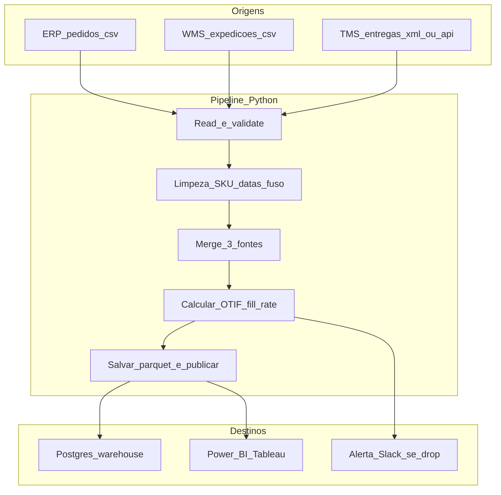
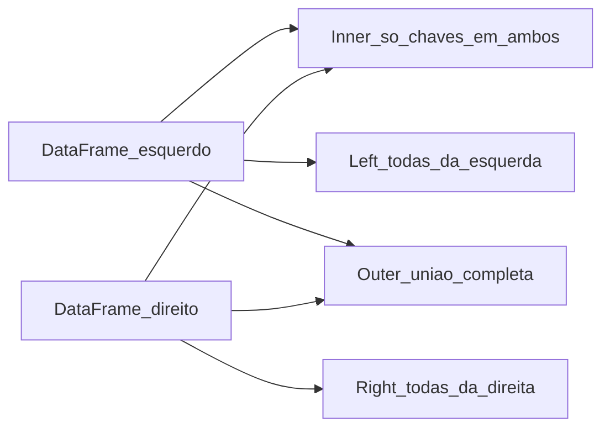

# *pandas*: CSV, planilhas e Parquet na logística — limpar sujeira antes de somar OTIF

***pandas*** é a biblioteca Python mais usada para **dados tabulares**: ler CSV exportado do ERP/WMS, **normalizar** datas e SKUs, **juntar** (*merge*) pedidos com expedições, **agregar** por CD ou transportadora, **publicar** em Parquet/Excel/banco. Em logística, 80% do esforço é **limpeza** e 20% é cálculo — esta aula foca onde o erro silencioso vive.

A aula traz **código real** (não pseudocódigo), incluindo *parsing* de XML CT-e, conciliação multi-fonte, conversão para Parquet (mais barato e rápido que CSV em escala), e integração com bancos SQL via SQLAlchemy. Para volumes maiores, comparamos **pandas** com **Polars**, **DuckDB** e **PySpark**.

---

## Objetivos e resultado de aprendizagem

- Aplicar pipeline canónico **ler → tipar → limpar → juntar → agregar → exportar** com código real.
- Resolver **5 patologias típicas** de dado logístico: SKU como número, fuso, encoding, decimal, duplicados.
- Comparar `merge` *inner/left/outer*, `concat`, `join` e quando usar cada um.
- Distinguir **CSV / Excel / Parquet / SQL** — quando faz sentido cada formato.
- Conhecer alternativas de escala: **Polars**, **DuckDB**, **PySpark**, **Dask**.
- Calcular KPIs logísticos canónicos: **OTIF**, **fill rate**, **lead time**, **giro de estoque**.

**Duração sugerida:** 75–90 min. **Pré-requisitos:** [Aula 2.1](aula-01-ambiente-notebooks-boas-praticas.md).

---

## Mapa do conteúdo

1. *Read* (`read_csv`, `read_excel`, `read_parquet`, `read_sql`) com `dtype` e `parse_dates`.
2. **Limpeza** — SKU, datas, fuso, encoding, decimal, duplicados.
3. `merge` vs `concat` vs `join` — escolha consciente.
4. `groupby` + `agg` para KPIs logísticos.
5. Parquet: por que ganhar 10× em IO.
6. Pandas vs Polars vs DuckDB vs Spark.
7. Validação com `pandera` ou `great_expectations`.

---

## Gancho — a TechLar e o SKU «0123» virado número

Dois exports da **TechLar**: o ERP exportava SKU **`0123`** como **string** (com zero à esquerda); o WMS exportava o mesmo SKU como **número** `123` (zero comido). O `merge` falhou em **4%** das linhas e o painel OTIF **mentiu** na direção por **6 semanas**. Só uma auditoria de tipos descobriu.

```python
# CASO REAL TechLar — diagnóstico
import pandas as pd

pedidos = pd.read_csv("pedidos.csv")
expedicoes = pd.read_csv("expedicoes.csv")

print("Tipo SKU em pedidos:", pedidos["sku"].dtype)
print("Tipo SKU em expedicoes:", expedicoes["sku"].dtype)
print("Exemplo pedidos:", pedidos["sku"].head(3).tolist())
print("Exemplo expedicoes:", expedicoes["sku"].head(3).tolist())

# OUTPUT:
# Tipo SKU em pedidos: object
# Tipo SKU em expedicoes: int64
# Exemplo pedidos: ['0123', '0456', '0789']
# Exemplo expedicoes: [123, 456, 789]
```

**Solução** (forçar tipo na leitura):

```python
pedidos = pd.read_csv("pedidos.csv", dtype={"sku": "string"})
expedicoes = pd.read_csv("expedicoes.csv", dtype={"sku": "string"})
expedicoes["sku"] = expedicoes["sku"].str.zfill(4)
```

**Analogia do CEP:** sem zero à esquerda, a encomenda vai para **outro estado** — formatação **é** dado.

**Analogia do RG/CPF:** ninguém soma dois CPF; eles são **identidade**, não número. SKU, lote, NF, HTI — todos identidades, devem ser **string**.

---

## Conceito-núcleo — pipeline canónico


**Onde os erros silenciosos vivem:** **80% em T+C** (tipos errados) e **15% em M** (chave duplicada ou tipo divergente). Validação `V` apanha cedo.

---

## Diagrama / Arquitetura — fluxo completo de OTIF na TechLar



---

## Aprofundamentos — código completo TechLar OTIF

```python
"""
Pipeline OTIF TechLar — pedidos × expedições × entregas.
Demonstra: dtype, parse_dates, fuso, merge, groupby, validação.
"""
from __future__ import annotations
from pathlib import Path
import pandas as pd
import pandera as pa
from pandera.typing import DataFrame, Series

PedidosSchema = pa.DataFrameSchema({
    "id_pedido": pa.Column(str, unique=True),
    "sku": pa.Column(str),
    "qtd_pedida": pa.Column(int, pa.Check.ge(0)),
    "data_prometida": pa.Column("datetime64[ns, America/Sao_Paulo]"),
    "cd_id": pa.Column(str),
    "transportadora": pa.Column(str),
})

ExpedicoesSchema = pa.DataFrameSchema({
    "id_pedido": pa.Column(str),
    "sku": pa.Column(str),
    "qtd_expedida": pa.Column(int, pa.Check.ge(0)),
    "data_expedicao": pa.Column("datetime64[ns, America/Sao_Paulo]"),
})

EntregasSchema = pa.DataFrameSchema({
    "id_pedido": pa.Column(str),
    "data_entrega": pa.Column("datetime64[ns, America/Sao_Paulo]", nullable=True),
})

def read_pedidos(path: Path) -> pd.DataFrame:
    df = pd.read_csv(
        path,
        sep=";",
        dtype={"id_pedido": "string", "sku": "string", "cd_id": "string", "transportadora": "string"},
        parse_dates=["data_prometida"],
        date_format="%Y-%m-%d %H:%M:%S",
        decimal=",",
        encoding="utf-8",
    )
    df["sku"] = df["sku"].str.zfill(4)
    df["data_prometida"] = df["data_prometida"].dt.tz_localize("America/Sao_Paulo")
    return PedidosSchema.validate(df)

def read_expedicoes(path: Path) -> pd.DataFrame:
    df = pd.read_csv(
        path, sep=";",
        dtype={"id_pedido": "string", "sku": "string"},
        parse_dates=["data_expedicao"], decimal=",",
    )
    df["sku"] = df["sku"].str.zfill(4)
    df["data_expedicao"] = df["data_expedicao"].dt.tz_localize("America/Sao_Paulo")
    return ExpedicoesSchema.validate(df)

def read_entregas(path: Path) -> pd.DataFrame:
    df = pd.read_csv(path, sep=";", dtype={"id_pedido": "string"}, parse_dates=["data_entrega"])
    df["data_entrega"] = df["data_entrega"].dt.tz_localize("America/Sao_Paulo")
    return EntregasSchema.validate(df)

def calcular_otif(pedidos: pd.DataFrame, expedicoes: pd.DataFrame, entregas: pd.DataFrame) -> pd.DataFrame:
    base = pedidos.merge(
        expedicoes,
        on=["id_pedido", "sku"],
        how="left",
        validate="one_to_one",
        indicator="presenca_exp",
    )
    base = base.merge(
        entregas, on="id_pedido", how="left", validate="many_to_one", indicator="presenca_ent",
    )
    base["in_full"] = base["qtd_expedida"].fillna(0) >= base["qtd_pedida"]
    base["on_time"] = base["data_entrega"].notna() & (base["data_entrega"] <= base["data_prometida"])
    base["otif"] = base["in_full"] & base["on_time"]
    resumo = (
        base.groupby(["cd_id", "transportadora"], as_index=False)
        .agg(
            pedidos=("id_pedido", "nunique"),
            otif_pct=("otif", "mean"),
            in_full_pct=("in_full", "mean"),
            on_time_pct=("on_time", "mean"),
            atraso_medio_h=(
                "data_entrega",
                lambda s: ((s - base.loc[s.index, "data_prometida"]).dt.total_seconds() / 3600).mean(),
            ),
        )
        .sort_values("otif_pct", ascending=False)
    )
    return resumo

def main(pasta: Path) -> None:
    pedidos = read_pedidos(pasta / "pedidos.csv")
    expedicoes = read_expedicoes(pasta / "expedicoes.csv")
    entregas = read_entregas(pasta / "entregas.csv")
    resumo = calcular_otif(pedidos, expedicoes, entregas)
    resumo.to_parquet(pasta / "otif_por_cd_transp.parquet", compression="snappy", index=False)
    print(resumo.to_string(index=False))

if __name__ == "__main__":
    main(Path("./data/2026-04"))
```

**Pontos pedagógicos críticos:**

- `dtype="string"` (não `object`) — tipo nativo *pandas* 2.x, mais previsível.
- `validate="one_to_one"` no `merge` — **falha** se houver duplicado, em vez de duplicar silenciosamente.
- `indicator="presenca_exp"` — coluna de auditoria sobre origem do `merge`.
- `tz_localize("America/Sao_Paulo")` — explicitar fuso, evitar UTC implícito.
- `parquet snappy` — 5–10× menor que CSV, leitura colunar.
- `pandera` valida schema **na leitura** — fail-fast.

---

## Patologias típicas de dado logístico (e cura)

| Patologia | Sintoma | Cura |
|---|---|---|
| **SKU como número** | Zeros à esquerda comidos | `dtype={"sku": "string"}` + `str.zfill(N)` |
| **Encoding errado** | `"São Paulo"` vira `"São Paulo"` | `encoding="utf-8"` ou `"latin-1"`; *Excel BR* costuma ser `cp1252` |
| **Decimal vírgula** | `"1.234,56"` vs `"1234.56"` | `decimal=","` e `thousands="."` no `read_csv` |
| **Fuso ausente** | Datas "naïve" misturam UTC e BRT | Sempre `tz_localize` ou `tz_convert` |
| **Duplicados na chave** | `merge` explode linhas | `df.duplicated(subset=key).sum()` antes; `validate="one_to_one"` no merge |
| **Datas como string** | Filtros não funcionam | `parse_dates=["col"]` ou `pd.to_datetime` |
| **NaN como `"NA"` ou `""`** | Strings tratadas como dado | `na_values=["NA", "N/A", "-", ""]` |
| **Linhas de cabeçalho/rodapé** | Excel com totais no fim | `skiprows`, `skipfooter` |
| **Colunas com espaço** | KeyError | `df.columns = df.columns.str.strip()` |
| **Moeda misturada** | Soma BRL + USD | Coluna explícita de `moeda`; converter antes de somar |

---

## Trade-offs e decisão — `merge` consciente



| Tipo | Quando usar | Risco |
|---|---|---|
| **inner** | Conciliação onde só interessa coincidência | Perde linhas (investigar antes de publicar) |
| **left** | Pedidos × expedições (quero todos os pedidos) | NaN onde não houve expedição (intencional) |
| **outer** | Auditoria total (quem está em A, B ou ambos) | Volume infla; cuidado em produção |

**Regra:** sempre logar `df_pre.shape[0] - df_pos.shape[0]` para entender quanto perdeu/ganhou.

---

## Caso prático — KPIs logísticos canónicos

```python
def kpis_canonicos(df: pd.DataFrame) -> dict:
    """Calcula OTIF, fill rate, perfect order, lead time medio, giro estoque."""
    return {
        "otif_pct": float((df["on_time"] & df["in_full"]).mean()),
        "in_full_pct": float(df["in_full"].mean()),
        "on_time_pct": float(df["on_time"].mean()),
        "perfect_order_pct": float(
            (df["on_time"] & df["in_full"] & df["sem_avaria"] & df["doc_correto"]).mean()
        ),
        "lead_time_medio_dias": float(
            (df["data_entrega"] - df["data_pedido"]).dt.total_seconds().div(86400).mean()
        ),
        "giro_estoque_anual": float(
            df["custo_vendas_12m"].sum() / df["estoque_medio_12m"].sum()
        ),
    }
```

**OTIF** = *On-Time-In-Full* = `(entregas_on_time AND in_full) / total_pedidos`.
**Perfect Order** = OTIF + sem avaria + documentação correta.
**Fill Rate** = `qtd_expedida / qtd_pedida` (proporção, não binário).
**Giro** = COGS / estoque médio.

---

## Aprofundamentos — quando *pandas* não chega

| Volume | Recomendação |
|---|---|
| < 1 GB | **pandas** (carregando tudo em RAM) |
| 1–10 GB | **pandas** com `usecols`/`chunksize`, ou **Polars** (lazy) |
| 10–100 GB | **Polars** (multi-thread, query optimizer); **DuckDB** (SQL sobre Parquet) |
| > 100 GB | **PySpark** (cluster), **Dask**, ou **Ray** |
| Streaming | **Apache Beam**, **Flink**, **Kafka Streams** |

### Mesmo problema em pandas vs Polars vs DuckDB

```python
# pandas
import pandas as pd
df = pd.read_parquet("expedicoes.parquet")
out = (df.query("status == 'ENTREGUE'")
         .groupby("cd_id", as_index=False)
         .agg(total=("qtd", "sum"))
         .sort_values("total", ascending=False))

# Polars (mais rápido em CPU, lazy evaluation)
import polars as pl
out = (pl.scan_parquet("expedicoes.parquet")
         .filter(pl.col("status") == "ENTREGUE")
         .group_by("cd_id")
         .agg(pl.col("qtd").sum().alias("total"))
         .sort("total", descending=True)
         .collect())

# DuckDB (SQL direto sobre Parquet, zero ETL)
import duckdb
out = duckdb.sql("""
    SELECT cd_id, SUM(qtd) AS total
    FROM 'expedicoes.parquet'
    WHERE status = 'ENTREGUE'
    GROUP BY cd_id
    ORDER BY total DESC
""").df()
```

**Quando preferir Polars:** dataset > 1GB, multi-core disponível, *query optimizer* importante.
**Quando preferir DuckDB:** equipa SQL-fluente, dado em Parquet/CSV grandes, zero infra.
**Quando preferir pandas:** ecossistema (sklearn, statsmodels), fluência da equipa, < 1GB.

---

## Erros comuns e armadilhas

- **Encoding errado** — caracteres quebrados (`ã` em vez de `ã`).
- **Duplicados na chave** sem `drop_duplicates` consciente — `merge` infla linhas.
- **Agregar antes de limpar** — lixo agregado vira KPI oficial.
- **Publicar KPI** sem reconciliar com **um** número conhecido do BI.
- `df.append()` em loop (deprecated; use `pd.concat([df, novo])` uma vez).
- `for index, row in df.iterrows():` para volume — **lentíssimo**, prefira vetorização.
- Usar `apply` quando dá para vetorizar.
- **`df.copy()`** esquecido → `SettingWithCopyWarning` mascarado.
- Salvar em **CSV** quando deveria Parquet (10× mais lento, 5× mais espaço).
- `pd.read_excel` sem `engine="openpyxl"` em xlsx novo (pode falhar).
- **NaN propagando**: `df["a"] + df["b"]` com NaN dá NaN — usar `fillna(0)` consciente.
- Comparar **datetime tz-aware** com **naive** → `TypeError`.

---

## Segurança, ética e governança

- **PII em CSV**: cuidado com nome de motorista, CPF, endereço — **mascarar** antes de salvar/exportar.
- **Encoding** de export: padronizar UTF-8 para evitar perda em rotas internacionais.
- **Versão da regra**: gravar `version` da fórmula de OTIF junto com o resultado (auditoria).
- **Reproduzibilidade**: nome de arquivo com data e `run_id`.
- **Não publicar** dataset bruto em S3/SharePoint público — usar bucket privado.
- **DPIA** quando agregação habilitar reidentificação (cuidado com baixos *k*-anonimato).

---

## KPIs

| KPI | Pergunta | Dono | Fonte | Cadência | Playbook |
|---|---|---|---|---|---|
| **Discrepância pandas vs BI** | KPI bate com painel oficial? | DataOps | Reconciliação | Semanal | Investigar fórmula/filtro |
| **% linhas descartadas no merge** | Quanto perdemos? | Process Owner | Logs do pipeline | Diário | Investigar chave |
| **Tempo de execução** | Quanto demora? | DataOps | OTel | Diário | Otimizar (Polars/DuckDB) |
| **Taxa de falha do schema** | Quantas linhas falham `pandera`? | DataOps | Audit | Diário | Corrigir upstream |
| **Cobertura de testes do ETL** | % linhas testadas | Tech lead | pytest-cov | Por PR | Adicionar teste |
| **Idade do dado mais recente** | Quão fresh? | Process Owner | Watermark | Tempo real | Alertar se > X horas |

---

## Tecnologias e ferramentas

| Necessidade | Opções |
|---|---|
| **DataFrame** | `pandas`, `polars`, `dask`, `vaex` |
| **SQL local** | `duckdb`, `sqlite` |
| **Validação** | `pandera`, `great_expectations`, `pydantic` (single record) |
| **Excel** | `openpyxl`, `xlsxwriter` (escrita), `python-calamine` (leitura rápida) |
| **Parquet/Arrow** | `pyarrow`, `fastparquet` |
| **Banco** | `SQLAlchemy`, `psycopg`, `pymssql` |
| **Visualização** | `matplotlib`, `seaborn`, `plotly`, `altair` |
| **Profiling** | `pandas-profiling` (`ydata-profiling`), `sweetviz` |
| **Orquestração** | `Airflow`, `Prefect`, `Dagster` |

---

## Glossário rápido

- **DataFrame**: tabela bidimensional com índice e tipos por coluna.
- **`dtype`**: tipo de dado (`int64`, `float64`, `string`, `category`, `datetime64[ns, tz]`).
- **`merge` validate**: `"one_to_one"`, `"one_to_many"`, etc. — falha se a relação não bater.
- **Parquet**: formato colunar binário (Apache); 5–10× menor e mais rápido que CSV.
- **Lazy evaluation** (Polars): plano de execução otimizado antes de rodar.
- **Vetorização**: operar em arrays em vez de loop Python (10–1000× mais rápido).
- **`tz-aware` vs `naive`**: datetime com ou sem fuso.

---

## Aplicação — exercícios

**Ex.1 — *parser*.** Escreva código pandas que: lê `pedidos.csv` (separador `;`, encoding `latin-1`, decimal `,`), garante `id_pedido` e `sku` como string, parseia `data_prometida` com fuso BRT.

**Ex.2 — `merge` defensivo.** Faça merge de pedidos × expedições retornando: total de linhas em cada lado, % match, % só-esquerda, % só-direita.

**Ex.3 — KPI por CD.** A partir do `df` consolidado, calcule OTIF, in-full e on-time por `cd_id`, ordenando por OTIF crescente.

**Ex.4 — Parquet.** Converta um CSV de 50 MB para Parquet e compare tamanho e tempo de leitura.

**Gabarito pedagógico:**

- **Ex.1**: `pd.read_csv(..., sep=";", encoding="latin-1", decimal=",", dtype={"id_pedido":"string","sku":"string"}, parse_dates=["data_prometida"])` + `.dt.tz_localize("America/Sao_Paulo")`.
- **Ex.2**: usar `indicator=True` e `value_counts()` na coluna `_merge`.
- **Ex.3**: `groupby("cd_id").agg(otif=("otif","mean"), ...).sort_values("otif")`.
- **Ex.4**: tipicamente Parquet snappy ≈ 8–15 MB para CSV 50 MB; leitura 3–10× mais rápida.

---

## Pergunta de reflexão

Qual coluna do teu export **nunca** foi validada tipo-a-tipo? Se ela vier como `int` em vez de `string`, **quanto** muda no painel da diretoria?

---

## Fechamento — takeaways

1. **pandas é ferramenta**; definição de KPI continua a ser **negócio**.
2. **SKU, lote, NF, HTI são identidades** — trate como string sempre.
3. **`merge` mal feito é OTIF falso** com aparência científica — use `validate=`.
4. **Parquet em vez de CSV** para qualquer dataset > 50 MB.
5. **`pandera`/`great_expectations`** valida schema na entrada — falha barata > falha cara.
6. **Polars/DuckDB** quando dataset escala — não esperar a dor.

---

## Referências

1. **McKINNEY, W.** *Python for Data Analysis* (3.ª ed., O'Reilly, 2022).
2. **Documentação pandas** — [pandas.pydata.org](https://pandas.pydata.org/docs/).
3. **Documentação Polars** — [docs.pola.rs](https://docs.pola.rs/).
4. **DuckDB** — [duckdb.org/docs](https://duckdb.org/docs/).
5. **Apache Arrow / Parquet** — [arrow.apache.org](https://arrow.apache.org/).
6. **Pandera** — [pandera.readthedocs.io](https://pandera.readthedocs.io/).
7. **Great Expectations** — [docs.greatexpectations.io](https://docs.greatexpectations.io/).
8. **Real Python** — *Pandas Cookbook* / *Polars Tutorial*.
9. **Modern Pandas** (Tom Augspurger) — [tomaugspurger.net](https://tomaugspurger.net/).
10. **CSCMP** / **ASCM** — definições canónicas de OTIF, Perfect Order, Fill Rate.

---

## Pontes para outras trilhas

- [Aula 2.3 — REST e agendamento](aula-03-agendamento-apis-leitura-rest.md) — colocar este pipeline em scheduler.
- [Aula 1.3 — CT-e e documentos BR](../modulo-01-automacao-processos-logisticos-rpa/aula-03-casos-logistica-doc-faturamento-asn.md) — fonte de dados estruturada.
- [Indicadores logísticos](../../trilha-dados-analytics-logistica/modulo-04-indicadores-logisticos-kpis/README.md) — definição canónica dos KPIs.
- [Aula 3.1 — Previsão de demanda](../modulo-03-ai-aplicada-supply-chain/aula-01-supervisionado-previsao-demanda-intro.md) — input do dataset limpo.
