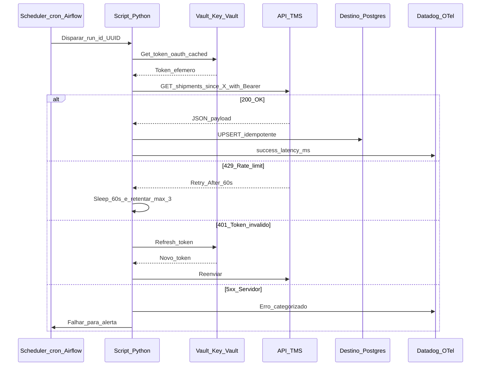
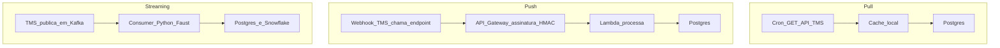

# Agendamento e leitura REST — o *script* que acorda sozinho (e não deve trazer o prédio abaixo)

**Agendar** um *script* Python (*cron* em Linux/macOS, **Task Scheduler** no Windows, **Airflow/Prefect** em produção séria) permite **relatórios matinais**, **sincronização** de ficheiros e **poll** leve de APIs. **REST** com método **GET** (só leitura) é o padrão mais seguro para começar; quando há eventos em tempo real, **Webhook** (push) ganha.

A maturidade exige conhecer: códigos HTTP, *rate limit* (429), *retry com backoff*, *idempotência*, autenticação (**API Key**, **OAuth 2.0 client credentials**, **mTLS**), gestão de *secrets* (vault), *circuit breaker*, observabilidade (latência, *p95*, *error rate*) e quando subir do `cron` para um **orquestrador real** (Airflow, Prefect, Dagster, Temporal).

---

## Objetivos e resultado de aprendizagem

- Agendar com `cron` / Task Scheduler com **utilizador**, **PATH** e **fuso** corretos.
- Fazer GET REST com `requests` + `tenacity` (retry com *exponential backoff*).
- Tratar `200`, `204`, `401`, `403`, `429`, `5xx` de forma diferente.
- Aplicar **OAuth 2.0 client credentials** com cache de token.
- Implementar **idempotência** com chave determinística e *upsert*.
- Decidir entre `cron`, **Airflow**, **Prefect**, **Dagster**, **Temporal**, **AWS EventBridge**, **Azure Logic Apps**.
- Comparar **pull (GET)** vs **push (Webhook)** vs **streaming (Kafka, MQTT)**.

**Duração sugerida:** 75–90 min. **Pré-requisitos:** [Aula 2.1](aula-01-ambiente-notebooks-boas-praticas.md), [Aula 2.2](aula-02-pandas-csv-planilhas-logistica.md).

---

## Mapa do conteúdo

1. *cron* / Task Scheduler — sintaxe e armadilhas.
2. REST GET com `requests` + `tenacity` + `httpx`.
3. Códigos HTTP que importam.
4. Autenticação: API Key, Basic, Bearer, OAuth 2.0, mTLS.
5. Idempotência e *upsert* no destino.
6. *Pull vs Push* (Webhook) vs streaming.
7. Quando subir para Airflow/Prefect/Dagster.
8. Observabilidade do job: métricas e alertas.

---

## Gancho — a TechLar e o *cron* a cada minuto

Um script consultava a **API TMS** da **TechLar** a cada **minuto** "para estar atualizado". O fornecedor aplicou **`429 Too Many Requests`** e **bloqueou** a chave por **24 h** — parou **TUDO** que usava a mesma integração (relatório CEO, painel B2B, alerta Slack do *fleet manager*).

Causa-raiz: **falta de etiqueta** com a API e **sem cache local**. Solução posterior:

1. Negociar com o fornecedor **rate limit oficial** (60 req/min, 5000 req/dia).
2. Implementar **cache local** com TTL de 10 min para queries idênticas.
3. Adicionar `Retry-After` header parsing + *exponential backoff*.
4. Webhook do TMS para *eventos críticos* (nova entrega, status mudou).
5. *Pull* GET reduzido a **1× a cada 15 min** para *backfill*.

**Analogia do telefonema ao vizinho:** perguntar **de hora a hora** é razoável; **dez vezes por minuto** é assédio — APIs têm **etiqueta**.

**Analogia do correio:** se o carteiro entrega 1× ao dia, ir à caixa **a cada minuto** não traz a carta antes — só desgasta o caminho.

---

## Conceito-núcleo — anatomia de uma chamada REST robusta



**Códigos que importam:**

| Código | Significado | Ação |
|---|---|---|
| `200 OK` | Sucesso com payload | Processar |
| `201 Created` | Criação bem-sucedida (POST) | Confirmar |
| `204 No Content` | Sucesso sem payload | OK; **não confundir com erro** |
| `301/302 Redirect` | Endpoint mudou | Atualizar URL |
| `400 Bad Request` | Payload mal formado | **Não retentar** — corrigir |
| `401 Unauthorized` | Token inválido/expirou | Refresh token |
| `403 Forbidden` | Sem permissão | Escalar — não retentar |
| `404 Not Found` | Recurso não existe | Logar; depende do contexto |
| `409 Conflict` | Conflito (idempotency) | Verificar lógica |
| `422 Unprocessable Entity` | Validação semântica falhou | Corrigir payload |
| `429 Too Many Requests` | Rate limit atingido | Respeitar `Retry-After` |
| `500 Internal Server Error` | Erro do servidor | Retentar com backoff |
| `502/503/504 Bad Gateway / Unavailable / Timeout` | Infra do servidor | Retentar com backoff longo |

---

## Diagrama / Arquitetura — pull vs push vs streaming



**Decisão:**

| Critério | Pull | Push (Webhook) | Streaming (Kafka/MQTT) |
|---|---|---|---|
| Latência | minutos | < 1s | < 100ms |
| Carga API | alta | baixa | mínima |
| Setup | simples | médio (endpoint público + HMAC) | complexo (broker) |
| Garantia entrega | até retry funcionar | depende (idempotência crítica) | at-least-once / exactly-once |
| Custo infra | baixo | médio | alto |
| **Quando** | volume baixo, fornecedor sem webhook | eventos críticos, fornecedor moderno | telemetria veículo, IoT, alta vazão |

---

## Aprofundamentos — código real

### Snippet 1 — GET REST com retry, idempotência, OAuth

```python
"""
Sync TechLar TMS shipments -> Postgres com:
- OAuth 2.0 client credentials + cache de token
- Retry com backoff exponencial e respeito a Retry-After
- Idempotência via UPSERT em chave determinística (id + version)
- Logging estruturado e métricas para Datadog/OTel
"""
from __future__ import annotations
import os
import time
import logging
from datetime import datetime, timedelta, timezone
from typing import Any
import httpx
import structlog
from tenacity import (
    retry, stop_after_attempt, wait_exponential, retry_if_exception_type, before_sleep_log
)
from sqlalchemy import create_engine, text
from azure.identity import DefaultAzureCredential
from azure.keyvault.secrets import SecretClient

log = structlog.get_logger()
logging.basicConfig(level=logging.INFO)

VAULT_URL = os.environ["VAULT_URL"]
TMS_BASE = os.environ["TMS_BASE"]  # ex.: https://api.tms-fornecedor.com/v2
DB_URL = os.environ["DB_URL"]      # ex.: postgresql+psycopg://...

# ---------- Vault ----------
_kv = SecretClient(VAULT_URL, DefaultAzureCredential())

class TokenCache:
    def __init__(self):
        self._token: str | None = None
        self._exp: datetime = datetime.now(timezone.utc)

    def get(self) -> str:
        if self._token and self._exp > datetime.now(timezone.utc) + timedelta(seconds=30):
            return self._token
        client_id = _kv.get_secret("tms-client-id").value
        client_secret = _kv.get_secret("tms-client-secret").value
        r = httpx.post(
            f"{TMS_BASE}/oauth/token",
            data={
                "grant_type": "client_credentials",
                "client_id": client_id,
                "client_secret": client_secret,
                "scope": "shipments:read",
            },
            timeout=10,
        )
        r.raise_for_status()
        body = r.json()
        self._token = body["access_token"]
        self._exp = datetime.now(timezone.utc) + timedelta(seconds=body["expires_in"])
        log.info("oauth_token_refreshed", expires_in_s=body["expires_in"])
        return self._token

token_cache = TokenCache()

# ---------- Excecoes para retry ----------
class RetryableError(Exception): ...
class FatalError(Exception): ...

@retry(
    stop=stop_after_attempt(5),
    wait=wait_exponential(multiplier=2, min=2, max=120),
    retry=retry_if_exception_type(RetryableError),
    before_sleep=before_sleep_log(logging.getLogger(), logging.WARNING),
    reraise=True,
)
def fetch_page(since: datetime, page: int = 1, per_page: int = 200) -> dict[str, Any]:
    headers = {"Authorization": f"Bearer {token_cache.get()}", "Accept": "application/json"}
    params = {"since": since.isoformat(), "page": page, "per_page": per_page}
    r = httpx.get(f"{TMS_BASE}/shipments", headers=headers, params=params, timeout=30)
    if r.status_code == 200:
        return r.json()
    if r.status_code == 401:
        token_cache._token = None  # forca refresh na proxima
        raise RetryableError("token expired")
    if r.status_code == 429:
        wait_s = int(r.headers.get("Retry-After", "60"))
        log.warning("rate_limited", wait_s=wait_s)
        time.sleep(wait_s)
        raise RetryableError("rate limit")
    if 500 <= r.status_code < 600:
        raise RetryableError(f"server {r.status_code}")
    raise FatalError(f"unexpected {r.status_code}: {r.text[:200]}")

# ---------- Persistencia idempotente ----------
UPSERT_SQL = text("""
INSERT INTO shipments (id, status, updated_at, payload, source_version)
VALUES (:id, :status, :updated_at, :payload, :source_version)
ON CONFLICT (id) DO UPDATE
  SET status = EXCLUDED.status,
      updated_at = EXCLUDED.updated_at,
      payload = EXCLUDED.payload,
      source_version = EXCLUDED.source_version
  WHERE shipments.source_version < EXCLUDED.source_version
""")

def persist(rows: list[dict], engine) -> int:
    with engine.begin() as conn:
        result = conn.execute(UPSERT_SQL, rows)
        return result.rowcount

# ---------- Watermark (last sync) ----------
def get_watermark(engine) -> datetime:
    with engine.begin() as conn:
        row = conn.execute(text("SELECT MAX(updated_at) FROM shipments")).scalar()
    return row or datetime.now(timezone.utc) - timedelta(days=1)

# ---------- Main ----------
def main() -> int:
    engine = create_engine(DB_URL, pool_pre_ping=True)
    since = get_watermark(engine)
    log.info("sync_started", since=since.isoformat())
    page = 1
    total = 0
    while True:
        body = fetch_page(since, page=page)
        items = body["data"]
        if not items:
            break
        rows = [
            {
                "id": item["id"],
                "status": item["status"],
                "updated_at": item["updated_at"],
                "payload": item,
                "source_version": item.get("version", 1),
            }
            for item in items
        ]
        n = persist(rows, engine)
        total += n
        log.info("page_persisted", page=page, count=n)
        if not body.get("next_page"):
            break
        page += 1
    log.info("sync_completed", total_upserted=total)
    return 0

if __name__ == "__main__":
    raise SystemExit(main())
```

**Pontos críticos:**

- `tenacity` com `wait_exponential(min=2, max=120)` cobre maioria dos transientes.
- **Token cache** com margem de 30s antes do `expires_in` para evitar corrida.
- **Watermark** (`MAX(updated_at)`) habilita **retomada** sem reprocessar tudo.
- `ON CONFLICT ... WHERE source_version < EXCLUDED.source_version` impede regressão de dado mais antigo sobrescrever recente.
- `payload` JSONB guarda o original (auditoria), enquanto colunas relacionais expõem o essencial.
- Saída `SystemExit(1)` permite cron/orchestrator detectar falha.

### Snippet 2 — Webhook receiver (Push) com FastAPI + HMAC

```python
"""
Endpoint para receber webhook do TMS:
- Verifica assinatura HMAC SHA-256
- Idempotência por event_id (evita reprocessar)
- Encaminha para fila assíncrona (Celery/RQ/Redis Stream)
"""
from fastapi import FastAPI, Request, HTTPException, Depends, BackgroundTasks
import hmac, hashlib, os, json
import redis

WEBHOOK_SECRET = os.environ["TMS_WEBHOOK_SECRET"].encode()
r = redis.from_url(os.environ["REDIS_URL"])
app = FastAPI()

def verify_hmac(body: bytes, signature: str) -> bool:
    expected = hmac.new(WEBHOOK_SECRET, body, hashlib.sha256).hexdigest()
    return hmac.compare_digest(f"sha256={expected}", signature)

@app.post("/webhook/tms/shipments")
async def webhook_shipments(request: Request, background: BackgroundTasks):
    body = await request.body()
    sig = request.headers.get("X-TMS-Signature", "")
    if not verify_hmac(body, sig):
        raise HTTPException(401, "Invalid signature")
    event = json.loads(body)
    event_id = event["event_id"]
    if r.set(f"webhook:tms:{event_id}", "1", nx=True, ex=86400) is None:
        return {"status": "duplicate", "event_id": event_id}
    background.add_task(process_event, event)
    return {"status": "accepted", "event_id": event_id}

def process_event(event: dict) -> None:
    # persistir no DB, idempotente
    ...
```

**HMAC** garante que o webhook **veio do fornecedor** (impede atacante forjar). `Redis SET NX EX` garante **idempotência** por 24h sem locks.

### Snippet 3 — DAG Airflow para o mesmo job

```python
from datetime import datetime, timedelta
from airflow import DAG
from airflow.operators.python import PythonOperator
from airflow.models.baseoperator import chain
from airflow.utils.task_group import TaskGroup
from sync_tms import main as sync_main

default_args = {
    "owner": "logistikon-data",
    "retries": 3,
    "retry_delay": timedelta(minutes=5),
    "retry_exponential_backoff": True,
    "max_retry_delay": timedelta(minutes=60),
    "email_on_failure": True,
    "email": ["dataops@techlar.com.br"],
}

with DAG(
    dag_id="sync_tms_shipments",
    description="Sincroniza shipments TMS para warehouse",
    default_args=default_args,
    schedule="*/15 * * * *",
    start_date=datetime(2026, 1, 1),
    catchup=False,
    max_active_runs=1,
    tags=["tms", "logistica", "incremental"],
) as dag:
    sync = PythonOperator(task_id="sync_shipments", python_callable=sync_main)
```

**Por que Airflow > cron?** retries com backoff configurável, dependências entre tasks, UI de observabilidade, alertas, *catchup* histórico, *backfill*, *SLA tracking*.

---

## Sintaxe `cron` essencial (e armadilhas)

```bash
# minuto hora dia mes diasem comando
*/15 * * * * /opt/venv/bin/python /app/sync_tms.py >> /var/log/sync.log 2>&1

# diariamente às 03:00 BRT — CUIDADO com fuso do servidor!
TZ=America/Sao_Paulo
0 3 * * * /opt/venv/bin/python /app/otif_report.py
```

**Armadilhas comuns do `cron`:**

| Problema | Causa | Solução |
|---|---|---|
| Script roda manual mas não em cron | `PATH` ausente | Definir `PATH=...` no crontab |
| Script "perde" import | `cwd` errado | Usar caminho absoluto + `cd /app && ...` |
| `python` errado | python do sistema vs venv | Caminho explícito `/opt/venv/bin/python` |
| Fuso errado | servidor UTC, lógica BRT | `TZ=America/Sao_Paulo` ou usar `cron-utils` |
| Sem log | stdout perdido | `>> /var/log/x.log 2>&1` |
| Duas instâncias paralelas | execução demorou > intervalo | `flock`: `flock -n /tmp/x.lock python ...` |
| Falha silenciosa | sem alerta | wrapper que `curl` para Healthchecks.io |

---

## Trade-offs — Cron / Airflow / Prefect / Dagster / Temporal

| Critério | cron / Task Scheduler | Airflow | Prefect | Dagster | Temporal |
|---|---|---|---|---|---|
| Setup | nenhum | médio | baixo | baixo | médio-alto |
| UI | não | sim | sim | sim (rica em assets) | sim |
| Dependência tasks | manual | DAG | flow | asset graph | workflow |
| Backfill / catchup | manual | nativo | nativo | nativo | nativo |
| Idempotência built-in | não | parcial | parcial | parcial | **forte (workflow id)** |
| Stateful long-running | não | limitado | limitado | limitado | **forte** |
| Quando usar | < 5 jobs simples | clássico data pipeline | moderno, Pythonic | data + assets (lineage) | sagas, workflows complexos cross-system |

**Recomendação por estágio de empresa:**

- **PME / piloto**: cron + Healthchecks.io.
- **Equipa data madura**: Airflow ou Prefect.
- **Lineage + qualidade**: Dagster.
- **Workflows complexos** (compensação, espera longa): Temporal.

---

## Caso prático — TechLar TMS sync (visão completa)

**Cenário:** sincronizar 5 000 shipments/dia do TMS para Postgres, com SLA de "dado < 30 min de atraso".

**Decisões:**

| Decisão | Escolha | Justificação |
|---|---|---|
| Mecanismo | Airflow + watermark | Já existe Airflow corporativo |
| Frequência | a cada 15 min | SLA permite |
| Auth | OAuth client credentials | Padrão do fornecedor |
| Storage | Postgres com tabela JSONB + colunas | Auditoria + queries |
| Idempotência | UPSERT com `source_version` | Cobrir reordenação de eventos |
| Observabilidade | structlog → Datadog + métricas Prometheus | Padrão da equipa |
| Alerta | falha 2× consecutivas → PagerDuty P3 | SLA de 30 min permite 1 atraso |
| Backfill | rodar manual com `--since=YYYY-MM-DD` se watermark perdido | Resiliência |

---

## Erros comuns e armadilhas

- **`cron` em fuso errado** → relatório "dia anterior" misturado.
- **Token sem rotação** → cai no dia errado, ninguém percebe até auditoria.
- **Ignorar TLS / proxy corporativo** (`requests` sem `verify=` ou cert empresarial).
- **Script sem lock** → 2 instâncias paralelas duplicam dado.
- ***Polling* infinito** sem *budget* → `429` permanente.
- **`requests.get(url)` sem `timeout=`** → pendura ad infinitum (default é nenhum).
- **Não logar latência** → impossível detectar degradação cedo.
- **Não usar `httpx`** quando precisa async/HTTP2 (em volume alto).
- **Webhook sem verificação HMAC** — qualquer um envia `POST` falso.
- **Webhook sem idempotência** — fornecedor reentregando duplica registo.
- **Sem *circuit breaker*** — alvo degradado vira *thundering herd*.

---

## Segurança, ética e governança

| Tema | Prática |
|---|---|
| **API Key** | Vault, rotação, escopo mínimo |
| **OAuth** | Client credentials para máquina-a-máquina; nunca *password grant* |
| **mTLS** | Para integração crítica B2B (cliente apresenta cert; servidor verifica) |
| **TLS** | `verify=True` sempre; usar cert raiz corporativa se proxy MITM |
| **PII em payload** | Mascarar antes de logar; criptografar em trânsito e repouso |
| **LGPD** | Mapear dado pessoal nos endpoints; base legal no contrato com fornecedor |
| **Rate limit** | Cumprir; ser bom cidadão da API alheia |
| **Webhook secret** | Vault; rotação; HMAC compare_digest (timing-safe) |
| **Auditoria** | Logar request_id, status, latency, retry_count |
| **Quota / billing** | Monitorar uso (cloud providers cobram por chamada) |

---

## KPIs

| KPI | Pergunta | Dono | Fonte | Cadência | Playbook |
|---|---|---|---|---|---|
| **Job success rate** | % execuções OK | DataOps | Airflow / Datadog | Diário | Investigar top erro |
| **Latency p95** | Quanto demora 95% das chamadas? | DataOps | OTel | Diário | Otimizar query / fornecedor |
| **Error rate por código** | Mix de 4xx/5xx/429 | DataOps | Logs estruturados | Diário | Negociar quota / corrigir payload |
| **Retry count médio** | Quantos retries por job? | DataOps | Tenacity logs | Semanal | Se subir, alvo degradado |
| **Watermark drift** | Quão atrás está dado? | Process Owner | Watermark vs now | Tempo real | Backfill / aumentar paralelismo |
| **API quota utilizada (%)** | Estamos perto do limite? | DataOps | API provider dashboard | Diário | Negociar mais ou cachear |
| **Webhook delivery rate** | % eventos entregues | DataOps | Provider dashboard | Diário | Validar endpoint |
| **MTTR** | Tempo para reparar falha | DataOps | Incident log | Mensal | Postmortem |

---

## Tecnologias e ferramentas

| Categoria | Recomendado |
|---|---|
| **HTTP client** | `requests` (síncrono), `httpx` (sync+async, HTTP/2), `aiohttp` (async puro) |
| **Retry** | `tenacity`, `backoff` |
| **Schema validation** | `pydantic`, `marshmallow` |
| **Cache local** | `requests-cache`, `cachetools`, Redis |
| **Vault** | Azure Key Vault, AWS Secrets Manager, HashiCorp Vault |
| **Scheduler simples** | `cron`, Task Scheduler, `systemd timer`, GitHub Actions schedule |
| **Orchestrator** | Apache Airflow, Prefect, Dagster, Temporal, AWS Step Functions, Azure Logic Apps |
| **Webhook hosting** | FastAPI + Uvicorn, AWS Lambda + API Gateway, Azure Functions |
| **Streaming** | Apache Kafka, Redpanda, AWS Kinesis, Azure Event Hubs, MQTT (IoT) |
| **Healthcheck externo** | Healthchecks.io, Better Uptime, UptimeRobot |
| **Observability** | OpenTelemetry, Datadog, New Relic, Grafana stack |

---

## Glossário rápido

- **REST**: Representational State Transfer (Fielding, 2000); convenção HTTP para APIs.
- **GET / POST / PUT / PATCH / DELETE**: verbos HTTP; GET é só leitura.
- **Idempotência**: repetir operação não duplica resultado.
- **OAuth 2.0**: padrão de autorização (RFC 6749); *client credentials* é o flow máquina-a-máquina.
- **HMAC**: Hash-based Message Authentication Code; verifica origem e integridade.
- **Webhook**: HTTP POST que o fornecedor envia para teu endpoint.
- **Rate limit**: limite de requests por janela de tempo.
- **Backoff exponencial**: aumentar tempo entre retries (2s, 4s, 8s, 16s...).
- **Circuit breaker**: cortar chamadas quando alvo está degradado.
- **DAG**: Directed Acyclic Graph; estrutura de tarefas no Airflow.
- **Watermark**: marcador de "até onde já processei".

---

## Aplicação — exercícios

**Ex.1 — Crontab.** Escreva linha crontab para rodar `/opt/venv/bin/python /app/sync.py` a cada 30 min, em fuso BRT, com lock, log em `/var/log/sync.log`.

**Ex.2 — Retry.** Decore uma função com `tenacity` para 5 tentativas, backoff exponencial 2–60s, retry só em `RetryableError`.

**Ex.3 — Idempotência.** Para um POST que cria pedido, descreva 2 mecanismos de idempotência (chave do cliente + chave servidor).

**Ex.4 — Webhook.** Pseudocódigo para verificar HMAC SHA-256 e idempotência por `event_id` em Redis com TTL 24h.

**Ex.5 — Decisão.** Empresa tem 200 jobs Python, dependências entre eles, equipa de 8 dataengineers. `cron`, Airflow, Prefect ou Temporal? Justifique.

**Gabarito pedagógico:**

- **Ex.1**: `TZ=America/Sao_Paulo\n*/30 * * * * flock -n /tmp/sync.lock /opt/venv/bin/python /app/sync.py >> /var/log/sync.log 2>&1`.
- **Ex.2**: `@retry(stop=stop_after_attempt(5), wait=wait_exponential(min=2,max=60), retry=retry_if_exception_type(RetryableError))`.
- **Ex.3**: cliente envia `Idempotency-Key: UUID`; servidor armazena `(key, response_hash)` por 24h e retorna mesmo resultado.
- **Ex.4**: `hmac.compare_digest(expected, signature)`; `redis.set(f"webhook:{event_id}", "1", nx=True, ex=86400)`.
- **Ex.5**: Airflow ou Prefect. `cron` não escala, Temporal é overkill (workflows simples).

---

## Pergunta de reflexão

A tua integração principal é **pull** (cron + GET). **Devia** ser **push** (webhook) ou **streaming** (Kafka)? Que **SLA** sustentaria a mudança?

---

## Fechamento — takeaways

1. **Agendar é fácil; agendar bem** exige fuso, lock, retry, alerta.
2. **API é contrato** — leia limites e semântica de erros antes de codar.
3. **OAuth + vault** > API Key embutida — sempre.
4. **Idempotência (chave + UPSERT)** transforma falha em "tudo bem, retentamos".
5. **`cron` para protótipo**, **Airflow/Prefect** para produção, **Temporal** para workflow complexo.
6. **Push (webhook)** quando latência importa; **streaming** quando volume é IoT.

---

## Referências

1. **FIELDING, R. T.** *Architectural Styles and the Design of Network-based Software Architectures* (PhD, 2000) — base teórica REST.
2. **RFC 6585** — códigos `428`, `429`, `431`, `511`.
3. **RFC 6749** — OAuth 2.0.
4. **RFC 7519** — JWT.
5. **`requests`** docs — [requests.readthedocs.io](https://requests.readthedocs.io/).
6. **`httpx`** docs — [www.python-httpx.org](https://www.python-httpx.org/).
7. **`tenacity`** — [tenacity.readthedocs.io](https://tenacity.readthedocs.io/).
8. **Apache Airflow** — [airflow.apache.org](https://airflow.apache.org/).
9. **Prefect** — [docs.prefect.io](https://docs.prefect.io/).
10. **Dagster** — [docs.dagster.io](https://docs.dagster.io/).
11. **Temporal** — [docs.temporal.io](https://docs.temporal.io/).
12. **OWASP API Security Top 10** — [owasp.org/API-Security](https://owasp.org/API-Security/).

---

## Pontes para outras trilhas

- [TMS](../../trilha-tecnologia-e-sistemas/modulo-04-tms/README.md) — fontes típicas de API.
- [RPA quando não há API](../modulo-01-automacao-processos-logisticos-rpa/README.md) — rota alternativa.
- [Aula 3.3 — MLOps lite](../modulo-03-ai-aplicada-supply-chain/aula-03-otimizacao-intro-mlops-lite-governanca.md) — onde modelos consomem APIs.
- [Logística 4.0 — IoT](../../trilha-logistica-estrategica/modulo-04-logistica-4-0/README.md) — quando subir para streaming.
