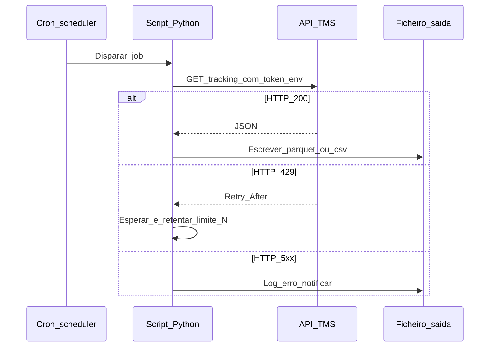

# Agendamento e leitura REST — o *script* que acorda sozinho (e não deve trazer o prédio abaixo)

**Agendar** um *script* Python (*cron* em Linux/macOS, **Task Scheduler** no Windows) permite **relatórios matinais**, **sincronização** de ficheiros e **poll** leve de APIs. **REST** com método **GET** (só leitura) é o padrão mais seguro para começar: **URL**, **cabeçalhos** (*Authorization*), **parâmetros**, **códigos HTTP** e **limite de taxa** (*rate limit*). **Nunca** gravar *token* no código-fonte.

---

## Objetivos e resultado de aprendizagem

**Ao final desta aula**, você será capaz de:

- Descrever agendamento com **utilizador** e **caminho** corretos em *cron*/*Task Scheduler*.  
- Ler resposta **GET** com tratamento de `429` / `5xx` e *backoff* simples (*conceito*).  
- Explicar **idempotência** em jobs repetidos.

**Duração sugerida:** 60–75 minutos.

---

## Gancho — a TechLar e o *cron* a cada minuto

Um *script* consultava a API TMS da **TechLar** a **cada minuto** «para estar atualizado». O fornecedor aplicou **429 Too Many Requests** e **bloqueou** a chave por 24 h — parou **tudo** que usava a mesma integração. A política correcta era **intervalo** negociado + **cache** local + **alerta** se dados estivessem velhos **X** minutos.

**Analogia do telefonema ao vizinho:** perguntar **de hora a hora** é razoável; **dez vezes por minuto** é assédio — APIs têm **etiqueta**.

---

## Mapa do conteúdo

- *cron*: `min hour day month weekday` + `PATH` e *venv*.  
- REST GET: `requests.get` (pseudocódigo), *headers*, *params*.  
- Erros: *timeout*, *retry*, *exponential backoff* (intuição).  
- Idempotência: escrever **mesma** fatia de dados sem duplicar.

---

## Conceito núcleo

**GET idempotente:** múltiplas chamadas «iguais» **não** devem alterar estado no servidor (*ideal teórico* — APIs mal desenhadas existem; validar documentação).

**Códigos úteis:** `200` OK; `401` não autorizado; `429` *rate limit*; `5xx` erro servidor — **não** confundir com «dados vazios».

**Legenda:** `S` implementa **política** de retentativas acordada com TI/fornecedor.

**Mini-caso:** *script* corre **duas vezes** o mesmo dia por erro de *cron* — destino deve usar **partição por data** ou **chave única** (*upsert*) para não duplicar linhas.

---

## Trade-offs

- **Frequência** de *poll* *versus* **carga** e custo.  
- **Webhook** (*push*) *versus* **GET** (*pull*) — *push* exige endpoint exposto (TI).  
- **Simplicidade** de ficheiro CSV *versus* **API** em tempo real.

---

## Aplicação — exercício

Escreva **pseudocódigo** para: ler `API_KEY` de ambiente; fazer GET a `.../shipments?since=YYYY-MM-DD`; se `status_code != 200`, registar erro e sair com código 1; se OK, gravar JSON bruto num ficheiro datado.

**Gabarito pedagógico:** `API_KEY` **não** pode aparecer literal no pseudocódigo; código de saída **≠0** para *monitoring* captar falha; tratamento mínimo de **429** opcional mas valorizado.

---

## Erros comuns e armadilhas

- *Cron* em **timezone** errado — relatório «dia anterior».  
- **Token** com validade infinita exposto — rotação é padrão maduro.  
- Ignorar **certificado TLS** / *proxy* corporativo.  
- *Script* sem **lock** — duas instâncias em paralelo.

---

## KPIs e decisão

- **Disponibilidade** do job (% execuções com sucesso).  
- **Latência** média da API.  
- **Número** de *retries* por dia.  
- **Volume** de dados transferidos (custo em cloud).

---

## Fechamento — três takeaways

1. Agendar é fácil; **agendar bem** exige *timezone* e *lock*.  
2. API é **contrato** — leia limites e semântica de erros.  
3. GET de leitura ainda pode **custar dinheiro** e **confiança** se abusado.

**Pergunta de reflexão:** a tua integração é **pull** — devia ser **push** ou ficheiro diário?

---

## Referências

1. Fielding, R. T. *Architectural Styles and the Design of Network-based Software Architectures* — tese REST (base teórica).  
2. *Requests* library docs — [requests.readthedocs.io](https://requests.readthedocs.io/).  
3. IETF RFC 6585 — código **429** (*tipo de fonte normativa*).

**Ponte:** [TMS](../../trilha-tecnologia-e-sistemas/modulo-04-tms/README.md); [RPA](../modulo-01-automacao-processos-logisticos-rpa/README.md) quando não há API.
