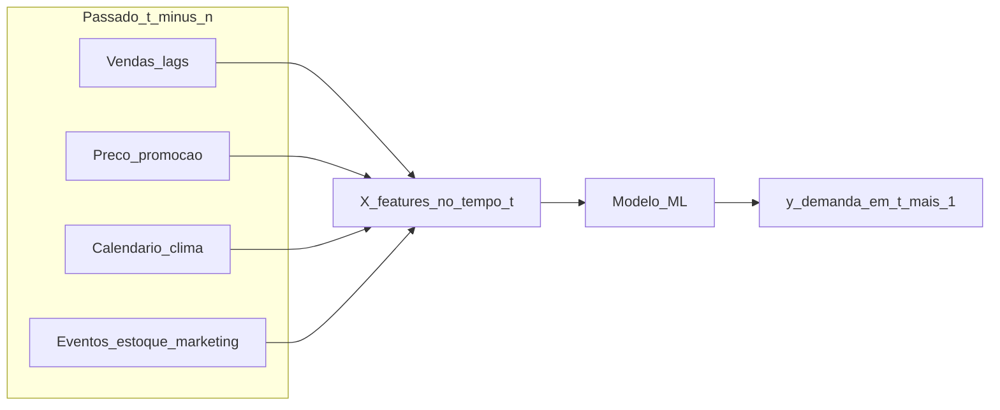
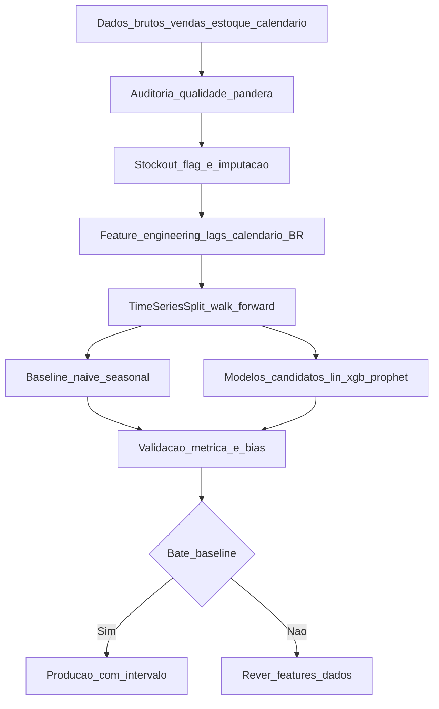

# Aprendizagem supervisionada e previsão de demanda — do «chuta» ao modelo que podes defender

**Aprendizagem supervisionada** usa exemplos passados **(X)** com **rótulo** **(y)** — *features* de promoção, calendário, preço e *lags* históricos para prever a **demanda** na semana seguinte. Em **séries temporais** o **tempo importa**: não se baralha aleatoriamente (`shuffle=True` proíbido); usa-se **janela** treino → validação **futura** (*walk-forward / time series split*).

Esta aula traz **código real** com `scikit-learn`, **`Prophet` com calendário brasileiro** (feriados nacionais, Black Friday, Carnaval), comparação com **`statsmodels` (SARIMA)** e introdução a **deep learning para séries** (`N-BEATS`, `Temporal Fusion Transformer`, `TimesFM`). Tratamos também o problema clássico da logística: **demanda censurada por *stockout***.

---

## Objetivos e resultado de aprendizagem

- Distinguir **regressão**, **classificação** e **time series forecasting**.
- Construir *features* logisticamente relevantes: *lags*, médias móveis, calendário BR, preço, promoção, clima.
- Aplicar **`TimeSeriesSplit`** correto (sem *data leakage*).
- Comparar *baselines* (*naive*, *seasonal naive*, média móvel) com modelos (linear, *gradient boosting*, Prophet).
- Tratar **stockout** (demanda censurada) com mascaramento/imputação.
- Escolher métrica certa por contexto: **MAPE**, **WAPE**, **RMSE**, **MAE**, **bias**, **pinball loss**.
- Gerar **previsão probabilística** (intervalos), não só ponto.

**Duração sugerida:** 90–105 min. **Pré-requisitos:** [Aula 2.2 (pandas)](../modulo-02-python-para-logistica/aula-02-pandas-csv-planilhas-logistica.md); estatística básica.

---

## Mapa do conteúdo

1. ML supervisionado vs forecasting clássico — fronteiras.
2. *Feature engineering* para demanda logística.
3. Validação temporal correta — *walk-forward*.
4. Baselines obrigatórios (sem eles, qualquer modelo "parece génio").
5. Modelos: regressão linear, *Random Forest*, *XGBoost*/*LightGBM*, Prophet, SARIMA, deep (N-BEATS, TFT).
6. Stockout e demanda censurada.
7. Métricas e bias.
8. Previsão probabilística (intervalos de confiança).

---

## Gancho — a TechLar e o modelo que «aprendeu» a ruptura

A **TechLar** treinou um modelo de **demanda** com 3 anos de histórico em que **rupturas** apareciam como **vendas baixas** (cliente entrou, não tinha, registou venda zero). O `XGBoost` aprendeu **brilhantemente** que aquele SKU "vendia pouco" e **recomendou menos estoque** — a equipa de planeamento confiou no modelo, **piorou** ruptura no próximo trimestre.

Diagnóstico:

```python
# Mostrar o problema
import pandas as pd
df = pd.read_parquet("vendas_2y.parquet")
print(df.groupby("sku")["qtd_vendida"].describe())
# SKU-X: max=2, mean=0.4 — parecia "demanda baixa"
# Mas: stockout_dias[SKU-X] = 180 — quase metade do tempo sem estoque!
```

**Solução técnica:**

1. Marcar **flag `stockout=True`** em dias com estoque inicial = 0 ou turnover muito rápido.
2. **Excluir** ou **imputar** com `Tobit regression` ou imputação por demanda em mercados similares.
3. Sinalizar **bias** ao planeador (intervalo amplo).

**Analogia do termómetro atrás do sofá:** a leitura é **real** mas **não** mede a sala — dados **censurados mentem**.

**Analogia do estagiário fluente** (LLM/ML): o modelo **fala bem** sobre números — mas se aprendeu mentira, decora a mentira.

---

## Conceito-núcleo — supervisão e causalidade temporal



**Regra de ouro (causalidade temporal):** toda *feature* em `X_t` deve estar **disponível** no momento `t`. Se usar `vendas_t+1` (futuro) como feature, é **data leakage** — o modelo "prevê" perfeitamente em treino e desmorona em produção.

### Tipos de problema

| Tipo | y | Exemplo logístico | Métrica típica |
|---|---|---|---|
| **Regressão** | número contínuo | demanda em unidades | MAE, RMSE, MAPE, WAPE |
| **Classificação binária** | sim/não | atraso na entrega | F1, Recall, AUC |
| **Classificação multi** | classe | risco {alto, médio, baixo} | F1-macro |
| **Forecasting** | série temporal | demanda 12 semanas à frente | MAPE, WAPE, MASE, pinball |
| **Probabilístico** | distribuição | intervalo P10/P50/P90 | Pinball loss, CRPS |

---

## Diagrama / Arquitetura — pipeline ML completo



**Legenda:** `S` (stockout) é o passo mais frequentemente esquecido em logística; sem ele, modelo aprende artefacto da operação.

---

## Aprofundamentos — código real

### Snippet 1 — *baselines* obrigatórios

```python
"""
Baselines: sem isto, qualquer ML 'genial' pode ser pior que copiar a semana passada.
"""
import pandas as pd
import numpy as np

def baseline_naive(serie: pd.Series) -> pd.Series:
    """Previsão t+1 = valor em t."""
    return serie.shift(1)

def baseline_seasonal_naive(serie: pd.Series, periodo: int = 7) -> pd.Series:
    """Previsão = mesmo dia da semana anterior (sazonalidade semanal)."""
    return serie.shift(periodo)

def baseline_media_movel(serie: pd.Series, janela: int = 7) -> pd.Series:
    return serie.rolling(window=janela, min_periods=1).mean().shift(1)
```

### Snippet 2 — *Feature engineering* logístico (calendário BR + lags)

```python
"""
Feature engineering para previsão de demanda logística no Brasil.
- lags de venda
- médias móveis
- calendário brasileiro (feriados nacionais + Black Friday + Mães + Pais)
- preço, promoção, ruptura
"""
from __future__ import annotations
import pandas as pd
import numpy as np
import holidays

def feriados_br_estendido(start: str, end: str) -> pd.DataFrame:
    """Feriados nacionais BR + datas de varejo críticas."""
    br_h = holidays.country_holidays("BR", years=range(int(start[:4]), int(end[:4]) + 1))
    feriados = pd.DataFrame(
        [(pd.Timestamp(d), n, "nacional") for d, n in br_h.items()],
        columns=["data", "feriado", "tipo"],
    )
    eventos = []
    for ano in range(int(start[:4]), int(end[:4]) + 1):
        eventos.append((pd.Timestamp(f"{ano}-11-29"), "BlackFriday", "varejo"))
        eventos.append((pd.Timestamp(f"{ano}-11-30"), "BlackSaturday", "varejo"))
        eventos.append((pd.Timestamp(f"{ano}-12-02"), "CyberMonday", "varejo"))
        # 2o domingo de maio = Mães
        eventos.append((segundo_domingo(ano, 5), "DiaMaes", "varejo"))
        # 2o domingo de agosto = Pais
        eventos.append((segundo_domingo(ano, 8), "DiaPais", "varejo"))
        eventos.append((pd.Timestamp(f"{ano}-12-25"), "Natal", "nacional"))
    df_eventos = pd.DataFrame(eventos, columns=["data", "feriado", "tipo"])
    return pd.concat([feriados, df_eventos], ignore_index=True).drop_duplicates(subset="data")

def segundo_domingo(ano: int, mes: int) -> pd.Timestamp:
    primeiro = pd.Timestamp(f"{ano}-{mes:02d}-01")
    domingos = pd.date_range(primeiro, periods=14, freq="D")
    return domingos[domingos.weekday == 6][1]

def add_features(df: pd.DataFrame, target_col: str = "qtd_vendida") -> pd.DataFrame:
    """df precisa: data, sku, qtd_vendida, preco, promo_flag, stockout_flag."""
    df = df.sort_values(["sku", "data"]).copy()
    g = df.groupby("sku")[target_col]
    for lag in [1, 7, 14, 28]:
        df[f"lag_{lag}"] = g.shift(lag)
    for janela in [7, 14, 28]:
        df[f"ma_{janela}"] = g.shift(1).rolling(janela).mean()
        df[f"std_{janela}"] = g.shift(1).rolling(janela).std()
    df["dia_semana"] = df["data"].dt.dayofweek
    df["mes"] = df["data"].dt.month
    df["semana_ano"] = df["data"].dt.isocalendar().week.astype(int)
    df["dia_mes"] = df["data"].dt.day
    df["fim_de_mes"] = (df["data"].dt.day >= 25).astype(int)
    inicio = df["data"].min().strftime("%Y-%m-%d")
    fim = df["data"].max().strftime("%Y-%m-%d")
    feriados = feriados_br_estendido(inicio, fim)
    df = df.merge(feriados, on="data", how="left")
    df["eh_feriado"] = df["feriado"].notna().astype(int)
    df["eh_varejo"] = (df["tipo"] == "varejo").astype(int)
    df["dias_ate_feriado"] = (
        df["data"]
        .apply(lambda d: (feriados["data"][feriados["data"] >= d].min() - d).days)
        .fillna(999)
        .astype(int)
    )
    return df
```

### Snippet 3 — Validação *walk-forward* + treino XGBoost

```python
"""
Validação temporal correta + XGBoost para demanda diária por SKU.
"""
import xgboost as xgb
from sklearn.metrics import mean_absolute_error, mean_squared_error
from sklearn.model_selection import TimeSeriesSplit

def wape(y_true: np.ndarray, y_pred: np.ndarray) -> float:
    """Weighted Absolute Percentage Error - melhor que MAPE quando tem zeros."""
    return np.sum(np.abs(y_true - y_pred)) / np.sum(np.abs(y_true)) if np.sum(y_true) else np.nan

def bias(y_true: np.ndarray, y_pred: np.ndarray) -> float:
    """Mede se modelo sub/superprevê sistematicamente."""
    return float((y_pred - y_true).mean())

FEATURES = [
    "lag_1", "lag_7", "lag_14", "lag_28",
    "ma_7", "ma_14", "ma_28", "std_7", "std_14", "std_28",
    "dia_semana", "mes", "semana_ano", "dia_mes", "fim_de_mes",
    "preco", "promo_flag", "eh_feriado", "eh_varejo", "dias_ate_feriado",
]

def treinar_xgb(df_features: pd.DataFrame, target: str = "qtd_vendida") -> dict:
    df_features = df_features.dropna(subset=FEATURES + [target]).sort_values("data")
    X = df_features[FEATURES]
    y = df_features[target]
    tscv = TimeSeriesSplit(n_splits=5, test_size=28)
    metricas = []
    for fold, (train_idx, test_idx) in enumerate(tscv.split(X), start=1):
        X_tr, X_te = X.iloc[train_idx], X.iloc[test_idx]
        y_tr, y_te = y.iloc[train_idx], y.iloc[test_idx]
        model = xgb.XGBRegressor(
            n_estimators=600, learning_rate=0.05, max_depth=6,
            subsample=0.8, colsample_bytree=0.8, tree_method="hist",
            objective="reg:tweedie", tweedie_variance_power=1.4,
            random_state=42,
        )
        model.fit(X_tr, y_tr, eval_set=[(X_te, y_te)], verbose=False)
        y_hat = model.predict(X_te)
        metricas.append({
            "fold": fold,
            "mae": mean_absolute_error(y_te, y_hat),
            "rmse": np.sqrt(mean_squared_error(y_te, y_hat)),
            "wape": wape(y_te.values, y_hat),
            "bias": bias(y_te.values, y_hat),
        })
    return {"metricas": pd.DataFrame(metricas), "modelo": model}
```

**Notas pedagógicas:**

- `objective="reg:tweedie"` — distribuição **Tweedie** é adequada para demanda intermitente (muitos zeros, alguns picos).
- `TimeSeriesSplit(n_splits=5, test_size=28)` — 5 janelas de 28 dias para *walk-forward*; **não embaralha**.
- **WAPE** > MAPE: WAPE é estável com zeros (MAPE explode quando `y_true=0`).

### Snippet 4 — Prophet com calendário BR

```python
"""
Prophet com feriados brasileiros + Black Friday + Mães + Pais.
Bom para demanda diária com sazonalidade forte e tendência.
"""
from prophet import Prophet
import pandas as pd

def prepara_prophet_holidays(start: str, end: str) -> pd.DataFrame:
    feriados = feriados_br_estendido(start, end).rename(
        columns={"data": "ds", "feriado": "holiday"}
    )
    feriados["lower_window"] = -1   # efeito começa 1 dia antes
    feriados["upper_window"] = 1
    return feriados[["ds", "holiday", "lower_window", "upper_window"]]

def treinar_prophet(df_sku: pd.DataFrame) -> tuple[Prophet, pd.DataFrame]:
    """df_sku precisa: data (ds), qtd_vendida (y), preco, promo_flag."""
    base = df_sku.rename(columns={"data": "ds", "qtd_vendida": "y"})
    feriados = prepara_prophet_holidays(
        base["ds"].min().strftime("%Y-%m-%d"),
        base["ds"].max().strftime("%Y-%m-%d"),
    )
    m = Prophet(
        holidays=feriados,
        yearly_seasonality=True,
        weekly_seasonality=True,
        daily_seasonality=False,
        seasonality_mode="multiplicative",
        changepoint_prior_scale=0.05,
        interval_width=0.80,
    )
    m.add_country_holidays(country_name="BR")
    m.add_regressor("preco")
    m.add_regressor("promo_flag")
    m.fit(base[["ds", "y", "preco", "promo_flag"]])
    futuro = m.make_future_dataframe(periods=28, freq="D")
    futuro["preco"] = base["preco"].iloc[-1]
    futuro["promo_flag"] = 0
    forecast = m.predict(futuro)
    return m, forecast[["ds", "yhat", "yhat_lower", "yhat_upper"]]
```

**Por que Prophet:** intervalo de incerteza nativo (`yhat_lower`/`yhat_upper`), feriados como *first-class*, robusto a *missing data*, fácil de explicar a planeador. **Limitações:** mono-série (treina um SKU por vez); para milhares de SKU, preferir *ensemble* (XGBoost com SKU como feature).

### Snippet 5 — Tratamento de stockout

```python
def marcar_stockout(df: pd.DataFrame, estoque_inicial_min: int = 1) -> pd.DataFrame:
    """Marca dias em que SKU teve estoque insuficiente para suprir demanda esperada."""
    df = df.copy()
    df["stockout_flag"] = (df["estoque_inicial_dia"] < estoque_inicial_min).astype(int)
    return df

def imputar_demanda_censurada(df: pd.DataFrame, target: str = "qtd_vendida") -> pd.DataFrame:
    """Substitui qtd_vendida em dias de stockout pela média da janela simétrica."""
    df = df.sort_values(["sku", "data"]).copy()
    df[f"{target}_imputado"] = df[target]
    for sku, grupo in df.groupby("sku"):
        idx = grupo.index
        mask = grupo["stockout_flag"] == 1
        if not mask.any():
            continue
        valido = grupo.loc[~mask, target].rolling(window=14, min_periods=3).median()
        df.loc[idx[mask], f"{target}_imputado"] = (
            valido.reindex(grupo.index).ffill().bfill().loc[idx[mask]]
        )
    return df
```

**Métodos mais avançados:** *Tobit regression*, *survival analysis*, *demand sensing* com Bayesian (PyMC).

---

## Aprofundamentos — variações de modelos

### ML clássico vs Deep Learning vs Foundation Models

| Família | Exemplos | Quando usar | Custo |
|---|---|---|---|
| **Linear / GLM** | `LinearRegression`, GLM Tweedie | Baseline interpretável; demanda explicada por preço/promo | Muito baixo |
| **Tree-based** | RandomForest, **XGBoost**, **LightGBM**, CatBoost | Maioria dos casos tabulares; SOTA para ML clássico | Baixo |
| **Statistical TS** | ARIMA, SARIMA, Holt-Winters, ETS | Série única, sazonalidade clara | Baixo |
| **Prophet** (Meta) | Prophet, NeuralProphet | Holidays + tendência + interpretabilidade | Baixo |
| **Deep TS** | N-BEATS, **TFT**, DeepAR (Amazon), Informer | Multi-séries, milhares SKU, padrões complexos | Médio-alto (GPU) |
| **Foundation models TS** | TimesFM (Google, 2024), Chronos (Amazon), Lag-Llama | Zero-shot/few-shot em séries novas | Inferência cara |
| **Hierárquico** | hts (R), HierarchicalForecast (Nixtla) | SKU → família → categoria com reconciliação | Médio |

**Recomendação prática:** começar com **baselines + XGBoost** com SKU como feature; Prophet por SKU top-50; deep só se o ROI justificar GPU.

### Métricas — escolher a certa

| Métrica | Fórmula | Quando usar | Cuidado |
|---|---|---|---|
| **MAE** | $\frac{1}{n}\sum |y_i - \hat{y}_i|$ | Interpretação direta em unidades | Não comparável entre escalas |
| **RMSE** | $\sqrt{\frac{1}{n}\sum (y_i - \hat{y}_i)^2}$ | Penaliza erros grandes | Sensível a outliers |
| **MAPE** | $\frac{100}{n}\sum \frac{|y_i - \hat{y}_i|}{y_i}$ | % intuitivo | **Indefinido se y=0**; assimétrico |
| **WAPE** | $\frac{\sum |y_i - \hat{y}_i|}{\sum y_i}$ | Melhor que MAPE em logística | Pode mascarar SKU pequenos |
| **MASE** | MAE/MAE_naive | Comparar com baseline | Difícil de explicar |
| **Bias** | $\frac{1}{n}\sum (\hat{y}_i - y_i)$ | Detectar viés sistemático | Erros podem cancelar |
| **Pinball loss** | depende do quantil | Previsão probabilística | Conceitualmente avançado |
| **CRPS** | integral | Distribuição completa | Avançado |

**Regra prática logística:** reportar **WAPE + bias + intervalo de 80%** como pacote mínimo.

---

## Trade-offs e decisão

| Decisão | Trade-off |
|---|---|
| **Granularidade** diária × semanal | Diária = mais ruído, mais detalhe; semanal = estável, menos sinal |
| **Modelo único** (todos SKU) × **um por SKU** | Único: generaliza, lida com SKU novos; um por SKU: customizado, frágil em cold-start |
| **Horizonte** curto (1 sem) × longo (12 sem) | Curto: alta acurácia, baixa utilidade tática; longo: tática, baixa acurácia |
| **Modelo complexo** (TFT) × **simples** (XGBoost) | Complexo: SOTA potencial; simples: mais barato, mais explicável, suficiente em 80% |
| **Ponto** × **probabilístico** | Ponto: simples; probabilístico: melhor decisão de estoque |
| **Build interno** × **AutoML** (DataRobot, AutoGluon, Vertex) | Build: controlo, custo dev; AutoML: time-to-value |

---

## Caso prático — TechLar previsão da família "ar-condicionado split"

**Cenário:** 50 SKUs de ar-condicionado, vendas diárias, sazonalidade muito forte (verão BR ⇒ pico Nov-Mar). Histórico 3 anos.

**Plano:**

| Etapa | Ferramenta | Métrica alvo |
|---|---|---|
| Auditar stockout | pandas + flag | < 5% dias censurados |
| Baselines | seasonal naive 7d e 365d | WAPE referência |
| Modelo principal | XGBoost com SKU como feature, *features* calendário BR | WAPE < seasonal naive 365d - 15% |
| Top-5 SKU | Prophet por SKU + intervalos | Cobertura intervalo 80% real |
| Reconciliação | sum(SKU) ≈ família ± 5% | Hierarchical reconciliation se desviar |
| Backtesting | 3 últimos meses, walk-forward 4 splits | Bias |\<| 5% |
| Decisão de estoque | usar `yhat_upper` para `safety_stock` | Service level 95% |

**Resultado esperado:** ~35% de redução de ruptura no pico, ~10% de redução de obsoleto fora-pico.

---

## Erros comuns e armadilhas

- **`shuffle=True`** em série temporal — *data leakage* total.
- **Promoção omitida** em `X` — modelo aprende média.
- **Stockout** como demanda real (caso TechLar).
- **MAPE com zero** — `inf`; usar WAPE ou MAE.
- **Comparar modelos** com diferentes janelas/conjuntos sem aviso.
- **Treinar e validar** no mesmo período — *p-hacking* não-intencional.
- **Não documentar** versão do dataset → impossível reproduzir.
- **Feature engineering** que usa futuro: `media_30d_centrada` em vez de `media_30d_anterior`.
- **Sem baseline** — qualquer modelo "parece génio".
- **Modelo único para SKU heterogéneos** (rápido vs lento, novo vs maduro).
- **Esquecer cold-start**: SKU novo sem histórico → *content-based* + *transfer learning*.
- **Desconsiderar viés** (`bias`) — modelo com WAPE 12% pode estar sub-prevendo sistematicamente.
- **Ignorar incerteza** — só prever ponto, sem intervalo, mata a otimização de estoque.

---

## Segurança, ética e governança

| Tema | Aplicação |
|---|---|
| **Reprodutibilidade** | `random_state` fixo, hash do dataset, versão do código (MLOps Aula 3.3) |
| **Bias** | Modelo pode discriminar regiões/canal — auditar |
| **Transparência** | Planeador deve entender features top (SHAP) |
| **LGPD** | Demanda agregada raramente é PII; cuidado com cliente individual |
| **EU AI Act** | Forecasting de demanda **não** é high-risk; exceção: scoring de cliente para crédito/preço |
| **Explicabilidade obrigatória** | Setor regulado (saúde, financeiro): SHAP, LIME |
| **Documentação** | *Model Card* (Google) — propósito, dados, métricas, limitações |
| **Validação humana** | Planejador aprova override; modelo não decide sozinho em alto valor |

---

## KPIs

| KPI | Pergunta | Dono | Fonte | Cadência | Playbook |
|---|---|---|---|---|---|
| **WAPE** por nível (SKU/família) | Quanto erra em média? | Demand Planning | Backtest semanal | Semanal | Refinar features / re-treino |
| **Bias** | Sub ou super-prevê? | Demand Planning | Backtest | Semanal | Investigar features faltantes |
| **WAPE vs baseline** | Modelo agrega valor? | Data Science Lead | Backtest | Semanal | Reverter para baseline se inferior |
| **Cobertura intervalo (80%)** | Real cai dentro? | Demand Planning | Backtest | Mensal | Recalibrar `interval_width` |
| **Service level realizado** | Ruptura caiu? | Operações | WMS | Mensal | Ajustar `safety_stock` na fórmula |
| **Tempo de re-treino** | Pipeline lento? | DataOps | Pipeline metrics | Semanal | Otimizar features |
| **Estabilidade do modelo** | Métrica oscila? | Data Science | Monitoring | Diário | Investigar drift (Aula 3.3) |
| **Adoção do planejador** | Override > 50%? | Demand Planning | Override log | Mensal | Modelo inútil — refazer |

---

## Tecnologias e ferramentas

| Categoria | Opções 2026 |
|---|---|
| **ML clássico** | scikit-learn, XGBoost, LightGBM, CatBoost |
| **Forecasting clássico** | statsmodels (SARIMA), sktime, Darts |
| **Prophet & cousins** | prophet, neuralprophet, statsforecast (Nixtla) |
| **Deep TS** | PyTorch Forecasting (TFT, N-BEATS), neuralforecast (Nixtla), GluonTS (Amazon) |
| **Foundation TS** | TimesFM (Google), Chronos (Amazon), Lag-Llama, Moirai (Salesforce) |
| **AutoML** | AutoGluon, AutoTS, DataRobot, Vertex AutoML, Azure AutoML |
| **Hierarchical** | hierarchicalforecast (Nixtla), thief (R) |
| **Feature store** | Feast, Tecton, Vertex Feature Store |
| **Experiment tracking** | MLflow, Weights & Biases, Comet, Neptune |
| **Explicabilidade** | SHAP, LIME, InterpretML, ELI5 |
| **Calendário BR** | `holidays`, `workalendar` |
| **Validação dados** | pandera, great_expectations |

---

## Glossário rápido

- **X / y**: features (input) e label (output).
- **Train/Validation/Test**: 3 conjuntos disjuntos no tempo.
- **Walk-forward / TimeSeriesSplit**: validação respeitando ordem temporal.
- **Data leakage**: usar info do futuro em treino.
- **MAPE/WAPE/MAE/RMSE**: famílias de erro.
- **Tweedie**: distribuição para demanda intermitente.
- **Stockout/censura**: limite operacional que distorce y observado.
- **SHAP**: Shapley values, framework de explicação local.
- **Cold start**: SKU novo sem histórico.
- **Bias**: tendência sistemática de erro.

---

## Aplicação — exercícios

**Ex.1 — Diagnóstico.** Numa série diária de SKU "geladeira frost-free 400L", encontre como detectar **3 problemas**: (a) stockout, (b) feriado não marcado, (c) promoção esquecida.

**Ex.2 — Validação.** Para 24 meses de dados, dimensione `TimeSeriesSplit`: quantos folds, com que `test_size`, considerando re-treino mensal?

**Ex.3 — Métricas.** Para SKU "fritadeira air fryer" com média 200 unidades/semana e SKU "linha branca premium" com média 2 unidades/semana, qual métrica reporta? Justifique.

**Ex.4 — Cold-start.** Para SKU lançado há 2 semanas, descreva 3 estratégias de previsão.

**Ex.5 — Decisão de estoque.** Modelo prevê `yhat=100`, `yhat_upper(95%)=140`. Qual o `safety_stock` para SLA 95% e lead time 7 dias?

**Gabarito pedagógico:**

- **Ex.1**: (a) cruzar `qtd_vendida=0` com `estoque=0`; (b) plotar resíduos por dia, picos não explicados; (c) cruzar com tabela de promoções de marketing.
- **Ex.2**: 5 folds × `test_size=4 semanas` cobre 5 meses; suficiente para 1 ano de validação.
- **Ex.3**: ambos: WAPE; segundo SKU também precisa **bias** e *count zeros*; MAPE é inadequado.
- **Ex.4**: (1) usar média da família/categoria; (2) modelo content-based (atributos: marca, preço, BTU); (3) Bayesian com prior informativa, atualiza com dados conforme chegam.
- **Ex.5**: `safety_stock = (yhat_upper - yhat) × √(LT) ≈ 40 × √7 ≈ 106 unidades` (regra simplificada); usar fórmula completa com z-score 1.65 para 95%.

---

## Pergunta de reflexão

O teu **histórico de vendas** reflete **demanda real** ou **capacidade de entrega**? Quantos *stockouts* não estão marcados — e quanto isso vicia o modelo?

---

## Fechamento — takeaways

1. **Sem baseline**, qualquer modelo "parece génio" — comece por seasonal-naive.
2. **Dados de stockout não são demanda real** sem tratamento.
3. **Validação temporal walk-forward** — `shuffle=True` é proibido.
4. **WAPE + bias + intervalo** > MAPE solo.
5. **Calendário BR** (feriados + Black Friday + Mães + Pais) muda o jogo.
6. **Tweedie objective** para demanda intermitente.
7. **Modelo bom no laptop que piora estoque** é modelo errado para o caso.
8. **Cold start** e **drift** (próxima aula) são reais — desenhar para eles.

---

## Referências

1. **HYNDMAN, R. J.; ATHANASOPOULOS, G.** *Forecasting: Principles and Practice* (3.ª ed., aberto) — [otexts.com/fpp3](https://otexts.com/fpp3/).
2. **MAKRIDAKIS, S. et al.** — Competições M3, M4, M5 — referências de benchmark.
3. **scikit-learn** — *User Guide* sobre time series — [scikit-learn.org](https://scikit-learn.org/stable/).
4. **PROPHET** docs — [facebook.github.io/prophet](https://facebook.github.io/prophet/).
5. **Nixtla** — `statsforecast`, `neuralforecast`, `hierarchicalforecast` ([nixtlaverse.nixtla.io](https://nixtlaverse.nixtla.io/)).
6. **OROZCO, S.; LIMENA, J.** — *Forecasting: Methods and Applications in Supply Chain*.
7. **GOOGLE TimesFM** (2024) — modelo fundacional para séries.
8. **AMAZON Chronos** (2024) — *Learning the Language of Time Series*.
9. **CSCMP / ASCM** — *S&OP* e *Demand Planning* benchmarks.
10. **ILOS** / **ABRALOG** — métricas BR de previsão.

---

## Pontes para outras trilhas

- [Aula 3.2 — Classificação](aula-02-classificacao-risco-atraso-qualidade.md) — risco e atraso.
- [Aula 3.3 — MLOps lite e governança](aula-03-otimizacao-intro-mlops-lite-governanca.md) — colocar modelo em produção.
- [Previsão de demanda — Fundamentos](../../trilha-fundamentos-e-estrategia/modulo-03-planejamento-demanda-sop/aula-01-previsao-demanda-metodos.md).
- [Aula 2.2 — pandas](../modulo-02-python-para-logistica/aula-02-pandas-csv-planilhas-logistica.md) — feature engineering parte mecânica.
- [Logística 4.0 — IA estratégica](../../trilha-logistica-estrategica/modulo-04-logistica-4-0/aula-03-ia-casos-uso-governanca-risco.md).
