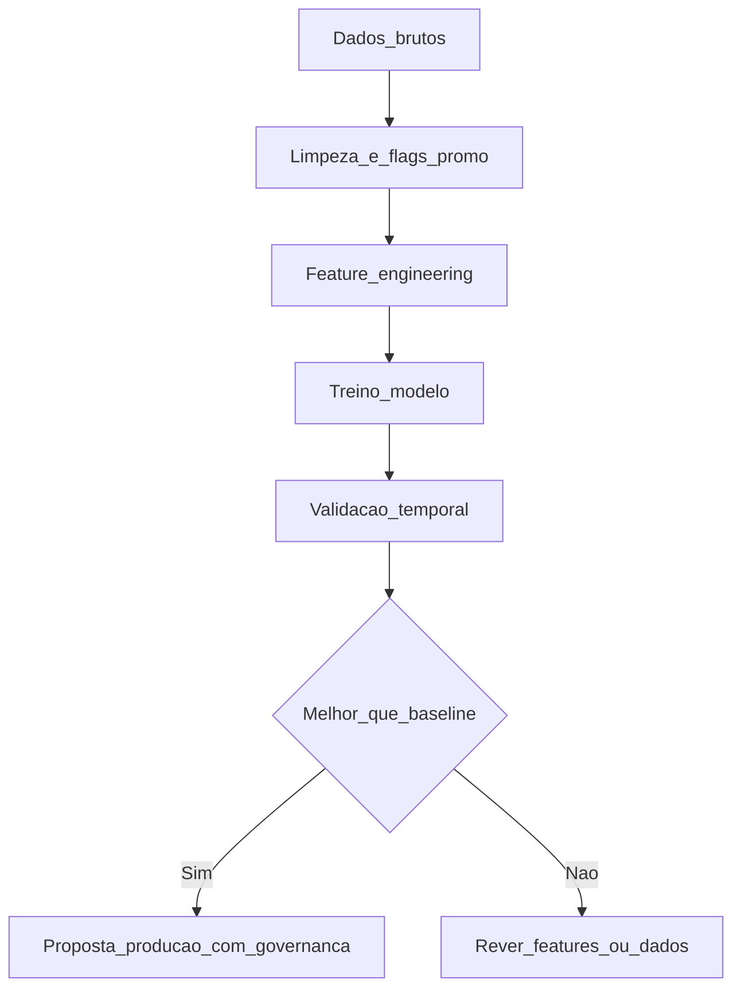

# Aprendizagem supervisionada e previsão de demanda (intro) — do «chuta» ao modelo que podes defender

**Aprendizagem supervisionada** usa exemplos passados **(X)** com **rótulo** **(y)** — ex.: *features* de promoção, calendário e histórico para prever **demanda** na semana seguinte. Em **séries temporais**, o **tempo importa**: não se baralha aleatoriamente (*shuffle*) como em *cross-validation* clássica de *tabular*; usa-se **janela** treino → validação **futura** (*time series split*, *consenso de mercado*).

---

## Objetivos e resultado de aprendizagem

**Ao final desta aula**, você será capaz de:

- Explicar **X**, **y**, treino e validação em linguagem de negócio.  
- Comparar modelo simples com ***baseline*** (*naive*, média móvel, último valor).  
- Listar **erros** típicos em previsão para *stock* (promoção não marcada, *stockout* como zero).

**Duração sugerida:** 60–75 minutos.

---

## Gancho — a TechLar e o modelo que «aprendeu» a ruptura

A **TechLar** treinou um modelo de **demanda** com histórico em que **rupturas** apareciam como **vendas baixas**. O modelo **recomendou** menos estoque — **piorou** ruptura. Só ao **marcar** períodos de *stockout* e **excluir** ou **imputar** com critério, o modelo deixou de «**odiar**» os SKUs críticos.

**Analogia do termómetro atrás do sofá:** a leitura é **real** mas **não** mede a sala — dados **censurados** mentem.

---

## Mapa do conteúdo

- Supervisionado: regressão *versus* classificação (próxima aula).  
- *Features*: calendário, preço, promoção, clima (*opcional*), *lags*.  
- Métricas: MAPE, RMSE — **ligar** a decisão de estoque (não só %).  
- *Baseline* obrigatória.

---

## Conceito núcleo

**y:** o que queremos prever (ex.: unidades vendidas na semana *t+1*).

**X:** informação disponível **antes** de *t+1* (regra de **causalidade** temporal).

***Baseline* *naive*:** «a previsão é **igual** à semana passada» — se o modelo não **bate** isto, não merece produção (*hipótese pedagógica* forte).

**Legenda:** losango = **decisão** de negócio + dados; `P` exige *MLOps* (próxima aula).

**Mini-caso:** MAPE **15%** em SKU com média 2 unidades *versus* MAPE 15% em SKU com média 10 000 — o **erro absoluto** muda a operação; comparar também **bias** (sub/previsão sistemática).

---

## Trade-offs

- **Modelo complexo** *versus* **interpretabilidade** para *planner*.  
- **Granularidade** diária *versus* semanal — mais ruído *versus* mais detalhe.  
- **Horizonte** longo de previsão *versus* acurácia típica menor.

---

## Aplicação — exercício

Defina **um** problema de previsão (SKU ou família). Liste **cinco** *features* e **uma** *baseline*. Escreva **como** validaria no tempo (ex.: treinar até Jun, validar Jul–Ago).

**Gabarito pedagógico:** *features* não podem usar **informação futura** (*data leakage*); validação deve ser **temporal**; *baseline* explícita — se faltar, incompleto.

---

## Erros comuns e armadilhas

- *Shuffle* em série temporal.  
- Promoção **omitida** em *X*.  
- Comparar modelos com **diferentes** conjuntos de dados sem aviso.  
- MAPE com valores **zero** reais na demanda (problema matemático).

---

## KPIs e decisão

- **MAPE/RMSE** *versus* *baseline*.  
- **Custo** de inventário simulado (*backtest* simples, *opcional*).  
- **Bias** médio (sub ou super-estimar).  
- **Tempo** de re-treino aceitável pelo negócio.

---

## Fechamento — três takeaways

1. Sem *baseline*, qualquer modelo parece **genial**.  
2. Dados de ruptura **não** são «demanda real» sem tratamento.  
3. Métrica boa no *laptop* que **piora** o estoque é métrica **errada** para o caso.

**Pergunta de reflexão:** o teu histórico de vendas reflete **demanda** ou **capacidade de entrega**?

---

## Referências

1. HYNDMAN, R. J.; ATHANASOPOULOS, G. *Forecasting: Principles and Practice* (livro aberto) — [otexts.com](https://otexts.com/fpp3/).  
2. Scikit-learn *User Guide* — [scikit-learn.org](https://scikit-learn.org/stable/) (*tipo de ferramenta*).  
3. [Previsão — Fundamentos](../../trilha-fundamentos-e-estrategia/modulo-03-planejamento-demanda-sop/aula-01-previsao-demanda-metodos.md).

**Ponte:** [Governança de IA estratégica](../../trilha-logistica-estrategica/modulo-04-logistica-4-0/aula-03-ia-casos-uso-governanca-risco.md).
