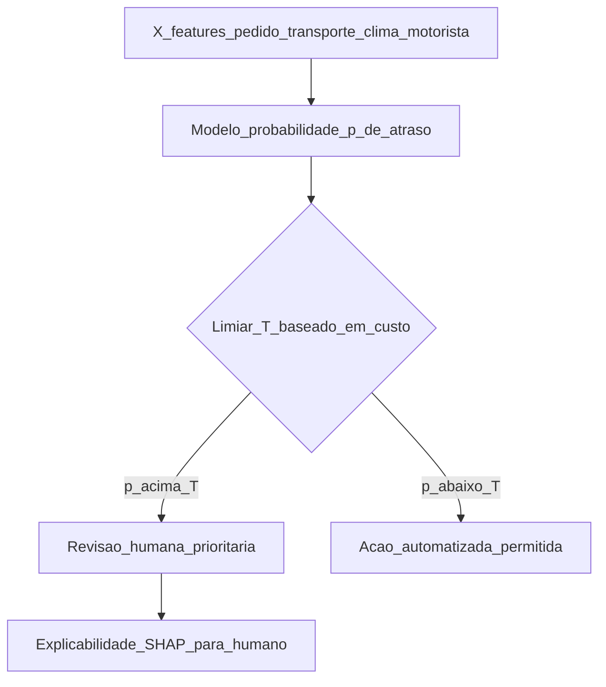
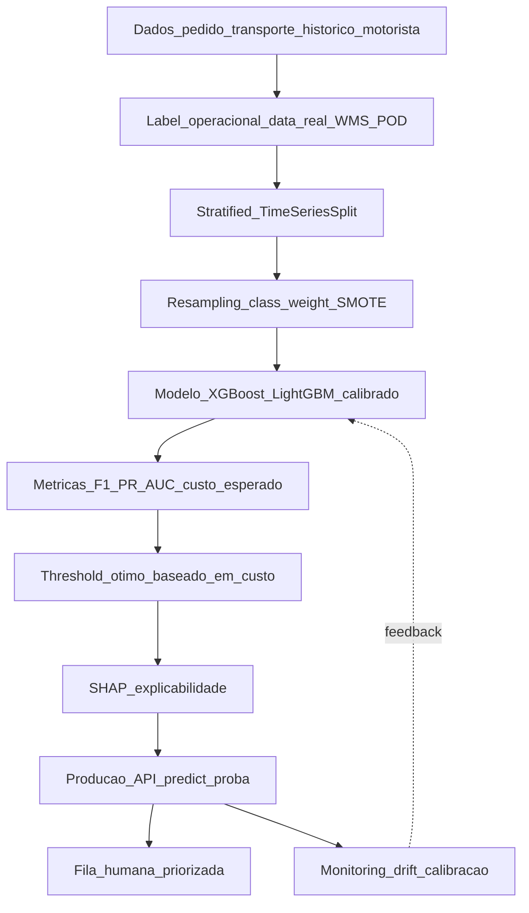

# Classificação: risco, atraso e qualidade — quando a pergunta é «qual categoria?» e não «quanto?»

Em **classificação**, o modelo prevê **classe** ou **probabilidade** de classe: atraso **sim/não**, risco de NC (não-conformidade) **alta/média/baixa**, suspeita de **fraude em fatura de frete**, **anomalia em recebimento**. Em logística, três desafios dominam: **desbalanceamento** (poucos positivos), **custo assimétrico** (falso negativo ≠ falso positivo) e **necessidade de explicação** para o humano na fila.

Esta aula traz código real com **`scikit-learn`**, **`XGBoost`** e **`LightGBM`** para classificação binária e multi-classe; aborda **calibração de probabilidade** (Platt, isotônica), **limiar ótimo de negócio** (não os 0.5 padrão), **explicabilidade com SHAP**, **anomaly detection** com Isolation Forest e **fairness/bias** em decisões assistidas. Casos reais: **risco de atraso de entrega**, **detecção de fraude de frete** e **anomalia em recebimento**.

---

## Objetivos e resultado de aprendizagem

- Formular problemas de classificação binária/multi-classe com *labels* alinhados à operação.
- Reconhecer **desbalanceamento** e remediar com `class_weight`, *oversampling* (SMOTE), *undersampling*, *threshold tuning*.
- Distinguir **acurácia, precisão, recall, F1, AUC-ROC, AUC-PR** e quando usar cada uma.
- **Calibrar probabilidade** (Platt scaling, isotônica) para que `0.7` realmente seja "70% chance".
- **Otimizar limiar** com base em custo de erro do negócio.
- Explicar previsão individual com **SHAP** para a fila de exceções.
- Aplicar **anomaly detection** (Isolation Forest, Autoencoder) quando não há *label*.
- Mitigar **bias** e cumprir **EU AI Act** se classificação for *high-risk*.

**Duração sugerida:** 90–105 min. **Pré-requisitos:** [Aula 3.1](aula-01-supervisionado-previsao-demanda-intro.md).

---

## Mapa do conteúdo

1. Problemas de classificação em logística (atraso, fraude, qualidade, anomalia).
2. *Label* operacional — como definir.
3. Desbalanceamento — 4 estratégias.
4. Métricas: precisão, recall, F1, ROC-AUC, PR-AUC, custo esperado.
5. Calibração de probabilidade.
6. *Threshold tuning* baseado em matriz de custo.
7. Explicabilidade — SHAP, LIME.
8. Anomaly detection sem *label*.
9. Bias, fairness e EU AI Act.

---

## Gancho — a TechLar e o «atraso previsto» que nunca atrasou

A **TechLar** etiquetou **atraso** como "ETA estimado pelo TMS depois do *slot*". O modelo treinou com 18 meses; precisão **94%**, AUC **0.91**. Em produção, *recall* despencou — o modelo apontava atrasos que **não aconteciam** e perdia atrasos que **aconteciam**.

Causa-raiz: o **label vinha do TMS** (ETA do transportador, **otimista** sistematicamente). O modelo aprendeu **viés do fornecedor**, não comportamento físico.

**Correção em 3 passos:**

1. Re-etiquetar com **data real** de chegada do **WMS** (POD).
2. Adicionar feature `bias_historico_transportador` (média de atraso real - ETA).
3. Validar contra **expedições reais** (não previsões).

Resultado: F1 subiu de 0.62 (mascarado pela acurácia 94% no falso label) para 0.78 com label correto. **Lição**: *label* errado vence qualquer modelo.

**Analogia do exame médico:** se o diagnóstico "positivo" foi anotado com **teste errado**, o modelo aprende **mito**.

**Analogia do estagiário do call center:** se for treinado com transcripts onde "cliente satisfeito" foi marcado pelo próprio operador, vai julgar todos os atendimentos como ótimos.

---

## Conceito-núcleo — anatomia da classificação



**Limiar de decisão (T)**: o `predict_proba` devolve `p ∈ [0,1]`; o limiar `0.5` *default* é raramente certo. **T deve refletir custo assimétrico**: se falso negativo custa R$ 10k e falso positivo custa R$ 100, T baixa muito (~0.05).

### Fórmula do limiar ótimo

$$T^* = \frac{C_{FP}}{C_{FP} + C_{FN}}$$

Onde $C_{FP}$ = custo do falso positivo e $C_{FN}$ = custo do falso negativo.

| Caso | $C_{FP}$ | $C_{FN}$ | T* |
|---|---|---|---|
| Atraso de entrega | R$ 50 (alerta inútil) | R$ 500 (cliente surpreso) | 0,09 |
| Fraude em fatura frete | R$ 200 (revisão) | R$ 5 000 (pagamento indevido) | 0,04 |
| Risco de avaria carga refrigerada | R$ 100 (verificação) | R$ 50 000 (perda total) | 0,002 |

---

## Diagrama / Arquitetura — pipeline classificação completo



---

## Aprofundamentos — código real

### Snippet 1 — Classificação binária com XGBoost + class_weight + calibração

```python
"""
Risco de atraso de entrega (binario): 1 = atraso, 0 = no prazo.
Lida com desbalanceamento (12% positivos) e calibra probabilidade.
"""
from __future__ import annotations
import pandas as pd
import numpy as np
import xgboost as xgb
from sklearn.model_selection import StratifiedKFold
from sklearn.calibration import CalibratedClassifierCV
from sklearn.metrics import (
    f1_score, precision_score, recall_score, roc_auc_score,
    average_precision_score, brier_score_loss, confusion_matrix
)

FEATURES = [
    "distancia_km", "peso_kg", "valor_carga", "qtd_volumes",
    "modal_rodoviario", "modal_aereo", "regiao_destino_norte",
    "transportadora_id", "bias_historico_transp", "lead_time_contratado_h",
    "hora_coleta", "dia_semana_coleta", "feriado_em_3_dias",
    "chuva_prevista_destino_mm", "carga_fragil", "carga_perigosa",
]

def treinar_classificador_atraso(df: pd.DataFrame) -> dict:
    df = df.dropna(subset=FEATURES + ["atrasou"]).copy()
    X, y = df[FEATURES], df["atrasou"].astype(int)
    pos_ratio = y.mean()
    scale_pos_weight = (1 - pos_ratio) / pos_ratio
    base = xgb.XGBClassifier(
        n_estimators=800, learning_rate=0.05, max_depth=6,
        subsample=0.8, colsample_bytree=0.8,
        scale_pos_weight=scale_pos_weight, eval_metric="aucpr",
        tree_method="hist", random_state=42,
    )
    skf = StratifiedKFold(n_splits=5, shuffle=False)
    metricas = []
    for fold, (tr, te) in enumerate(skf.split(X, y), start=1):
        modelo = CalibratedClassifierCV(base, method="isotonic", cv=3)
        modelo.fit(X.iloc[tr], y.iloc[tr])
        p = modelo.predict_proba(X.iloc[te])[:, 1]
        y_te = y.iloc[te].values
        y_hat_05 = (p >= 0.5).astype(int)
        metricas.append({
            "fold": fold,
            "auc_roc": roc_auc_score(y_te, p),
            "auc_pr": average_precision_score(y_te, p),
            "brier": brier_score_loss(y_te, p),
            "f1@0.5": f1_score(y_te, y_hat_05),
            "precision@0.5": precision_score(y_te, y_hat_05),
            "recall@0.5": recall_score(y_te, y_hat_05),
        })
    return {"metricas": pd.DataFrame(metricas), "modelo": modelo}
```

**Notas pedagógicas:**

- `scale_pos_weight` ajuda XGBoost a ponderar a classe minoritária.
- `eval_metric="aucpr"` (AUC-PR) é melhor que `auc` em classes raras.
- `CalibratedClassifierCV` com `method="isotonic"` corrige distorção de XGBoost (que tende a "esticar" probabilidades para extremos).
- **Brier score** mede calibração: menor = melhor calibrado.

### Snippet 2 — Limiar ótimo baseado em matriz de custo

```python
import numpy as np
import pandas as pd

def custo_esperado(y_true: np.ndarray, prob: np.ndarray, T: float, c_fp: float, c_fn: float) -> float:
    y_hat = (prob >= T).astype(int)
    cm = pd.crosstab(y_true, y_hat).reindex(index=[0, 1], columns=[0, 1], fill_value=0)
    fp = cm.loc[0, 1]
    fn = cm.loc[1, 0]
    return c_fp * fp + c_fn * fn

def melhor_limiar(y_true: np.ndarray, prob: np.ndarray, c_fp: float, c_fn: float) -> tuple[float, float]:
    Ts = np.linspace(0.01, 0.99, 99)
    custos = [(T, custo_esperado(y_true, prob, T, c_fp, c_fn)) for T in Ts]
    return min(custos, key=lambda x: x[1])

t_otimo, c_min = melhor_limiar(y_te, p, c_fp=50, c_fn=500)
print(f"Limiar otimo: {t_otimo:.2f} | Custo esperado: R$ {c_min:.2f}")
```

**Saída típica:** limiar `0.18` (não 0.5), custo R$ 12 400 — ~30% menor que limiar default.

### Snippet 3 — Explicabilidade com SHAP

```python
"""
SHAP para explicar caso individual ao operador da fila humana.
"""
import shap
import xgboost as xgb

modelo_xgb = xgb.XGBClassifier(...).fit(X_train, y_train)
explainer = shap.TreeExplainer(modelo_xgb)

def explicar_caso(idx: int, X: pd.DataFrame) -> pd.DataFrame:
    shap_values = explainer.shap_values(X.iloc[[idx]])
    contribs = pd.DataFrame({
        "feature": X.columns,
        "valor": X.iloc[idx].values,
        "contribuicao_shap": shap_values[0],
    }).sort_values("contribuicao_shap", key=abs, ascending=False)
    return contribs.head(5)

# Exemplo de saída: top 5 features que empurraram a probabilidade para "atraso"
explicar_caso(idx=42, X=X_test)
#                feature  valor  contribuicao_shap
# 4  bias_historico_transp   3.5             +0.82
# 7  chuva_prevista_destino  45.0            +0.41
# 1            distancia_km  1200            +0.22
# 9          feriado_em_3_dias  1            +0.18
# 0          carga_fragil       1            +0.09
```

**No frontend da fila humana:** mostrar essas 5 linhas como "razão para alertar". Aumenta confiança e ajuda operador a tomar decisão informada.

### Snippet 4 — Anomaly detection sem label (Isolation Forest)

```python
"""
Detectar anomalia em recebimento sem label histórico.
Caso: variação inexplicada em peso, volume, valor da NF de recebimento.
"""
from sklearn.ensemble import IsolationForest
import pandas as pd

FEATURES_ANOMALIA = [
    "peso_total_kg", "volume_total_m3", "valor_total",
    "qtd_skus", "tempo_descarga_min", "ratio_peso_volume",
]

def detectar_anomalias(df_recebimento: pd.DataFrame, contamination: float = 0.02) -> pd.DataFrame:
    iso = IsolationForest(
        n_estimators=300, contamination=contamination,
        max_samples="auto", random_state=42, n_jobs=-1,
    )
    df_recebimento = df_recebimento.copy()
    df_recebimento["anomaly_score"] = -iso.fit(df_recebimento[FEATURES_ANOMALIA])._score_samples(
        df_recebimento[FEATURES_ANOMALIA]
    )
    df_recebimento["is_anomaly"] = iso.predict(df_recebimento[FEATURES_ANOMALIA]) == -1
    return df_recebimento.sort_values("anomaly_score", ascending=False)
```

**Quando usar:**

- **Sem label** (não há histórico de "fraude vs normal").
- **Cold-start** de classificação supervisionada (gera *labels* iniciais via revisão).
- **Drift detection** — identifica casos fora da distribuição treino.

**Outras opções:** Local Outlier Factor (LOF), One-Class SVM, Autoencoder (deep), DBSCAN.

### Snippet 5 — Multi-classe com calibração e *macro F1*

```python
"""
Risco de NC (não-conformidade) em recebimento: {baixo, medio, alto}.
"""
import lightgbm as lgb
from sklearn.metrics import classification_report, f1_score

modelo_multi = lgb.LGBMClassifier(
    n_estimators=500, learning_rate=0.05, max_depth=8,
    class_weight="balanced", objective="multiclass", num_class=3,
    metric="multi_logloss", random_state=42,
)
modelo_multi.fit(X_train, y_train)
y_hat = modelo_multi.predict(X_test)
print(classification_report(y_test, y_hat, target_names=["baixo", "medio", "alto"]))
print(f"F1 macro: {f1_score(y_test, y_hat, average='macro'):.3f}")
```

`class_weight="balanced"` ajusta automaticamente para classes raras. **F1 macro** é a métrica certa: trata todas as classes igualmente.

---

## Trade-offs e decisão

| Decisão | Trade-off |
|---|---|
| **Recall alto** (apanhar todos os atrasos) | Mais alarmes falsos (operador cansa) |
| **Modelo explicável** (regra, regressão logística) | Geralmente menor performance que ensemble |
| **Modelo opaco** (XGBoost, LSTM) | Maior performance, mas precisa SHAP/LIME |
| **Automatizar decisão** | Mais rápido, risco regulatório (LGPD art. 20, EU AI Act) |
| **Decisão assistida** (humano confirma) | Mais lenta, defensável, exige UX da fila |
| **`predict` (classe)** | Decisão direta, perde informação |
| **`predict_proba` (probabilidade)** | Permite limiar dinâmico, calibração, ranking |
| **Re-treino frequente** | Captura drift, custo computacional |
| **Re-treino raro** | Estável, risco de drift acumulado |

---

## Caso prático — TechLar 3 modelos em produção

### Modelo A: Risco de atraso B2B
- **Classes**: 0 = no prazo, 1 = atraso ≥ 4h
- **Volume**: 12 000 entregas/mês, 8% atrasos
- **Custo**: $C_{FP}=R\$50$ (alerta), $C_{FN}=R\$800$ (cliente reclama, multa SLA)
- **Limiar**: ~0.06
- **Ação**: alerta proativo ao cliente + tentativa de reagendamento

### Modelo B: Fraude em fatura de frete
- **Classes**: 0 = ok, 1 = suspeita
- **Volume**: 800 CT-e/mês, 0,5% fraudes históricas
- **Custo**: $C_{FP}=R\$300$ (revisão), $C_{FN}=R\$10\,000$ (média do prejuízo)
- **Limiar**: ~0.03
- **Ação**: bloquear pagamento, abrir investigação

### Modelo C: Anomalia em recebimento (Isolation Forest)
- **Sem label**, contamination 2%
- **Volume**: 200 recebimentos/dia
- **Ação**: contagem dirigida pelo conferente em recebimentos top-decile de score

---

## Aprofundamentos — fairness e bias

Logística raramente é "high-risk" pelo EU AI Act, **exceto**:

1. **Decisão de crédito** ao cliente (B2B) — high-risk.
2. **Pricing dinâmico** que discrimina região/perfil.
3. **Avaliação de motorista** que afeta emprego (gestão de pessoas).
4. **Triagem de currículos** para emprego logístico.

**Auditoria de bias** mínima:

```python
from fairlearn.metrics import MetricFrame
from sklearn.metrics import recall_score

mf = MetricFrame(
    metrics={"recall": recall_score},
    y_true=y_test, y_pred=y_pred,
    sensitive_features=df_test["regiao"],
)
print(mf.by_group)  # recall por região
print(mf.difference())  # gap entre regiões
```

Se `recall` é 0.85 em SP e 0.62 em PA, modelo **discrimina** por região — investigar features (proxies: distância, transportadora dominante).

---

## Erros comuns e armadilhas

- **Acurácia como única métrica** com classes raras (98% acurácia = "sempre prevê negativo").
- **Label desalinhado** entre TMS, WMS, financeiro (caso TechLar).
- **Treinar com dados pós-intervenção** sem registar a intervenção (*selection bias*).
- **Limiar 0.5** sem reflexão → custo subótimo.
- **Não calibrar** XGBoost/RF → `0.7` não é "70% chance".
- **SMOTE no test set** — *leakage*; resampling **só no treino** (use `imblearn.pipeline`).
- **Não medir drift** → modelo degrada sem avisar (próxima aula).
- **Sem feedback loop**: operador da fila marca "errei aqui" mas não volta para o treino.
- **Discriminação inadvertida** por região, gênero, idade do motorista.
- **Sobreajuste a poucos positivos** — modelo "decora" os 50 fraudes históricos.
- **Não testar em **época diferente** da treino (concept drift sazonal).

---

## Segurança, ética e governança

| Tema | Aplicação |
|---|---|
| **LGPD art. 20** (decisão automatizada) | Direito de revisão humana se decisão tem impacto relevante (multa, bloqueio) |
| **EU AI Act** | High-risk se afetar emprego, crédito; documentação técnica obrigatória |
| **Model Card** | Propósito, dataset, métricas, limitações, fairness — Google, 2019 |
| **Datasheet for Datasets** | Como o dataset foi coletado, vieses conhecidos |
| **Auditoria** | Logar input, output, prob, decisão, override humano para forensics |
| **Reidentificação** | Cuidado com features altamente discriminantes (motorista_id) |
| **Direito ao esquecimento** | Como remover indivíduo do conjunto de treino |
| **Transparência ao titular** | Comunicar quando decisão é automatizada |

---

## KPIs

| KPI | Pergunta | Dono | Fonte | Cadência | Playbook |
|---|---|---|---|---|---|
| **F1 / Recall classe minoritária** | Apanhamos os positivos? | Data Science | Backtest | Semanal | Reajustar limiar / features |
| **Precision na classe minoritária** | Quantos alarmes são reais? | Data Science | Backtest | Semanal | Subir limiar se baixa |
| **AUC-PR** | Discrimina probabilisticamente? | Data Science | Backtest | Semanal | Refazer features |
| **Brier score** | Probabilidades calibradas? | Data Science | Backtest | Mensal | Recalibrar |
| **Custo esperado** | R$ economizado vs sem modelo | Negócio + Data Science | Backtest + simulação | Mensal | Re-otimizar limiar |
| **Tempo na fila humana** | Operador acompanha? | Operações | Action Center | Diário | Aumentar capacidade ou subir limiar |
| **Override humano (%)** | Modelo é útil? | Operações | Action Center | Mensal | Se > 50%, refazer |
| **Drift de feature** | Distribuição mudou? | Data Science | Monitoring | Semanal | Re-treino |
| **Fairness gap** | Diferença de performance entre grupos | Data Science + Compliance | Audit | Trimestral | Re-balancear / re-feature |

---

## Tecnologias e ferramentas

| Categoria | Opções 2026 |
|---|---|
| **Modelos clássicos** | scikit-learn (LogReg, RF, SVM), XGBoost, LightGBM, CatBoost |
| **Calibração** | scikit-learn `CalibratedClassifierCV`, `betacal` |
| **Imbalanced** | imbalanced-learn (SMOTE, ADASYN, RandomUnderSampler) |
| **Explicabilidade** | SHAP, LIME, InterpretML, Captum (PyTorch), Anchors |
| **Anomaly detection** | scikit-learn (IsoForest, LOF, OCSVM), PyOD, Alibi Detect |
| **Fairness** | Fairlearn (Microsoft), AIF360 (IBM), What-If Tool (Google) |
| **Drift detection** | Evidently AI, NannyML, Alibi Detect, WhyLogs |
| **Experiment tracking** | MLflow, Weights & Biases, Comet, Neptune |
| **AutoML** | AutoGluon, H2O AutoML, TPOT, Vertex AutoML |
| **Deep classification** | PyTorch / TensorFlow Keras, Hugging Face Transformers (NLP), Tabular Net |

---

## Glossário rápido

- **Confusion Matrix**: TP, FP, FN, TN.
- **Precision**: TP / (TP+FP) — "dos que apontei, quantos eram?"
- **Recall**: TP / (TP+FN) — "dos que existiam, quantos apanhei?"
- **F1**: média harmónica de precision e recall.
- **AUC-ROC**: área sob curva ROC; bom para balanceado.
- **AUC-PR**: área sob curva precision-recall; melhor para desbalanceado.
- **Brier Score**: erro quadrático médio da probabilidade; calibração.
- **Calibração**: probabilidade prevista bate com frequência observada.
- **Threshold tuning**: escolher limiar baseado em custo, não 0.5.
- **SMOTE**: Synthetic Minority Over-sampling Technique (Chawla, 2002).
- **SHAP**: SHapley Additive exPlanations — explicabilidade.
- **Drift**: mudança na distribuição (covariate, label, concept).
- **Fairness**: paridade de erro entre grupos sensíveis.

---

## Aplicação — exercícios

**Ex.1 — Definir label.** Para "atraso na entrega B2B", proponha 3 definições operacionais e escolha uma justificada (ex: "data POD - data prometida > 4h úteis").

**Ex.2 — Limiar ótimo.** Custo: $C_{FP}=R\$80$, $C_{FN}=R\$1\,200$. Calcule T*. Se modelo prever `p=0.07`, qual a decisão?

**Ex.3 — Métrica.** Em fraude (1% positivos), por que **acurácia** é enganosa? Que métricas reportar?

**Ex.4 — SHAP.** Para decisão "bloquear pagamento de fatura de R$ 8 500" com `p=0.92`, escreva 3 perguntas que o operador deve responder antes de aprovar.

**Ex.5 — Fairness.** Modelo de risco tem recall 0.85 em SP e 0.55 em região Norte. Liste 3 hipóteses + 1 ação por hipótese.

**Gabarito pedagógico:**

- **Ex.1**: deve mencionar fonte do dado (WMS POD), unidade temporal (h vs dias), exclusão de cancelamento.
- **Ex.2**: T* = 80/(80+1200) = 0.0625. `p=0.07 > 0.0625` → ação positiva.
- **Ex.3**: classifier "tudo negativo" tem 99% acurácia mas 0% recall; usar **F1**, **AUC-PR**, **recall na minoritária**.
- **Ex.4**: top-3 features SHAP, histórico do fornecedor, valor vs limite contratual.
- **Ex.5**: (a) volume baixo de dados Norte → coletar mais; (b) features proxy (transportadora) → desenvolver features regionais; (c) drift sazonal → re-treinar com janela móvel.

---

## Pergunta de reflexão

Qual erro te custa mais caro hoje — **alarme falso** (alguém olhou e nada era) ou **falha silenciosa** (cliente reclamou primeiro que o sistema)? Sabes em **R$**?

---

## Fechamento — takeaways

1. **Classificação é política de negócio** disfarçada de matemática.
2. **Desbalanceamento mata acurácia** como narrativa — usar F1/PR-AUC/recall.
3. **Threshold é parâmetro de gestão**, derivado de custo.
4. **Calibrar probabilidade** — XGBoost/RF "esticam" probas; usar isotonic/Platt.
5. **SHAP/LIME** transformam modelo opaco em ferramenta da fila humana.
6. **Anomaly detection** quando não há label — Isolation Forest é começo barato.
7. **Bias e fairness**: medir por grupo sensível, antes de produção.
8. **Label correto vence qualquer modelo**.

---

## Referências

1. **JAMES, G. et al.** *An Introduction to Statistical Learning* — capítulo de classificação.
2. **CHAWLA, N. V. et al.** (2002) *SMOTE: Synthetic Minority Over-sampling Technique* — JAIR.
3. **LUNDBERG, S. M.; LEE, S. I.** (2017) *A Unified Approach to Interpreting Model Predictions* — SHAP paper, NeurIPS.
4. **PROVOST, F.; FAWCETT, T.** *Data Science for Business* — O'Reilly.
5. **scikit-learn** — *User Guide* (Calibration, Imbalanced) — [scikit-learn.org](https://scikit-learn.org/stable/).
6. **Fairlearn** docs — [fairlearn.org](https://fairlearn.org/).
7. **Evidently AI** — drift detection ([evidentlyai.com](https://www.evidentlyai.com/)).
8. **MITCHELL, M. et al.** (2019) *Model Cards for Model Reporting* — FAT*.
9. **EU AI Act** — Annex III (high-risk systems).
10. **NIST AI RMF 1.0** (2023) — gestão de risco de IA.
11. **CSCMP / ASCM** — analytics aplicada a serviço logístico.

---

## Pontes para outras trilhas

- [Aula 3.3 — MLOps lite e governança](aula-03-otimizacao-intro-mlops-lite-governanca.md) — produção, drift, rollback.
- [Six Sigma — medir e analisar](../../trilha-melhoria-continua-e-processos/modulo-02-six-sigma-logistica/aula-02-medir-analisar-pareto-amostragem.md).
- [Aula 1.2 — RPA com fila humana](../modulo-01-automacao-processos-logisticos-rpa/aula-02-desenho-excecao-governanca-rpa.md) — onde a previsão alimenta exceção.
- [Logística 4.0 — IA estratégica](../../trilha-logistica-estrategica/modulo-04-logistica-4-0/aula-03-ia-casos-uso-governanca-risco.md).
