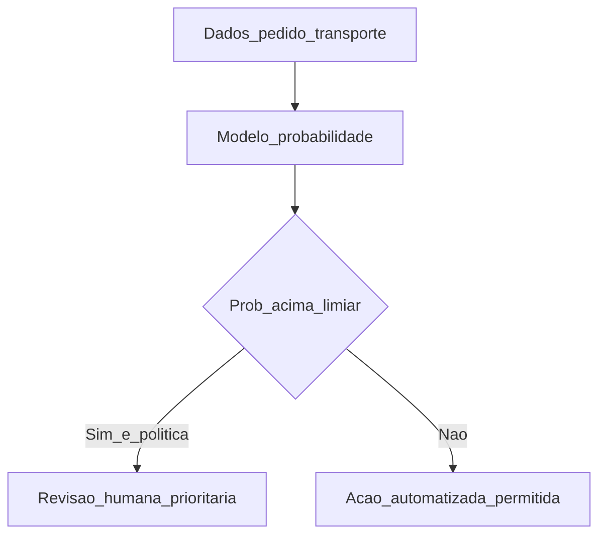

# Classificação: risco, atraso e qualidade — quando a pergunta é «qual categoria?» e não «quanto?»

Em **classificação**, o modelo prevê **classe** ou **probabilidade** de classe: atraso **sim/não**, risco de **NC** alta/média/baixa, suspeita de **fraude** simples em fatura. Em logística, o desafio típico é **desbalanceamento** (poucos positivos) e **necessidade de explicação** para o humano na fila de exceções.

---

## Objetivos e resultado de aprendizagem

**Ao final desta aula**, você será capaz de:

- Formular **problemas** de classificação com *labels* alinhados à operação.  
- Reconhecer **desbalanceamento** e remediações (*oversampling*, peso de classe, métrica certa — *conceito*).  
- Posicionar **decisão assistida** com humano obrigatório em casos sensíveis.

**Duração sugerida:** 60–75 minutos.

---

## Gancho — a TechLar e o «atraso previsto» que nunca atrasou

A **TechLar** etiquetou **atraso** como «chegou depois do *slot*» — mas o modelo treinou com **ETA** do TMS que já vinha **otimista**. O classificador aprendeu **ruído do fornecedor**, não comportamento físico. **Re-etiquetar** com **data real de chegada** (WMS) corrigiu a **precisão** e a **confiança** da torre de controlo.

**Analogia do exame médico:** se o diagnóstico «positivo» foi anotado com **teste errado**, o modelo aprende **mito**.

---

## Mapa do conteúdo

- Binário *versus* multi-classe.  
- Métricas: precisão, *recall*, F1, AUC-ROC (*intuição*).  
- Desbalanceamento e custo de **falso negativo** *versus* **falso positivo**.  
- *Threshold* de decisão alinhado a negócio.

---

## Conceito núcleo

**Label (rótulo):** definição **operacional** — quem aprova, com que fonte, com que atraso máximo de registo.

**Desbalanceamento:** ex.: 2% de pedidos «alto risco» — acurácia 98% pode ser **trivial** (*always negative*).

**Decisão assistida:** modelo **ordena** ou **sinaliza**; humano **decide** em multas, segurança alimentar, *recall* regulatório.

**Legenda:** losango = **limiar** e política; ramos dependem de **risco** regulatório (*hipótese pedagógica*).

**Mini-caso:** **falso positivo** em «fraude» de frete — operação para; **falso negativo** — dinheiro sai; o **limiar** deve refletir **custo assimétrico**, não 0.5 por defeito.

---

## Trade-offs

- **Recall** alto (apanhar todos os atrasos) *versus* **mais** alarmes falsos.  
- **Modelo explicável** (*shap*, regras) *versus* *ensemble* opaco.  
- **Automatizar** *versus* **treinar** pessoas na nova fila de revisão.

---

## Aplicação — exercício

Defina **um** problema de classificação logística. Para cada classe, escreva **custo de erro** (alto/médio/baixo) se o modelo **confundir** com a outra classe principal. Proponha **métrica** principal (F1, *recall*, precisão) e **justifique** numa frase.

**Gabarito pedagógico:** deve aparecer **assimetria** de custo em pelo menos um par de erros; métrica deve **alinhar** com o erro mais caro (ex.: *recall* se falso negativo é crítico).

---

## Erros comuns e armadilhas

- *Label* **desalinhado** entre TMS, WMS e financeiro.  
- **Treino** com dados pós-intervenção humana sem registar a intervenção (*leakage*).  
- **Acurácia** como única métrica com classes raras.  
- Lançar modelo sem **canal** de feedback do operador.

---

## KPIs e decisão

- **F1** / *recall* na classe minoritária.  
- **Tempo** médio na fila humana após *score*.  
- **Economia** estimada *versus* revisão 100% manual.  
- **Taxa** de *override* humano (muito alta = modelo inútil).

---

## Fechamento — três takeaways

1. Classificação é **política** de negócio disfarçada de matemática.  
2. Desbalanceamento mata **acurácia** como narrativa.  
3. *Threshold* é **parâmetro de gestão**, não só técnico.

**Pergunta de reflexão:** qual erro te custa mais caro hoje — **alarme falso** ou **falha silenciosa**?

---

## Referências

1. JAMES, G. et al. *An Introduction to Statistical Learning* — capítulo de classificação.  
2. Chawla, N. V. et al. *SMOTE* — *oversampling* (*paper*; usar com critério).  
3. ASCM — analytics na cadeia — [ascm.org](https://www.ascm.org/).

**Ponte:** [Six Sigma — medir](../../trilha-melhoria-continua-e-processos/modulo-02-six-sigma-logistica/aula-02-medir-analisar-pareto-amostragem.md).
