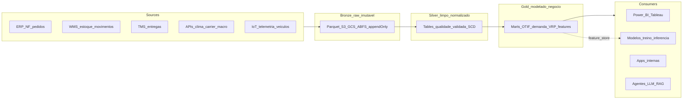
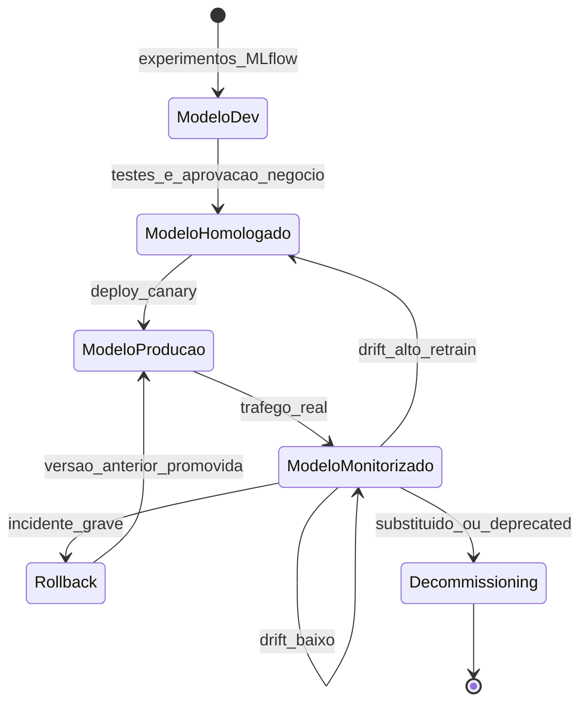

# Otimização introdutória, *MLOps lite* e governança — do «arranja-me a rota» ao modelo que não pode fugir

**Otimização** em *supply chain* formula **objetivo** (custo, tempo, serviço), **variáveis de decisão** e **restrições** (capacidade, frota, janelas, prioridades). Famílias clássicas: **VRP** (*Vehicle Routing Problem*), **TSP** (*Traveling Salesman*), **FLP** (*Facility Location*), **assignment**, **knapsack**, **MIP** (*Mixed-Integer Programming*). Ferramentas open-source maduras: **OR-Tools** (Google), **PuLP**, **Pyomo**, **NetworkX** — antes de pagar Gurobi/CPLEX.

***MLOps lite*** é a higiene mínima: **versionar** dados e modelo (data versioning + model registry), **monitorizar** *drift*, **alertar** queda de métrica, ter **caminho** de **rollback** e **re-treino**. Esta aula liga implementação à **governança de IA estratégica** ([Logística 4.0](../../trilha-logistica-estrategica/modulo-04-logistica-4-0/aula-03-ia-casos-uso-governanca-risco.md)) com **EU AI Act**, **AI RMF NIST**, **ISO 42001**, **LGPD/ANPD**.

A aula traz **código real OR-Tools** para VRP com janela de tempo (VRPTW) e capacidade, **MLflow** para experimento e registry, **Evidently AI** para drift, e **arquitetura medallion** (bronze/silver/gold) como base de plataforma de dados moderna.

---

## Objetivos e resultado de aprendizagem

- Modelar **TSP/VRP/VRPTW** em OR-Tools com objetivo, variáveis e restrições.
- Distinguir **otimalidade** (LP/MIP) e **heurística** (CP-SAT, metaheurísticas) — quando importa.
- Estruturar **MLOps lite** com **MLflow** (tracking + registry), **DVC** ou **LakeFS** (data versioning), **Evidently AI** (drift).
- Desenhar **arquitetura medallion** (bronze/silver/gold) e *feature store*.
- Aplicar frameworks de governança: **EU AI Act**, **ISO 42001**, **AI RMF NIST**, **LGPD**.
- Definir **rollback** mensurável (métrica de negócio + dado).
- Conhecer **agentes de IA** (LLM com *guardrails*) e seus riscos em SC.

**Duração sugerida:** 90–105 min. **Pré-requisitos:** [Aula 3.1](aula-01-supervisionado-previsao-demanda-intro.md), [Aula 3.2](aula-02-classificacao-risco-atraso-qualidade.md).

---

## Mapa do conteúdo

1. Vocabulário de otimização: objetivo, variáveis, restrições.
2. Famílias clássicas: TSP, VRP, VRPTW, FLP, MIP, LP.
3. **OR-Tools** com código real para VRPTW.
4. *MLOps lite*: tracking, registry, data versioning, drift, rollback, retreino.
5. Arquitetura plataforma moderna: medallion (bronze/silver/gold), feature store, lakehouse.
6. Governança: EU AI Act (riscos), AI RMF NIST, ISO 42001, LGPD/ANPD, *Model Cards*.
7. **LLMs em SC** com RAG e agentes — riscos e *guardrails*.
8. Centro de Excelência IA + papéis emergentes (ML Engineer, MLOps, AI Governance).

---

## Gancho — a TechLar e o «otimizador» que cortou o cliente errado

Um *prototype* de **otimização** de entregas da **TechLar** **minimizou** km **sem** restrição de **janela B2B** com multa contratual — o solver **adiou** um *key account* (contrato R$ 12M/ano) "porque matematicamente dava jeito". O CEO descobriu na ligação do cliente.

**Causa-raiz:**

1. Função objetivo só com `total_distance` (sem penalidade de janela).
2. Restrição de janela "soft" (penalidade) ausente.
3. Sem revisão humana do output em primeiros 30 dias.
4. Sem KPI de "incumprimento de janela contratual" no monitoring.

**Correção:**

```python
# Adicionar dimensão Time com janelas hard
routing.AddDimension(transit_callback_index, slack_max=30, capacity=1440, fix_start_cumul_to_zero=False, name="Time")
time_dimension = routing.GetDimensionOrDie("Time")
for location_idx, time_window in enumerate(time_windows):
    if location_idx == 0:
        continue
    index = manager.NodeToIndex(location_idx)
    time_dimension.CumulVar(index).SetRange(time_window[0], time_window[1])
# Penalidade soft para clientes prioritários
for cliente in clientes_prioritarios:
    routing.AddDisjunction([manager.NodeToIndex(cliente)], 100_000)  # alto custo de pular
```

**Analogia do GPS só por distância:** ignora **estrada fechada** e **prioridade de ambulância**. Otimização sem **restrições de negócio** é **homicídio de relacionamento**.

**Analogia do MLOps = academia para o modelo:** sem treino regular, sem medição, sem nutrição (dados frescos), o modelo emagrece em performance.

---

## Conceito-núcleo — vocabulário de otimização

Todo problema de otimização tem três peças:

| Peça | Pergunta | Exemplo VRP |
|---|---|---|
| **Função objetivo** | O que minimizar/maximizar? | min(custo total = soma km × R$/km + multa SLA) |
| **Variáveis de decisão** | O que escolho? | $x_{ij}$ = veículo vai de $i$ para $j$? (binária) |
| **Restrições** | O que **não** posso violar? | capacidade veículo, janela cliente, jornada motorista, prioridade |

### Famílias clássicas

| Problema | Definição | Exemplo logístico | Solver típico |
|---|---|---|---|
| **TSP** | menor rota visitando todos pontos uma vez | rota motorista solo | OR-Tools, Concorde |
| **VRP** | TSP com K veículos e capacidade | last-mile com frota | OR-Tools, Jsprit |
| **VRPTW** | VRP + janelas de tempo | B2B com hora marcada | OR-Tools, OptaPlanner |
| **CVRP** | VRP com capacidade | CD para clientes | OR-Tools |
| **FLP** | onde abrir CD/loja | rede de distribuição | PuLP, Gurobi |
| **Assignment** | matching ótimo | motorista × rota | scipy linear_sum_assignment |
| **Knapsack** | seleção com peso/valor | quais pedidos no veículo | PuLP, OR-Tools |
| **Network flow** | max-flow / min-cost | balanço entre CDs | NetworkX, OR-Tools |
| **Job-shop scheduling** | ordem de tarefas | doca, picking | OR-Tools CP-SAT |
| **MIP genérico** | mistas inteiras + contínuas | S&OP integrado | Pyomo, Gurobi, CPLEX |

### Heurística vs ótimo

| Tipo | Encontra ótimo? | Tempo | Quando |
|---|---|---|---|
| **Branch & Bound (LP/MIP)** | sim (eventualmente) | exponencial | problema pequeno, prova requerida |
| **CP-SAT (constraint programming)** | sim (limited) | polinomial em prática | scheduling, assignment com restrições complexas |
| **Heurística construtiva** (savings, sweep) | não | rápido | warm-start |
| **Metaheurística** (GA, simulated annealing, tabu) | não, boa | médio | VRP grande |
| **GLS / LNS** (large neighborhood search) | não | médio | OR-Tools default |

**Regra prática logística:** OR-Tools resolve 95% dos casos de roteamento; só ir para Gurobi/CPLEX quando volume/restrições forem extremos.

---

## Diagrama / Arquitetura — plataforma de dados moderna (medallion)



**Vantagens medallion:**

- Bronze imutável → reprocessamento histórico possível.
- Silver com schema validado (`pandera`/`great_expectations`) → confiança downstream.
- Gold modelado por **dimensão de negócio** (OTIF, custo, demanda) → BI e ML compartilham fonte de verdade.

---

## Diagrama / Arquitetura — MLOps lite



**Componentes mínimos:**

| Componente | Open-source | Cloud manage |
|---|---|---|
| **Experiment tracking** | MLflow, Weights & Biases | Vertex Experiments, Azure ML, SageMaker Experiments |
| **Model registry** | MLflow Registry | Vertex Model Registry, Azure ML Models |
| **Data versioning** | DVC, LakeFS, Pachyderm | Delta Lake, Iceberg, Hudi |
| **Feature store** | Feast | Vertex Feature Store, Tecton, Hopsworks |
| **Pipeline orchestration** | Airflow, Prefect, Dagster, Kubeflow | Vertex Pipelines, Azure ML Pipelines, Step Functions |
| **Serving** | BentoML, MLflow serve, FastAPI | SageMaker Endpoints, Vertex Endpoints, Azure ML Endpoints |
| **Monitoring drift** | Evidently AI, NannyML, Alibi Detect, WhyLogs | Vertex Model Monitoring, SageMaker Monitor |
| **Container** | Docker | Cloud Run, App Service |
| **CI/CD** | GitHub Actions, GitLab CI | CodePipeline, Azure DevOps |

---

## Aprofundamentos — código real

### Snippet 1 — VRPTW com OR-Tools

```python
"""
Vehicle Routing Problem with Time Windows (VRPTW) + Capacity.
Cenario TechLar: 1 CD em Sao Paulo, 4 veiculos, 20 entregas com janelas.
"""
from __future__ import annotations
from ortools.constraint_solver import pywrapcp, routing_enums_pb2

def solve_vrptw(
    distance_matrix: list[list[int]],   # metros
    time_matrix: list[list[int]],       # minutos (incluindo servico)
    time_windows: list[tuple[int, int]],# (inicio, fim) em minutos a partir de 00:00
    demands: list[int],                 # m3 por entrega (0 no deposito)
    vehicle_capacities: list[int],      # m3 por veiculo
    num_vehicles: int = 4,
    depot: int = 0,
    max_route_min: int = 600,           # jornada legal motorista
):
    n = len(distance_matrix)
    manager = pywrapcp.RoutingIndexManager(n, num_vehicles, depot)
    routing = pywrapcp.RoutingModel(manager)
    def distance_cb(from_idx, to_idx):
        return distance_matrix[manager.IndexToNode(from_idx)][manager.IndexToNode(to_idx)]
    transit_dist = routing.RegisterTransitCallback(distance_cb)
    routing.SetArcCostEvaluatorOfAllVehicles(transit_dist)
    def time_cb(from_idx, to_idx):
        return time_matrix[manager.IndexToNode(from_idx)][manager.IndexToNode(to_idx)]
    transit_time = routing.RegisterTransitCallback(time_cb)
    routing.AddDimension(transit_time, 60, max_route_min, False, "Time")
    time_dim = routing.GetDimensionOrDie("Time")
    for loc, (a, b) in enumerate(time_windows):
        if loc == depot:
            continue
        idx = manager.NodeToIndex(loc)
        time_dim.CumulVar(idx).SetRange(a, b)
    for v in range(num_vehicles):
        idx_start = routing.Start(v)
        time_dim.CumulVar(idx_start).SetRange(time_windows[depot][0], time_windows[depot][1])
        routing.AddVariableMinimizedByFinalizer(time_dim.CumulVar(routing.Start(v)))
        routing.AddVariableMinimizedByFinalizer(time_dim.CumulVar(routing.End(v)))
    def demand_cb(from_idx):
        return demands[manager.IndexToNode(from_idx)]
    transit_dem = routing.RegisterUnaryTransitCallback(demand_cb)
    routing.AddDimensionWithVehicleCapacity(transit_dem, 0, vehicle_capacities, True, "Capacity")
    for loc in range(1, n):
        routing.AddDisjunction([manager.NodeToIndex(loc)], 1_000_000)
    params = pywrapcp.DefaultRoutingSearchParameters()
    params.first_solution_strategy = routing_enums_pb2.FirstSolutionStrategy.PATH_CHEAPEST_ARC
    params.local_search_metaheuristic = routing_enums_pb2.LocalSearchMetaheuristic.GUIDED_LOCAL_SEARCH
    params.time_limit.seconds = 30
    solution = routing.SolveWithParameters(params)
    if not solution:
        return None
    rotas = []
    for v in range(num_vehicles):
        idx = routing.Start(v)
        rota = []
        while not routing.IsEnd(idx):
            no = manager.IndexToNode(idx)
            chegada = solution.Value(time_dim.CumulVar(idx))
            rota.append({"node": no, "chegada_min": chegada})
            idx = solution.Value(routing.NextVar(idx))
        rota.append({"node": manager.IndexToNode(idx), "chegada_min": solution.Value(time_dim.CumulVar(idx))})
        rotas.append({"veiculo": v, "rota": rota})
    return {"rotas": rotas, "custo_total_metros": solution.ObjectiveValue()}
```

**Pontos pedagógicos:**

- `AddDisjunction` com penalidade alta = "se não conseguir, pague o preço" (soft constraint para SLA).
- `GUIDED_LOCAL_SEARCH` é a metaheurística default sólida.
- `time_limit.seconds=30` — em produção, balanço entre qualidade e *responsiveness*.

### Snippet 2 — Treino + tracking com MLflow

```python
"""
Treino XGBoost com MLflow tracking + registry.
"""
import mlflow
import mlflow.xgboost
import xgboost as xgb
from sklearn.metrics import f1_score

mlflow.set_tracking_uri("http://mlflow.techlar.local:5000")
mlflow.set_experiment("risco_atraso_b2b")

with mlflow.start_run(run_name="xgb_v3_isotonic") as run:
    params = {"n_estimators": 800, "learning_rate": 0.05, "max_depth": 6}
    mlflow.log_params(params)
    mlflow.log_param("dataset_hash", "sha256:abcd...1234")  # versao dos dados!
    model = xgb.XGBClassifier(**params).fit(X_train, y_train)
    y_pred = model.predict(X_val)
    f1 = f1_score(y_val, y_pred)
    mlflow.log_metric("f1", f1)
    mlflow.log_metric("auc_pr", auc_pr)
    mlflow.xgboost.log_model(
        model, artifact_path="model",
        registered_model_name="risco_atraso_b2b",
        signature=mlflow.models.infer_signature(X_train, y_pred),
    )
    if f1 > 0.78:
        client = mlflow.tracking.MlflowClient()
        latest = client.get_latest_versions("risco_atraso_b2b", stages=["None"])[0]
        client.transition_model_version_stage(
            name="risco_atraso_b2b", version=latest.version, stage="Staging",
        )
```

### Snippet 3 — Drift detection com Evidently

```python
"""
Detectar drift de features e label entre produção e baseline.
"""
from evidently.report import Report
from evidently.metric_preset import DataDriftPreset, TargetDriftPreset
import pandas as pd

baseline = pd.read_parquet("s3://lake/gold/risco_atraso/train_2025Q4.parquet")
current = pd.read_parquet("s3://lake/gold/risco_atraso/predictions_2026_04.parquet")

report = Report(metrics=[DataDriftPreset(), TargetDriftPreset()])
report.run(reference_data=baseline, current_data=current)
report.save_html("/tmp/drift_2026_04.html")
result = report.as_dict()
n_drifted = result["metrics"][0]["result"]["number_of_drifted_columns"]
if n_drifted > 3:
    raise SystemExit(f"Drift severo: {n_drifted} colunas mudaram. Disparar retreino.")
```

**Tipos de drift:**

| Tipo | O que muda | Sinal típico |
|---|---|---|
| **Covariate drift** | $P(X)$ — distribuição das features | KS test, PSI > 0.2 |
| **Concept drift** | $P(y\|X)$ — relação X→y | métrica cai |
| **Label drift** | $P(y)$ — distribuição de y | rate de positivos muda |

### Snippet 4 — Rollback automático com canary deploy

```python
"""
Comparar nova versao vs produção em janela canary (5% trafego).
Se metrica de negocio cair > 10%, rollback automático.
"""
def canary_check(prod_metric: float, canary_metric: float, tolerance: float = 0.10) -> str:
    diff = (canary_metric - prod_metric) / prod_metric
    if diff < -tolerance:
        return "ROLLBACK"
    if diff > 0.05:
        return "PROMOTE"
    return "MONITOR"

acao = canary_check(prod_metric=0.78, canary_metric=0.69)
if acao == "ROLLBACK":
    promote_previous_version("risco_atraso_b2b")
    notify_pagerduty("Canary failed: F1 dropped from 0.78 to 0.69")
```

---

## Trade-offs e decisão

| Decisão | Trade-off |
|---|---|
| **LP/MIP exato** vs **heurística** | Exato dá ótimo provável, lento; heurística rápido, sem prova |
| **Otimizar 1 vez ao dia** vs **online** | Diário simples; online responde a evento, custo computacional |
| **Modelo único global** vs **modelos por região** | Único: simples; regional: custo manutenção |
| **Build interno** (Python+Open) vs **buy** (Manhattan, Llamasoft, Coupa) | Build: controlo; buy: time-to-value, suporte |
| **LLM proprietário** (GPT-4, Claude, Gemini) vs **open** (Llama, Mistral) | Proprietário: qualidade, contrato; open: privacidade, custo |
| **Centralizar IA** (CoE) vs **distribuir** (citizen) | CoE: padrão; citizen: velocidade, risco |
| **Cloud ML** (Vertex, SageMaker) vs **on-prem** | Cloud: rápido escalar; on-prem: regulação, latência |

---

## Caso prático — TechLar plataforma de dados + 3 modelos em prod

**Stack escolhido (PME média BR, 2026):**

| Camada | Escolha | Justificação |
|---|---|---|
| Storage | S3 (AWS) com Iceberg / Delta | Open formats, multi-engine |
| Processing | Databricks ou Snowflake | SQL + Python + ML |
| Orchestration | Airflow gerenciado (MWAA / Astronomer) | DAGs, dependências |
| ML platform | MLflow + Feast (self-hosted) ou Databricks ML | Maturidade |
| Monitoring | Evidently AI + Datadog | Drift + infra |
| Serving | FastAPI em ECS Fargate ou Databricks Model Serving | Custo controlado |
| LLM/RAG | OpenAI GPT-4o + LangChain + Pinecone (RAG sobre PRD logístico) | Time-to-value |
| Governança | MLflow Model Cards + Datadog audit + AI risk register | Cumprir LGPD/AI Act |

**3 modelos em produção:**

1. **Demanda** (Aula 3.1) — XGBoost diário SKU; Prophet top-50.
2. **Risco atraso** (Aula 3.2) — XGBoost calibrado, threshold 0.06.
3. **Roteirização** (esta aula) — OR-Tools VRPTW, executa 04:00 e 12:00.

---

## Aprofundamentos — LLMs em SC com RAG e *guardrails*


**Casos de uso emergentes em SC:**

| Caso | Risco | Guardrail |
|---|---|---|
| **Q&A sobre manuais WMS** (RAG) | Alucinação, info desatualizada | Citações obrigatórias, expirar chunks |
| **Resumo de PRD logístico** | Omissão crítica | Revisão humana, *evals* |
| **Geração de SQL contra warehouse** | Query destrutiva | Read-only role, sandbox, query budget |
| **Agente que cancela pedido** | Ação errada | Confirmação humana, valor máximo, audit |
| **Análise de e-mail de cliente** | PII vazada para LLM externo | Mascarar antes; usar LLM on-prem |

**Frameworks:** LangChain, LlamaIndex, Haystack, DSPy. **Vector DB:** Pinecone, Weaviate, Qdrant, pgvector, Milvus.

**Princípios de agente seguro:**

1. **Least privilege**: agente lê tudo, escreve só onde autorizado.
2. **Confirmação humana** para ação reversível-cara ou irreversível.
3. **Budget de tokens/ações** por sessão.
4. **Audit log** de cada chamada de tool.
5. **Eval suite** com casos adversariais.
6. **Circuit breaker** se erro/custo subir.

---

## Erros comuns e armadilhas

- **Otimizar km e piorar serviço** (caso TechLar gancho).
- **Deploy sem linha de base operacional** (não sabemos se piorou).
- **Re-treino automático** sem validação humana em domínio regulado.
- **Confundir demo de solver com produção** integrada a WMS/TMS.
- **Modelo "fantasma"** em produção sem registry, sem owner.
- **Versão de dados não rastreada** → "qual dataset gerou esse modelo?"
- **Drift ignorado** até cliente reclamar.
- **Rollback manual** que demora horas — automatize.
- **Feature engineered no treino** mas não disponível em inferência (*train-serve skew*).
- **LLM responde com confiança** sem dado — alucinação não tratada.
- **Agente** com permissão admin no ERP — risco massivo.
- **Modelo que vira oráculo** — equipa não questiona output.

---

## Segurança, ética e governança — quadro consolidado

### EU AI Act (Reg. 2024/1689) — categorias

| Categoria | Exemplos SC | Obrigação |
|---|---|---|
| **Proibido** | manipulação subliminar, social scoring | Zero |
| **High-risk** | RH, crédito, infraestrutura crítica | Doc técnica, gestão risco, supervisão humana, log, transparência, registo UE |
| **Limited risk** | chatbot interno | Transparência (utilizador sabe que é IA) |
| **Minimal** | maioria forecasting/VRP | Nenhuma adicional |
| **GPAI** (foundation models) | GPT, Claude, Gemini | Obrigações ao provider |

### Frameworks de governança

| Framework | Origem | Tipo | Quando usar |
|---|---|---|---|
| **EU AI Act** | EU | Regulação | Operar/vender na UE |
| **ISO/IEC 42001:2023** | ISO | Sistema de gestão (certificável) | Empresa que quer atestar maturidade |
| **AI RMF 1.0** | NIST (USA) | Voluntário | Quadro de risco geral |
| **LGPD** (Lei 13.709) | BR | Regulação | Dado pessoal no Brasil |
| **ANPD guias** | BR | Orientação setorial | Aplicar LGPD na prática |
| **OECD AI Principles** | OECD | Princípios | Ética geral |
| **NIST GenAI Profile** | NIST | Voluntário | LLMs/agentes |
| **ISO/IEC 23894** | ISO | Gestão de risco AI | Apoio a 42001 |

### Documentação mínima (Model Card por modelo)

- **Propósito** e *use cases* permitidos.
- **Dataset**: origem, período, viés conhecido.
- **Métricas**: por subgrupo se aplicável.
- **Limitações**: cold-start, *distribution shift*.
- **Considerações éticas**: bias, fairness gap.
- **Owner**, contato, revisão prevista.

---

## KPIs

| KPI | Pergunta | Dono | Fonte | Cadência | Playbook |
|---|---|---|---|---|---|
| **Gap vs baseline operacional** | Modelo > heurística? | Negócio + DS | Backtest + AB | Mensal | Reverter se gap negativo |
| **Tempo CPU/solver** | Roda no SLA? | Eng | OTel | Diário | Escalar / heurística |
| **Incumprimento restrição soft (multas)** | Quanto pagamos? | Operações | Logs solver + ERP | Mensal | Re-otimizar pesos |
| **Uptime serviço predição** | Disponível? | SRE | Datadog | Tempo real | Alerta + failover |
| **Latência p95 inferência** | Rápido? | SRE | Datadog | Tempo real | Otimizar ou escalar |
| **Drift PSI** | Distribuição mudou? | DS | Evidently | Diário | Re-treino |
| **Cobertura testes pipeline** | Pipeline confiável? | Eng | pytest-cov | Por PR | Adicionar teste |
| **Nº modelos sem owner** | Órfãos? | CoE IA | Registry | Trimestral | Revisão de portfolio |
| **Findings auditoria AI** | NCs em GRC? | Compliance | Auditoria | Anual | Plano 30/60/90 |
| **Custo cloud ML** | $/predição | Finance + Eng | Cloud bill | Mensal | Otimizar batch / cache |

---

## Tecnologias e ferramentas

| Categoria | Recomendado 2026 |
|---|---|
| **Otimização open** | OR-Tools, PuLP, Pyomo, NetworkX, scipy.optimize |
| **Otimização comercial** | Gurobi, CPLEX, FICO Xpress, Hexaly (ex-LocalSolver) |
| **VRP enterprise** | OptaPlanner (Red Hat), Llamasoft (Coupa), Optilogic, Solvoyo |
| **Tracking & registry** | MLflow, Weights & Biases, Comet, Neptune, Vertex Experiments, SageMaker Experiments |
| **Data versioning** | DVC, LakeFS, Pachyderm, Delta Lake, Iceberg, Hudi |
| **Feature store** | Feast, Tecton, Hopsworks, Vertex Feature Store |
| **Drift / monitoring** | Evidently AI, NannyML, Alibi Detect, WhyLogs, Arize, Fiddler, Aporia |
| **Pipeline ML** | Kubeflow, Airflow, Dagster, Vertex Pipelines, Azure ML Pipelines, Metaflow |
| **Model serving** | BentoML, FastAPI, TorchServe, Triton (NVIDIA), Vertex/SageMaker Endpoints |
| **LLM frameworks** | LangChain, LlamaIndex, Haystack, DSPy, AutoGen |
| **Vector DB** | Pinecone, Weaviate, Qdrant, Chroma, pgvector, Milvus |
| **Governance** | Credo AI, Fiddler, Datadog AI Guard, OneTrust AI Governance |

---

## Glossário rápido

- **OR**: Operations Research.
- **VRP / TSP / FLP**: Vehicle Routing / Traveling Salesman / Facility Location Problem.
- **MIP / LP / IP**: Mixed-Integer / Linear / Integer Programming.
- **Heurística**: encontra solução boa rapidamente, sem prova de ótimo.
- **MLOps**: práticas para ML em produção (DevOps + ML).
- **Drift**: mudança na distribuição.
- **PSI** (Population Stability Index): métrica de drift.
- **Canary deploy**: nova versão recebe % de tráfego antes de tudo.
- **Model Registry**: catálogo versionado de modelos.
- **Feature Store**: catálogo de features compartilhado treino/inferência.
- **Medallion / Bronze-Silver-Gold**: arquitetura de lakehouse (Databricks).
- **RAG**: Retrieval-Augmented Generation (LLM + busca em base própria).
- **Guardrails**: validações antes/depois da chamada ao LLM.

---

## Aplicação — exercícios

**Ex.1 — Modelar.** Para "alocar 50 pedidos a 5 CDs minimizando custo de transporte com capacidade", escreva: objetivo, variáveis de decisão, 3 restrições.

**Ex.2 — Restrição soft.** Para VRP, qual o efeito de transformar "janela do cliente" de hard para soft com penalidade R$ 200/min?

**Ex.3 — Rollback critério.** Defina **3 critérios mensuráveis** para rollback automático do modelo de risco de atraso (Aula 3.2).

**Ex.4 — Drift.** Modelo de demanda com PSI 0.18 em `dia_semana` e 0.32 em `preco`. O que isso indica? Ação?

**Ex.5 — Governança.** Para um agente LLM que pode "criar PO no ERP", liste **5 guardrails**.

**Gabarito pedagógico:**

- **Ex.1**: min(Σ custo_ij × x_ij); x_ij ∈ {0,1}; restrições: cada pedido em 1 CD; capacidade respeitada; CD aberto.
- **Ex.2**: solver passa a "violar" janelas quando custo total compensa; gestor decide via peso da penalidade.
- **Ex.3**: F1 < 0.65 por 3 dias; AUC-PR cai 15%; intervenção manual > 60% das previsões.
- **Ex.4**: PSI > 0.25 = drift severo (preço); 0.1–0.25 = moderado (dia_semana, sazonal). Ação: re-treino com janela recente; investigar mudança de preço.
- **Ex.5**: (1) limite de valor do PO; (2) confirmação humana; (3) lista de fornecedores autorizados; (4) audit log integral; (5) eval suite com casos adversariais.

---

## Pergunta de reflexão

Tens **número** que mandaria **parar o modelo hoje**? Quem decide o rollback — o data scientist, o operations manager, ou o CFO? **Quanto tempo** para executar?

---

## Fechamento — takeaways

1. **Otimização sem restrição de negócio** é armamento descontrolado.
2. **OR-Tools resolve 95%** dos casos de roteirização — só comprar Gurobi/CPLEX se justificar.
3. ***MLOps lite* é higiene** — evita "modelo fantasma" em produção.
4. **Drift acontece** — monitor antes do cliente reclamar.
5. **Medallion (bronze/silver/gold)** dá rastreabilidade e reuso entre BI e ML.
6. **EU AI Act, ISO 42001, NIST AI RMF, LGPD** — escolha frameworks compatíveis com mercado.
7. **LLMs e agentes** têm valor em SC, mas exigem **guardrails** desde o dia 1.
8. **Rollback mensurável** é a definição de modelo "em produção" maduro.

---

## Referências

1. **TOTH, P.; VIGO, D. (eds.)** *Vehicle Routing: Problems, Methods, and Applications* — SIAM.
2. **WINSTON, W. L.** *Operations Research: Applications and Algorithms*.
3. **Google OR-Tools** — [developers.google.com/optimization](https://developers.google.com/optimization).
4. **Pyomo** — [pyomo.readthedocs.io](https://pyomo.readthedocs.io/).
5. **MLflow** — [mlflow.org](https://mlflow.org/).
6. **Evidently AI** — [docs.evidentlyai.com](https://docs.evidentlyai.com/).
7. **Feast** — [feast.dev](https://feast.dev/).
8. **Databricks** — *Lakehouse architecture* white papers.
9. **Google** — *Rules of ML* / *People + AI Guidebook* — [pair.withgoogle.com](https://pair.withgoogle.com/).
10. **EU AI Act** (Reg. 2024/1689) — [artificialintelligenceact.eu](https://artificialintelligenceact.eu/).
11. **NIST AI RMF 1.0** (2023) e **NIST GenAI Profile** (2024).
12. **ISO/IEC 42001:2023** — AI Management System.
13. **ANPD** — guias setoriais ([gov.br/anpd](https://www.gov.br/anpd/)).
14. **LangChain** / **LlamaIndex** docs — RAG e agentes.
15. **CSCMP** / **ASCM** — *Digital Capabilities Model* (DCM).

---

## Pontes para outras trilhas

- [Logística 4.0 — IA estratégica e governança](../../trilha-logistica-estrategica/modulo-04-logistica-4-0/aula-03-ia-casos-uso-governanca-risco.md).
- [Aula 4.1 — Pilares e maturidade operacional](../modulo-04-transformacao-digital-supply-chain/aula-01-valor-cadeia-pilares-madurez-operacional.md).
- [Aula 4.2 — Roadmap e quick wins](../modulo-04-transformacao-digital-supply-chain/aula-02-roadmap-portfolio-quick-wins.md).
- [Aula 1.2 — Governança de RPA](../modulo-01-automacao-processos-logisticos-rpa/aula-02-desenho-excecao-governanca-rpa.md) — paralelo.
- [Aula 2.3 — APIs e agendamento](../modulo-02-python-para-logistica/aula-03-agendamento-apis-leitura-rest.md) — onde o modelo é consumido.
