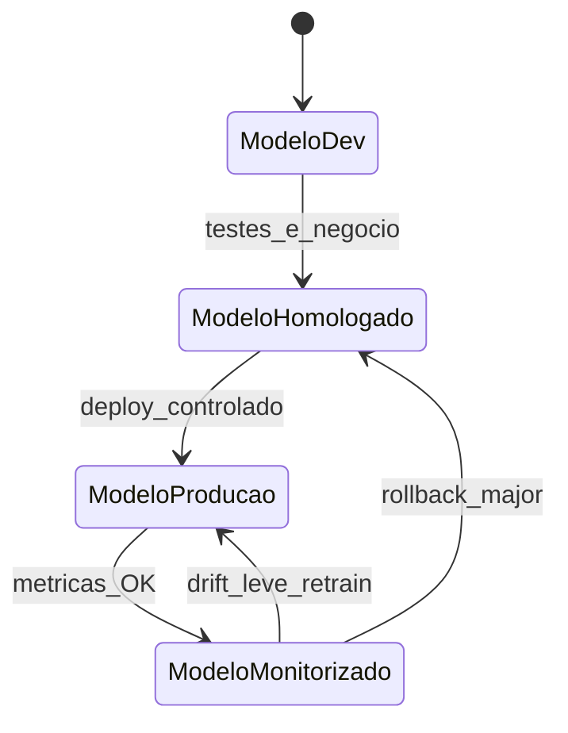

# Otimização introdutória, *MLOps lite* e governança — do «arranja-me a rota» ao modelo que não pode fugir

**Otimização** em *supply chain* formula **objetivo** (custo, tempo, serviço) e **restrições** (capacidade, frota, janelas) — *solver* industrial é produto caro; aqui fica a **linguagem de problema** e o **encaixe** com ML. ***MLOps lite*** significa **versionar** dados e modelo, **monitorizar** *drift* e ter **caminho** de *rollback* — ponte prática à [governança de IA estratégica](../../trilha-logistica-estrategica/modulo-04-logistica-4-0/aula-03-ia-casos-uso-governanca-risco.md).

---

## Objetivos e resultado de aprendizagem

**Ao final desta aula**, você será capaz de:

- Escrever **objetivo** e **restrições** para um problema de roteiro ou alocação em **frases** (sem solver).  
- Descrever estados de **ciclo de vida** do modelo (*dev* → homologado → produção → monitorizado).  
- Nomear **sinais** de *drift* e ação de *rollback*.

**Duração sugerida:** 60–75 minutos.

---

## Gancho — a TechLar e o «otimizador» que cortou o cliente errado

Um *prototype* de **otimização** de entregas da **TechLar** **minimizou** km **sem** restrição de **janela B2B** com multa contratual — o algoritmo **adiou** um *key account* «porque matematicamente dava jeito». Só uma **restrição** explícita de **prioridade** ou **penalidade** de atraso corrigiu o comportamento. **Objetivo** sem **regras de negócio** é **homicídio** de relacionamento.

**Analogia do GPS só por distância:** ignora **estrada fechada** e **prioridade de ambulância** — precisa de **restrições**.

---

## Mapa do conteúdo

- Função objetivo, variáveis de decisão, restrições (vocabulário).  
- *Heurística* *versus* optimalidade (*trade-off* tempo *versus* qualidade).  
- *MLOps lite*: *hash* de dados, versão de modelo, *dashboard* de métrica.  
- *Rollback* quando métrica sai do intervalo.

---

## Conceito núcleo

**Exemplo verbal de VRP simplificado:** «Minimizar **tempo total** de rota sujeito a **capacidade** do veículo e **janelas** de entrega.» — *Vehicle Routing Problem* é família clássica (*literatura OR*).

**MLOps lite (*consenso de mercado*):**

- Registar **versão** do *dataset* e do modelo.  
- **Testes** de *smoke* antes de *deploy*.  
- **Monitor** de métrica de negócio e de dados de entrada.  
- **Plano** de volta à versão anterior.

**Legenda:** estados = **postura** do artefacto; transições são **decisões** de *release*.

**Mini-caso:** *drift* pós-pandemia ou mudança de **mix** de canal — distribuição de *features* muda; modelo antigo **degrada**; *retrain* com **janela** recente.

---

## Trade-offs

- **Optimalidade** *versus* **tempo** de cálculo em operação diária.  
- **Modelo único** *versus* **modelos** por região (manutenção).  
- **Automatizar decisão** *versus* **assistir** (*política* de risco).

---

## Aplicação — exercício

Escreva **três** frases: (1) objetivo de otimização para alocação de pedidos a CDs; (2) **duas** restrições de negócio; (3) **um** indicador que dispararia *rollback* do modelo em produção.

**Gabarito pedagógico:** restrições devem ser **negócio** (capacidade, prioridade cliente, produto perigoso); *rollback* deve ser **mensurável** (ex.: OTIF previsto *versus* real fora de banda por N dias).

---

## Erros comuns e armadilhas

- Otimizar **subproblema** (km) e **piorar** custo total ou serviço.  
- *Deploy* sem **linha de base** operacional.  
- *Retrain* automático **sem** validação humana em domínio regulado.  
- Confundir **demo** de *solver* com **produção** integrada a WMS/TMS.

---

## KPIs e decisão

- **Gap** *versus* solução manual ou *baseline* heurística.  
- **Tempo** de CPU / licença de *solver*.  
- **Incumprimento** de restrições «moles» (multas).  
- **Uptime** do serviço de predição.

---

## Fechamento — três takeaways

1. Otimização sem **restrição** de negócio é **armamento** descontrolado.  
2. *MLOps lite* é **higiene** — evita «modelo fantasma» em produção.  
3. Estratégia (IA) e implementação (esta trilha) **conversam** por métricas e *rollback*.

**Pergunta de reflexão:** tens **número** que mandaria parar o modelo **hoje**?

---

## Referências

1. TOTH, P.; VIGO, D. (eds.) *Vehicle Routing: Problems, Methods, and Applications* — SIAM (*OR*).  
2. Google *Rules of ML* / *People + AI Guidebook* — boas práticas de produto (*tipo de fonte*).  
3. EU *AI Act* / ISO/IEC 42001 — **quadros** de governança (*consultar versão vigente*).

**Ponte:** [Governança de IA estratégica](../../trilha-logistica-estrategica/modulo-04-logistica-4-0/aula-03-ia-casos-uso-governanca-risco.md).
