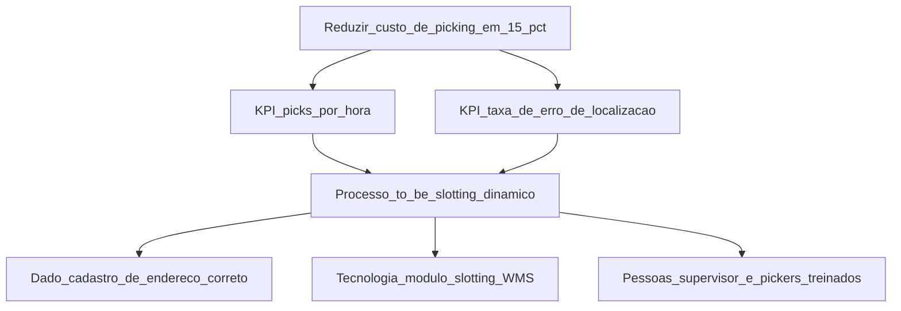
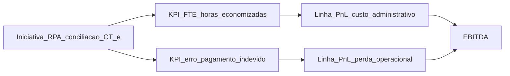
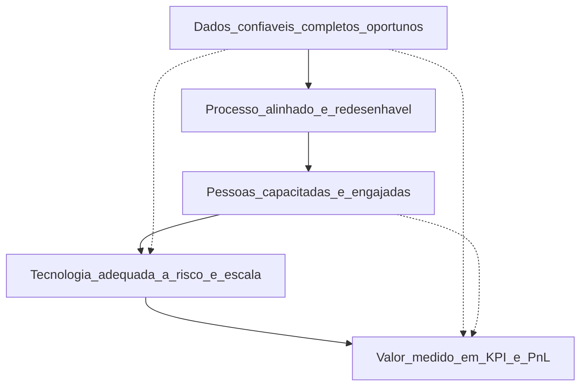
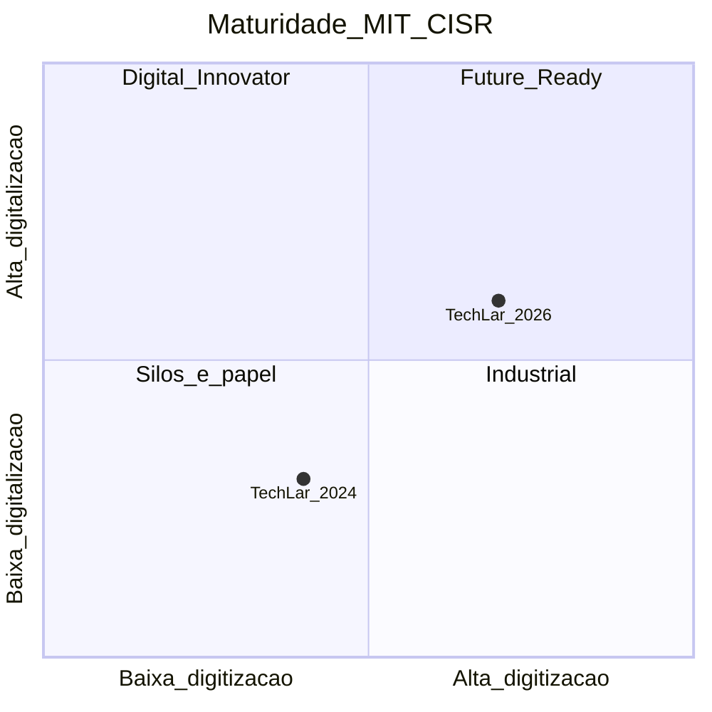
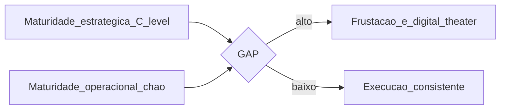

# Valor na cadeia, pilares e maturidade operacional — digital que paga conta, não só *slide*

**Transformação digital** na *supply chain* só **vale** se mover **valor**: menos custo, mais serviço, menos risco, melhor capital de giro — **mensurável** em P&L. **Pilares** habituais (*consenso de mercado*): **dados** confiáveis, **processos** estáveis ou redesenhados, **pessoas** com competências e **tecnologia** alinhada. **Maturidade operacional** (o que o chão consegue **usar todos os dias**) complementa a [maturidade estratégica](../../trilha-logistica-estrategica/modulo-04-logistica-4-0/aula-01-maturidade-digital-supply-chain.md) — pode haver **estratégia** madura com **operação** ainda em Excel manual.

Esta aula consolida **5 modelos canónicos de maturidade** (DCM ASCM, DCMM CSCMP/Gartner, MIT/CISR, McKinsey IDX, Deloitte DSCM), o **value tree** que liga iniciativa digital a **EBITDA**, e ferramenta prática (auto-avaliação H/M/L por pilar). Foco em **caso BR PME → médio porte** com restrições de orçamento e equipa.

---

## Objetivos e resultado de aprendizagem

- Definir **valor digital** com métrica de negócio (EBITDA tree).
- Articular **4 pilares** (dados, processo, pessoas, tecnologia) e dependências.
- Conhecer **5 modelos de maturidade**: DCM, DCMM, MIT/CISR, McKinsey IDX, Deloitte DSCM.
- Diagnosticar **gap** entre maturidade **estratégica** e **operacional**.
- Aplicar **value tree** para conectar iniciativa → KPI → EBITDA.
- Identificar **anti-padrões**: *tool-first*, *dashboard-first*, *AI-first sem dado*.
- Entender **arquetipos de empresa BR**: PME tradicional, médio em transformação, grande digital-native.

**Duração sugerida:** 75–90 min. **Pré-requisitos:** Aulas 1.1–3.3 (entender o leque técnico).

---

## Mapa do conteúdo

1. O que é "valor" em transformação digital — *value tree*.
2. Os 4 pilares (D-P-P-T) e como se sustentam mutuamente.
3. Modelos de maturidade: DCM, DCMM, MIT/CISR, McKinsey IDX, Deloitte DSCM.
4. Maturidade estratégica × operacional — o gap mais comum.
5. Auto-avaliação rápida (H/M/L por pilar).
6. Arquetipos de empresa BR.
7. Anti-padrões: *tool-first*, *AI sem dado*, *digital theater*.

---

## Gancho — a TechLar e o *dashboard* que ninguém abre

A **TechLar** lançou painel "*end-to-end*" patrocinado pelo CEO. Beleza em demo no auditório; **6 meses** depois, o CD ainda usava planilha para *slotting* porque o **cadastro de endereço** estava errado em **22%** dos SKUs e **ninguém tinha dono**. O valor não estava no gráfico — estava no **dado** e no **processo** ao redor. ROI estimado do painel: **negativo R$ 480 000**.

**Diagnóstico TechLar com value tree:**

**Lição:** sem **D1** (cadastro correto), **T1** vira *shelfware*; sem **H1**, ninguém adota. O painel atacou só K1/K2 (visualização), nada na base. Depois de 6 meses arrumando D1 e P1, painel passou a ter **7 logins/dia** vs. 1 antes.

**Analogia do ginásio:** cartão anual ≠ músculos — uso e disciplina são o pilar escondido.

**Analogia da casa nova:** comprar mobília antes da estrutura é **digital theater** — bonito, instável.

---

## Conceito-núcleo — value tree (do KPI ao R$)

Toda iniciativa digital deve ter **rastro até EBITDA**. Sem isso é "investimento de fé".

### Pilares logísticos onde valor "mora"

| Alavanca de valor | Métrica típica | Iniciativa digital típica |
|---|---|---|
| **Custo total servir** | R$/pedido, R$/CT-e | RPA conciliação, IDP fatura |
| **Custo de inventário** | giro, dias estoque, obsoleto | ML demanda + safety stock dinâmico |
| **OTIF / NPS B2B** | % entregas perfeitas | classificação risco, torre controle |
| **Custo de transporte** | R$/km, R$/kg, taxa ocupação | OR-Tools VRP, otimização frota |
| **Capital de giro** | dias contas pagar/receber/estoque | automação fiscal, ML *demand sensing* |
| **Risco operacional** | incidentes, multas, perdas | anomaly detection, monitoring |
| **Adoção de tecnologia** | usuários ativos, transações no canal | mudança cultural (Aula 4.3) |

---

## Diagrama / Arquitetura — pilares D-P-P-T

**Legenda:** linha contínua = dependência principal. Linhas tracejadas = atalhos perigosos: empresa que vai direto Dados → Tecnologia (sem processo nem pessoas) acaba com **lakehouse caro vazio**.

### Tabela de auto-avaliação H/M/L

| Pilar | Pergunta diagnóstica | Alto | Médio | Baixo |
|---|---|---|---|---|
| **Dados** | Que % dos campos críticos (lead time, peso, dimensões) estão corretos? | > 95% | 80–95% | < 80% |
| | Existe MDM (Master Data Management)? | Sim, governado | Parcial | Não |
| | Dado é versionado? | Sim, lineage | Parcial | Não |
| **Processo** | Top-10 processos têm SOP atualizado? | Sim | Parcial | Não |
| | Há *process mining* ou medição? | Sim | Pontual | Não |
| | Capacidade de redesenho rápido? | Sim, com Lean | Esporádico | Não |
| **Pessoas** | Equipa tem competência digital base? | > 70% | 30–70% | < 30% |
| | Há *citizen developers* ativos com governance? | Sim | Embrionário | Não |
| | Plano de carreira para roles emergentes (DataOps, ML Eng)? | Sim | Em construção | Não |
| **Tecnologia** | ERP/WMS/TMS têm API estável? | Sim, todos | Maioria | Mínimo |
| | Plataforma de dados moderna (lakehouse)? | Sim | Em construção | Apenas BI legado |
| | Modelos em produção com MLOps? | Sim | Pilotos | Nenhum |

**Score global:** > 75% Alto = **Líder**; 50–75% = **Em transformação**; < 50% = **Tradicional / inicial**.

---

## Aprofundamentos — modelos canónicos de maturidade

### 1. ASCM/CSCMP — *Digital Capabilities Model* (DCM)

5 níveis × 5 dimensões (Plan, Source, Make, Deliver, Enable). Ênfase em **capabilidades funcionais**.

### 2. CSCMP/Gartner — *Digital Supply Chain Maturity Model* (DCMM)

5 estágios:

| Estágio | Foco | Exemplo |
|---|---|---|
| 1 — Reactive | apaga incêndio | planilhas, Excel macro |
| 2 — Anticipatory | algum forecast | BI, S&OP mensal |
| 3 — Integrated | integração entre funções | MDM, planejamento integrado |
| 4 — Collaborative | parceiros e clientes | CPFR, control tower |
| 5 — Orchestrated | autônomo, IA | self-healing, agentes IA |

### 3. MIT/CISR — *Digital Transformation Maturity*

2 dimensões: **digitização** (eficiência interna) e **digitalização** (modelo negócio). 4 quadrantes:

### 4. McKinsey — *Industrial Digital Index* (IDX)

Foco em manufatura/operação, 8 dimensões (lean digital, advanced analytics, automation, etc.).

### 5. Deloitte — *Digital Supply Chain Maturity*

5 níveis × 6 capabilities (visibility, automation, analytics, etc.).

### Síntese pragmática

Para PME BR, **DCMM** é o mais usável. Evitar comprar consultoria de modelo proprietário só para reposicionar — o mapa é menos importante que **fechar gaps mensuráveis**.

---

## Aprofundamentos — gap estratégico × operacional

**Sintomas de gap alto:**

- Diretoria vende caso de "AI-driven supply chain" em conferência; analista usa Excel.
- *Roadmap* tem 50 iniciativas; entregue zero MVP.
- Ferramentas compradas (Manhattan, Coupa, Llamasoft) **subutilizadas** (< 30% das features).
- Modelo de IA com ROI projetado em PowerPoint, não medido em P&L.

**Causas comuns:**

1. **Falta MDM** — dado bom é pré-requisito.
2. **Sem processo redesenhado** — automatiza-se chaos.
3. **Pessoas sem capacitação** — adoção fracassa.
4. **TI/negócio desalinhados** — TI entrega ferramenta, negócio não usa.
5. **Sponsor ausente após go-live** — prioridade muda no Q seguinte.

---

## Aprofundamentos — arquetipos BR

### Arquétipo A: PME tradicional (faturação < R$ 100M)
- ERP TOTVS Protheus / SAP B1; sem WMS dedicado.
- BI: Power BI; analytics: Excel.
- TI 1–3 pessoas; sem CoE.
- **Quick wins**: RPA conciliação CT-e, Power Automate aprovações, Power BI consolidado.
- **Evitar**: lakehouse, AI/ML enterprise.

### Arquétipo B: Médio em transformação (R$ 100M–R$ 1B)
- ERP SAP ECC ou TOTVS Datasul; WMS WiseTec/Manhattan; TMS dedicado.
- BI corporativo; primeiros pilotos ML.
- TI 5–20; CoE RPA embrionário.
- **Quick wins**: IDP fatura, ML demanda top-100 SKU, MLOps com MLflow.
- **Caminho**: lakehouse com Databricks/Snowflake, CoE IA.

### Arquétipo C: Grande corporação / digital-native (> R$ 1B)
- ERP S/4HANA; OMS, WMS, TMS multi-site; cloud-native.
- Lakehouse Databricks/Snowflake; ML em produção.
- Equipas dedicadas: DataOps, MLOps, ML Eng, AI Governance.
- **Foco**: agentes IA, control tower em tempo real, EU AI Act compliance, ISO 42001.

---

## Trade-offs e decisão

| Trade-off | A | B | Quando A | Quando B |
|---|---|---|---|---|
| Investir em MDM (dado) vs *quick win* visível | MDM | Quick win | Setor regulado, longo prazo | CEO precisa win em 90d |
| Padronizar global vs adaptar local | Global | Local | Operação > 5 países | Realidade muito diferente |
| Buy (Manhattan, Coupa, Llamasoft) vs build | Buy | Build | Time-to-value > controle | Diferencial competitivo, equipa |
| Consultoria estrutural vs equipa interna | Consultoria | Interna | Sem competência | Volume contínuo |
| Big bang vs ondas | Ondas | Big bang | Risco médio (default) | Burning platform |
| Transparência total vs política | Transparência | Diplomacia | Cultura aberta | Estágio inicial |

---

## Caso prático — TechLar matriz de iniciativas

| Iniciativa | Pilar dominante | Maturidade exigida | Score H/M/L | Ação |
|---|---|---|---|---|
| MDM cadastro material | Dados | Médio | M | **Prioridade 1** — base de tudo |
| RPA conciliação CT-e | Tecnologia + Processo | Baixo | M | Quick win G1 |
| ML demanda top-50 | Dados + Tecnologia | Médio | M | G2, depende de MDM |
| Lakehouse Databricks | Tecnologia | Alto | L | **Adiar** até MDM e ML maduros |
| Treinamento Power BI 200 pessoas | Pessoas | Baixo | H já | Continuar |
| Agente LLM atendimento B2B | Pessoas + Tecnologia + Dados | Alto | L | **Não fazer agora** |

---

## Erros comuns e armadilhas

- **ROI inventado** com baseline inexistente.
- Confundir **digitalização** (PDF, painel) com **transformação** (capacidade nova).
- Ignorar **sindicato** ou acordo coletivo em mudança de função.
- Métrica só de **TI** (uptime) sem **negócio**.
- ***Tool-first*** — comprar SAP IBP / Llamasoft / Manhattan antes de mapear processo.
- ***Dashboard-first*** — cor antes de dado.
- ***AI-first*** sem dado limpo — modelo sem chão.
- **Maturidade comprada** com consultoria sem mudança real.
- **Iniciativa órfã** — sponsor sai, projeto morre.
- **Big bang** sem capacidade de absorção (próxima aula).

---

## Segurança, ética e governança

| Tema | Aplicação |
|---|---|
| **Inventário de IA/automação** | Lista viva de tudo em produção (CoE owns) |
| **AI Risk Register** | Cada modelo classificado pelo EU AI Act |
| **Comitê de governança digital** | TI + Negócio + Compliance + DPO + RH |
| **Política de uso de IA generativa** | Quem pode usar GPT/Claude com dado corporativo? |
| **Aderência LGPD/ANPD** | DPIA por iniciativa que toca dado pessoal |
| **Sindicato / mudança de função** | Diálogo cedo, plano de re-skilling |

---

## KPIs

| KPI | Pergunta | Dono | Fonte | Cadência | Playbook |
|---|---|---|---|---|---|
| **EBITDA atribuído a digital** | Quanto a transformação contribuiu? | CFO + CDO | Benefits realization | Trimestral | Auditar atribuição |
| **% iniciativas com baseline + meta** | Disciplina financeira? | PMO | Portfolio | Mensal | Bloquear sem baseline |
| **Maturidade digital (DCMM)** | Avançamos? | CDO | Auto-avaliação anual | Anual | Plano por dimensão |
| **% transações digitais** | Adoção real? | COO | Sistemas | Mensal | Ver Aula 4.3 |
| **Score qualidade dado top-20 campos** | MDM funciona? | Master Data Owner | Profiling | Mensal | Plano correção |
| **Cobertura SOP top-30 processos** | Processo documentado? | COO | PMO | Trimestral | Workshop |
| **% colaboradores com competência digital base** | Pessoas no jogo? | RH | Survey + LMS | Anual | Treinamento |
| **Iniciativas órfãs** | Sem owner? | PMO | Portfolio | Trimestral | Encerrar ou re-sponsor |

---

## Tecnologias e ferramentas

| Categoria | Ferramentas |
|---|---|
| **Maturity assessment** | Templates DCMM (CSCMP/Gartner), DCM (ASCM), McKinsey IDX, Deloitte |
| **MDM** | Informatica MDM, Stibo, SAP Master Data Governance, Profisee, Reltio |
| **Process mining** | Celonis, UiPath Process Mining, Microsoft Process Insights, ABBYY Timeline |
| **BI** | Power BI, Tableau, Looker, Qlik, Metabase |
| **Data quality** | Great Expectations, Soda, Monte Carlo, Bigeye, Anomalo |
| **Lakehouse** | Databricks, Snowflake, Microsoft Fabric, Google BigQuery + Dataform |
| **Portfolio mgmt** | ServiceNow SPM, Planview, Microsoft Project, Jira Plans |
| **OKR / strategy** | Workboard, Quantive (ex-Gtmhub), 15Five |

---

## Glossário rápido

- **DCMM**: Digital Capabilities Maturity Model.
- **MDM**: Master Data Management.
- **Value tree**: árvore que liga iniciativa a EBITDA via KPI.
- **EBITDA**: Earnings Before Interest, Taxes, Depreciation, Amortization.
- **Lakehouse**: arquitetura unificando data lake e data warehouse.
- **Citizen developer**: usuário de negócio que constrói automação low-code.
- **Process mining**: análise de logs para descobrir como processos rodam.
- **Tool-first**: anti-padrão — escolher ferramenta antes do problema.
- **Digital theater**: aparência de transformação sem mudança real.

---

## Aplicação — exercícios

**Ex.1 — Value tree.** Para "redução de 10% no custo de last-mile", desenhe árvore com KPI intermediário, alavanca digital e linha de P&L.

**Ex.2 — Auto-avaliação.** Para uma iniciativa real ou fictícia, atribua H/M/L em cada pilar e identifique a **lacuna principal**.

**Ex.3 — Gap.** Liste 3 sintomas de gap entre maturidade estratégica e operacional.

**Ex.4 — Arquétipo.** Para uma empresa de R$ 250M faturação, 3 CDs, ERP TOTVS, sem MDM: que arquétipo? Quais 3 quick wins recomendar?

**Ex.5 — Anti-padrão.** Identifique o anti-padrão em: "vamos comprar Llamasoft por R$ 8M para otimizar S&OP em 2027".

**Gabarito pedagógico:**

- **Ex.1**: deve aparecer KPIs como `R$/km`, `taxa ocupação veículo`, `OTIF`; alavanca como OR-Tools/torre controle; linha P&L `custo logístico`.
- **Ex.2**: lacuna deve ser **específica** ("cadastro de lead time" > "dados maus").
- **Ex.3**: sponsor ausente, ferramenta subutilizada, ROI em PowerPoint sem medição.
- **Ex.4**: Arquétipo B (médio em transformação). Quick wins: MDM material top-50, RPA CT-e, Power BI integrado.
- **Ex.5**: tool-first sem maturidade. Antes: MDM, processo S&OP rodando manual em Excel disciplinado, equipa com base estatística.

---

## Pergunta de reflexão

Qual pilar (D-P-P-T) da tua **última iniciativa** foi **mentira** na prática? Se MDM fosse pré-requisito gate **mandatório**, quantas iniciativas em curso seriam suspensas?

---

## Fechamento — takeaways

1. **Valor sem número** é marketing interno.
2. **Dados ruins** geram **painéis bonitos** e **decisões feias**.
3. **Estratégia e operação podem divergir** — fechar o gap é trabalho de gestão.
4. **DCMM/DCM** servem como mapa; o que conta é fechar gaps.
5. ***Tool-first / Dashboard-first / AI-first* sem dado** é digital theater.
6. **Arquétipo BR** orienta o que **não** fazer agora — disciplina de portfolio.
7. **MDM é fundação** — sem ele, ML é roleta.

---

## Referências

1. **WESTERMAN, G. et al.** *Leading Digital* — Harvard Business Press.
2. **WESTERMAN, G.; BONNET, D.; McAFEE, A.** *The Nine Elements of Digital Transformation*.
3. **MIT CISR** — *Digital Transformation Roadmap* — [cisr.mit.edu](https://cisr.mit.edu/).
4. **CSCMP / Gartner** — *Digital Supply Chain Maturity Model*.
5. **ASCM** — *Digital Capabilities Model* (DCM) — [ascm.org](https://www.ascm.org/).
6. **McKinsey** — *Digital industrial transformation* (anual).
7. **Deloitte** — *Digital Supply Networks*.
8. **Gartner** — *Hype Cycle for Supply Chain* (anual).
9. **DAMA-DMBOK** — Master Data Management.
10. **CSCMP** *State of Logistics Report* — benchmarks anuais.
11. **ILOS** / **ABRALOG** — pesquisas BR de maturidade logística.

---

## Pontes para outras trilhas

- [Logística 4.0 — Maturidade digital](../../trilha-logistica-estrategica/modulo-04-logistica-4-0/aula-01-maturidade-digital-supply-chain.md).
- [Aula 4.2 — Roadmap, portfólio e quick wins](aula-02-roadmap-portfolio-quick-wins.md).
- [Aula 4.3 — Mudança cultural e KPIs de adoção](aula-03-mudanca-cultural-kpis-adocao.md).
- [Aula 3.3 — MLOps e governança IA](../modulo-03-ai-aplicada-supply-chain/aula-03-otimizacao-intro-mlops-lite-governanca.md).
- [Indicadores logísticos](../../trilha-dados-analytics-logistica/modulo-04-indicadores-logisticos-kpis/README.md).
