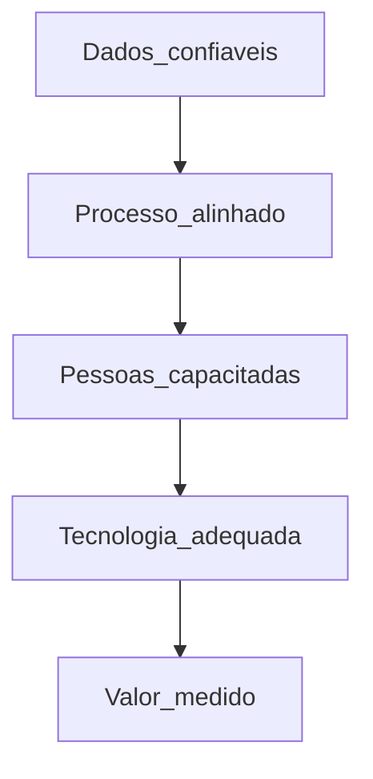

# Valor na cadeia, pilares e maturidade operacional — digital que paga conta, não só *slide*

**Transformação digital** na *supply chain* só **vale** se mover **valor**: menos custo, mais serviço, menos risco ou melhor capital — mensurável. **Pilares** habituais (*consenso de mercado*): **dados** confiáveis, **processos** estáveis ou melhorados, **pessoas** com competências e **tecnologia** alinhada. **Maturidade operacional** (o que o chão consegue **usar** todos os dias) complementa a [maturidade estratégica](../../trilha-logistica-estrategica/modulo-04-logistica-4-0/aula-01-maturidade-digital-supply-chain.md) — pode haver **estratégia** madura com **operação** ainda a apanhar *Excel*.

---

## Objetivos e resultado de aprendizagem

**Ao final desta aula**, você será capaz de:

- Definir **valor** em digitalização com **métrica** de negócio.  
- Articular **quatro** pilares e dependências entre eles.  
- Diagnosticar **gap** entre discurso estratégico e uso real no CD/transporte.

**Duração sugerida:** 60–75 minutos.

---

## Gancho — a TechLar e o *dashboard* que ninguém abre

A **TechLar** lançou **painel** «*end-to-end*» patrocinado pelo CEO. **Beleza** em demo; **seis meses** depois, o CD ainda usava **planilha** para *slotting* porque **cadastro** de endereço estava **errado** e **ninguém** tinha dono. O valor **não** estava no gráfico — estava no **dado** e no **processo** em volta.

**Analogia do ginásio:** cartão anual comprado ≠ **músculos** — uso e **disciplina** são o pilar escondido.

---

## Mapa do conteúdo

- *Value stream* digital: do pedido ao cash com **dados** e decisões.  
- Pilares: dados, processo, pessoas, tecnologia.  
- Maturidade **operacional** *versus* **estratégica**.  
- Anti-padrão: *tool-first*.

---

## Conceito núcleo

**Valor (pedagógico):** mudança mensurável em **KPI** acordado (OTIF, inventário, custo de conciliação, lead time) **atribuível** (mesmo que parcialmente) à iniciativa digital.

**Pilares:**

| Pilar | Pergunta-chave |
|-------|----------------|
| Dados | O campo X é **verdade** em quantos % dos casos? |
| Processo | O passo Y ainda é **necessário** ou herdado? |
| Pessoas | Quem **perde** tempo e quem **ganha** poder com a mudança? |
| Tecnologia | A solução é **adequada** ao risco e à escala? |

**Legenda:** setas = **dependência** típica; saltar pilares gera **piloto eterno**.

**Mini-caso:** RPA sem **processo** — automatiza **erro** 10 000 vezes por dia até alguém parar o robô.

---

## Trade-offs

- **Investir** em MDM *versus* *quick win* visível ao CEO.  
- **Padronizar** globalmente *versus* **adaptar** a realidade local.  
- **Transparência** de dados *versus* **política** entre áreas.

---

## Aplicação — exercício

Para **uma** iniciativa digital (real ou fictícia), avalie **H/M/L** em cada pilar e escreva **uma** lacuna principal que impede valor hoje.

**Gabarito pedagógico:** lacuna deve ser **específica** («cadastro de lead time» melhor que «dados maus»); se todos os pilares «Altos» sem evidência, rever.

---

## Erros comuns e armadilhas

- **ROI** inventado com **baseline** inexistente.  
- Confundir **digitalização** (PDF) com **transformação**.  
- Ignorar **sindicato** ou acordo de trabalho em mudança de função.  
- Métrica só de **TI** (uptime) sem **negócio**.

---

## KPIs e decisão

- **KPI de negócio** antes/depois (mesma definição).  
- **% transações** com dados completos.  
- **NPS** interno ou *survey* pós-go-live (*opcional*).  
- **Custo total** do projeto *versus* benefício anualizado.

---

## Fechamento — três takeaways

1. Valor sem **número** é marketing interno.  
2. Dados ruins fazem **painéis bonitos** e decisões **feias**.  
3. Estratégia e operação de maturidade **podem** divergir — fechar o *gap* é trabalho de gestão.

**Pergunta de reflexão:** qual pilar da tua última iniciativa foi **mentira** na prática?

---

## Referências

1. WESTERMAN, G. et al. *Leading Digital* — Harvard Business Press.  
2. McKINSEY / BCG / Deloitte — relatórios sobre *digital supply chain* (*tipo de fonte*; usar com espírito crítico).  
3. ASCM — *digital transformation* — [ascm.org](https://www.ascm.org/).

**Ponte:** [Maturidade digital estratégica](../../trilha-logistica-estrategica/modulo-04-logistica-4-0/aula-01-maturidade-digital-supply-chain.md).
