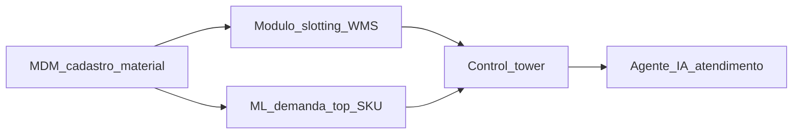
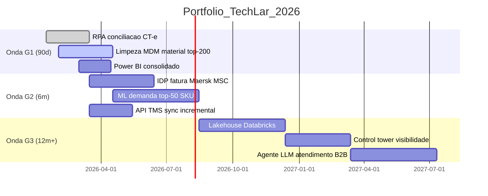
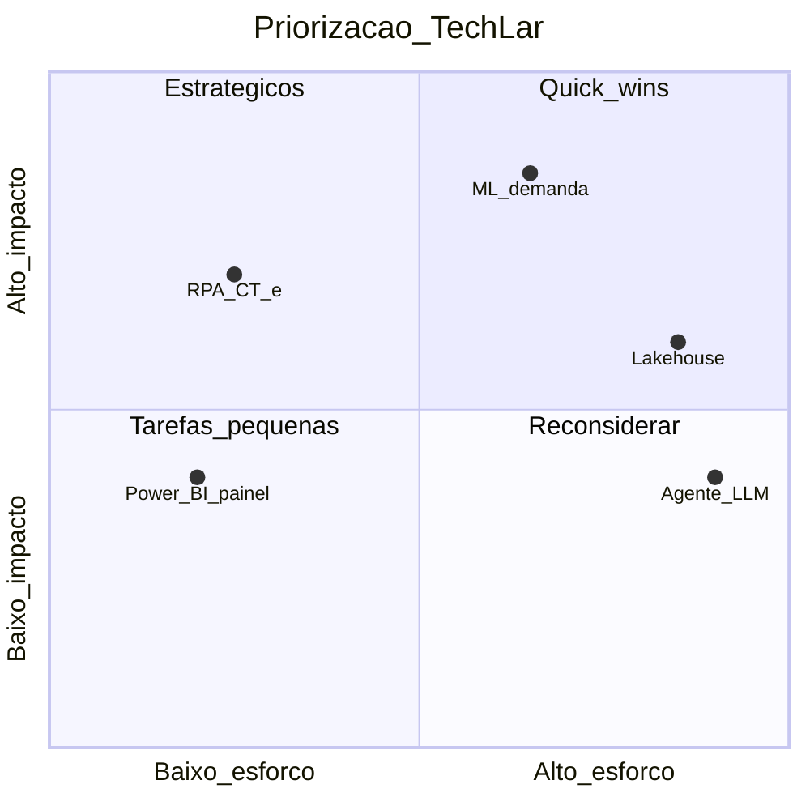
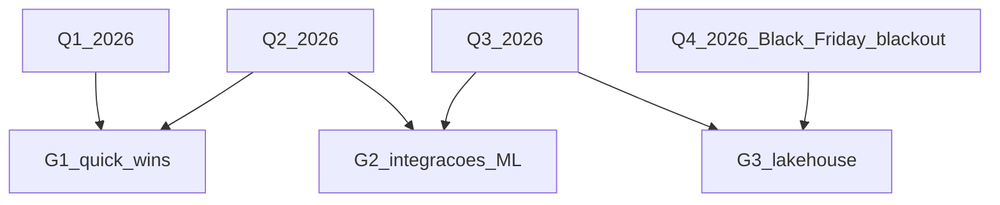

# *Roadmap*, portfólio e *quick wins* — ondas que não afogam a operação

***Roadmap* digital** organiza **iniciativas** no tempo com **dependências**, **capacidade** de mudança e **patrocínio** explícito. **Portfólio** evita 50 projetos meio-verdes; ***quick wins*** geram **prova** e **confiança** — desde que **não quebrem** integridade de dados ou segurança por **pressa**. Esta aula entrega ferramentas práticas: matriz **impacto × esforço**, **MoSCoW**, ***RICE***, **Buy a Feature**, *gates* G1/G2/G3 com critérios de saída, **kill criteria**, **OKRs** e **benefits tracking**.

A regra de ouro: ***roadmap* sem capacidade de absorção é agenda de PowerPoint**. *Roadmap* sem **kill criteria** vira museu de projetos zombie.

---

## Objetivos e resultado de aprendizagem

- Construir **portfolio matrix** com **impacto × esforço** para 10–30 iniciativas.
- Aplicar **RICE** (Reach × Impact × Confidence ÷ Effort) para priorização quantitativa.
- Definir **ondas G1/G2/G3** com *gates* e critérios de saída claros.
- Estabelecer **critérios de quick win** (≤ 90 dias, dono, métrica, risco baixo).
- Estabelecer **kill criteria** para parar iniciativas zombie.
- Conectar *roadmap* a **OKRs** e *benefits tracking* (realização efetiva).
- Aplicar metodologia **Buy a Feature** para alinhamento com sponsors.

**Duração sugerida:** 75–90 min. **Pré-requisitos:** [Aula 4.1](aula-01-valor-cadeia-pilares-madurez-operacional.md).

---

## Mapa do conteúdo

1. Princípios: capacidade de absorção, *patrocínio*, sequenciamento.
2. Matrizes de priorização: 2×2 impacto×esforço, MoSCoW, RICE, WSJF.
3. Ondas G1/G2/G3 com critérios de entrada/saída.
4. Quick wins — definição operacional.
5. Portfolio governance — *kill criteria* e *gates*.
6. OKRs e *benefits tracking*.
7. Buy a Feature workshop com sponsors.
8. Riscos: sazonalidade, dependência, multa por *late entry*.

---

## Gancho — a TechLar e as ondas sobrepostas

A **TechLar** lançou **WMS**, **TMS** e **RPA de faturação** **no mesmo trimestre Q3 2025** — alvo: "modernizar antes do Black Friday". Mesma equipa de master data, mesma TI, mesma chefia de transportes.

**Resultados:**

| Iniciativa | Status pós-Q3 |
|---|---|
| WMS | go-live com 38% de pickers ainda em papel; OTIF caiu de 92% para 76% |
| TMS | atrasado 4 meses, dependência do master data do WMS |
| RPA faturação | em hypercare estendido, 22% de exceções não previstas |
| Multa SLA cliente top-3 | R$ 1,8 milhão |

**Causa-raiz:**

1. **Sem capacidade de absorção** — mesma equipa em 3 frentes.
2. **Dependências ignoradas** (TMS espera dado do WMS).
3. **Sem *gates* de saída** — todos avançaram em paralelo.
4. **Sazonalidade ignorada** — Q3 é pré-Black Friday (não muda nada).
5. **Sem *kill criteria*** — quando WMS atrasou, ninguém parou TMS.

**Lições aplicadas em Q1 2026:**

- **Ondas explícitas** com aprovação por *gate*.
- **Capacidade declarada** por equipa-chave (master data, TI, op transportes) em pessoas-mês.
- ***Kill criteria*** assinados por sponsor.
- **Calendário de blackout** (Black Friday, Natal, dezembro fechamento) para go-lives.

**Analogia de obras em casa:** cozinha e casa de banho ao mesmo tempo — **sem água** para ninguém.

**Analogia da maratona:** correr 3 ao mesmo tempo só dá lesão, não medalha.

---

## Conceito-núcleo — princípios de portfolio

### 1. Capacidade de absorção (não de TI, mas do negócio)

A capacidade não é "quantos devs temos" — é **quantos go-lives a operação aguenta sem quebrar SLA**. Em logística:

| Recurso | Capacidade típica anual (PME → médio) |
|---|---|
| Master data team | 3–6 iniciativas significativas/ano |
| Operações WMS (gerente CD) | 1 *go-live* sistema crítico/ano |
| TI integração | 8–12 integrações/ano |
| Treinamento de força (200+ pessoas) | 1 grande mudança a cada 6 meses |
| CFO/Compliance approval | 4–6 grandes/ano |

### 2. Patrocínio explícito

Cada iniciativa precisa de:

- **Sponsor executivo** (C-level ou diretor) com nome.
- **Process owner** (gerente operacional) com tempo dedicado.
- **Tech lead** (TI / CoE).
- **Decision rights** explícitos (RACI).

Sem sponsor, **arquive a iniciativa** — não morra ela morrer no Q seguinte.

### 3. Sequenciamento por dependência

**Tentar agente IA antes de MDM = zombie garantido.**

---

## Diagrama / Arquitetura — portfólio em ondas

### Critérios de entrada/saída por *gate*

| Gate | Entrada (start ondinha) | Saída (próxima ondinha pode começar) |
|---|---|---|
| **G1 → G2** | Quick win com baseline + meta + sponsor | Métrica realizada > 80% da meta; processo documentado; sem incidente sev-1 |
| **G2 → G3** | Integração estável; pessoa treinada | Adoção > 60% dos usuários-alvo; ROI parcial demonstrado |
| **G3 →** | MLOps maduro; data lakehouse populado | KPI estratégico movido; auditoria sem NC crítica |

---

## Aprofundamentos — métodos de priorização

### 1. Matriz 2×2 impacto × esforço

### 2. RICE (Reach × Impact × Confidence ÷ Effort)

| Iniciativa | Reach (pessoas/mês) | Impact (1-3) | Confidence (0-1) | Effort (pessoa-meses) | RICE |
|---|---|---|---|---|---|
| RPA CT-e | 200 (controllers) | 2 | 0.9 | 3 | 120 |
| ML demanda top-50 | 500 (impacto estoque) | 3 | 0.6 | 8 | 113 |
| Lakehouse | 2000 (ind) | 3 | 0.5 | 24 | 125 |
| Agente LLM | 300 | 2 | 0.3 | 12 | 15 |

**Fórmula:** $\text{RICE} = \frac{R \times I \times C}{E}$. Score alto → priorizar.

### 3. WSJF — *Weighted Shortest Job First* (SAFe)

$$\text{WSJF} = \frac{\text{Cost of Delay}}{\text{Job Size}}$$

`Cost of Delay = User Value + Time Criticality + Risk Reduction / Opportunity`. Bom para portfólio com forte componente regulatório (cumprimento prazo legal = TC alto).

### 4. MoSCoW

- **Must** — sem isso, falha.
- **Should** — importante, não crítico.
- **Could** — nice to have.
- **Won't** (this time) — explicitamente fora.

### 5. Buy a Feature (workshop com sponsors)

Cada sponsor recebe "moedas" virtuais e "compra" features de uma lista. Força priorização forçada com restrição de orçamento. Excelente para alinhar **C-level**.

### Comparativo

| Método | Quando usar | Limitação |
|---|---|---|
| 2×2 impacto×esforço | Visão rápida, comunicação | Subjetivo |
| RICE | Equipa madura quantitativa | Confidence é chute |
| WSJF | SAFe, escala ágil | Cost of Delay difícil estimar |
| MoSCoW | Negociação com cliente/sponsor | Tudo vira "Must" |
| Buy a Feature | Workshop alinhamento | Tempo, requer sponsors juntos |

---

## Aprofundamentos — quick wins de verdade

**Definição operacional de quick win:**

| Critério | Exigência |
|---|---|
| Tempo | ≤ 90 dias do *kick-off* ao valor medido |
| Owner | Pessoa nomeada com tempo protegido |
| Métrica | Baseline + meta + fórmula |
| Risco | Baixo: reversível, sem dependência crítica |
| Stakeholders | ≤ 3 áreas envolvidas |
| Tecnologia | Off-the-shelf ou existente; não primeira vez de nada |
| Compliance | Sem nova base legal, sem novo dado pessoal sensível |

**Quick wins típicos em logística BR:**

| Iniciativa | Tempo | ROI estimado | Risco |
|---|---|---|---|
| RPA conciliação CT-e | 60–90d | R$ 200k–R$ 1M/ano | Baixo |
| Power BI consolidado top-3 indicadores | 45d | Decisão mais rápida | Baixo |
| Power Automate aprovação PO | 30d | -50% lead time aprovação | Baixo |
| Limpeza MDM top-100 SKUs | 60d | Habilita 5+ iniciativas | Médio (esforço, não risco) |
| Dashboard OTIF semanal | 30d | Visibilidade COO | Baixo |

**Anti-quick wins (parecem mas não são):**

- "Implementar lakehouse em 90 dias" — escopo gigante.
- "Pilotar IA com Hugging Face" — sem produção.
- "POC com Microsoft" — sem dono operacional.

---

## Aprofundamentos — *kill criteria* e governança

**Kill criteria** = critérios pré-acordados para encerrar iniciativa **sem culpa**.

| Tipo | Exemplo |
|---|---|
| **Tempo** | Atraso > 50% sem causa externa documentada |
| **Custo** | Estouro > 30% sem reaprovação |
| **Métrica** | Métrica-alvo não atingida em fase piloto |
| **Mercado** | Tecnologia mudou (ex.: fornecedor descontinuou produto) |
| **Sponsor** | Sponsor saiu e ninguém assumiu em 60 dias |
| **Compliance** | Surge regulação que inviabiliza (raro mas crítico) |

**Ritual mensal/trimestral:**

- *Steering committee* revisa cada iniciativa.
- Status: **Green / Yellow / Red**.
- 2 yellows consecutivos → revisão profunda.
- 1 red → decisão de **parar, escalar ou reescopar**.

---

## Trade-offs e decisão

| Trade-off | Cenário |
|---|---|
| Paralelismo vs capacidade | Mais paralelo = mais velocidade declarada, mais risco real |
| Visibilidade política vs dívida técnica | "Painel para CEO" rápido vs MDM por baixo |
| Cortar escopo vs adiar go-live | Escopo enxuto vence quase sempre |
| Big bang vs ondas | Big bang só com burning platform |
| Externalizar (consultoria) vs internalizar | Externalizar para arrancar, internalizar para sustentar |
| Investir em piloto vs scale-up | Pilotos eternos são fuga de scale-up |

---

## Caso prático — TechLar plano 2026

**Onda G1 (Q1-Q2):**

| Iniciativa | Owner | Sponsor | Métrica | Meta | Status Q2 |
|---|---|---|---|---|---|
| RPA CT-e | Camila (Controller) | CFO | Hours saved/sem | 25h/sem | ✅ 28h |
| MDM material top-200 | João (DataOps) | COO | % campos OK | > 95% | ✅ 96% |
| Power BI integrado | Pedro (BI) | CFO | DAU diretoria | > 5 | 🟡 4 |

**Onda G2 (Q2-Q3):**

| Iniciativa | Depende de | Critério gate |
|---|---|---|
| ML demanda top-50 | MDM | WAPE < seasonal naive 365d -15% |
| API TMS incremental | TMS estável | Latência p95 < 5min |
| IDP fatura Maersk | Volume justifica | F1 IDP > 0.85 |

**Onda G3 (Q3-Q4):** lakehouse + control tower **só inicia** se G2 todas Green.

**Calendário de blackout** (não mexer em produção):
- Black Friday (15 nov–10 dez).
- Fechamento contábil (último dia útil ± 3).
- Carnaval (semana).

---

## Erros comuns e armadilhas

- ***Roadmap* linear** ignorando sazonalidade do negócio.
- ***Quick win* que corta** controlo interno (ex.: aprovação de pagamento sem segregação).
- **Sem critério de *kill*** — projeto vira museu.
- **OKR de TI** desligado de P&L ou serviço.
- **Sponsor de plenário** — assina mas não defende em comitê.
- **Iniciativa sem owner** — propriedade flutuante.
- **Paralelismo otimista** — "todos podemos fazer ao mesmo tempo".
- **Roadmap PowerPoint** sem ferramenta de portfolio (perde-se a versão).
- **Dependências escondidas** (master data, segurança, compliance).
- **Sem *benefits realization*** — go-live é meta final, não adoção/valor.
- **Vaidade do número de iniciativas** — "lançamos 47 projetos!"
- **Sem revisão pós-mortem** — não aprende.

---

## Segurança, ética e governança

| Tema | Aplicação |
|---|---|
| **Comitê digital** | TI + Negócio + Compliance + DPO + RH |
| **Política sobre PoCs** | Nenhuma com dado pessoal real sem DPIA |
| **AI Risk Register** | Cada iniciativa AI classificada (EU AI Act) |
| **Sindicato/CCT** | Diálogo cedo em mudanças de função |
| **Roadmap publicado** | Internamente — transparência reduz boato |
| **Documentação de decisão** | "Por que matamos X" — aprendizagem |

---

## KPIs

| KPI | Pergunta | Dono | Fonte | Cadência | Playbook |
|---|---|---|---|---|---|
| **% iniciativas a tempo e orçamento** | Saúde do portfolio? | PMO | Portfolio tool | Mensal | Investigar reds |
| **Valor entregue por onda (R$)** | *Benefits realization* | CFO + PMO | Benefits tracking | Trimestral | Auditar atribuição |
| **Capacidade utilizada (%)** por equipa-chave | Sobrecarga? | PMO | Allocation | Mensal | Reagendar |
| **Incidentes pós-release** (sev 1/2) | Qualidade? | SRE / Ops | Incident log | Por release | Postmortem |
| **Iniciativas zombie** (Yellow > 2 ciclos) | Decisão? | Steering | Portfolio | Trimestral | Kill / re-scope |
| **Tempo de gate G1→G2** | Velocidade decisória? | PMO | Portfolio | Por gate | Reduzir burocracia |
| **Adoção pós-go-live** | Quick wins viraram uso? | Process Owner | Sistemas | Mensal | Ver Aula 4.3 |
| **% iniciativas com baseline + meta** | Disciplina? | PMO | Portfolio | Mensal | Bloquear sem |
| **% iniciativas com kill criteria** | Risk management? | Steering | Portfolio | Mensal | Exigir desde início |

---

## Tecnologias e ferramentas

| Necessidade | Ferramentas |
|---|---|
| **Portfolio mgmt** | Jira Plans, ServiceNow SPM, Planview, Microsoft Project, Asana, Smartsheet, Productboard |
| **OKR** | Workboard, Quantive (ex-Gtmhub), 15Five, Lattice, Mooncamp |
| **Benefits realization** | ServiceNow Benefits, Apptio, Planview Adaptive Work |
| **Roadmapping** | Productboard, Aha!, Roadmunk, Notion (PME) |
| **Steering ritual** | Confluence + Miro + Loom para gravar decisões |
| **Process visualization** | Lucidchart, Miro, Mermaid (em Markdown), Diagrams.net |
| **Buy a Feature workshop** | Cards físicos / Miro template |

---

## Glossário rápido

- **Roadmap**: visão temporal de iniciativas e dependências.
- **Portfolio**: conjunto de iniciativas geridas conjuntamente.
- **Quick win**: ≤ 90 dias, dono, métrica, risco baixo.
- **Gate (G1/G2/G3)**: ponto de decisão para próxima onda.
- **Kill criteria**: critérios pré-acordados para parar.
- **RICE**: Reach × Impact × Confidence ÷ Effort.
- **WSJF**: Weighted Shortest Job First (SAFe).
- **MoSCoW**: Must / Should / Could / Won't.
- **Buy a Feature**: workshop priorização forçada com moedas.
- **Benefits realization**: medir valor real após entrega.
- **Hypercare**: período pós go-live com suporte intensificado.

---

## Aplicação — exercícios

**Ex.1 — RICE.** Calcule RICE para 3 iniciativas (R, I, C, E à sua escolha) e ordene.

**Ex.2 — Quick win check.** Para "implementar agente IA atendimento B2B em 90 dias", aplique os 7 critérios. É quick win? Justifique.

**Ex.3 — Kill criteria.** Defina 4 *kill criteria* específicos para um projeto WMS de 12 meses.

**Ex.4 — Onda.** Desenhe portfólio para PME R$ 80M faturação: 3 iniciativas em G1 (90d), 2 em G2 (6m), 1 em G3 (12m+). Inclua dependências.

**Ex.5 — Workshop Buy a Feature.** Liste 5 features para "modernização de transportes" e atribua "preço" em moedas a cada uma. Justifique.

**Gabarito pedagógico:**

- **Ex.1**: deve mostrar `RICE = (R×I×C)/E`; alta confidence em iniciativas pequenas.
- **Ex.2**: NÃO é quick win — alto risco (LLM novo), múltiplos stakeholders (CS, jurídico, DPO), tecnologia inexistente em produção.
- **Ex.3**: atraso > 4m, estouro orçamento > 25%, CSAT pós-piloto < 70, 2 sev-1 em hypercare.
- **Ex.4**: G1 deve ser quick wins reais; G2 depende de G1; G3 só após G2 estável.
- **Ex.5**: features tipicamente: API TMS, telemetria veículos, control tower, ML risco atraso, App motorista. Preço inversamente proporcional a esforço.

---

## Pergunta de reflexão

Qual projeto no teu portfolio **deveria ser encerrado com honra**? Por que ele continua vivo? Quem perderia status pessoal se ele morresse — e isso é razão válida para mantê-lo?

---

## Fechamento — takeaways

1. **Onda sem capacidade** é fila de desastre.
2. **Quick win bom** tem métrica, dono, risco baixo, ≤ 90 dias.
3. **Parar projeto** também é gestão de portfolio — celebrar *kill* informado.
4. **RICE/WSJF/MoSCoW/Buy a Feature** — escolher método pela cultura, não dogma.
5. **Calendário de blackout** (BF, fechamento) é não-negociável.
6. **Sponsor + Owner + Tech Lead** — sem trio nomeado, não inicie.
7. **Benefits realization** > go-live — adoção e R$ medidos é o fim.

---

## Referências

1. **KOTTER, J. P.** *Leading Change* — narrativa de patrocínio.
2. **PMI** — *Benefits Realization Management*; *PMBOK*.
3. **DOERR, J.** *Measure What Matters* — OKRs.
4. **REIFER, K.** *Doing it Right* — portfolio governance.
5. **SAFe** — *Weighted Shortest Job First* — [scaledagileframework.com](https://scaledagileframework.com/).
6. **Intercom** — *RICE Scoring Model* (artigos públicos).
7. **Productboard** / **Aha!** — playbooks de roadmapping.
8. **CSCMP** / **ASCM** — alinhamento estratégia-operação.
9. **Standish CHAOS Report** — estatísticas de sucesso/insucesso de projetos.
10. **MIT Sloan / HBR** — artigos sobre digital transformation portfolio.

---

## Pontes para outras trilhas

- [Aula 4.1 — Pilares e maturidade](aula-01-valor-cadeia-pilares-madurez-operacional.md).
- [Aula 4.3 — Mudança cultural e adoção](aula-03-mudanca-cultural-kpis-adocao.md).
- [Gestão de projetos logísticos](../../trilha-melhoria-continua-e-processos/modulo-04-gestao-de-projetos-logisticos/aula-01-charter-raci-wbs.md).
- [Logística 4.0 — estratégia](../../trilha-logistica-estrategica/modulo-04-logistica-4-0/README.md).
