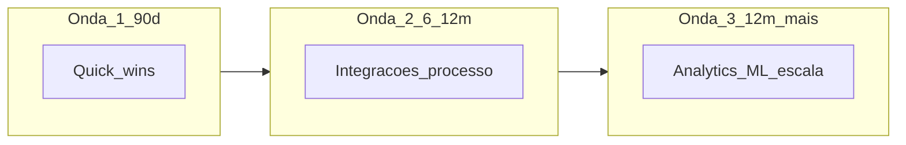

# *Roadmap*, portfólio e *quick wins* — ondas que não afogam a operação

***Roadmap*** digital organiza **iniciativas** no tempo com **dependências**, **capacidade** de mudança e **patrocínio**. **Portfólio** evita 50 projetos **meio** verdes; ***quick wins*** geram **prova** e **confiança** — desde que **não** quebrem integridade de dados ou segurança por **pressa**.

---

## Objetivos e resultado de aprendizagem

**Ao final desta aula**, você será capaz de:

- Montar *roadmap* em **ondas** (G1, G2, G3) com **objetivo** e **risco** por onda.  
- Priorizar com **impacto × esforço** (*consenso de mercado*).  
- Definir **critérios** de *quick win* aceitável para a empresa.

**Duração sugerida:** 60–75 minutos.

---

## Gancho — a TechLar e as ondas sobrepostas

A **TechLar** lançou **WMS**, **TMS** e **RPA** de faturação **no mesmo trimestre** — mesma equipa de **master data**, mesma **TI**. **Congestionamento** de testes; **cadastro** errado em produção; *go-live* com **multa** a cliente. *Roadmap* sem **capacidade** de absorção é **agenda de PowerPoint**.

**Analogia de obras em casa:** cozinha e casa de banho ao mesmo tempo — **sem água** para ninguém.

---

## Mapa do conteúdo

- Ondas e *gates* de decisão (*hipótese pedagógica*).  
- *Quick win*: critérios (≤90 dias, dono, métrica, risco baixo).  
- Portfólio e **parar** iniciativas *zombie*.  
- Patrocínio executivo e **ritual** de revisão.

---

## Conceito núcleo

**Onda G1 (*quick wins*):** baixo risco, **alto** *visibility*, prepara dados ou cultura (ex.: RPA em conciliação **após** regra fechada).

**Onda G2:** integrações e **processo** redesenhado (ex.: API TMS + limpeza de cadastro).

**Onda G3:** analytics avançado, **ML** em escala — **só** com base estável.

**Legenda:** sequência **típica** — pode sobrepor **com** equipas distintas e risco controlado.

**Mini-caso:** *quick win* de **automatizar e-mail** sem **registar** exceções — gera **caos** em auditoria; preferir *quick win* com **log** e **owner**.

---

## Trade-offs

- **Paralelismo** *versus* **capacidade** de teste.  
- **Visibilidade política** *versus* **dívida técnica** escondida.  
- **Cortar escopo** *versus* **adiar** *go-live*.

---

## Aplicação — exercício

Desenhe **três** ondas para a sua empresa (fictícia). Por onda: **2 iniciativas**, **1 métrica**, **1 risco principal**.

**Gabarito pedagógico:** G3 não deve começar com «**IA em tudo**» se G1 não tiver **dado** e **processo**; riscos devem ser **realistas** (pessoas, integração, fornecedor).

---

## Erros comuns e armadilhas

- *Roadmap* **linear** ignorando sazonalidade do negócio.  
- *Quick win* que **corta** controlo interno.  
- Sem **critério** de *kill* para projeto atrasado.  
- **OKR** de TI desligados de P&L ou serviço.

---

## KPIs e decisão

- **% iniciativas** a tempo e orçamento.  
- **Valor** entregue por onda (*benefits tracking*).  
- **Capacidade** utilizada (pessoas-chave em %).  
- **Incidentes** pós-*release*.

---

## Fechamento — três takeaways

1. Onda sem **capacidade** é fila de desastre.  
2. *Quick win* bom tem **métrica** e **risco baixo** explícitos.  
3. Parar projeto também é **gestão de portfólio**.

**Pergunta de reflexão:** qual projeto no teu portfólio deveria ser **encerrado** com honra?

---

## Referências

1. KOTTER, J. P. *Leading Change* — narrativa de patrocínio (*contexto*).  
2. PMI — *benefits realization* (*tipo de fonte* alinhada a PMO).  
3. ASCM — alinhamento estratégico-operacional — [ascm.org](https://www.ascm.org/).

**Ponte:** [Gestão de projetos logísticos](../../trilha-melhoria-continua-e-processos/modulo-04-gestao-de-projetos-logisticos/aula-01-charter-raci-wbs.md).
