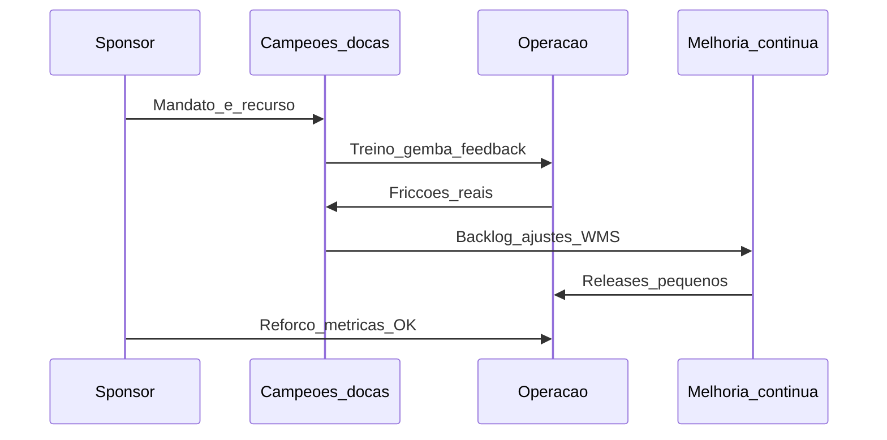

# Mudança cultural e KPIs de adoção — *go-live* não é vitória, uso diário é

**Mudança** em transformação digital falha mais por **comportamento** que por **código**. Modelos como **ADKAR** (Awareness, Desire, Knowledge, Ability, Reinforcement) dão **checklist** de uma página (*consenso de mercado* em *change management*). **KPIs de adoção** medem **uso**, **qualidade de dado** introduzido por humanos e **abandono** de atalhos antigos — não só «sistema no ar».

---

## Objetivos e resultado de aprendizagem

**Ao final desta aula**, você será capaz de:

- Aplicar ADKAR em **cinco frases** a um caso logístico.  
- Propor **três** KPIs de adoção além de uptime.  
- Desenhar **rede de campeões** (*change network*) mínima.

**Duração sugerida:** 60–75 minutos.

---

## Gancho — a TechLar e o WMS que «ninguém queria»

O **WMS** novo da **TechLar** passou em **teste técnico**. No **chão**, pickers **continuaram** a anotar no **papel** «porque é mais rápido no primeiro dia». Só quando **supervisor** e **campeão** de doca **co-desenharam** *shortcut* no coletor e **métrica** de *scan* por hora é que o papel **caiu**. **Reforço** (rewards, auditoria gentil) sustentou o hábito.

**Analogia do telemóvel novo:** instalar a app não basta — **hábito** e **frustração** no primeiro contacto mandam no *churn* interno.

---

## Mapa do conteúdo

- ADKAR resumido.  
- Resistência: medo, perda de poder, trabalho extra percetível.  
- KPIs: *DAU*/*WAU* de função crítica, % pedidos com *scan* completo, *override* manual.  
- *Reinforcement*: celebrar **comportamento** certo, não só *go-live*.

---

## Conceito núcleo

**Awareness:** «**porquê**» muda — ligar a cliente, segurança, overtime.

**Desire:** «**o que ganho**» — reduzir dor honestamente ou **co-criar** compensação.

**Knowledge + Ability:** treino **no contexto** do SKU real, não vídeo genérico.

**Reinforcement:** *coaching* 30-60-90 dias, **métricas** visíveis, correcção sem humilhação.

**Legenda:** mensagens = **fluxo de mudança**; *releases pequenos* reduzem trauma.

**Mini-caso:** KPI «**% ordens** criadas **só** no novo sistema» *versus* «sistema disponível» — a primeira mede **adoção**, a segunda **infra**.

---

## Trade-offs

- **Velocidade** de *rollout* *versus* **fadiga** de mudança (*change fatigue*).  
- **Padronização** *versus* **flex** local necessária.  
- **Auditoria** *versus* **confiança** — equilíbrio cultural.

---

## Aplicação — exercício

Escolha **uma** mudança digital (fictícia). Preencha **uma linha** por letra ADKAR com **ação concreta**. Liste **três** KPIs de adoção com **fonte de dado** (WMS, LMS, *survey*).

**Gabarito pedagógico:** *Desire* não pode ser só «comunicado email» — precisa **interesse** tangível; KPIs devem ser **mensuráveis**; fonte de dados explícita.

---

## Erros comuns e armadilhas

- Treino **só** no *launch day* sem *hypercare*.  
- Culpar **operador** por sistema mal configurado.  
- Campeões **sem tempo** protegido.  
- «Adoção 100%» como meta **sem** exceções legítimas.

---

## KPIs e decisão

- **%** de transações no canal novo.  
- **Tempo** por tarefa *versus* baseline.  
- **Erro** de dado introduzido por humano (*opcional*, difícil).  
- **Satisfação** pós-treino e *retention* de hábito aos 90 dias.

---

## Fechamento — três takeaways

1. *Go-live* é **meio**; adoção é **fim** operacional.  
2. ADKAR é **mapa**, não discurso de RH.  
3. Campeões no **gemba** vencem *slide* no *headquarters*.

**Pergunta de reflexão:** que **reforço** positivo existe hoje para quem usa o sistema **certo**?

---

## Referências

1. PROSCI — modelo ADKAR e pesquisas de *change* (*tipo de fonte* comercial/académica mista).  
2. KOTTER — passos de mudança (*complemento* ao ADKAR).  
3. CSCMP — pessoas na cadeia — [cscmp.org](https://cscmp.org/).

**Ponte:** [Melhoria contínua — patrocínio](../../trilha-melhoria-continua-e-processos/modulo-03-continuous-improvement/aula-01-pdca-gemba-sponsor.md).
