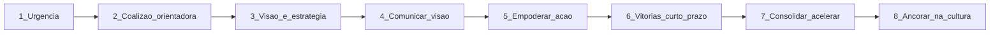
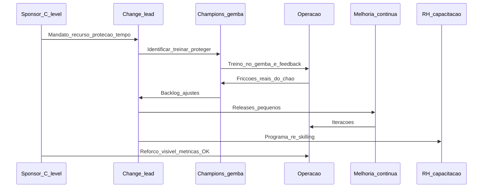
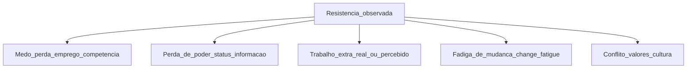

# Mudança cultural e KPIs de adoção — *go-live* não é vitória, uso diário é

**Mudança** em transformação digital falha mais por **comportamento** que por **código**. Modelos consagrados — **ADKAR** (Prosci), **Kotter 8 passos**, **Bridges Transition Model**, **Lewin Unfreeze-Change-Refreeze** — entregam *checklist* de uma página, mas só **funcionam** se o sponsor protege tempo, o **gemba** participa do desenho e os **KPIs de adoção** medem **uso real**, não "sistema disponível".

Em logística, a complexidade extra: **força operacional grande** (pickers, conferentes, motoristas), **rotatividade alta** (turnover anual 30–60% em CDs BR), **sindicato/CCT** para mudanças de função, **trabalho 24/7** (turnos), **diversidade de letramento digital**. Esta aula traz frameworks combinados, métricas práticas, ritual de **change network** e casos BR (WMS, RPA, ML em planejamento).

---

## Objetivos e resultado de aprendizagem

- Aplicar **ADKAR** + **Kotter 8** + **Bridges** combinados a iniciativa logística.
- Distinguir **mudança técnica** (sistema) de **transição psicológica** (Bridges).
- Construir **change network** (sponsor + champions + early adopters) com ritual.
- Definir **5 KPIs de adoção** mais úteis (não só uptime).
- Diagnosticar **resistência** (medo, perda de poder, trabalho extra, fadiga de mudança).
- Estruturar **hypercare** + 30-60-90 com métricas e *coaching*.
- Considerar **sindicato/CCT** e LGPD em mudanças de função.

**Duração sugerida:** 75–90 min. **Pré-requisitos:** [Aula 4.2](aula-02-roadmap-portfolio-quick-wins.md).

---

## Mapa do conteúdo

1. Por que mudança falha — estatísticas e padrões.
2. ADKAR — checklist de uma página.
3. Kotter 8 passos — narrativa executiva.
4. Bridges — transição psicológica (não só processo).
5. Change network: sponsor, champions, early adopters.
6. Resistência — diagnóstico e intervenção.
7. KPIs de adoção (não só infraestrutura).
8. Hypercare 30-60-90 com coaching.
9. Aspectos BR: sindicato/CCT, turnover, letramento digital.

---

## Gancho — a TechLar e o WMS que «ninguém queria»

O **WMS novo** da **TechLar** passou em **teste técnico** e **UAT** com nota A. Go-live num sábado tranquilo. Na **segunda-feira** no chão, **64% dos pickers** continuaram a anotar **no papel** "porque é mais rápido no primeiro dia". Supervisor não interveio. **Quarta-feira** já havia **inventário negativo** em 8% dos endereços.

**Diagnóstico de mudança:**

| Sintoma | Causa |
|---|---|
| Papel persistiu | UI do coletor exigia 7 toques onde papel exigia 2 |
| Supervisor inerte | Não foi treinado, não tinha incentivo |
| Inventário negativo | Quem usou o sistema confiou no estoque que estava errado por causa de quem usou papel |
| KPI "sistema disponível 99,7%" | Verde. Mas adoção real ~36% |

**Intervenção em 6 semanas:**

1. **Champions** de doca co-desenharam *shortcut* no coletor (3 toques).
2. Métrica visível: **% picks com scan completo por turno** afixada na doca.
3. Supervisor treinado em *coaching*; bônus pessoal vinculado à adoção da equipa.
4. Removidos blocos de papel da operação (após 2 semanas de aviso).
5. **Reforço positivo**: prêmio de produtividade da semana para equipa com 100% scan.
6. Aos 90 dias: **94% scan completo**.

**Analogia do telemóvel novo:** instalar a app não basta — **hábito** e **frustração** no primeiro contacto mandam no *churn* interno.

**Analogia do cinto de segurança:** levou 3 décadas e leis para virar hábito; mudança digital tem que **reduzir fricção** + **incentivo** + **norma social** ou não cola.

---

## Conceito-núcleo — três frameworks combinados

Não escolha **um** framework — combine forças:

| Framework | Foco | Ponto forte | Ponto fraco |
|---|---|---|---|
| **ADKAR** (Prosci) | Indivíduo | Checklist operacional | Sequencial demais |
| **Kotter 8** | Organização | Narrativa para liderança | Top-down |
| **Bridges Transition** | Psicologia | Distingue mudança ≠ transição | Menos prático |
| **Lewin** | Processo | Simples (descongelar/mudar/recongelar) | Antigo, não cobre digital |

### ADKAR detalhado

| Letra | Significado | Ação concreta |
|---|---|---|
| **A**wareness | Consciência do "porquê" | Town hall com CEO, vídeo de cliente, número da multa |
| **D**esire | Desejo de participar | "O que ganho?" — reduzir overtime, ergonomia, carreira |
| **K**nowledge | Saber como mudar | Treinamento contextual, simulação, manual visual |
| **A**bility | Capacidade real de mudar | Coletor disponível, processo redesenhado, hypercare |
| **R**einforcement | Reforço para sustentar | Métrica visível, reconhecimento, correção sem humilhação |

**Diagnóstico ADKAR:** se **uma** letra falha, todo o resto desaba. ADKAR baixo em "Desire" = piorar não adianta treinar mais.

### Kotter 8 passos



**Aplicação ao WMS TechLar:**

- **K1 Urgência**: "Multa de R$ 1,8M em Q3 por OTIF; sem WMS, repetimos."
- **K6 Vitória curto prazo**: equipa-piloto com -20% tempo picking em 4 semanas.
- **K8 Ancorar**: KPI de adoção em scorecard do gerente CD.

### Bridges — transição psicológica

| Fase | Estado emocional | O que precisa |
|---|---|---|
| **Ending** (fim) | Luto pelo modo antigo | Reconhecer perda, despedida ritualizada |
| **Neutral zone** (vazio) | Confusão, ansiedade, oportunidade | Tempo, suporte, espaço para erro |
| **New beginning** (novo) | Aceitação, energia | Identidade nova reforçada |

**Erro comum:** sponsor "pula" a *neutral zone* — exige adoção 100% no dia 2. Resultado: regressão à norma antiga.

---

## Diagrama / Arquitetura — change network



### Arquetipos do change network

| Papel | Quem | Quanto tempo |
|---|---|---|
| **Sponsor executivo** | C-level (COO típico) | 2-4h/semana visível |
| **Change Lead** | Gerente sênior dedicado | 100% durante hypercare |
| **Champions** | 1 por turno/área (8-15 pessoas em CD) | 20% do tempo, **protegido** |
| **Early adopters** | Voluntários entusiastas | espontâneo |
| **Tech support / hypercare** | TI + fornecedor | 24/7 nos primeiros 30 dias |
| **RH/L&D** | Capacitação | até 1 ano após go-live |

**Champion protegido = champion**. Champion sobrecarregado = ex-champion.

---

## Aprofundamentos — resistência



### Intervenções por causa

| Causa | Intervenção |
|---|---|
| **Medo do emprego** | Garantir publicamente; mostrar plano de re-skilling; honestidade sobre função que muda |
| **Medo da competência** | Treinamento contextual, padrinho, tempo de prática sem julgamento |
| **Perda de poder** | Co-criar nova role com poder equivalente; reconhecimento expert |
| **Trabalho extra** | Eliminar antes de adicionar (Lean); compensação temporária |
| **Fadiga** | Calendário de mudança; **espaçar**; respeitar blackout |
| **Conflito valores** | Diálogo aberto; pode ser sinal de problema real (segurança, ética) |

**Princípio:** **resistência não é fraqueza** — é informação. Quem resiste muitas vezes está vendo um problema real que sponsor ignora.

---

## Aprofundamentos — KPIs de adoção (5 essenciais)

### 1. **Adoção** funcional

`% transações no canal novo` (e não só "sistema disponível").

```sql
SELECT
  data,
  100.0 * SUM(CASE WHEN canal = 'novo_wms' THEN 1 ELSE 0 END) / COUNT(*) AS adocao_pct
FROM transacoes_picking
WHERE data >= go_live
GROUP BY data
ORDER BY data;
```

Meta típica curva: 40% sem 1 → 70% sem 4 → 90% sem 12 → 95% estável.

### 2. **Profundidade**

`% features avançadas em uso` — diferencia "uso forçado" (mínimo) de "uso pleno".

### 3. **Qualidade do dado introduzido por humano**

`% scan completo`, `% campos preenchidos corretamente`, `taxa de override`.

### 4. **Override / desvio**

`% transações com workaround` (ex.: criar pedido pelo "modo emergencial" porque o normal é chato).

### 5. **Sustentação a 90/180/365 dias**

Adoção que **mantém** após hypercare. Curva pode reverter se reforço para.

### KPIs complementares

| KPI | Pergunta |
|---|---|
| **DAU/MAU/WAU** (Daily/Weekly/Monthly Active Users) | Frequência de uso |
| **Tempo por tarefa** | Eficiência subiu? |
| **Erros de digitação/scan** | Qualidade |
| **eNPS** (employee NPS) pós-treinamento | Sentimento |
| **Churn** de champions | Sustentação |
| **Tempo até autonomia** (do nuevo entrar à executar sozinho) | Curva de aprendizagem |
| **Backlog hypercare** | Volume de problemas |

---

## Aprofundamentos — hypercare 30-60-90

### Dia 1 — D-day

- Equipa de hypercare **on-site** 24/7.
- Sponsor visível na operação.
- *War room* com TI + fornecedor + Change Lead.
- Métrica de adoção em tempo real (TV na doca).

### Semana 1-4 — hypercare intensivo

- *Coaching* individual aos champions.
- Daily standup ops + tech.
- Backlog priorizado de ajustes (release diário se necessário).
- Comunicação: o que mudou hoje; vitórias; lições.

### Mês 2-3 — estabilização

- Hypercare reduz para business hours.
- Métrica semanal pública.
- Identificar *laggards* — coaching dirigido (sem humilhação).
- Início de remoção de "modo antigo" (ex.: papel).

### Mês 4-6 — sustentação

- Métricas mensais.
- Champions seguem com 10-20% tempo dedicado.
- Plano de onboarding para novos contratados (turnover é fato).
- Postmortem de change com lições.

### Mês 7-12 — ancoragem

- Métricas trimestrais no scorecard do líder.
- Capacidade de novas releases sem desestabilizar.
- *Continuous improvement* incorporado.

---

## Trade-offs e decisão

| Trade-off | Cenário |
|---|---|
| **Velocidade** rollout vs **fadiga** de mudança | Forçar rápido = burn out; lento = perde momentum |
| **Padronização** vs **flex local** | Padrão escala; flex respeita realidade |
| **Auditoria** vs **confiança** | Vigiar demais quebra confiança; pouco vira chaos |
| **Big bang** rollout vs **piloto + ondas** | Big bang só se houver burning platform |
| **Voluntariedade** vs **mandatório** | Voluntário é mais sustentável; mandatório é mais rápido |
| **Comunicação franca** vs **diplomacia** | Franqueza ganha confiança no longo; diplomacia evita pânico no curto |

---

## Caso prático — TechLar 3 mudanças simultâneas

**Cenário:** 3 mudanças em janelas próximas:

1. **WMS novo** — 200 pessoas, 3 turnos.
2. **App motorista** — 80 motoristas terceirizados.
3. **ML demanda** — 15 planejadores.

**Risco identificado:** **fadiga de mudança** + recursos de change concorrentes.

**Plano:**

| Iniciativa | Sponsor | Champions | Hypercare | Calendário |
|---|---|---|---|---|
| WMS | COO | 12 (4 por turno) | 60 dias on-site | Q1 (não Q3 nem Q4) |
| App motorista | Diretor transportes | 6 motoristas líderes | 30 dias hotline | Q2 (após WMS estável) |
| ML demanda | VP Planning | 3 planejadores sênior | 14 dias intensivo | Q3 (gap pequena equipa) |

**Comunicação centralizada:** uma única "voz da mudança" para evitar contradição interna.

---

## Erros comuns e armadilhas

- Treino **só no launch day** sem hypercare.
- Culpar **operador** por sistema mal configurado ("não está usando direito").
- Champions **sem tempo protegido** — "fazer extra na hora do almoço".
- "Adoção 100%" como meta **sem** exceções legítimas (ex.: máquina parada).
- Métrica de **TI** ("uptime") como única — ignora uso real.
- Sponsor que **desaparece** após go-live.
- Comunicação só **e-mail** — operação não lê.
- **Treinamento genérico** (vídeo padrão) em vez de **contextual** (com o SKU/cliente real).
- **Punição** ao primeiro erro — todos voltam ao papel.
- Ignorar **sindicato/CCT** em mudança de função (risco trabalhista).
- **Vaidade do KPI**: "% treinados" sem **% efetivamente usando**.
- Não medir **fadiga** — equipa em burn out simula adoção.
- **Burocratizar** o feedback (form de 30 campos) — ninguém preenche.

---

## Segurança, ética e governança

| Tema | Aplicação |
|---|---|
| **CCT/Sindicato** | Negociar mudança de função (carga horária, ergonomia, salário) cedo |
| **LGPD** | Comunicar uso de dado em dashboards de produtividade individual |
| **Saúde mental** | Mudança gera estresse; canal de apoio (PAE) ativo |
| **Inclusão** | Treinamento adaptado (letramento, idioma, deficiência) |
| **Vigilância** | Métrica individual deve ter base legal e proporcionalidade |
| **Bias** | Não medir só "produtividade" — medir qualidade, segurança, trabalho em equipa |
| **Transparência** | Funcionários sabem o que é medido, por quê, e como dado é usado |

---

## KPIs

| KPI | Pergunta | Dono | Fonte | Cadência | Playbook |
|---|---|---|---|---|---|
| **% transações no canal novo** | Adoção real? | Process Owner | Sistemas | Diário | < meta → coaching/champion intervir |
| **Profundidade de uso** | Funcionalidades usadas? | Process Owner | Sistemas | Mensal | Gap → treino dirigido |
| **% scan completo / dado correto** | Qualidade humana? | Operações | WMS/TMS | Diário | Auditoria gentle, treino |
| **Override / workaround** | Sistema fricciona? | Process Owner + Tech | Sistemas | Semanal | Refazer UI, eliminar canal antigo |
| **Tempo por tarefa** | Eficiência? | Operações | WMS/TMS | Mensal | Comparar com baseline |
| **eNPS / sentimento** | Equipa engajada? | RH | Survey | Mensal/Trim | Ouvir, agir |
| **Churn de champions** | Sustentação? | Change Lead | HR | Trimestral | Re-recrutar, proteger tempo |
| **Backlog hypercare** | Volume de problemas? | Tech | Tickets | Diário | Priorizar quick fixes |
| **Adoção por turno / área** | Variabilidade? | Change Lead | Sistemas | Semanal | Investigar laggards |
| **Tempo até autonomia** novo contratado | Onboarding? | RH + Ops | Trilha LMS | Mensal | Ajustar treinamento |
| **Reincidência erros** mesmo tópico | Treinamento eficaz? | RH + Ops | Tickets | Mensal | Refazer módulo |

---

## Tecnologias e ferramentas

| Categoria | Ferramentas |
|---|---|
| **Change platform** | WalkMe, Whatfix, Pendo (in-app guidance) |
| **LMS** | Workday Learning, Cornerstone, Docebo, 360Learning, Moodle |
| **Survey/eNPS** | Officevibe, Culture Amp, Lattice, 15Five, Microsoft Viva Glint |
| **Comunicação interna** | Slack, MS Teams, Workplace, intranet, app dedicada |
| **Documentação visual** | Tango (record clicks), Loom, Scribe |
| **Gamification** | Bunchball, Leaderboard interno em PowerBI |
| **Analytics adoção** | Pendo, Heap, Mixpanel, Power BI Desktop com dados sistema |
| **Coaching plataforma** | BetterUp, CoachHub |

---

## Glossário rápido

- **ADKAR**: Awareness, Desire, Knowledge, Ability, Reinforcement (Prosci).
- **Kotter 8**: 8 passos clássicos de mudança organizacional.
- **Bridges**: modelo de transição psicológica (Ending → Neutral → Beginning).
- **Champion**: pessoa de chão que advoga e ensina pares.
- **Hypercare**: período pós-go-live com suporte intensificado (típ. 30-60-90 dias).
- **Change fatigue**: esgotamento por excesso de mudança.
- **eNPS**: Employee Net Promoter Score.
- **DAU/WAU/MAU**: Daily/Weekly/Monthly Active Users.
- **Override / workaround**: usar canal alternativo ao oficial.
- **CCT**: Convenção Coletiva de Trabalho (BR).

---

## Aplicação — exercícios

**Ex.1 — ADKAR.** Para "implementar app motorista terceirizado", escreva **uma frase concreta** por letra (A-D-K-A-R) com ação tangível.

**Ex.2 — Resistência.** Identifique 3 fontes de resistência prováveis em "WMS substitui RF e papel" e proponha intervenção para cada.

**Ex.3 — KPIs.** Proponha **5 KPIs** de adoção (não infraestrutura) com fonte de dado explícita.

**Ex.4 — Champion network.** Para CD com 150 pickers em 3 turnos, dimensione: quantos champions, quantas horas/semana protegidas, qual incentivo.

**Ex.5 — Hypercare.** Plano 30-60-90 dias para go-live de IDP fatura: quem na war room, métricas, decisão go/nogo de remover modo antigo.

**Gabarito pedagógico:**

- **Ex.1**: Desire não pode ser só "comunicado e-mail" — precisa interesse tangível (menos espera no portão, GPS oficial pago); Reinforcement sustenta a 90 dias.
- **Ex.2**: medo emprego (motoristas), trabalho extra (cadastrar veículo), conflito (privacidade GPS) — intervenções específicas.
- **Ex.3**: deve ter % transações canal novo, profundidade, qualidade, override, sustentação 90d.
- **Ex.4**: 6 champions (2 por turno) com 4-6h/semana protegidas; bônus + reconhecimento + carreira.
- **Ex.5**: war room com Change Lead + DataOps + IDP fornecedor + finance; métrica F1 IDP > 0.85 + override < 20%; remover modo manual após 60d com adoção > 90%.

---

## Pergunta de reflexão

Que **reforço positivo** existe hoje para quem **usa o sistema certo**? Se a resposta é "nenhum, é obrigação", **quanto tempo** até a adoção desabar quando o sponsor desviar foco?

---

## Fechamento — takeaways

1. ***Go-live* é meio**; **adoção é fim** operacional.
2. **ADKAR + Kotter + Bridges** combinados — não dogma único.
3. **Champions no gemba** vencem *slide* no headquarter.
4. **Resistência é informação**, não inimigo.
5. **KPI de adoção** > KPI de infraestrutura — uptime 99,9% sem uso = vaidade.
6. **Hypercare 30-60-90** com sponsor visível e métricas em tempo real.
7. **Sindicato/CCT, LGPD, saúde mental** — agenda obrigatória em mudanças com força operacional.
8. **Reforço positivo sustentado** — sem ele, regressão.

---

## Referências

1. **PROSCI** — *ADKAR Model* e pesquisas anuais ([prosci.com](https://www.prosci.com/)).
2. **KOTTER, J. P.** *Leading Change* (1996); *Accelerate* (2014).
3. **BRIDGES, W.** *Managing Transitions: Making the Most of Change* (4ª ed.).
4. **HEATH, C. & D.** *Switch: How to Change Things When Change Is Hard*.
5. **DUHIGG, C.** *The Power of Habit* — formação de hábitos individuais e organizacionais.
6. **McKinsey** — *Why most digital transformations fail* (artigos anuais).
7. **HBR** — *Why Transformation Efforts Fail* (Kotter, 1995, ainda essencial).
8. **CSCMP** / **ASCM** — change management na cadeia.
9. **CLT** e **CCT setoriais BR** — Direito do Trabalho aplicado à mudança digital.
10. **LGPD** — vigilância e métricas individuais (ANPD guias).
11. **WHO / OMS** — saúde mental no trabalho.

---

## Pontes para outras trilhas

- [Aula 4.1 — Pilares e maturidade](aula-01-valor-cadeia-pilares-madurez-operacional.md).
- [Aula 4.2 — Roadmap e quick wins](aula-02-roadmap-portfolio-quick-wins.md).
- [Melhoria contínua — patrocínio e gemba](../../trilha-melhoria-continua-e-processos/modulo-03-continuous-improvement/aula-01-pdca-gemba-sponsor.md).
- [Aula 1.2 — RPA + fila humana](../modulo-01-automacao-processos-logisticos-rpa/aula-02-desenho-excecao-governanca-rpa.md) — exceções precisam de operador treinado.
- [Aula 3.3 — MLOps e governança](../modulo-03-ai-aplicada-supply-chain/aula-03-otimizacao-intro-mlops-lite-governanca.md).
