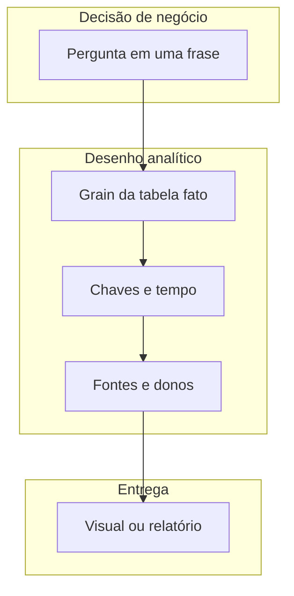

# Do problema ao *dataset* — a pergunta que nasce antes da planilha

A pior reunião de dados da semana começa assim: «Traz aí um *dashboard* de logística». Sem pergunta, não há **teste**; sem **granularidade** (*grain*), não há agregação honesta; sem **dono** da fonte, não há confiança quando o número «pula». *Analytics* aplicado à logística é, em primeiro lugar, **tradução**: decisão de negócio → eventos observáveis → tabelas com chave e tempo.

Usaremos a **TechLar** (e-commerce fictício de utilidades, CD no interior, picos de campanha) como fio condutor. Substitua pelo seu contexto: o mecanismo é o mesmo.

---

## Gancho — o CD que «sempre» erra o prazo

O diretor comercial acusa o CD de **atraso**. O gerente de armazém mostra *screenshots* de **embarque no prazo**. A transportadora mostra **coleta** no dia seguinte. O cliente reclama de **janela** perdida. Cada área tem um número «certo» porque cada uma mede **um evento diferente**. *Analytics* começa ao nomear o **evento** que corresponde à promessa ao cliente — não ao conforto do slide.

---

## Tipos de decisão e o mínimo de dados

| Decisão típica | Pergunta testável | *Grain* mínimo comum |
|----------------|-------------------|----------------------|
| Reposição de SKU | «Quantas unidades devo pedir amanhã?» | SKU × dia (demanda líquida, estoque, LT) |
| Nível de serviço | «Cumprimos a janela acordada?» | Linha de pedido × entrega (timestamp início/fim) |
| Rota / modal | «Qual opção reduz P90 de lead time com orçamento X?» | Viagem × trecho × custo |
| Capacidade de doca | «Há colisão de picos?» | Pedido × slot de chegada × recursos |

**Analogia do restaurante:** não dá para «otimizar a cozinha» sem saber se a pergunta é **tempo de espera do cliente** ou **custo de mão de obra por cobertura**. Cada pergunta pede **um tipo de linha** na base.

---

## *Grain* — a «menor verdade» que a análise promete respeitar

O *grain* (granularidade) é a descrição de **uma linha** da tabela fato: «uma linha = um evento de **embarque**» *versus* «uma linha = **linha de pedido** entregue». Misturar dois *grains* na mesma tabela sem regra de agregação gera **médias mentirosas** e KPIs verdes que o cliente não vive.

**Legenda:** fluxo conceitual; «dono» é papel organizacional, não login de sistema.

---

## Fatos e dimensões — intuição sem fanatismo dimensional

**Fato:** algo que ocorreu (pedido, embarque, contagem de inventário, viagem) com **medidas** numéricas (quantidade, horas, custo). **Dimensão:** contexto estável ou quase estável (produto, cliente, transportadora, calendário). A literatura *Kimball* formaliza *star schema*; nesta aula basta a **disciplina**: toda medida deve saber **onde** foi contada (dimensão) e **quando** (*grain* temporal).

Na TechLar, «vendas do marketplace» podem chegar como **arquivo diário** agregado por SKU, enquanto o WMS guarda **onda de separação**. Juntar os dois exige **chave** e **janela** explícitas — senão vira «achismo com *vlookup*».

---

## Checklist «pergunta → colunas → dono»

1. Escreva a pergunta em **uma** frase com verbo mensurável (reduzir, cumprir, comparar).
2. Defina **uma linha** de fato em português simples.
3. Liste **colunas obrigatórias** (chaves + timestamps + medidas).
4. Para cada coluna, indique **sistema de origem** e **dono** (nome + área).
5. Registe **o que não** está disponível — isso também é dado de projeto.

---

## Exercício — TechLar, campanha de fim de semana

**Cenário:** a campanha promete entrega em **48 h** para capitais. **Tarefa:** preencher o checklist acima para a pergunta «**Percentagem de pedidos capitais entregues dentro de 48 h após confirmação de pagamento**». Inclua **dois** riscos de dados que invalidariam a métrica.

**Gabarito pedagógico:** *grain* = **pedido** (ou linha, se a promessa for por item) com timestamps de **pagamento confirmado** e **POD** ou equivalente; riscos: **fuso** não alinhado; **marketplace** com data de «entrega» diferente do CD; pedidos **cancelados** ainda na base; **stockout** que atrasa sem marcar motivo.

---

## Erros comuns

- Começar pelo gráfico e «encaixar» dados depois.
- Usar «média da empresa» quando a decisão é **por canal** ou região.
- Confundir **embarque** com **entrega ao cliente**.

---

## Referências

1. KIMBALL, R.; ROSS, M. *The Data Warehouse Toolkit* (conceitos de fato e dimensão). Wiley.  
2. FEW, S. *Show Me the Numbers* / *Now You See It* — gramática de tabelas e gráficos para análise. Analytics Press.  
3. CSCMP — Glossário de supply chain: https://cscmp.org/CSCMP/cscmp/educate/scm_definitions_and_glossary_of_terms.aspx  
4. Microsoft — **Power Query** overview (ETL no ecossistema Excel/PBI): https://learn.microsoft.com/power-query/

---

## Fechamento

*Dataset* maduro é **contrato**: pergunta, linha, tempo, dono. O resto é ferramenta.

**Pergunta de reflexão:** qual decisão na sua empresa hoje **não** tem *grain* escrito numa linha?
