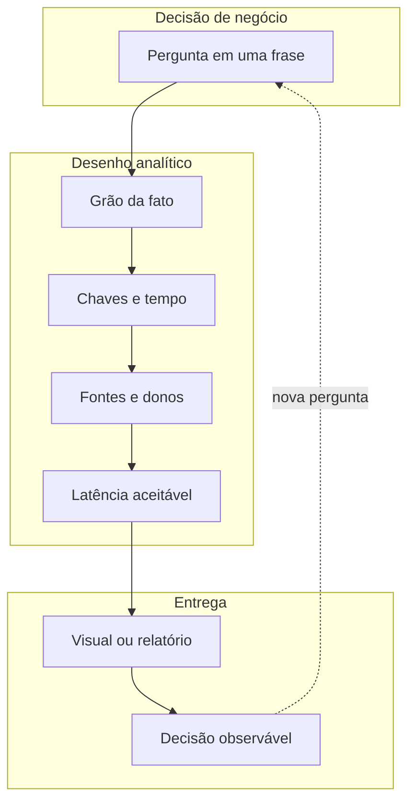

# Do problema ao *dataset* — a pergunta que nasce antes da planilha

A pior reunião de dados da semana começa assim: «Traz aí um *dashboard* de logística». Sem **pergunta**, não há **teste**; sem **granularidade** (*grain*), não há agregação honesta; sem **dono** da fonte, não há confiança quando o número «pula». *Analytics* aplicado à logística é, em primeiro lugar, **tradução**: decisão de negócio → eventos observáveis → tabelas com chave e tempo — e só depois Excel, Power BI, Databricks ou Fabric.

Usaremos a **TechLar** (e-commerce fictício de utilidades, CD no interior, picos de campanha, integração com marketplaces e B2B) como fio condutor. Substitua pelo seu contexto: o **mecanismo** é o mesmo.

---

## Objetivos e resultado de aprendizagem

- Traduzir uma **decisão** logística em **pergunta testável** com verbo mensurável.
- Definir **grão** de uma tabela fato em uma frase em português.
- Mapear **fonte → dono → cadência → latência** para cada coluna obrigatória.
- Distinguir **fato** *vs.* **dimensão** com intuição Kimball, sem fanatismo dimensional.
- Produzir um **mini-contrato de dados** auditável (1 página).

**Duração:** 45–60 min. **Pré-requisitos:** trilha [Fundamentos e estratégia](../../trilha-fundamentos-e-estrategia/README.md) recomendada; planilha básica; vontade de **escrever definição** antes de abrir gráfico.

---

## Mapa do conteúdo

1. Gancho — três áreas com três «verdades» sobre o mesmo atraso.
2. Decisão → pergunta testável → *grain* mínimo.
3. Fato e dimensão — intuição operacional.
4. Diagrama principal: pergunta → fato → fontes.
5. Variações por persona (planejador, expedição, comercial, CFO).
6. Mini-contrato de dados (template + exemplo TechLar).
7. Caso prático com gabarito numérico.
8. Erros comuns e armadilhas.
9. Dicionário operacional do KPI «entrega no prazo capital 48h».
10. Governança e qualidade (testes mínimos).
11. Ferramentas e tecnologias.
12. Glossário, exercícios, reflexão, fechamento, referências, pontes.

---

## Gancho — o CD que «sempre» erra o prazo

O diretor comercial acusa o CD de **atraso**. O gerente de armazém mostra *screenshots* de **embarque no prazo**. A transportadora mostra **coleta** no dia seguinte. O cliente reclama de **janela** perdida no portal B2B. Cada área tem um número «certo» porque cada uma mede **um evento diferente**: emissão de NF, *handoff* na doca, *POD* assinado.

> **Analogia do GPS:** três passageiros olhando três telas diferentes (Waze, Google Maps, mapa do carro) discutem rota; nenhum olha pela janela. *Analytics* começa por nomear o **evento** que corresponde à **promessa ao cliente** — não ao conforto do slide.

---

## Conceito-núcleo — decisão → pergunta → *grain*

A cadeia mental é simples e dura:

```
Decisão  →  Pergunta testável  →  Grão da fato  →  Chaves + tempo  →  Fontes + donos  →  Visual / decisão
```

| Decisão típica | Pergunta testável | *Grain* mínimo da fato | Marcos temporais essenciais |
|----------------|-------------------|------------------------|-----------------------------|
| Reposição de SKU | «Quantas unidades pedir amanhã para SKU X no CD-SP?» | SKU × CD × **dia** | Demanda líquida diária; saldo D-1; LT real |
| Nível de serviço B2B | «Cumprimos a janela acordada por contrato?» | **Linha de pedido × entrega** | Início e fim da janela; *POD* |
| Rota / modal | «Qual modal reduz P90 de LT com orçamento Y?» | Viagem × trecho × custo | Coleta; *handoff*; entrega |
| Capacidade de doca | «Há colisão de picos no CD?» | Pedido × *slot* de chegada × recurso | Agendamento; chegada efetiva |

> **Regra do guardanapo:** se a pergunta não cabe em **uma frase com verbo mensurável** (reduzir, cumprir, comparar, prever), o *dataset* ainda **não nasceu**.

---

## *Grain* — a «menor verdade» que a análise promete respeitar

O *grain* (granularidade) descreve **uma linha** da fato em português simples: «uma linha = um **evento de embarque**» *versus* «uma linha = **linha de pedido entregue**». Misturar dois *grains* na mesma fato sem regra explícita gera **médias mentirosas** — o famoso *Simpson’s paradox* em traje de KPI.

Exemplo concreto na TechLar:

- **Errado:** misturar `EmbarquePedido.csv` (1 linha por pedido) com `EmbarqueLinha.csv` (1 linha por SKU do pedido) num único *append*. Soma de quantidades **explode**; OTIF divide errado.
- **Certo:** dois fatos separados — `f_embarque_pedido` e `f_embarque_linha` — cada um com **seu** dicionário.



**Legenda:** ciclo vivo; «dono» é papel organizacional, não login de sistema. **Latência aceitável** é parâmetro de projeto: dashboard de turno tolera D−1, dashboard executivo tolera mês fechado.

---

## Fato e dimensão — intuição sem fanatismo dimensional

- **Fato:** algo que **ocorreu** (pedido, embarque, contagem de inventário, viagem) com **medidas** numéricas (quantidade, horas, custo). Tabela longa e estreita.
- **Dimensão:** **contexto** estável ou quase estável (produto, cliente, transportadora, calendário, canal). Tabela curta e larga.

Modelo mínimo TechLar para a pergunta «entregamos no prazo?»:

| Tabela | Tipo | Grão | Colunas-chave |
|--------|------|------|---------------|
| `f_entrega_linha` | Fato | 1 linha = 1 linha de pedido entregue | `pedido_id`, `linha_id`, `sku`, `cliente_id`, `transp_id`, `data_promessa_ini`, `data_promessa_fim`, `data_pod`, `qtd_pedida`, `qtd_entregue` |
| `d_produto` | Dimensão | 1 SKU | `sku`, `familia`, `peso_kg`, `categoria_abc`, `validade_meses` |
| `d_cliente` | Dimensão | 1 cliente | `cliente_id`, `canal` (site/marketplace/B2B), `regiao`, `segmento` |
| `d_transp` | Dimensão | 1 transportadora | `transp_id`, `modal`, `parceiro`, `regiao_atendida` |
| `d_calendario` | Dimensão | 1 dia | `data`, `ano_mes`, `semana_op`, `feriado`, `dia_util_br` |

A literatura **Kimball** formaliza *star schema*; nesta aula basta a **disciplina**: toda medida deve saber **onde** foi contada (dimensão) e **quando** (*grain* temporal). SCD (Slowly Changing Dimensions) tipo 2 — quando um cliente muda de canal, mantemos histórico — entra na trilha de modelagem; aqui registramos a **necessidade**, não a sintaxe.

---

## Aprofundamentos — variações por persona

A **mesma** fato `f_entrega_linha` alimenta visões diferentes:

| Persona | Pergunta dominante | Cadência | Latência aceitável | Dimensão de corte favorita |
|---------|-------------------|----------|--------------------|----------------------------|
| Planejador de demanda | «Qual SKU vai faltar?» | Diária | D−1 | `d_produto.familia`, `d_calendario.semana_op` |
| Líder de expedição | «Que linhas estão em risco hoje?» | Tempo real (≤15 min) | minutos | `d_transp`, *backlog* por idade |
| Gerente comercial | «Estamos cumprindo SLA por canal?» | Semanal | D−1 | `d_cliente.canal`, `d_cliente.regiao` |
| CFO | «Custo de frete e capital em estoque?» | Mensal | mês fechado | `d_calendario.ano_mes`, família, modal |

> A pergunta «temos um *dashboard* de logística?» dilui as quatro personas no mesmo gráfico. **Resposta segura:** não tem.

---

## Caso prático / Laboratório — TechLar, campanha de fim de semana

**Cenário:** a campanha promete entrega em **48 h** para capitais. Você tem 5 fontes potenciais:

| Fonte | Sistema | Dono | Cadência | Latência |
|-------|---------|------|----------|----------|
| `pedidos_ecom.csv` | Plataforma e-commerce | Squad e-commerce | tempo real | minutos |
| `wms_onda.parquet` | WMS | Coordenador CD | a cada 15 min | minutos |
| `tms_coleta.json` | TMS (API) | TI logística | hora | hora |
| `carrier_tracking.api` | API transportadora | Coordenador transporte | hora | 2 h |
| `pos_marketplace.csv` | Conector marketplace | Squad marketplace | diário | D−1 |

**Tarefa:** preencha o contrato.

**Pergunta testável:** «**Percentagem de pedidos de capitais entregues em até 48 h após `confirmacao_pagamento`, na campanha de 17–19/11/2026, por canal.**»

**Grão:** `1 linha = 1 pedido` (não linha — promessa é por pedido).

**Colunas obrigatórias:**

```
pedido_id (chave canônica), cliente_id, capital_flag (derivada de cep),
canal, data_confirmacao_pagto (timestamp UTC),
data_pod (timestamp UTC), status_final (entregue/cancelado/devolvido),
campanha_id (dimensão de evento)
```

**Riscos / o que NÃO está disponível:**

- Marketplace pode reportar `data_entrega` como **D+1 do POD** (atraso de integração).
- Pedidos **cancelados após embarque** ainda aparecem em `wms_onda` — excluir explicitamente.
- *Stockout* não tem evento próprio em alguns SKUs (ver **Aula 1.2**).
- Fuso: `pos_marketplace` em UTC, e-commerce em America/Sao_Paulo — **converter cedo**.

**Gabarito numérico parcial:** se a base bruta tiver 12.480 pedidos elegíveis de capitais e 11.214 com `data_pod − data_confirmacao_pagto ≤ 48h`, a métrica é `11.214 / 12.480 = 89,9%`. Em campanhas grandes do varejo brasileiro, métricas próximas de **95%** são comuns como gatilho de **multa** em contratos B2B (e a campanha estará **abaixo** dessa marca — decisão pede ação).

---

## Trade-offs e decisão

| Dimensão | Caminho A | Caminho B | Quando escolher A |
|----------|-----------|-----------|-------------------|
| Latência | Tempo real (Kafka, *streaming*) | Lote diário (CSV, ELT) | Decisão é por turno; SLA contratual penaliza horas |
| Granularidade | Linha de pedido | Pedido agregado | Comissão e SLA por linha; mix complexo |
| Local | Fato em ERP/WMS | Fato em DW/Lakehouse | Várias fontes; histórico longo; análise cruzada |
| Ferramenta | Excel + Power Query | Power BI + Fabric/Databricks | Volume cabe em planilha; usuário é dono |

> **Heurística:** comece pelo **mais barato auditável**. Subir para Lakehouse antes de ter **uma** definição de pedido é trocar caos local por caos com nota fiscal.

---

## Erros comuns e armadilhas

- Começar pelo **gráfico** e «encaixar» dados depois.
- Usar **«média da empresa»** quando a decisão é por canal/região (Simpson em ação).
- Confundir **embarque** com **entrega ao cliente**.
- Tratar **pedido cancelado** como linha viva no denominador.
- Misturar **fuso** sem documentar (UTC × America/Sao_Paulo × horário do POS).
- Definir KPI sem **dono** — quando a definição mudar, ninguém aprova.
- Ignorar **eventos não rotulados** (promoção, *push* de marketplace).

---

## Dicionário operacional de KPI — exemplo

| Campo | Valor |
|-------|-------|
| **Nome** | `pct_entrega_48h_capitais_campanha` |
| **Pergunta** | «% pedidos de capitais entregues ≤ 48 h após pagamento confirmado durante campanha» |
| **Numerador** | Pedidos com `data_pod − data_confirmacao_pagto ≤ 48 h` e `status_final = entregue` |
| **Denominador** | Pedidos com `cliente.cep` em capital BR, `campanha_id = X`, `status_final ≠ cancelado_pre_embarque` |
| **Exclusões** | Devoluções espontâneas pós-entrega; pedidos **B2B** (KPI próprio) |
| **Fonte** | `pedidos_ecom` (pagto) + `carrier_tracking` (POD) + `d_cliente` (CEP) |
| **Dono** | Coordenadora de Performance Logística |
| **Cadência** | Diária 09h00 América/SP, recálculo D−1 fechado |
| **Latência** | ≤ 2 h sobre POD do *carrier* |
| **Meta interna** | 95% durante campanha (gatilho de *war room* abaixo de 92%) |
| **Versão** | v1.0 — 2026-04-01 — aprovação ata #042 |

> **Analogia:** **KPI sem dicionário é como receita sem unidade**: «duas xícaras» não diz se é café ou farinha. Quando o número cair, ninguém saberá se é a operação ou a definição.

---

## Governança e qualidade de dados (mínima)

Três testes que cabem num *pull request* de pipeline (sintaxe inspirada em [dbt tests](https://docs.getdbt.com/docs/build/data-tests) / Great Expectations):

```yaml
- name: f_entrega_linha
  tests:
    - unique: [pedido_id, linha_id]
    - not_null: [pedido_id, sku, data_promessa_fim, qtd_pedida]
    - relationships:
        to: d_produto
        field: sku
    - freshness:
        column: data_carga
        warn_after: { count: 6, period: hour }
        error_after: { count: 24, period: hour }
```

**Contrato de dado** entre áreas: quem produz `data_pod` (transportadora) e quem **consome** (operação) assina **definição**, **schema**, **SLA de entrega** e **canal de erro**. Sem contrato, o pipeline é **boato com cron**.

---

## Ferramentas e tecnologias relevantes

- **Local / planilha:** Excel + Power Query, Google Sheets + AppScript.
- **BI corporativo:** Power BI, Tableau, Qlik Sense, Looker Studio, SAP Analytics Cloud.
- **Lakehouse / DW:** Microsoft Fabric, Databricks, Snowflake, Synapse, BigQuery, Redshift.
- **Camada semântica:** Power BI dataset, Looker LookML, dbt semantic layer, Cube.
- **Qualidade / observabilidade:** Great Expectations, dbt tests, Soda, Monte Carlo.
- **AI copilot (2025–2026):** Microsoft Fabric Copilot, Power BI Copilot, Tableau Pulse — geram explicações, **não** definições; o dicionário continua **humano**.

---

## Glossário rápido

- **Grain:** descrição literal de uma linha da fato.
- **Chave canônica:** identificador único e estável; sobrevive a rebatismo de sistema.
- **POD (*proof of delivery*):** evidência da entrega (assinatura, foto, OTP).
- **SCD (Slowly Changing Dimension):** estratégia para preservar histórico de atributos da dimensão.
- **Lineage:** rastro fonte → transformação → consumo.
- **Latência:** atraso entre o **evento real** e a **disponibilidade analítica**.

---

## Aplicação — exercício

1. Escolha **uma** decisão real da sua área que hoje é tomada por «achismo informado».
2. Escreva **uma** pergunta testável (com verbo mensurável e período).
3. Defina **grão** em uma frase.
4. Liste **5–8 colunas** obrigatórias com **fonte** e **dono**.
5. Identifique **dois** dados que **não** existem hoje (e o impacto na decisão).
6. Esboce o **dicionário** do KPI em uma página (use o template acima).

**Gabarito pedagógico:** revise se (a) a pergunta tem verbo mensurável, (b) o grão cabe em uma frase, (c) cada coluna tem **dono nominal** e (d) ao menos um item da lista «não existe» revela uma **lacuna de processo**, não só de TI.

---

## Pergunta de reflexão

Qual decisão na sua empresa hoje **não** tem *grain* escrito numa linha — e quem perderia poder se essa frase fosse pública?

---

## Fechamento — takeaways

- *Dataset* maduro é **contrato**: pergunta, linha, tempo, dono, latência.
- O resto é ferramenta — Excel, Power BI, Snowflake, Fabric: a ordem é **definição → fato → ferramenta**.
- **Sem dicionário não há KPI**, há figura.

---

## Referências

1. KIMBALL, R.; ROSS, M. *The Data Warehouse Toolkit*. Wiley, 3.ª ed.
2. FEW, S. *Show Me the Numbers* / *Now You See It*. Analytics Press.
3. CSCMP — [Glossary of Supply Chain Terms](https://cscmp.org/CSCMP/cscmp/educate/scm_definitions_and_glossary_of_terms.aspx).
4. APQC — [Process Classification Framework / KPIs](https://www.apqc.org/).
5. Microsoft — [Power Query overview](https://learn.microsoft.com/power-query/).
6. dbt — [Data tests](https://docs.getdbt.com/docs/build/data-tests).
7. Great Expectations — [Core concepts](https://greatexpectations.io/expectations/).
8. ILOS — Instituto de Logística e Supply Chain (Brasil), publicações sobre indicadores.

---

## Pontes para outras trilhas

- [Trilha Fundamentos — KPIs logísticos](../../trilha-fundamentos-e-estrategia/modulo-04-custos-logisticos-performance/aula-03-nivel-servico-kpis-logisticos.md): **o quê medir**.
- Próxima aula desta trilha: [Qualidade, viés e demanda fantasma](aula-02-qualidade-vies-demanda-fantasma.md).
- Trilha Automação: pipelines RPA podem ser **fonte** alimentando o `f_*` aqui modelado.
