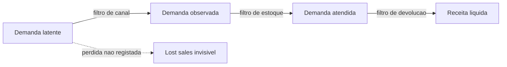
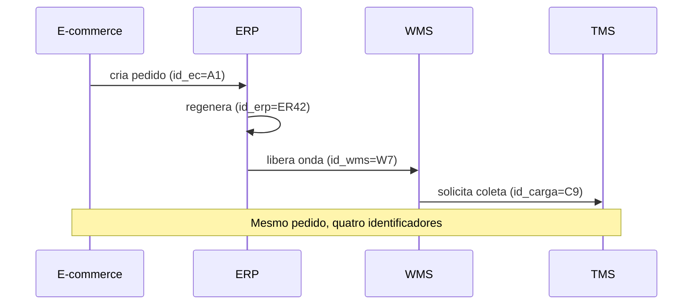

# Qualidade, viés e demanda «fantasma» — quando o histórico mente com boas intenções

O sistema registou **zero** unidades vendidas num dia. O analista conclui «falta de demanda». Na doca, a verdade era **ruptura**: havia fila de pedidos, mas nada para separar. **Qualidade de dados** em logística não é «campo sem nulo num *not null check*»; é **coerência com o processo físico** e consciência dos **viéses** que distorcem *forecast*, OTIF e giro.

---

## Objetivos e resultado de aprendizagem

- Reconhecer **viés de censura** (ruptura, *backorder*, ajustes manuais) em séries de venda.
- Construir uma **rotina de reconciliação** ERP × WMS × TMS com hipóteses testáveis.
- Implementar **5 testes mínimos** de qualidade (unicidade, integridade referencial, *freshness*, regra de negócio, anomalia estatística).
- Distinguir **demanda observada**, **demanda atendida** e **demanda latente**.
- Publicar um **rótulo de qualidade** («selo verde/amarelo/vermelho») num dataset.

**Duração:** 50–70 min. **Pré-requisitos:** [Aula 1.1](aula-01-do-problema-ao-dataset.md); noção de SQL ou Excel; familiaridade com Power Query útil.

---

## Mapa do conteúdo

1. Gancho — o forecast «vencedor» que faliu na semana seguinte.
2. Conceito — observada × atendida × latente.
3. Viés de ruptura, *push*, promoção, devolução, marketplace.
4. Reconciliação ERP × WMS × TMS — protocolo numérico.
5. Diagrama de lineage com pontos de quebra.
6. Framework de qualidade (5 testes + observabilidade).
7. Caso prático com cálculo de divergência aceitável.
8. Erros comuns, dicionário de termos, ferramentas.
9. Exercício, pergunta, fechamento, referências, pontes.

---

## Gancho — a série «linda» que destruiu o forecast

A TechLar celebrou um **MAPE** de 8% num SKU de campanha. Na semana seguinte, **faltou** produto: o modelo aprendera padrão de **empurrão** (*push* de marketplace) e **promoção** sem variáveis explicativas. O modelo não estava errado; o **dataset** mentiu por **omissão de eventos**.

> **Analogia do hospital:** «**fila zero**» pode significar «ninguém adoeceu» **ou** «ninguém foi atendido». A diferença não é estética — é vida ou morte. Em logística, é venda ou ruptura.

---

## Conceito-núcleo — três demandas



| Demanda | Definição | Onde mora |
|---------|-----------|-----------|
| **Latente** | O que o cliente **quereria** se tudo estivesse disponível | Pesquisa, *search* sem clique, *wishlist* |
| **Observada** | O que **chegou** ao sistema (carrinho, pedido) | E-commerce, ERP |
| **Atendida** | O que foi **entregue** (POD) | WMS, TMS, NF-e |

A maioria dos *forecasts* treina em **atendida** e a chama de «demanda». **Erro fundacional** — propagado em cada gráfico.

---

## Viés de ruptura e censura de demanda

Quando o cliente não consegue comprar, **vendas observadas** subestimam **demanda latente**. Tratar zero como «frio» infla erro de **nível de serviço** e induz reposição abaixo do necessário.

**Padrões de mercado:** registar **stockout**, **backorder**, **substituição** e **pedido cancelado por indisponibilidade** como **eventos próprios** com timestamps. Sem isso, o buraco vira **invisível**.

| Sintoma na série | Hipótese | Teste rápido |
|------------------|----------|--------------|
| Quedas pontuais para zero | Ruptura ou bug de integração | Cruzar com saldo WMS no dia |
| Picos sem tendência | Promoção / *push* sem rótulo | Cruzar com calendário de campanhas |
| Vendas «negativas» | Devolução contada errada | Olhar tipo de movimento contábil |
| Aumento súbito de B2B | Faturamento defasado de mês fechado | Analisar `data_emissao` *vs.* `data_entrega` |
| Quebra estrutural após dado de cadastro | Mudança de família / *bundle* | Auditar SCD na dimensão produto |

---

## Promoção, *push* e calendário de eventos

Campanhas deslocam volume no tempo. Se o calendário de promoções **não** entra como **dimensão de evento**, o modelo confunde **efeito estrutural** com **ruído**. Mínimo viável:

```sql
CREATE TABLE d_evento (
  evento_id      VARCHAR PRIMARY KEY,
  tipo           VARCHAR,            -- promocao, push, ruptura, ajuste, blackfriday
  inicio_utc     TIMESTAMP,
  fim_utc        TIMESTAMP,
  escopo_json    VARCHAR,            -- {sku:[...], canal:[...], regiao:[...]}
  fonte          VARCHAR,
  dono           VARCHAR
);
```

Para análise descritiva basta **um flag** `em_promocao` por linha; para forecast avançado, ver Hyndman & Athanasopoulos.

---

## Duplicidade e «dois ERPs na cabeça»

Pedido criado no e-commerce, **recriado** no ERP com outro ID, **mesclado** na exportação do WMS — triplicidade clássica.



**Regra prática:** definir **uma chave canônica** com **mapa de tradução** (`id_ec ↔ id_erp ↔ id_wms ↔ id_carga`) mantido por contrato. *Merge* com regra de **prioridade** explícita («fonte ERP vence em conflito de cliente»).

---

## Reconciliação ERP × WMS × TMS — protocolo numérico

**Receita prática** para fechar um dia D:

1. Escolha métrica simples: `cnt(pedidos)` no dia D.
2. Calcule em **três fontes**: ERP, WMS, TMS.
3. Tabule:

| Fonte | Definição | D−1 | D | Diferença esperada |
|-------|-----------|-----|---|--------------------|
| ERP | `cnt(pedidos)` com `data_criacao = D` | 1.842 | 1.910 | base |
| WMS | `cnt(pedidos)` com `data_liberacao = D` | 1.821 | 1.876 | ≤ 3% (lag de liberação) |
| TMS | `cnt(pedidos)` com `data_coleta = D` | 1.798 | 1.802 | ≤ 6% (corte de janela) |

4. Diferenças **acima do limite** abrem **incidente de dados**.
5. Toda divergência tem **dono** e **prazo**.

**Critério da TechLar:** até **5%** de divergência ERP–WMS é «normal» quando o critério é **criado** *vs.* **liberado**; acima disso, *war room*.

---

## Framework mínimo de qualidade

```yaml
- table: f_entrega_linha
  tests:
    - unique: [pedido_id, linha_id]
    - not_null: [pedido_id, sku, qtd_pedida]
    - relationships: { to: d_produto, field: sku }
    - expression: "qtd_entregue <= qtd_pedida + 1"
    - freshness: { warn_after: 6h, error_after: 24h }
    - anomaly:
        metric: "cnt(*) por dia"
        method: zscore
        window: 28d
        threshold: 3.5
```

**Selo de qualidade do dataset** (publicar no topo do dashboard):

| Selo | Critério |
|------|----------|
| Verde | Todos os testes verdes nas últimas 24 h, *freshness* < 6 h |
| Amarelo | 1 teste em alerta ou *freshness* 6–24 h |
| Vermelho | Teste crítico falhou ou *freshness* > 24 h |

**Observabilidade:** ferramentas como Soda, Monte Carlo, Bigeye e Lightup automatizam métricas de qualidade; em escala de PME, dbt + dashboard simples já bastam.

---

## Exemplos técnicos

**Excel — detectar dia com queda anómala (Z-score):**

```excel
=LET(
  janela; FILTER(VendasDiarias[Qtd]; (VendasDiarias[Data]>=A2-28)*(VendasDiarias[Data]<A2));
  media; AVERAGE(janela);
  desvio; STDEV.S(janela);
  z; (B2-media)/desvio;
  IF(z<-3; "ALERTA"; "OK")
)
```

**Power Query (M) — marcar pedidos canónicos:**

```m
let
    Fonte      = Excel.Workbook(File.Contents("pedidos.xlsx")),
    Ped        = Fonte{[Item="pedidos"]}[Data],
    Tipado     = Table.TransformColumnTypes(Ped, {{"id_ec", type text}, {"id_erp", type text}}),
    Canonico   = Table.AddColumn(Tipado, "pedido_id",
                    each if [id_erp] <> null and [id_erp] <> "" then [id_erp] else [id_ec]),
    SemDup     = Table.Distinct(Canonico, {"pedido_id"})
in
    SemDup
```

**SQL — reconciliação diária:**

```sql
WITH erp AS (
  SELECT data_criacao::date AS d, COUNT(*) AS n_erp
  FROM stg_erp_pedidos WHERE data_criacao::date = CURRENT_DATE - 1 GROUP BY 1
),
wms AS (
  SELECT data_liberacao::date AS d, COUNT(*) AS n_wms
  FROM stg_wms_ondas    WHERE data_liberacao::date = CURRENT_DATE - 1 GROUP BY 1
)
SELECT erp.d, n_erp, n_wms,
       (n_erp - n_wms)::float / NULLIF(n_erp,0) AS divergencia_pct
FROM erp LEFT JOIN wms USING (d);
```

---

## Caso prático — divergência «aceitável»

**Cenário:** TechLar fecha 30/04. ERP: 12.482 pedidos. WMS: 12.105. TMS: 11.900.

- ERP × WMS: `(12.482 − 12.105) / 12.482 = 3,0%` → **dentro** da banda (≤ 5%).
- WMS × TMS: `(12.105 − 11.900) / 12.105 = 1,7%` → **dentro** (≤ 3%).
- Hipótese 1: 377 pedidos criados após 22h00 (fora do *cut-off*) — **provável**, validar com `data_criacao`.
- Hipótese 2: 205 pedidos esperando coleta D+1 — validar com `status_coleta = pendente`.

**Lição:** não há «dado certo»; há **diferença explicável**. Sem reconciliação, o número da apresentação **será** o que mais convém naquele momento.

---

## Trade-offs

| Decisão | Mais simples | Mais correto | Quando vale a pena migrar |
|---------|--------------|--------------|---------------------------|
| Tratar nulo | Imputar média | Marcar `imputado_flag` | Sempre que houver impacto em decisão |
| Modelar ruptura | Ignorar | Evento `stockout` | Quando forecast tem viés sistemático |
| Lineage | Documento Word | Ferramenta (OpenLineage, dbt) | Mais de 3 fontes ou 2 consumidores |
| Anomalia | Z-score | Modelo robusto (MAD, Prophet outlier) | Sazonalidade forte ou cauda pesada |

---

## Erros comuns e armadilhas

- Imputar zero com média **«para não quebrar o gráfico»** sem marcar imputação.
- Confundir **pedido cancelado tarde** com **linha ativa**.
- Ignorar **fuso** entre CD e *data center* do SaaS.
- Tratar **devolução** como **venda negativa** sem evento próprio.
- Aceitar dataset **sem dono** vindo de marketplace.
- Confundir **MAPE baixo** com **modelo bom** (ver SKU em ruptura crônica).
- LGPD: dados pessoais (CPF, e-mail) sem **mascaramento** em ambientes analíticos.

---

## Dicionário operacional — exemplo

| Campo | Valor |
|-------|-------|
| **Nome** | `pct_divergencia_erp_wms_pedidos_dia` |
| **Numerador** | `abs(n_erp − n_wms)` |
| **Denominador** | `n_erp` |
| **Cadência** | diária 06h00 |
| **Latência** | 30 min após fecho WMS |
| **Limite verde** | ≤ 3% |
| **Limite amarelo** | 3–5% |
| **Limite vermelho** | > 5% |
| **Dono** | Engenharia de Dados Logística |
| **Ação** | Vermelho gera ticket P2 com hipótese e dono nominal |

---

## Ferramentas e tecnologias

- **Tests:** dbt tests, Great Expectations, Soda, Deequ.
- **Observabilidade:** Monte Carlo, Bigeye, Lightup, Datadog Data Streams.
- **Lineage:** OpenLineage, Marquez, Microsoft Purview, Atlan, Collibra.
- **Catálogo:** DataHub, Atlan, Alation.
- **PII / LGPD:** mascaramento (Snowflake dynamic masking, Databricks Unity Catalog row filters).

---

## Glossário rápido

- **Censura:** observação «cortada» pelo processo (ex.: ruptura).
- **Lineage:** mapa fonte → transformação → consumo.
- **MAPE:** Mean Absolute Percentage Error.
- **Freshness:** atraso entre evento e disponibilidade analítica.
- **SCD2:** estratégia para preservar histórico de atributos da dimensão.

---

## Aplicação — exercício

1. Liste **seis** causas de «demanda fantasma» na sua empresa.
2. Para cada uma, descreva **uma ação de dados** (não precisa ser TI: pode ser **processo**).
3. Aplique o **template do selo** (verde/amarelo/vermelho) a um dataset que você consome hoje.

**Gabarito pedagógico (causas):** ruptura sem evento; devolução contada como venda; B2B com faturamento defasado; *bundle* que muda composição; marketplace com cancelamento tardio; ajuste manual de inventário sem nota; pedidos de teste em produção; integração que duplica linha em retransmissão.

---

## Pergunta de reflexão

Que divergência entre ERP e WMS a sua empresa **explica em uma frase** hoje — e qual ela **não consegue** explicar?

---

## Fechamento — takeaways

- Dados bons **falam** do processo; dados maus **escondem** o processo.
- A primeira análise é quase sempre **auditoria**, não *insight*.
- **Eventos invisíveis** (ruptura, ajuste) precisam de **registro próprio** ou continuarão a corromper modelos.

---

## Referências

1. HYNDMAN, R. J.; ATHANASOPOULOS, G. *Forecasting: Principles and Practice* — [otexts.com/fpp3](https://otexts.com/fpp3/).
2. CHOPRA, S.; MEINDL, P. *Supply Chain Management*. Pearson.
3. FEW, S. *Signal*. Analytics Press.
4. CSCMP — [Glossary](https://cscmp.org/CSCMP/cscmp/educate/scm_definitions_and_glossary_of_terms.aspx).
5. Great Expectations — [Documentation](https://greatexpectations.io/).
6. dbt — [Tests & sources](https://docs.getdbt.com/docs/build/data-tests).
7. OpenLineage — [openlineage.io](https://openlineage.io/).
8. ANPD / LGPD — [Lei 13.709/2018](https://www.gov.br/anpd/pt-br).

---

## Pontes para outras trilhas

- Anterior: [Aula 1.1 — Do problema ao dataset](aula-01-do-problema-ao-dataset.md).
- Seguinte: [Aula 1.3 — Visualização e narrativa](aula-03-visualizacao-narrativa-logistica.md).
- Trilha Fundamentos — [KPIs logísticos](../../trilha-fundamentos-e-estrategia/modulo-04-custos-logisticos-performance/aula-03-nivel-servico-kpis-logisticos.md).
