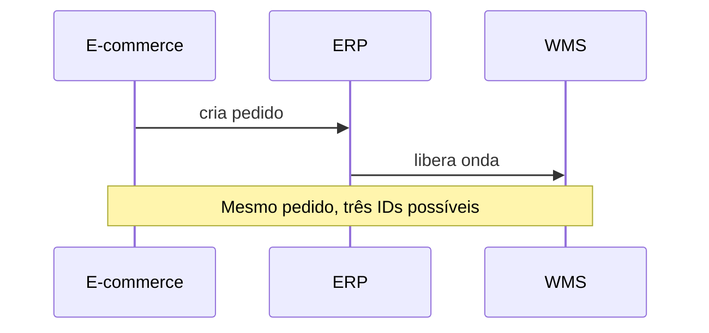

# Qualidade, viés e demanda «fantasma» — quando o histórico mente com boas intenções

O sistema registrou **zero** unidades vendidas num dia. O analista conclui «falta de demanda». Na doca, a verdade era **ruptura**: havia fila de pedidos, mas nada para separar. **Qualidade de dados** em logística não é «campo sem nulo»; é **coerência com o processo físico** e consciência dos **viéses** que distorcem forecast, OTIF e giro.

---

## Gancho — a série «linda» que destruiu o forecast

A TechLar celebrou um **MAPE** baixo num SKU de campanha. Na semana seguinte, **faltou** produto: o modelo aprendera padrão de **empurrão** e **promoção** sem variáveis explicativas. **Hipótese pedagógica:** modelos ingénuos «absorvem» eventos não rotulados como se fossem clima.

---

## Viés de ruptura e censura de demanda

Quando o cliente não consegue comprar, **vendas observadas** subestimam **demanda latente**. Em *analytics* de reposição, tratar zero como «frio» infla erros de **nível de serviço** e de forecast. **Consenso de mercado:** registrar **stockout**, **backorder** ou «pedido não atendido» como evento próprio — senão, o buraco vira **invisível** no gráfico.

**Analogia do hospital:** fila zero no sistema pode significar «ninguém adoeceu» ou «ninguém foi atendido» — a diferença não é estética.

---

## Promoção, *push* e calendário de eventos

Campanhas deslocam volume no tempo. Se o calendário de promoções **não** entra como metadado, o modelo confunde **efeito estrutural** com **ruído**. Para análise descritiva, basta uma **dimensão** «em promoção?» com vigência; para forecast avançado, ver trilha de Fundamentos e Hyndman & Athanasopoulos.

---

## Duplicidade e «dois ERPs na cabeça»

Pedido criado no e-commerce, **recriado** no ERP com outro ID, **mesclado** na exportação do WMS — triplicidade clássica. Regra prática: **uma chave canónica** por pedido ou por linha, documentada; *merge* com regra de **prioridade** («fonte A vence data de criação»).

---

## Reconciliação entre bases — o exercício da divergência aceitável

1. Escolha uma métrica simples (ex.: **contagem de pedidos do dia D**).  
2. Calcule em **duas fontes** (ex.: ERP *vs.* WMS).  
3. Explique **toda** diferença > 0 com hipótese testável (atraso de integração, cancelamento, *timezone*).

Na TechLar, **5%** de divergência pode ser «normal» se o critério for **criado** *vs.* **liberado** — o erro é julgar sem **critério escrito**.

---

## Exercício

Liste **seis** causas de «demanda fantasma» ou de série de vendas **não interpretável** como demanda, com uma **ação de dados** para cada uma (não precisa ser técnica de TI — pode ser processo).

**Gabarito pedagógico:** ruptura; devolução contada como venda; **B2B** com faturamento defasado; **bundle** que muda composição; **marketplace** com cancelamento tardio; **ajuste** manual de inventário sem nota; ação = evento/registo ou reconciliação com dono.

---

## Erros comuns

- Imputar zero com média «para não quebrar o gráfico» sem marcar imputação.  
- Misturar **pedido** cancelado tarde com **linha** ativa.  
- Ignorar **fuso** entre CD e *data center* do SaaS.

---

## Referências

1. HYNDMAN, R. J.; ATHANASOPOULOS, G. *Forecasting: Principles and Practice* — capítulos sobre dados e qualidade de série. https://otexts.com/fpp3/  
2. CHOPRA, S.; MEINDL, P. *Supply Chain Management* — drivers de informação e distorções. Pearson.  
3. FEW, S. *Signal* — leitura sobre variabilidade e apresentação honesta.  
4. CSCMP — Glossário: https://cscmp.org/CSCMP/cscmp/educate/scm_definitions_and_glossary_of_terms.aspx  

---

## Fechamento

Dados bons **falam** do processo; dados maus **escondem** o processo. A primeira análise é quase sempre **auditoria**, não «*insight*».

**Pergunta:** que divergência entre ERP e WMS a sua empresa **explica** hoje em uma frase?
