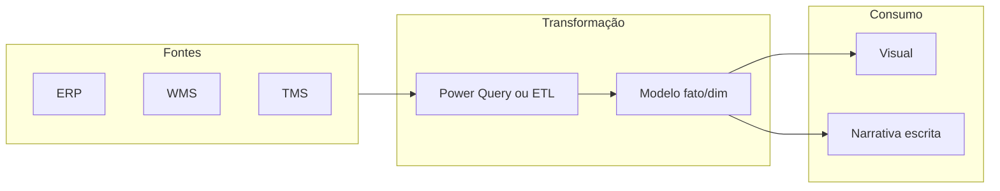

# Visualização e narrativa para logística — gráfico certo para decisão certa

Gráfico não é enfeite; é **argumento** com eixo. Em logística, os erros clássicos são **escalas** que escondem a cauda, **barras empilhadas** que impedem comparar categorias, e **mapas de calor** bonitos sem **denominador**. A boa prática — defendida por Stephen Few e por comunidades de *data storytelling* — é **mostrar o contexto** (meta, banda, histórico) e **nomear a incerteza** quando ela existe.

---

## Gancho — o «OTIF subiu» com eixo truncado

Na reunião da TechLar, o slide mostra OTIF a «subir» de 92% para 94%. O eixo Y começa em **90%**. Moralmente questionável; cognitivamente **enganoso**. A mesma informação com eixo **0–100%** conta outra história: ganho real, mas pequeno — talvez **não** priorizar frente a custo de campanha.

---

## Escolha de forma — o que cada forma faz bem

| Necessidade | Forma frequentemente útil | Cuidado |
|-------------|-----------------------------|---------|
| Comparar categorias (região, transportadora) | Barras horizontais ordenadas | Poucas categorias; rótulos claros |
| Tendência temporal | Linha ou colunas esparsas | Sazonalidade; marcar eventos |
| Distribuição de lead time | Histograma ou *boxplot* | **P90** visível; não só média |
| Parte-do-todo **quando** as partes são estáveis | *Stacked bar* com moderação | Evitar se partes competem na percepção |

**Analogia do trânsito:** mapa de calor de congestionamento sem «**número de viagens**» é decoração; com denominador, vira **prioridade de rota**.

---

## Pipeline de dados até o gráfico — uma linha de visão

**Legenda:** «Narrativa» é texto que diz **decisão** sugerida e **limite** do gráfico (o que não mostra).

---

## Mini-*dashboard* no papel (wireframe)

Desenhe **três** visuais para o gerente de expedição da TechLar: (1) **OTD** do CD (embarque vs promessa interna); (2) **backlog** de ondas por idade; (3) **top 10** SKUs por linhas de pedido abertas. Abaixo de cada uma, **uma** frase de ação («se X > Y, acionar *picking* noturno»).

**Gabarito pedagógico:** não há desenho único — avalie se os três visuais usam **o mesmo critério temporal** e se evitam **double counting** de linhas.

---

## Erros comuns

- Curvas suavizadas que **apagam** picos operacionais.  
- Cores sem legenda acessível.  
- Misturar **%** e valores absolutos no mesmo eixo.

---

## Referências

1. FEW, S. *Now You See It* — percepção visual aplicada a análise. Analytics Press.  
2. FEW, S. *Show Me the Numbers* — tabelas eficazes.  
3. FEW, S. *The Chartjunk Debate* (artigos e blog) — economia de tinta e honestidade de escala.  
4. Microsoft — boas práticas de **relatórios** Power BI: https://learn.microsoft.com/power-bi/guidance/  

---

## Fechamento

O melhor gráfico logístico é aquele que **sobrevive** à pergunta «qual decisão muda se eu acreditar nisto?».

**Pergunta:** qual visual na sua empresa **não** tem denominador explícito?
