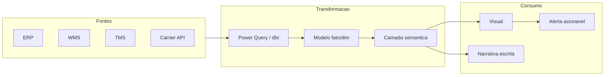

# Visualização e narrativa para logística — gráfico certo para decisão certa

Gráfico não é enfeite; é **argumento** com eixo. Em logística, os erros clássicos são **escalas truncadas** que escondem a cauda, **barras empilhadas** que impedem comparar categorias, **mapas de calor** bonitos sem **denominador** e **gauges** que viram pop art. A boa prática — defendida por **Stephen Few**, **Cole Nussbaumer** e a comunidade de *data storytelling* — é **mostrar o contexto** (meta, banda, histórico, distribuição) e **nomear a incerteza** quando ela existe.

---

## Objetivos e resultado de aprendizagem

- Escolher a **forma visual** adequada à **pergunta** (comparar, distribuir, evoluir, decompor).
- Aplicar a **gramática de gráficos** (escala honesta, *small multiples*, *boxplot*, *bullet chart*).
- Estruturar **narrativa** com **lead**, **evidência**, **decisão** (modelo BLUF + SCQA).
- Construir um **wireframe** de painel com hierarquia visual.
- Identificar **gauges de vaidade** e substituí-los por visuais com **ação**.

**Duração:** 50–70 min. **Pré-requisitos:** [Aula 1.1](aula-01-do-problema-ao-dataset.md) e [Aula 1.2](aula-02-qualidade-vies-demanda-fantasma.md); noção de Excel ou Power BI.

---

## Mapa do conteúdo

1. Gancho — o «OTIF subiu» com eixo truncado.
2. Pergunta antes de gráfico — taxonomia de Cleveland/Few.
3. Catálogo de formas (com armadilhas).
4. Diagrama do pipeline dado → gráfico → narrativa.
5. Storytelling — BLUF, SCQA, *anchor* + *delta*.
6. Wireframe de painel TechLar (operacional × executivo).
7. Acessibilidade WCAG aplicada a dashboards.
8. Erros comuns, ferramentas, glossário.
9. Exercício, reflexão, fechamento, referências, pontes.

---

## Gancho — o «OTIF subiu» com eixo truncado

Na reunião da TechLar, o slide mostra **OTIF a subir de 92% para 94%**. O eixo Y começa em **90%**. Moralmente questionável; cognitivamente **enganoso** (a barra parece **dobrar**). A mesma informação com eixo **0–100%** conta outra história: **ganho real, mas pequeno** — talvez **não** priorizar frente a custo de campanha.

> **Analogia do trânsito:** mapa de calor de congestionamento sem **número de viagens** é decoração; com denominador, vira **prioridade de rota**. Sem escala honesta, é **propaganda**.

---

## Pergunta antes de gráfico — taxonomia operacional

| Pergunta | Forma frequentemente útil | Forma a evitar |
|----------|---------------------------|----------------|
| **Comparar categorias** (região, transportadora) | Barras horizontais ordenadas | Pizza com >5 fatias; *radar* |
| **Tendência temporal** | Linha com *small multiples*; **sparkline** | Pizza com tempo; barras 3D |
| **Distribuição** (lead time, peso) | Histograma + **boxplot** | Média sozinha em cartão |
| **Composição** (modal, canal) | Barras 100% **estável**; *treemap* | *Stacked* com 8 cores |
| **Correlação** | *Scatter*; *small multiples* condicionados | Linha conectando categorias |
| **Performance vs meta** | *Bullet chart* (Few); cartão + banda | Velocímetro / *gauge* |
| **Geográfica com denominador** | Coroplético com normalização | Bolha sem normalização |

**Heurística de Cleveland:** posição em escala comum > comprimento > ângulo > área > cor > volume. **Pergunta-antes-de-gráfico** é a vacina contra «achar bonito».

---

## Pipeline dados → gráfico → narrativa



**Legenda:** «Narrativa» é texto que diz **decisão** sugerida e **limite** do gráfico (o que não mostra). Sem narrativa, o gráfico é uma **frase sem verbo**.

---

## Storytelling — BLUF + SCQA + *anchor* / *delta*

Três frameworks complementares:

- **BLUF (*Bottom Line Up Front*):** comece pela **conclusão**. *Ex.:* «OTIF caiu 3 pp esta semana por causa do CD-RJ; recomendo *war room* com transportadora X.»
- **SCQA (Minto):** *Situation* → *Complication* → *Question* → *Answer*. Útil em e-mail executivo.
- ***Anchor* + *Delta*:** todo número exibido tem **âncora** (meta, ano anterior, banda) e **delta** (variação interpretável). Sem âncora, número é **abstração**.

> **Analogia do médico:** «pressão 130/85» sozinho não diz nada. Com âncora («faixa normal 120/80») e delta («subiu 10 em 30 dias»), vira **decisão**.

---

## Catálogo de visuais com armadilhas

### Cartão de KPI (correto)

```
┌──────────────────────────────┐
│ OTIF semana            93,2% │
│ ▲ +0,8 pp vs sem. anterior   │
│ Meta 95% | Pior canal: B2B   │
└──────────────────────────────┘
```

- **Anchor:** meta 95% e «pior canal».
- **Delta:** +0,8 pp.
- **Sem velocímetro.**

### *Bullet chart* (Stephen Few)

Substitui o velocímetro: barra horizontal com **meta** (linha vertical) e **bandas** (vermelho/amarelo/verde). Permite comparar **dezenas** de KPIs no mesmo espaço de **um** *gauge*.

### *Small multiples*

Várias mini-séries com **eixo idêntico** lado a lado (ex.: 12 meses por canal). Resolve a **selva** de uma série única com 8 cores.

### Histograma + boxplot de **lead time**

- Histograma mostra **distribuição** e modais.
- Boxplot mostra **mediana**, **quartis** e **outliers** — visualmente mais honesto que «média ± desvio».

---

## Wireframe — painel TechLar

### Página operacional (turno da manhã)

```
┌──────────────────────────────────────────────────────────┐
│ TechLar · Expedicao · Selo qualidade [VERDE] · 07:42  ⟳  │
├──────────────────────────────────────────────────────────┤
│ [Cartao OTIF dia]  [Cartao Fill linha]  [Cartao SLA POD] │
├──────────────────────────────────────────────────────────┤
│ Tabela exceções (ordenada por idade do backlog)          │
│ pedido | cliente | linhas | idade | acao sugerida        │
├──────────────────────────────────────────────────────────┤
│ Mini-tendencia 14d (small multiples por canal)           │
└──────────────────────────────────────────────────────────┘
```

### Página executiva (CFO/COO)

```
┌──────────────────────────────────────────────────────────┐
│ TechLar · Performance · Mes fechado abr/2026             │
├──────────────────────────────────────────────────────────┤
│ [OTIF mensal vs meta - bullet]  [Capital estoque - card] │
├──────────────────────────────────────────────────────────┤
│ Linha YoY OTIF + banda de confianca                      │
├──────────────────────────────────────────────────────────┤
│ Mapa BR: cobertura em dias por CD                        │
├──────────────────────────────────────────────────────────┤
│ Narrativa: 3 bullets BLUF + 2 acoes recomendadas         │
└──────────────────────────────────────────────────────────┘
```

**Princípio Z:** olho ocidental varre **da esquerda para a direita, de cima para baixo** — o KPI mais importante vai no **canto superior esquerdo**.

---

## Acessibilidade (WCAG mínimo)

- **Contraste** ≥ 4.5:1 para texto sobre cor.
- **Não codificar só por cor**: usar forma + rótulo (`▲▼`, ícone, padronagem).
- **Paleta amigável a daltonismo**: evitar verde/vermelho **sem reforço**; preferir azul/laranja, ColorBrewer.
- **Foco em teclado** em dashboards web; alt-text em visuais publicados.
- **Tamanho mínimo** de fonte legível em sala (≥ 14 pt em projetor).

---

## Trade-offs visuais

| Decisão | Mais honesto | Mais «vendável» | Quando ceder |
|---------|--------------|----------------|--------------|
| Eixo Y | 0 a máximo natural | Truncado | **Nunca** sem indicar truncamento |
| Cor | Categorica neutra | Verde/vermelho | Quando usuário exige semáforo — **adicione forma** |
| Smoothing | Nenhum | Suavizado | Apresentação executiva longa-data; **nunca** operacional |
| Cartão | Número + delta + âncora | Número grande sozinho | Cartaz publicitário, não dashboard |

---

## Erros comuns e armadilhas

- **Eixo Y truncado** sem indicador.
- **Velocímetro** para 12 KPIs (vira parquinho).
- **Curvas suavizadas** que apagam picos operacionais.
- **Cores** sem legenda acessível (verde/vermelho que daltônico não vê).
- Misturar **%** e valores absolutos no mesmo eixo.
- Painel com **20+ visuais** sem hierarquia (síndrome do «tudo no ecrã»).
- Gráfico sem **denominador** (mapa de calor sem `n` por região).
- Cartão sem **anchor** (94% solto, sem meta nem comparador).

---

## Dicionário operacional do visual

| Campo | Valor |
|-------|-------|
| **Visual** | `OTIF semanal vs meta` |
| **Pergunta** | «Cumprimos a meta semanal por canal?» |
| **Persona** | Diretor de operações |
| **Forma** | *Bullet chart* horizontal por canal |
| **Anchor** | Meta 95% e ano anterior |
| **Delta** | pp vs semana anterior |
| **Cores** | Cinza neutro, marca em azul; alertas em laranja (não vermelho) |
| **Texto fixo abaixo** | Ação se < 92% |
| **Atualização** | Dom 23h00 (ciclo semanal) |

---

## Ferramentas e tecnologias

- **Excel:** gráficos com `LET` e `LAMBDA` para visuais reproduzíveis; ColorBrewer.
- **Power BI:** *core visuals*, marketplace (deneb/Vega-Lite), **smart narrative**.
- **Tableau:** *bullet*, *box*, *small multiples* nativos.
- **Looker Studio / Looker:** *blended* + LookML.
- **Vega-Lite, Plotly, ggplot:** quando o BI corporativo limita.
- **AI copilots:** Power BI Copilot e Tableau Pulse geram **rascunho** de narrativa — revise sempre.

---

## Glossário rápido

- **BLUF:** *Bottom Line Up Front*.
- **SCQA:** *Situation–Complication–Question–Answer* (McKinsey/Minto).
- **Bullet chart:** alternativa de Stephen Few ao velocímetro.
- **Small multiples:** matriz de mini-gráficos com eixos idênticos.
- **Pre-attentive attributes:** posição, cor, tamanho — percebidos em < 250 ms.

---

## Aplicação — exercício

1. Escolha um gráfico real do seu trabalho com **eixo truncado** ou **gauge**.
2. Reformule em **bullet chart** ou **cartão com anchor + delta**.
3. Escreva a **narrativa BLUF** em 3 frases (conclusão → evidência → ação).
4. Aponte **um** elemento que viola WCAG.
5. Liste **uma** decisão que mudaria com o novo visual.

**Gabarito pedagógico:** avalie se a reformulação preservou a **informação** sem o **truque visual**, e se a narrativa BLUF começou pela **conclusão acionável**.

---

## Pergunta de reflexão

Qual visual na sua empresa **não tem denominador explícito** — e quem decide com base nele todo dia?

---

## Fechamento — takeaways

- O melhor gráfico logístico é o que **sobrevive** à pergunta «qual decisão muda se eu acreditar nisto?».
- **Anchor + delta + ação** convertem número em decisão.
- **Velocímetro morre**; *bullet chart* vive.

---

## Referências

1. FEW, S. *Now You See It* / *Show Me the Numbers* / *Information Dashboard Design*. Analytics Press.
2. NUSSBAUMER KNAFLIC, C. *Storytelling with Data*. Wiley.
3. CLEVELAND, W. S. *The Elements of Graphing Data*. Hobart Press.
4. TUFTE, E. R. *The Visual Display of Quantitative Information*. Graphics Press.
5. MUNZNER, T. *Visualization Analysis and Design*. CRC.
6. ColorBrewer 2.0 — [colorbrewer2.org](https://colorbrewer2.org).
7. Microsoft — [Power BI guidance](https://learn.microsoft.com/power-bi/guidance/).
8. Tableau — [Best practices](https://help.tableau.com/current/pro/desktop/en-us/dashboards_best_practices.htm).
9. WCAG 2.2 — [W3C](https://www.w3.org/TR/WCAG22/).

---

## Pontes para outras trilhas

- Anterior: [Aula 1.2 — Qualidade e demanda fantasma](aula-02-qualidade-vies-demanda-fantasma.md).
- Próximo módulo: [Excel avançado para logística](../modulo-02-excel-avancado-para-logistica/README.md).
- Trilha Fundamentos — [KPIs logísticos](../../trilha-fundamentos-e-estrategia/modulo-04-custos-logisticos-performance/aula-03-nivel-servico-kpis-logisticos.md).
