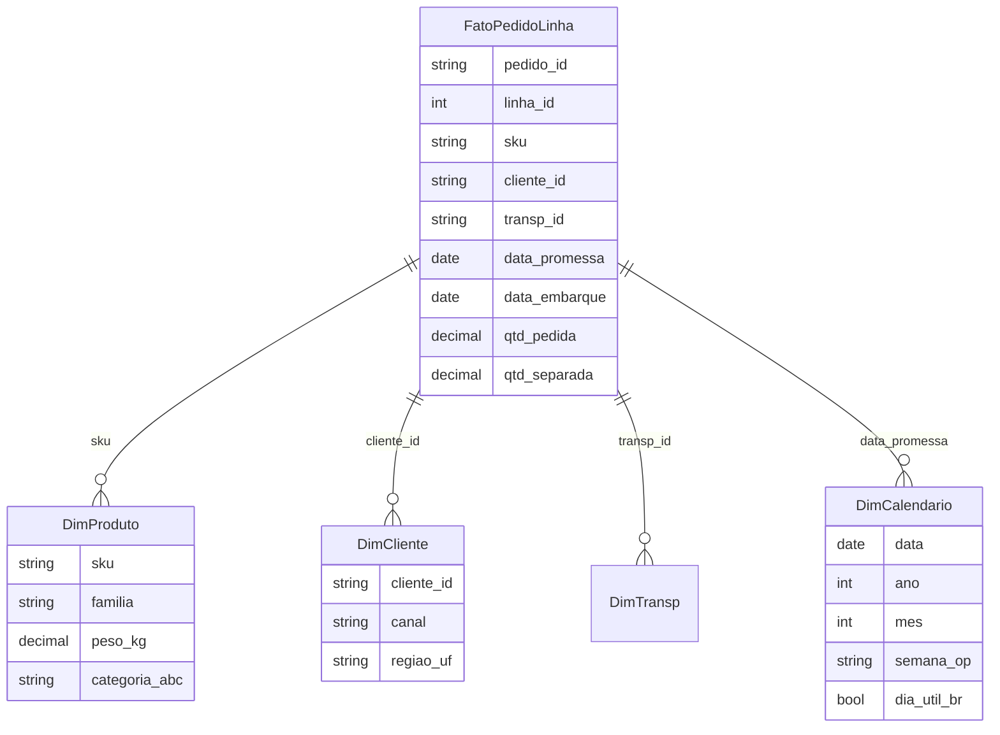

# Modelagem tabular para logística — tabelas, chaves e o fim do «mar de PROCV»

Excel deixou de ser só célula: com **Tabela** (`Ctrl+T`), **Modelo de Dados** (Power Pivot), funções dinâmicas (`XLOOKUP`, `LET`, `LAMBDA`, `FILTER`) e **DAX**, você aproxima-se da lógica de **Power BI** sem sair da ferramenta que ainda manda na **mesa do planejador**. Para logística, o ganho é **uma verdade** por pedido, linha ou embarque — e relatórios que **atualizam** sem arrastar fórmula frágil por dez mil linhas.

---

## Objetivos e resultado de aprendizagem

- Desenhar **fato + dimensões** em Excel para uma operação logística.
- Configurar o **Modelo de Dados** com **relacionamentos** muitos-para-um.
- Aplicar **chave canónica** e detetar **anti-join** (linhas órfãs).
- Substituir `PROCV` por **`XLOOKUP`** e **`SUMIFS`** em fluxos críticos.
- Usar **`LET`** e **`LAMBDA`** para expressões legíveis e reutilizáveis.
- Construir uma **DimCalendario** explícita para análises temporais honestas.

**Duração:** 50–70 min. **Pré-requisitos:** Excel intermediário (tabelas, fórmulas), conceitos de [Aula 1.1](../modulo-01-data-analytics-para-logistica/aula-01-do-problema-ao-dataset.md).

---

## Mapa do conteúdo

1. Gancho — a planilha que «quebrou» na sexta-feira.
2. Conceito — fato, dimensão e chave canónica em planilha.
3. Modelo de dados no Excel (Power Pivot, relacionamentos).
4. ER conceitual + tabela de tabelas (tipo, grão, colunas-chave).
5. Funções modernas: `XLOOKUP`, `SUMIFS`, `FILTER`, `LET`, `LAMBDA`.
6. Anti-padrão `PROCV` → padrão `XLOOKUP` (com benchmark).
7. DimCalendario explícita.
8. Caso prático com gabarito numérico.
9. Trade-offs Excel × Power BI × notebook.
10. Erros comuns, dicionário, ferramentas, glossário.
11. Exercícios, reflexão, fechamento, referências, pontes.

---

## Gancho — a planilha que «quebrou» na sexta-feira

Na TechLar, o ficheiro **`Expedicao_semana_47.xlsx`** tinha **sete abas** com `PROCV` entre exportações de WMS, TMS e planilha comercial. Um **espaço extra** no código de transportadora derrubou **meia hora** de reunião. Modelagem tabular não é snobismo; é **seguro de vida** para quem precisa dormir na sexta.

> **Analogia da cozinha:** sete abas de `PROCV` é como sete tigelas onde a receita está espalhada — quem prepara o prato precisa decorar a ordem. **Modelo tabular** é o caderno com **etapas, ingredientes e medidas** numa única página.

---

## Conceito-núcleo — fato, dimensão e chave canónica

| Tabela | Tipo | Grão | Colunas-chave | Cardinalidade típica |
|--------|------|------|---------------|----------------------|
| `FatoPedidoLinha` | Fato | 1 linha = 1 linha de pedido | `pedido_id`, `linha_id`, `sku`, `cliente_id`, `transp_id`, `data_promessa`, `data_embarque`, `qtd_pedida`, `qtd_separada` | 10⁵–10⁷/ano |
| `FatoEntrega` | Fato | 1 linha = 1 entrega POD | `pedido_id`, `data_pod`, `tipo_pod` | 10⁵–10⁶ |
| `DimProduto` | Dimensão | 1 SKU | `sku`, `familia`, `peso_kg`, `cubagem_m3`, `categoria_abc` | 10³–10⁵ |
| `DimCliente` | Dimensão | 1 cliente | `cliente_id`, `canal`, `regiao_uf`, `segmento` | 10³–10⁵ |
| `DimTransp` | Dimensão | 1 transportadora | `transp_id`, `modal`, `parceiro` | 10–100 |
| `DimCalendario` | Dimensão | 1 dia | `data`, `ano`, `mes`, `ano_mes`, `semana_op`, `feriado`, `dia_util_br` | 365 × N anos |

**Chave canónica:** `pedido_id` + `linha_id` no fato; `sku` em produto; `cliente_id` em cliente; nunca aceite chave **gerada na cabeça** («junte canal+CEP»).



**Legenda:** diagrama conceitual; nomes podem espelhar o seu ERP, mas **nunca** o nome do botão de exportação («Export 03_FINAL_v2.xlsx»).

---

## Modelo de dados no Excel (passo a passo)

1. Em cada tabela, `Ctrl+T` → **renomear** (`tbl_FatoPedidoLinha`, `tbl_DimProduto` …).
2. **Dados** → **Modelo de Dados** → **Gerenciar** → **Diagram View**.
3. Arrastar `tbl_FatoPedidoLinha[sku]` → `tbl_DimProduto[sku]` (cardinalidade muitos-para-um).
4. Repetir para `cliente_id`, `transp_id`, `data_promessa` (→ `DimCalendario.data`).
5. **PivotTable** → **Usar Modelo de Dados desta pasta de trabalho**.
6. Em qualquer Pivot, **ano-mês** vem da `DimCalendario` (não da fato).

**Anti-join (achado de cadastro):** linhas de fato sem `sku` na dimensão aparecem como **(em branco)** na pivot — diagnóstico **gratuito** de cadastro. Use `=COUNTROWS(FILTER(tbl_FatoPedidoLinha[sku]; ISNA(XMATCH(tbl_FatoPedidoLinha[sku]; tbl_DimProduto[sku]))))` para quantificar.

---

## Funções modernas — receita prática

### `XLOOKUP` substitui `PROCV`/`PROCH`/`ÍNDICE+CORRESP`

```excel
= XLOOKUP(
    [@sku];                    // valor a procurar
    tbl_DimProduto[sku];       // vetor de pesquisa
    tbl_DimProduto[familia];   // vetor de retorno
    "SEM CADASTRO";            // se não achar
    0                          // correspondência exata
  )
```

Vantagens vs `PROCV`:

- **Não exige** chave na primeira coluna.
- **Devolve** texto custom em vez de `#N/D`.
- **Performance** melhor em volumes grandes.
- Trabalha **horizontal** e **vertical**.

### `SUMIFS` para fato somado por dimensão

```excel
= SUMIFS(
    tbl_FatoPedidoLinha[qtd_separada];
    tbl_FatoPedidoLinha[sku];          [@sku];
    tbl_FatoPedidoLinha[data_embarque]; ">="&D$1;
    tbl_FatoPedidoLinha[data_embarque]; "<="&D$2
  )
```

### `LET` — variáveis intermédias dentro da fórmula

```excel
= LET(
    qped;     SUM(tbl_FatoPedidoLinha[qtd_pedida]);
    qsep;     SUM(tbl_FatoPedidoLinha[qtd_separada]);
    fillrate; IFERROR(qsep/qped; 0);
    TEXT(fillrate; "0,0%")
  )
```

### `LAMBDA` — função reutilizável (Excel 365)

```excel
// Defina via Gerenciador de Nomes:
FillRateLinha = LAMBDA(qped; qsep;
  IFERROR(SUMX(qsep)/SUMX(qped); 0)
)

// Uso:
= FillRateLinha(tbl_FatoPedidoLinha[qtd_pedida]; tbl_FatoPedidoLinha[qtd_separada])
```

### `FILTER` + `SORT` + `UNIQUE` (matrizes dinâmicas)

```excel
// Top 10 SKUs com fill rate < 90% nas últimas 4 semanas
= TAKE(
    SORTBY(
      FILTER(
        tbl_DimProduto[[sku]:[familia]];
        FillRatePorSku(tbl_DimProduto[sku]) < 0,9
      );
      FillRatePorSku(tbl_DimProduto[sku]); 1
    );
    10
  )
```

> **Regra prática:** se a fórmula tem 3 níveis de parêntese, **embrulhe em `LET`**. Se ela aparece em 5 lugares, **vire `LAMBDA`** com nome falante.

---

## Anti-padrão × padrão

| Anti-padrão | Sintoma | Substituto |
|-------------|---------|------------|
| `PROCV` em coluna fixa A:E | Lentidão, `#N/D`, quebra ao inserir coluna | `XLOOKUP` em tabela nomeada |
| Soma com `=SOMA(B2:B99999)` | Nulos, lentidão | `SUMIFS` em tabela |
| `=SE(SE(SE(...))` aninhado | Ilegível | `LET` + `IFS` |
| Cópia colada de SKUs entre abas | Cadastro divergente | `DimProduto` única + `XLOOKUP` |
| Datas como texto | Pivots quebram | `DimCalendario` + `DATEVALUE` no Power Query |

---

## DimCalendario explícita

Sem calendário próprio, semana operacional vira «achismo cronológico». Crie em Excel ou Power Query:

```excel
// Em uma célula vazia, gere 5 anos de calendário
= LET(
    ini; DATE(2024;1;1);
    n;   365*5;
    seq; SEQUENCE(n;1;ini;1);
    HSTACK(
      seq;
      YEAR(seq);
      MONTH(seq);
      TEXT(seq;"AAAA-MM");
      WEEKNUM(seq;21);
      WORKDAY.INTL(seq-1;1;1)=seq    // dia útil seg-sex sem feriados
    )
  )
```

Adicione coluna `feriado` por `XLOOKUP` numa lista BR (ANBIMA / governo). Promova para **Tabela** e marque como **Tabela de Datas** no Power Pivot.

---

## Caso prático — TechLar, fill rate por canal

Dados (3 SKUs, 6 linhas):

| pedido_id | linha_id | sku | cliente_id | qtd_pedida | qtd_separada |
|-----------|----------|-----|------------|------------|--------------|
| 101 | 1 | A1 | C1 | 10 | 10 |
| 101 | 2 | B2 | C1 | 5  | 4  |
| 102 | 1 | A1 | C2 | 8  | 8  |
| 102 | 2 | C3 | C2 | 4  | 0  |
| 103 | 1 | B2 | C3 | 6  | 6  |
| 103 | 2 | C3 | C3 | 2  | 2  |

`DimCliente`: C1=site, C2=marketplace, C3=B2B.

**Fórmula DAX (Power Pivot) para fill rate por canal:**

```dax
FillRateLinha :=
DIVIDE(
    SUM(tbl_FatoPedidoLinha[qtd_separada]),
    SUM(tbl_FatoPedidoLinha[qtd_pedida])
)
```

**Cálculo manual:**

| Canal | qtd_pedida | qtd_separada | fill rate |
|-------|-----------|--------------|-----------|
| site | 15 | 14 | 93,3% |
| marketplace | 12 | 8 | 66,7% |
| B2B | 8 | 8 | 100,0% |
| **Total** | **35** | **30** | **85,7%** |

**Interpretação:** marketplace mostra problema **escondido** quando se olha só o agregado. *Drill* por canal é **decisão**, não estética. Em farmácia ou varejo grande, um **fill rate por linha < 92%** é gatilho para **revisão de SLA** com fornecedores.

---

## Trade-offs

| Cenário | Excel + Power Pivot | Power BI | Notebook (Python/SQL) |
|---------|---------------------|----------|------------------------|
| Volume | até ~1–10 M linhas | até ~100 M com agregações | ilimitado |
| Distribuição | arquivo | publicado web/app | ad-hoc / pipeline |
| Governança | fraca | RLS, *workspace* | git + revisão |
| Time-to-first-chart | minutos | horas | horas-dias |
| Reuso | limitado | medidas reutilizáveis | funções, classes |

**Heurística:** comece em Excel até dor de **performance** ou **distribuição**; suba para Power BI. Notebook entra quando há **modelo estatístico** ou pipeline reproduzível.

---

## Erros comuns e armadilhas

- Duplicar SKU na dim produto (Pivot multiplica fato).
- Misturar **cabeçalho de exportação** com dados (linhas 1–3 «lixo»).
- **Mesclar células** no modelo (Pivot quebra).
- Datas como **texto** importadas de PDF.
- Relacionamento **muitos-para-muitos** sem necessidade.
- `PROCV` em arquivo aberto **a cada cálculo**.
- Esquecer **DimCalendario** e usar `MONTH()` direto na fato.

---

## Dicionário operacional (template para a planilha)

| Campo | Valor |
|-------|-------|
| **Medida** | `FillRateLinha` |
| **Definição** | soma `qtd_separada` ÷ soma `qtd_pedida` ao nível linha |
| **Exclusões** | linhas de cortesia (`tipo='cortesia'`); pedidos de teste |
| **Granularidade** | linha de pedido |
| **Dono** | Coordenação de Suprimentos |
| **Fonte** | `tbl_FatoPedidoLinha` (origem WMS) |
| **Cadência** | diária 06h00 |
| **Versão** | v1.0 — abr/2026 |

---

## Ferramentas e tecnologias

- **Excel 365 / 2024** (matrizes dinâmicas, `LAMBDA`, `LET`, `XLOOKUP`).
- **Power Pivot** + **Power Query** (**Aula 2.2**).
- **Office Scripts** ou **VBA** para automação de *refresh*.
- **SharePoint / OneDrive** para versionamento mínimo.
- **Power BI Desktop** quando o ficheiro passar a doer.

---

## Glossário rápido

- **Fato:** tabela longa com medidas observadas.
- **Dimensão:** tabela curta com contexto descritivo.
- **Pivot:** tabela dinâmica.
- **Anti-join:** linhas do fato sem correspondência na dimensão.
- **Modelo de Dados:** motor xVelocity dentro do Excel (Power Pivot).
- **SCD2:** versionamento de atributos da dimensão por linha histórica.

---

## Aplicação — exercícios

1. Desenhe **três tabelas** (fato + 2 dim) com 5 colunas cada para a sua operação.
2. Reescreva 1 fórmula `PROCV` real em `XLOOKUP` com mensagem de fallback.
3. Crie a `DimCalendario` com `SEQUENCE` (5 anos) e marque feriados nacionais.
4. Use `LET` para uma medida com 3 variáveis internas.
5. Execute o anti-join: quantas linhas de fato órfãs existem?

**Gabarito pedagógico:** revise se (a) chave do fato é única, (b) `XLOOKUP` tem fallback, (c) `DimCalendario` está marcada como **Tabela de Datas** no Power Pivot, (d) anti-join expõe ≥ 1 SKU descadastrado.

---

## Pergunta de reflexão

Qual relacionamento hoje só existe **na cabeça** do planejador — e o que acontece quando ele tirar férias?

---

## Fechamento — takeaways

- Modelo tabular é **contrato de chaves**, não estilo gráfico.
- `PROCV` morre, `XLOOKUP` reina; `LET` e `LAMBDA` viram fórmula em **prosa**.
- **DimCalendario própria** é fundação de toda análise temporal honesta.

---

## Referências

1. Microsoft — [Criar um modelo de dados no Excel](https://learn.microsoft.com/office/excel/create-a-data-model).
2. Microsoft — [Visão geral de tabelas](https://support.microsoft.com/office/overview-of-excel-tables).
3. Microsoft — [LET](https://support.microsoft.com/office/let-function), [LAMBDA](https://support.microsoft.com/office/lambda-function), [XLOOKUP](https://support.microsoft.com/office/xlookup-function).
4. KIMBALL, R.; ROSS, M. *The Data Warehouse Toolkit*. Wiley.
5. RUSSO, M.; FERRARI, A. *Analyzing Data with Power BI and Power Pivot for Excel*. Microsoft Press.
6. SQLBI — [DAX Patterns](https://www.daxpatterns.com/).

---

## Pontes para outras trilhas

- Próxima aula: [Aula 2.2 — Power Query](aula-02-power-query-pratica-logistica.md).
- [Aula 1.1 — Do problema ao dataset](../modulo-01-data-analytics-para-logistica/aula-01-do-problema-ao-dataset.md).
- Trilha Fundamentos — [KPIs logísticos](../../trilha-fundamentos-e-estrategia/modulo-04-custos-logisticos-performance/aula-03-nivel-servico-kpis-logisticos.md).
