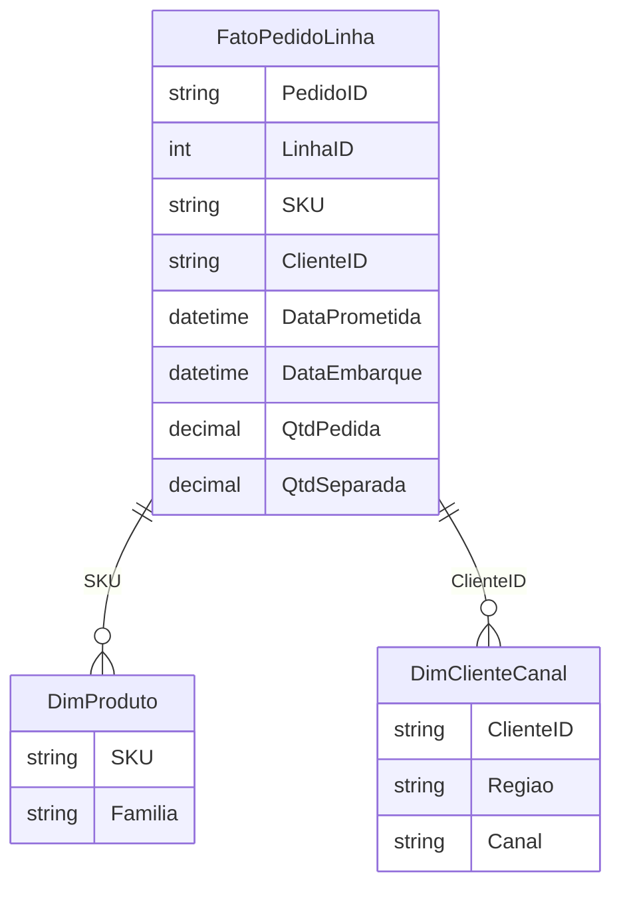

# Modelagem tabular para logística — tabelas, chaves e o fim do «mar de PROCV»

Excel deixou de ser só célula: com **Tabela** (*Ctrl+T*), **Modelo de Dados** e relacionamentos, você aproxima-se da lógica de **Power BI** sem sair da ferramenta que ainda manda no chão. Para logística, o ganho é **uma verdade** por pedido, linha ou embarque — e relatórios que **atualizam** sem arrastar fórmula frágil por dez mil linhas.

---

## Gancho — a planilha que «quebrou» na sexta-feira

Na TechLar, o ficheiro **Expedicao_semana_47.xlsx** tinha **sete abas** de `PROCV` entre exportações de WMS, TMS e planilha comercial. Um **espaço** a mais no código de transportadora derrubou **meia hora** de reunião. Modelagem tabular não é snobismo; é **seguro de vida** para quem precisa dormir.

---

## Tabelas oficiais — três papéis

1. **FatoPedidoLinha** — uma linha por **linha de pedido** com quantidade pedida, quantidade separada, data prometida, data embarque.  
2. **DimProduto** — SKU, família, peso cubado.  
3. **DimClienteCanal** — cliente, região, canal (site *vs.* marketplace).

Chaves: `PedidoID` + `LinhaID` compostos no fato; `SKU` na dim produto; `ClienteID` na dim cliente.

**Legenda:** diagrama conceitual; nomes podem espelhar o seu ERP.

---

## Modelo de dados no Excel

**Dados** → **Gerenciar modelo de dados** → relacionamentos **muitos-para-um** do fato para as dimensões. Tabelas dinâmicas passam a ler o **modelo** (não só a faixa). Medidas **DAX** (Power Pivot) podem esperar na próxima aula; aqui o foco é **estrutura**.

**Anti-*join*:** linhas de fato sem SKU na dimensão aparecem como **em branco** na dinâmica — ótimo diagnóstico de **cadastro**.

---

## Exercício

Desenhe no papel (ou no Excel vazio) as **três** tabelas acima com **cinco** colunas cada no fato e **três** em cada dim. Escreva **uma** regra de negócio que só pode ser verificada **depois** de relacionar fato e dim (ex.: «pedidos marketplace com peso > 30 kg»).

**Gabarito pedagógico:** exemplo de regra: **custo de frete** por faixa de peso exige `DimProduto.peso` × fato; sem relacionamento, vira chute.

---

## Erros comuns

- Duplicar SKU na dim produto.  
- Misturar **cabeçalho** de exportação com dados (linhas 1–3 «lixo»).  
- Usar **mesclar** no modelo quando o correto é **dimensão** desnormalizada controlada.

---

## Referências

1. Microsoft — **Criar um modelo de dados no Excel**: https://learn.microsoft.com/office/excel/create-a-data-model  
2. KIMBALL, R.; ROSS, M. *The Data Warehouse Toolkit* — modelagem dimensional.  
3. Excel **Tabelas**: https://support.microsoft.com/office/overview-of-excel-tables  

---

## Fechamento

Modelo tabular é **contrato de chaves**. O Excel agradece; o WMS nem sempre — aí entra qualidade de cadastro (módulo 1).

**Pergunta:** qual relacionamento hoje só existe na **cabeça** do planejador?
