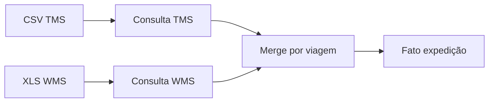

# Power Query na prática logística — ETL na bancada, sem pedir pizza para o TI

**Power Query** (*Obter e Transformar*) é o lugar onde a exportação «crua» do WMS vira **tabela limpa**: tipos corretos, datas unificadas, colunas renomeadas, junções com critério. Para o analista de logística, é a ponte entre **módulo 1** (qualidade e *grain*) e **painéis** reprodutíveis.

---

## Gancho — o ficheiro CSV «sempre» com encoding errado

A transportadora envia **CSV** em ANSI; o e-commerce exporta **UTF-8**. Na TechLar, caracteres acentuados viram «» e **chaves** deixam de bater. Power Query permite **fixar** origem, **tipo** de ficheiro e **locale** por consulta — documente isso no comentário da consulta ou num README da pasta.

---

## Padrão de consulta recomendado

1. **Conectar** à pasta ou ficheiro.  
2. **Tipar** cedo (`SKU` como texto, datas como *date*, quantidades como número decimal).  
3. **Renomear** passos com verbos (`RemoverLinhasCabecalhoDuplicado`).  
4. **Merge** com dimensões canónicas (transportadora, SKU).  
5. **Desativar** *load* de consultas intermediárias se só servirem de apoio (modelo mais leve).

---

## *Append* *vs.* *Merge*

- **Append:** empilhar exportações **iguais** (ex.: `Vendas_dia1.csv` + `Vendas_dia2.csv`).  
- **Merge:** trazer colunas de outra tabela pela **chave** (ex.: fato + dim transportadora).

**Analogia da cozinha:** *append* é **juntar** duas caixas de tomate do mesmo tipo; *merge* é **etiquetar** cada prato com a receita certa.

---

## Datas e fusos na TechLar

Converter **timestamp UTC** para **horário de Brasília** antes de comparar com **corte** do WMS. Uma hora errada vira **OTD** falso. Use `DateTimeZone.SwitchZone` ou equivalente na interface, conforme versão.

---

## Exercício

Descreva em **passos** (sem abrir Excel, se preferir) como consolidaria **OTD** (embarque até data interna) a partir de: (A) exportação WMS com `PedidoID`, `DataHoraEmbarque`; (B) exportação TMS com `PedidoID`, `DataHoraColeta`. O que fazer se (B) tiver **múltiplas** coletas por pedido?

**Gabarito pedagógico:** normalizar para **uma linha por pedido** com regra (`MIN` da coleta, ou última mile definida); documentar regra; *merge* por `PedidoID`; tratar nulos como «sem coleta».

---

## Erros comuns

- Referenciar **intervalo fixo** `A1:Z9999` em vez de **tabela** ou pasta dinâmica.  
- **Expandir** colunas demais no *merge* e duplicar linhas sem querer.  
- Não usar **pastas de trabalho** separadas para «brinquedo» *vs.* produção.

---

## Referências

1. Microsoft — **Power Query no Excel**: https://learn.microsoft.com/power-query/power-query-what-is-power-query  
2. Microsoft — **Combinar consultas** (*merge*): https://learn.microsoft.com/power-query/merge-queries  
3. FEW, S. — boas práticas de preparação antes de visualizar (conceito, não menu).

---

## Fechamento

Power Query é onde a **ética dos dados** encontra o **clique**: cada passo deve ser auditável amanhã.

**Pergunta:** qual consulta hoje ninguém sabe **refrescar** sem medo?
