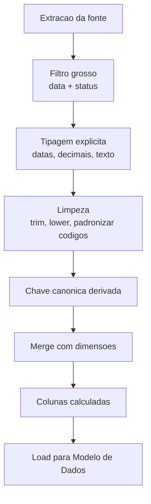

# Power Query na prática logística — ETL na bancada, sem pedir pizza para o TI

**Power Query** (*Obter e Transformar*) é o lugar onde a exportação «crua» do WMS vira **tabela limpa**: tipos corretos, datas unificadas, colunas renomeadas, junções com critério, fusos resolvidos. Para o analista de logística, é a ponte entre [Módulo 1](../modulo-01-data-analytics-para-logistica/README.md) (qualidade e *grain*) e **painéis** reprodutíveis. A linguagem por baixo é o **M** (case-sensitive, funcional) — vale aprender o básico para sair do «modo clique» quando o caso aperta.

---

## Objetivos e resultado de aprendizagem

- Conectar a **pasta de ficheiros** que cresce e tipá-los corretamente.
- Resolver **encoding**, **locale** e **fuso** logo no início do *pipeline*.
- Distinguir **Append** *vs.* **Merge** e identificar quando cada um se aplica.
- Escrever um **passo M** simples (não só clique) para limpeza recorrente.
- Aplicar **filtros pesados antes** dos *merges* (princípio do *query folding*).
- Documentar passos com **nomes em verbo** auditáveis.

**Duração:** 60–80 min. **Pré-requisitos:** [Aula 2.1](aula-01-modelagem-tabular-logistica.md); Excel 365 ou Power BI Desktop.

---

## Mapa do conteúdo

1. Gancho — o CSV que «sempre» vinha com encoding errado.
2. O fluxo recomendado de uma consulta logística.
3. Append × Merge × Group By — quando usar cada um.
4. Datas, fusos e horário de Brasília.
5. Linguagem M — anatomia de uma consulta.
6. Padrões úteis (anti-duplicidade, last-touch, snapshot).
7. Performance: query folding e *staging*.
8. Caso prático com gabarito (OTD a partir de WMS + TMS).
9. Trade-offs e governança.
10. Erros comuns, dicionário, ferramentas.
11. Exercícios, reflexão, fechamento, referências, pontes.

---

## Gancho — o CSV «sempre» com encoding errado

A transportadora envia **CSV** em **ANSI** (Windows-1252); o e-commerce exporta **UTF-8**. Na TechLar, caracteres acentuados viram «â» e **chaves** deixam de bater (`São Paulo` ≠ `S%C3%A3o Paulo`). Power Query permite **fixar** origem, **tipo** de ficheiro, **encoding** e **locale** por consulta — documente isso no comentário do passo ou num README da pasta.

> **Analogia da tradução:** importar dados sem declarar encoding é traduzir do japonês usando dicionário de português — algumas palavras parecem certas, mas o **sentido foge** sem aviso.

---

## Fluxo recomendado para uma consulta logística



**Princípios:**

1. **Conectar** à pasta ou ficheiro (não a uma aba congelada).
2. **Filtrar cedo** (período + status) — reduz volume e habilita *query folding*.
3. **Tipar cedo** (`sku` como **texto**, datas como `date`, quantidades como **número decimal**).
4. **Renomear passos com verbos**: `RemoverLinhasCabecalho`, `TiparColunas`, `MesclarDimProduto`.
5. **Merge** com dimensões canónicas só após chave normalizada.
6. **Desativar load** de consultas intermediárias (modelo mais leve).
7. **Documentar** com `// comentário` em M ou descrição da consulta.

---

## Append × Merge × Group By — escolha certa

| Operação | Quando usar | Exemplo logístico | Risco principal |
|----------|-------------|-------------------|-----------------|
| **Append** | Empilhar exportações **iguais** | `Vendas_dia1.csv` + `Vendas_dia2.csv` | Schemas divergentes silenciosos |
| **Merge** | Trazer colunas de outra tabela pela chave | Fato + `DimTransportadora` | Expandir colunas demais → duplicação |
| **Merge (left anti)** | Achar **órfãos** | Fato sem SKU em `DimProduto` | Ignorar achado e seguir |
| **Group By** | Mudar grão (linha → pedido) | `n_linhas`, `min(coleta)` por pedido | Perder dimensão sem agregar |

> **Analogia da cozinha:** *Append* é **juntar** duas caixas de tomate do mesmo tipo; *Merge* é **etiquetar** cada prato com a receita certa; *Group By* é **trocar o tamanho do prato**.

---

## Datas, fusos e horário de Brasília

CD na TechLar opera em `America/Sao_Paulo`; *carrier* envia *timestamp* em `UTC`; ERP guarda em `naive` local. Resolva **uma vez** no Power Query:

```m
// Converter UTC -> America/Sao_Paulo (BR sem horário de verão desde 2019)
let
    Fonte    = Csv.Document(File.Contents("tracking.csv"), [Encoding=65001]),
    Promov   = Table.PromoteHeaders(Fonte),
    Tipado   = Table.TransformColumnTypes(Promov, {{"event_at_utc", type datetimezone}}),
    Convert  = Table.AddColumn(Tipado, "event_at_brt",
                  each DateTimeZone.SwitchZone([event_at_utc], -3, 0))
in
    Convert
```

**Regra de ouro:** **timestamps em UTC** durante o pipeline; conversão para BRT só na **camada de apresentação**. Misturar `naive` BRT com UTC é causa #1 de OTD falso.

---

## Linguagem M — anatomia mínima

Toda consulta M é uma série de `let ... in` com passos nomeados:

```m
let
    Fonte             = Excel.Workbook(File.Contents("C:\Dados\wms.xlsx"), null, true),
    Aba               = Fonte{[Item="ondas", Kind="Sheet"]}[Data],
    PromoverHeaders   = Table.PromoteHeaders(Aba, [PromoteAllScalars=true]),
    Tipado            = Table.TransformColumnTypes(PromoverHeaders, {
                            {"pedido_id",  type text},
                            {"linha_id",   Int64.Type},
                            {"sku",        type text},
                            {"data_libera",type datetime},
                            {"qtd_pedida", type number},
                            {"qtd_separada", type number}
                        }),
    LimparSku         = Table.TransformColumns(Tipado, {{"sku", Text.Trim, type text}}),
    FiltrarPeriodo    = Table.SelectRows(LimparSku, each [data_libera] >= #date(2026, 4, 1)),
    ChaveCanonica     = Table.AddColumn(FiltrarPeriodo, "pk", each [pedido_id] & "-" & Text.From([linha_id]), type text)
in
    ChaveCanonica
```

**Coisas que vão te morder:**

- M é **case-sensitive** (`Table.SelectRows` ≠ `table.selectrows`).
- Vírgula separa argumentos; **ponto-e-vírgula** separa registros (`{...}`).
- `each` é açúcar para `(_) =>`.
- Strings com aspas duplas; comentário `//` ou `/* ... */`.

---

## Padrões úteis em logística

### 1. Anti-duplicidade com chave canónica

```m
let
    Fonte    = ...,
    Canon    = Table.AddColumn(Fonte, "pedido_id",
                 each if Text.Length(Text.Trim([id_erp])) > 0 then [id_erp] else [id_ec]),
    SemDup   = Table.Distinct(Canon, {"pedido_id"})
in
    SemDup
```

### 2. *Last-touch* (último evento por pedido)

```m
let
    Eventos  = ...,
    Ordenar  = Table.Sort(Eventos, {{"event_at_utc", Order.Descending}}),
    Agrup    = Table.Group(Ordenar, {"pedido_id"}, {{"ultimo", each _{0}, type record}}),
    Expand   = Table.ExpandRecordColumn(Agrup, "ultimo", {"status", "event_at_utc"})
in
    Expand
```

### 3. *Snapshot* mensal (foto fim de mês)

Útil para inventário (saldo). Crie consulta que filtra `data = LASTDATE(month)` e materialize numa tabela `f_estoque_snapshot`.

### 4. Pasta dinâmica (CSV diários)

```m
let
    Pasta = Folder.Files("\\fileserver\tms\diario"),
    SoCsv = Table.SelectRows(Pasta, each Text.EndsWith([Name], ".csv")),
    Carregar = Table.AddColumn(SoCsv, "Conteudo",
                  each Csv.Document([Content], [Delimiter=";", Encoding=1252])),
    Combinado = Table.Combine(Table.TransformColumns(Carregar, {"Conteudo", each Table.PromoteHeaders(_)})[Conteudo])
in
    Combinado
```

---

## Performance — *query folding* e *staging*

- **Query folding:** Power Query **traduz** passos para SQL/API quando a fonte suporta (banco, OData). Filtros e seleções **antes** do merge são *folded* — operações como **adicionar coluna com função M** quebram o folding. Verifique pelo botão direito em cada passo → **«View Native Query»**.
- ***Staging***: para fluxos pesados (Power BI), use **dataflows** ou tabelas intermediárias com `EnableLoad = false`.
- **Tipos antes de mesclar** evitam re-cálculo no motor.
- Em volumes > 1 M linhas, considere **subir para SQL** ou **Lakehouse**.

---

## Caso prático — TechLar OTD a partir de WMS + TMS

**Pergunta:** «Qual o OTD (% pedidos embarcados até a data interna) por canal nesta semana?»

**Fontes:**

- A) `wms_embarques.csv`: `pedido_id`, `data_hora_embarque` (BRT).
- B) `tms_coletas.json`: `pedido_id`, `data_hora_coleta` (UTC), pode ter **múltiplas** coletas por pedido.

**Pipeline:**

```m
// Consulta TMS — uma linha por pedido (primeira coleta)
let
    Bruto   = Json.Document(File.Contents("tms_coletas.json")),
    T       = Table.FromRecords(Bruto),
    Tipado  = Table.TransformColumnTypes(T, {{"pedido_id", type text}, {"data_hora_coleta", type datetimezone}}),
    BRT     = Table.AddColumn(Tipado, "coleta_brt",
                each DateTimeZone.SwitchZone([data_hora_coleta], -3, 0)),
    Group   = Table.Group(BRT, {"pedido_id"}, {{"primeira_coleta_brt", each List.Min([coleta_brt])}})
in
    Group
```

```m
// Consulta WMS — uma linha por pedido com data interna prometida
let
    Wms     = Excel.Workbook(File.Contents("wms_embarques.xlsx")){[Item="dados"]}[Data],
    H       = Table.PromoteHeaders(Wms),
    Tip     = Table.TransformColumnTypes(H, {{"pedido_id", type text},
                                             {"data_hora_embarque", type datetime},
                                             {"data_interna_promessa", type datetime}}),
    AddOtd  = Table.AddColumn(Tip, "otd_flag",
                each if [data_hora_embarque] <= [data_interna_promessa] then 1 else 0,
                Int64.Type)
in
    AddOtd
```

```m
// Merge final
let
    Wms = #"q_wms",
    Tms = #"q_tms",
    M   = Table.NestedJoin(Wms, "pedido_id", Tms, "pedido_id", "tms", JoinKind.LeftOuter),
    E   = Table.ExpandTableColumn(M, "tms", {"primeira_coleta_brt"})
in
    E
```

**OTD por canal (gabarito numérico, valores ilustrativos):**

| Canal | n_pedidos | n_otd | OTD |
|-------|-----------|-------|-----|
| site | 3.480 | 3.342 | 96,0% |
| marketplace | 2.910 | 2.502 | 86,0% |
| B2B | 1.060 | 911 | 86,0% |
| **Total** | **7.450** | **6.755** | **90,7%** |

**Decisão:** marketplace e B2B abaixo da meta interna de **95%** → abrir incidente de **cut-off** com TMS e auditar promessa interna.

---

## Trade-offs

| Decisão | Power Query | Banco / SQL | dbt / Spark |
|---------|-------------|-------------|-------------|
| Volume | até ~10 M linhas | até bilhões | escala arbitrária |
| Versionamento | dataflow Git ou OneDrive | repositório SQL | repositório git nativo |
| Distribuição | arquivo / Power BI | view / API | tabelas materializadas |
| Curva de aprendizado | baixa | média | média-alta |
| Quando subir | quebra de performance, pipelines reusados em 3+ projetos | dor de versionamento e governança |

---

## Erros comuns e armadilhas

- Referenciar **intervalo fixo** `A1:Z9999` em vez de **tabela** ou pasta dinâmica.
- **Expandir** colunas demais no *merge* e duplicar linhas.
- Não converter **encoding** → quebra silenciosa de chaves.
- Misturar **fuso** UTC com BRT no mesmo passo.
- Pasta **«brinquedo» × «produção»** no mesmo caminho.
- Esquecer **EnableLoad = false** em consultas auxiliares.
- Cadeia de mais de 50 passos sem `// comentário`.

---

## Dicionário operacional do pipeline

| Campo | Valor |
|-------|-------|
| **Pipeline** | `f_otd_diario` |
| **Fontes** | `wms_embarques.xlsx`, `tms_coletas.json` |
| **Granularidade saída** | 1 linha por pedido por dia |
| **Janela** | últimos 60 dias |
| **Encoding** | UTF-8 (origem ANSI no TMS convertida) |
| **Fuso** | conversão para `America/Sao_Paulo` no `coleta_brt` |
| **Latência alvo** | 1 h após fecho WMS (22h00 BRT) |
| **Dono** | Engenharia de Dados Logística |

---

## Ferramentas e tecnologias

- **Power Query** (Excel + Power BI), **Dataflows** (Power BI Service / Fabric).
- **OData / API connectors** para SaaS (TMS, e-commerce, marketplace).
- Alternativas em maior escala: **Azure Data Factory**, **Databricks**, **Fivetran**, **Airbyte**.
- Para versionar M com Git: **Tabular Editor** + repositório de **dataflows** no Fabric.

---

## Glossário rápido

- **M:** linguagem funcional do Power Query.
- **Query folding:** tradução de passos M para SQL/API nativa.
- **Staging:** consultas auxiliares não carregadas no modelo.
- **Anti-join:** *merge* que retorna apenas órfãos.
- **Dataflow:** pipeline Power Query reutilizável e centralizado.

---

## Aplicação — exercícios

1. Liste **dois** datasets reais que você consome com encoding errado e implemente conversão.
2. Reescreva uma consulta com 30+ passos clicados, **renomeando** os passos com verbos.
3. Implemente um **anti-join** entre fato e dim para achar 5 órfãos reais.
4. Crie consulta de **pasta dinâmica** que aceite novos CSVs sem editar a query.
5. Verifique *query folding* num passo crítico (View Native Query).

**Gabarito pedagógico:** garanta que (a) tipagem precede *merge*, (b) consultas auxiliares estão com `EnableLoad=false`, (c) há **um lugar** documentando dono e cadência.

---

## Pergunta de reflexão

Qual consulta hoje **ninguém sabe refrescar sem medo** — e qual seria o impacto de ela falhar segunda-feira de manhã?

---

## Fechamento — takeaways

- Power Query é onde a **ética dos dados** encontra o **clique**: cada passo deve ser auditável amanhã.
- M não é tabu; saber o básico **destrava** casos onde o clique não chega.
- **Query folding** + **filtro cedo** = pipeline que escala sem dor.

---

## Referências

1. Microsoft — [Power Query no Excel](https://learn.microsoft.com/power-query/power-query-what-is-power-query).
2. Microsoft — [Combinar consultas (merge)](https://learn.microsoft.com/power-query/merge-queries).
3. Microsoft — [Linguagem M (referência)](https://learn.microsoft.com/powerquery-m/).
4. RUSSO, M. — [SQLBI / Power Query patterns](https://www.sqlbi.com/articles/).
5. POULIOT, R.; PUSEY, M. *M is for (Data) Monkey*. Holy Macro! Books.
6. Microsoft — [Dataflows no Microsoft Fabric](https://learn.microsoft.com/fabric/data-factory/dataflows-gen2-overview).

---

## Pontes para outras trilhas

- Anterior: [Aula 2.1 — Modelagem tabular](aula-01-modelagem-tabular-logistica.md).
- Próxima: [Aula 2.3 — Painéis operacionais](aula-03-paineis-operacionais-excel.md).
- [Aula 1.2 — Qualidade e demanda fantasma](../modulo-01-data-analytics-para-logistica/aula-02-qualidade-vies-demanda-fantasma.md).
