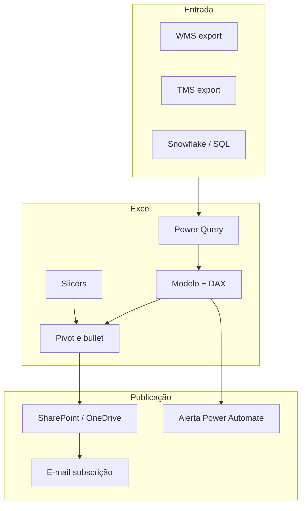

# Painéis operacionais em Excel — o que o turno da manhã precisa ver em trinta segundos

Painel **operacional** não é o mesmo que **relatório contábil**. O primeiro responde a «**o que está atrasado agora**» com **ações**; o segundo responde a «**quanto custou o mês**» com **fechamento**. Na TechLar, o painel da expedição misturava os dois — e ninguém confiava nos números às 07h00. Esta aula dá padrão de **layout**, **fórmulas**, **governança** e **publicação** para painel Excel que a operação realmente usa.

---

## Objetivos e resultado de aprendizagem

- Distinguir painel **operacional**, **tático** e **estratégico** em Excel.
- Construir cartões de KPI com **anchor + delta + ação**.
- Criar **bullet chart** com formatação condicional para substituir o velocímetro.
- Aplicar **slicers** e **timelines** de forma sincronizada entre visuais.
- Documentar **suposições**, **fonte**, **cadência** e **dono** no rodapé.
- Configurar **refresh automático** (Office Scripts ou *Power Automate*).

**Duração:** 60–90 min. **Pré-requisitos:** [Aula 2.1](aula-01-modelagem-tabular-logistica.md) e [Aula 2.2](aula-02-power-query-pratica-logistica.md).

---

## Mapa do conteúdo

1. Gancho — o cartão KPI «verde» com filtro errado.
2. Operacional × tático × estratégico — três painéis, um modelo.
3. Wireframe TechLar (turno da manhã).
4. Cartões com `LET` + `XLOOKUP` + formatação condicional.
5. Bullet chart no Excel (substituto do velocímetro).
6. Slicers, timelines e sincronização.
7. Lista de suposições obrigatória.
8. Refresh, governança e publicação.
9. Caso prático com gabarito.
10. Erros comuns, dicionário, ferramentas.
11. Exercícios, reflexão, fechamento, referências, pontes.

---

## Gancho — o cartão KPI «verde» com filtro errado

O cartão mostrava **fill rate** global **97%**. O filtro de **canal** estava em «todos», mas uma **segmentação escondida** limitava a **região Sul**. O gerente regional Norte decidiu com base em **UI**, não em **definição**. *Dashboard* é **interface**; interface mente quando **estado** não é visível.

> **Analogia do painel de carro:** velocidade, combustível, temperatura — **poucos** indicadores; **luzes de aviso** para exceção. Painel da TechLar tinha 18 cartões e nenhum dizia se o **motor estava ligado**.

---

## Três painéis, um modelo

| Painel | Pergunta | Cadência | Latência | Visuais típicos |
|--------|----------|----------|----------|-----------------|
| **Operacional** | «O que precisa de ação **agora**?» | Tempo real / hora | minutos | Tabela de exceções; cartões com semáforo; *backlog* por idade |
| **Tático** | «Como está a semana?» | Diária | D−1 | Tendência 14 d; *small multiples* por canal |
| **Estratégico** | «Cumprimos a meta do trimestre?» | Mensal | mês fechado | Bullet vs meta; YoY; mapa por região |

**Regra:** o **mesmo modelo de dados** alimenta os três; muda apenas o **layout** e o **filtro padrão**.

---

## Wireframe TechLar — turno da manhã

```
┌────────────────────────────────────────────────────────────────────┐
│ Logo  Expedicao TechLar  ·  Selo qualidade [VERDE]  ·  07:42  ⟳   │
├────────────────────────────────────────────────────────────────────┤
│ [OTIF dia    93,2%]  [Fill linha 91,5%]  [SLA POD 88,0%]  [Bk 142]│
│  Meta 95% ▼1pp        Meta 93% ▲0,5pp    Meta 90%  ▼2pp  Idade   │
├────────────────────────────────────────────────────────────────────┤
│  ⚠ Exceções (top 20 ordenado por idade do backlog)                │
│  pedido | cliente | linhas | idade(h) | causa | ação sugerida      │
│  ...                                                               │
├────────────────────────────────────────────────────────────────────┤
│  Tendência 14 d (small multiples por canal)                       │
│  site  marketplace  B2B  cortesia                                  │
├────────────────────────────────────────────────────────────────────┤
│ Suposições: OTD = embarque ≤ promessa interna 18h. Fuso BRT.       │
│ Atualização: 06:00 BRT. Dono: Coord. Performance Logística.        │
│ Versão modelo: v1.2 — 2026-04-15.                                  │
└────────────────────────────────────────────────────────────────────┘
```

**Leitura em Z:** o KPI mais importante (OTIF) no canto superior esquerdo; ações **descem** para o centro; contexto **abaixo**; metadados **rodapé**.

---

## Cartões com `LET` e formatação condicional

```excel
// Em B2 (valor):
= LET(
    qped; SUM(tbl_FatoPedidoLinha[qtd_pedida]);
    qsep; SUM(tbl_FatoPedidoLinha[qtd_separada]);
    IFERROR(qsep/qped; 0)
  )

// Em B3 (delta vs semana anterior):
= LET(
    atual;     B2;
    anterior;  XLOOKUP(MAX(tbl_DimCalendario[semana_op])-1;
                       tbl_FillRateSemanal[semana_op];
                       tbl_FillRateSemanal[fill_rate]);
    atual - anterior
  )

// Em B4 (texto de status):
= LET(
    v; B2;
    meta; 0,93;
    SWITCH(TRUE();
      v >= meta;          "✓ Dentro da meta";
      v >= meta - 0,02;   "⚠ Atenção";
      TRUE();             "✗ Acionar"
    )
  )
```

**Formatação condicional do cartão:**

- Regra 1: `=B2 >= 0,93` → preenchimento **azul** (não verde puro — daltonismo).
- Regra 2: `=B2 < 0,93` e `>= 0,91` → **laranja**.
- Regra 3: `=B2 < 0,91` → **vermelho-escuro com texto branco**.

---

## Bullet chart — substituto do velocímetro

**Receita rápida (Stephen Few):**

1. Inserir **gráfico de barras horizontais** com 3 séries:
   - Banda «vermelha» (0–91%), «amarela» (91–93%), «verde» (93–100%) → barras empilhadas em cinza claro/médio/escuro.
   - **Valor atual** (barra estreita escura sobreposta).
   - **Meta** (linha vertical → série de erro horizontal de tamanho zero).
2. Eixo Y: rótulo do KPI (ex.: «OTIF semana 17»).
3. Sem 3D, sem brilho.

Em **um espaço** de 8×2 cm, cabem **dezenas** de KPIs comparáveis. Velocímetro cabe **um**.

---

## Slicers, timelines e sincronização

- **Slicer** para `canal`, `regiao_uf`, `transp`.
- **Timeline** ligada à `DimCalendario[data]`.
- Botão direito no slicer → **«Conexões de Relatório»** → marcar **todas** as Pivots que devem responder.
- **Cor cinza** para slicer inativo; **azul** para ativo (formatação personalizada).
- Reservar **canto superior direito** para slicers — usuário sabe onde procurar.

---

## Lista de suposições (obrigatória no rodapé)

Exemplo TechLar:

1. **OTD** = embarque até **D+0 18h00** após **liberação financeira**.
2. **Pedidos cancelados** após separação **entram** como exceção manual (sem afetar fill rate base).
3. **Fuso:** `America/Sao_Paulo`.
4. **Universo:** pedidos com `status_final ≠ 'cortesia'`.
5. **Atualização do modelo:** `Power Query refresh` 05h45 BRT; ficheiro válido a partir das 06h00.

> Sem isso, o Excel é só **arte**.

---

## Refresh e governança mínima

| Item | Recomendação |
|------|--------------|
| **Origem** | OneDrive / SharePoint com path estável; nunca `C:\Users\fulano\` |
| **Refresh** | Office Scripts + Power Automate (cloud) ou `Workbook.RefreshAll` (VBA local) |
| **Versionamento** | Sufixo `vYYYY-MM-DD` no ficheiro; histórico no SharePoint |
| **Acesso** | Grupo AD/Entra ID por persona; leitura para operação, edição para 2 pessoas |
| **Documentação** | Aba `_README` com dono, contato, mudanças |
| **Selo de qualidade** | célula no topo (`VERDE` se `freshness ≤ 6 h` e tests OK) |



---

## Caso prático — TechLar, 5 visuais para o turno da manhã

| # | Visual | Pergunta | Limiar | Ação |
|---|--------|----------|--------|------|
| 1 | Cartão OTIF dia | «Estamos no acordo interno?» | `< 92%` | War room 8h00 |
| 2 | Cartão Fill linha | «Estamos entregando o que prometemos?» | `< 90%` | Suprimentos revisa SKUs faltantes |
| 3 | Cartão SLA POD | «Carrier devolve POD a tempo?» | `> 24 h` | Cobrar transportadora |
| 4 | Tabela exceções (top 20) | «Quais pedidos exigem ação?» | idade `> 8 h` | Refuerço picking ou contato cliente |
| 5 | Sparkline 14 d por canal | «Há tendência de degradação?» | 3 dias consecutivos abaixo da meta | Reunião tática |

**Cálculo numérico (gabarito):** se OTIF=91,2%, fill=92,0%, SLA POD=72h, backlog=180 com 12 pedidos > 8h e canal marketplace 87% por 4 dias seguidos → **três** ações disparadas; documente cada uma com hora e dono no log da operação.

---

## Trade-offs

| Decisão | Excel | Power BI | Aplicação dedicada |
|---------|-------|----------|--------------------|
| Distribuição | arquivo / OneDrive | publicado web/app | URL/app |
| Atualização | manual ou Office Scripts | scheduled refresh | streaming |
| Mobile | desktop friendly | layout mobile nativo | nativo |
| Custo | já tem | licença Pro/Premium | desenvolvimento |
| Quando subir | dor de governança ou >5 consumidores | dor de UX mobile / streaming |

---

## Erros comuns e armadilhas

- KPI sem **denominador** no subtítulo.
- Cores **sem significado estável** (verde hoje, azul amanhã).
- Misturar **valor** e **%** no mesmo cartão sem rótulo.
- **Filtros escondidos** mudando o universo sem aviso.
- Painel com **18 visuais** (síndrome do «tudo no ecrã»).
- Velocímetro com 3 KPIs (parquinho).
- **Refresh** dependendo de máquina pessoal.
- Falta de **selo de qualidade** → operação assume dado bom.

---

## Dicionário operacional do painel

| Campo | Valor |
|-------|-------|
| **Painel** | `Expedicao_Turno_Manha_v1.xlsx` |
| **Persona** | Coordenador de expedição |
| **Cadência** | diária 06h00 BRT |
| **KPIs** | OTIF dia, Fill linha, SLA POD, Backlog |
| **Visuais** | 4 cartões + 1 tabela exceções + 1 small multiples |
| **Suposições** | rodapé fixo |
| **Refresh** | Power Automate 05h45 BRT |
| **Dono** | Coord. Performance Logística |
| **Versão** | v1.2 — 2026-04-15 |

---

## Ferramentas e tecnologias

- **Excel 365** — `LET`, `LAMBDA`, `XLOOKUP`, sparklines, ícones de conjunto.
- **Office Scripts** — automação no navegador (substitui parte do VBA).
- **Power Automate** — refresh agendado e alertas.
- **SharePoint / OneDrive** — versionamento e ACL.
- **Power BI Desktop** — quando o ficheiro doer.
- **Excel Labs** — experimentos como `=PY()` para dados em Python.

---

## Glossário rápido

- **Anchor:** referência (meta, ano anterior, banda).
- **Delta:** variação interpretável vs anchor.
- **Bullet chart:** alternativa de Stephen Few ao velocímetro.
- **Sparkline:** mini-gráfico embutido na célula.
- **Selo de qualidade:** indicador de freshness e testes OK no topo.

---

## Aplicação — exercícios

1. Especifique **5 visuais** máximo para o seu turno da manhã.
2. Para cada um: pergunta, limiar, ação se violado, dono.
3. Substitua um velocímetro real por um **bullet chart**.
4. Implemente **selo de qualidade** (verde/amarelo/vermelho) no canto superior.
5. Documente **3 suposições** no rodapé.

**Gabarito pedagógico:** avalie se (a) os 5 visuais respondem perguntas distintas, (b) limiares são **comparáveis** entre regiões, (c) há **ação** documentada para cada violação, (d) há ao menos **um** anchor por cartão.

---

## Pergunta de reflexão

Qual limiar no seu painel hoje é **só feeling** — e que decisão diária ele dispara em silêncio?

---

## Fechamento — takeaways

- Painel operacional bom é **curto**, **estável** e **honesto** sobre o que não sabe.
- **Suposições no rodapé** são tão importantes quanto cartões no topo.
- **Selo de qualidade** + **anchor + delta + ação** = ciclo virtuoso.

---

## Referências

1. Microsoft — [Tabelas dinâmicas com Modelo de Dados](https://learn.microsoft.com/office/excel/pivot-tables).
2. Microsoft — [Office Scripts](https://learn.microsoft.com/office/dev/scripts/).
3. Microsoft — [Power Automate](https://learn.microsoft.com/power-automate/).
4. FEW, S. *Information Dashboard Design*. Analytics Press.
5. NUSSBAUMER KNAFLIC, C. *Storytelling with Data*. Wiley.
6. Trilha Fundamentos — [aula de KPIs](../../trilha-fundamentos-e-estrategia/modulo-04-custos-logisticos-performance/aula-03-nivel-servico-kpis-logisticos.md).

---

## Pontes para outras trilhas

- Anterior: [Aula 2.2 — Power Query](aula-02-power-query-pratica-logistica.md).
- Próximo módulo: [Power BI para supply chain](../modulo-03-power-bi-para-supply-chain/README.md).
- [Aula 1.3 — Visualização e narrativa](../modulo-01-data-analytics-para-logistica/aula-03-visualizacao-narrativa-logistica.md).
