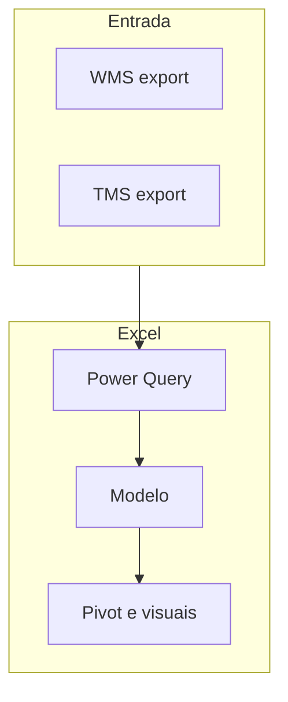

# Painéis operacionais em Excel — o que o turno da manhã precisa ver em trinta segundos

Painel operacional não é o mesmo que **relatório contábil**. O primeiro responde a «**o que está atrasado agora**» com **ações**; o segundo responde a «**quanto custou o mês**» com **fechamento**. Na TechLar, o painel da expedição misturava os dois — e ninguém confiava nos números às 07h00.

---

## Gancho — o cartão KPI «verde» com filtro errado

O cartão mostrava **fill rate** global **97%**. O filtro de **canal** estava em «todos», mas uma **segmentação** escondida limitava a **região Sul**. O gerente regional Norte decidiu com base em **UI**, não em **definição**. *Dashboard* é **interface**; interface mente quando **estado** não é visível.

---

## Componentes úteis no Excel

- **Tabela dinâmica** ligada ao modelo de dados (módulo 2.1).  
- **Segmentações** visíveis para data, canal, transportadora.  
- **Cartões** para 3–5 KPIs críticos (não quinze).  
- **Linha do tempo** ou slicer de calendário quando o fato for diário.

**Analogia do painel de carro:** velocidade, combustível, temperatura — poucos indicadores; luzes de **aviso** para exceção.

---

## Lista de suposições (obrigatória no rodapé)

Exemplo para TechLar:

1. **OTD** = embarque até **D+0** das 18h após **liberação financeira**.  
2. Pedidos **cancelados** após separação **entram** como exceção manual.  
3. **Fuso:** America/Sao_Paulo.

Sem isto, o Excel é só **arte**.

---

## *Refresh* e governança mínima

Documente: **origem** dos ficheiros, **horário** de atualização esperado, **quem** valida após mudança de layout. Se o ficheiro vive no SharePoint, registe **caminho** e versão mínima do Excel.

---

## Exercício

Especifique **cinco** visuais máximo para o turno da manhã da TechLar e, para cada um, **uma** pergunta que ele responde + **ação** se limiar for violado (ex.: «backlog > 200 linhas → acionar refuerço»).

**Gabarito pedagógico:** avaliar se limiares são **comparáveis** entre regiões; evitar dupla contagem de **linhas** *vs.* **pedidos**.

---

## Erros comuns

- KPI sem **denominador** no subtítulo.  
- Cores sem significado estável.  
- Misturar **valor** e **%** no mesmo cartão sem rótulo.

---

## Referências

1. Microsoft — **Tabelas dinâmicas** com modelo de dados: https://learn.microsoft.com/office/excel/pivot-tables  
2. FEW, S. *Information Dashboard Design* — princípios de painel.  
3. Trilha Fundamentos — [aula de KPIs](../../trilha-fundamentos-e-estrategia/modulo-04-custos-logisticos-performance/aula-03-nivel-servico-kpis-logisticos.md) para alinhar definições.

---

## Fechamento

Painel operacional bom é **curto**, **estável** e **honesto** sobre o que não sabe.

**Pergunta:** qual limiar hoje é **só feeling**?
