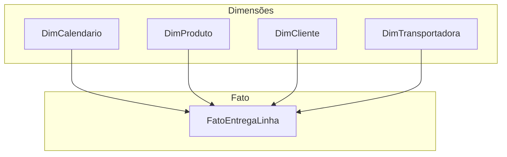

# Modelo de dados para supply chain no Power BI — estrela, calendário e uma só verdade

Power BI brilha quando o **modelo semântico** está limpo: fato estreito, dimensões largas, **calendário** explícito e relacionamentos **muitos-para-um** sem ambiguidade. Para supply chain, o modelo é o **mapa** que permite ao analista dizer «o número subiu **porque**» — e ao executivo confiar que **não** há dupla contagem escondida.

---

## Gancho — duas tabelas de «data»

Na TechLar, existiam **DataPedido** na fato e **Data** na dim produto (erro de importação). O visual de série temporal **duplicava** vendas ao filtrar. A correção foi **uma** tabela **Calendário** relacionada à data do **fato** — e **desligar** auto-datetime se a política da organização o exigir (performance e clareza).

---

## Esquema em estrela (mínimo viável)

- **FatoEntregaLinha** — granularidade **linha de pedido** entregue: chaves, quantidades, timestamps (prometido, embarque, entrega), custo de frete alocado se houver regra.  
- **DimProduto**, **DimCliente**, **DimTransportadora**, **DimCanal**.  
- **DimCalendario** — uma linha por dia, com colunas de **ano-mês**, **semana operacional**, **feriado** (se enriquecido).

---

## Boas práticas de relacionamento

- **Cardinalidade** explícita; evitar **ambos os sentidos** salvo necessidade rara e documentada.  
- **Chaves** inteiras ou texto **normalizado** (sem espaços surpresa).  
- Colunas de **baixa cardinalidade** na dimensão; medidas na **medida DAX**, não como coluna calculada pesada sem necessidade.

---

## *Row-level security* (conceito)

Perfis por **região** ou **time** permitem **um** relatório publicado com **visões** diferentes — útil para gerentes regionais da TechLar. Implementação técnica: roles no Power BI Desktop; validação com **View as role**. **Nota:** política de acesso a dados sensíveis deve alinhar com **LGPD** e TI — aqui só o **conceito** logístico.

---

## Exercício

Liste **sete** colunas obrigatórias em **FatoEntregaLinha** para suportar OTIF e fill rate **ao nível de linha**, sem ainda escrever DAX.

**Gabarito pedagógico:** `PedidoID`, `LinhaID`, `SKU`, `ClienteID`, `DataPromessaInicio`, `DataPromessaFim` (ou janela única), `DataEntregaEfetiva`, `QtdPedida`, `QtdEntregue`, `IndSubstituicaoAutorizada` (opcional mas valiosa) — ajuste nomes ao seu ERP.

---

## Erros comuns

- **Snowflake** excessivo no primeiro modelo (muitas dimensões encadeadas) — comece simples.  
- Medidas em **colunas** duplicadas por linha sem necessidade.  
- Fuso **implícito** no *dataset* misturado.

---

## Referências

1. Microsoft — **Modelagem em estrela**: https://learn.microsoft.com/power-bi/guidance/star-schema  
2. Microsoft — **RLS**: https://learn.microsoft.com/power-bi/admin/service-admin-rls  
3. KIMBALL, R.; ROSS, M. *The Data Warehouse Toolkit*.  

---

## Fechamento

Modelo ruim **teletransporta** lixo do ERP para o ecrã bonito. Modelo bom **paga** menos terapia em reunião.

**Pergunta:** qual dimensão hoje está **mesclada** no fato e devia nascer?
